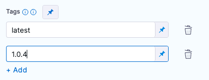

This topic provides settings you will need to build and push an Image to Docker Registry step, which creates a Docker image from a [Dockerfile](https://docs.docker.com/engine/reference/builder/) and pushes it to a Docker registry.

You may also use this step to push to an Azure Container Registry (ACR)This step is the equivalent to the [docker build command](https://docs.docker.com/engine/reference/commandline/build/).

### Name

The unique name for this step.

### Docker Connector

The Harness Docker Registry Connector to use for uploading the image. See [Docker Connector Settings Reference](https://docs.harness.io/article/u9bsd77g5a-docker-registry-connector-settings-reference).

### Docker Repository

The name of the Repository. For example, `<hub-user>/<repo-name>`.

When using private Docker registries, use a fully qualified repo name.

### Tags

[Docker build tag](https://docs.docker.com/engine/reference/commandline/build/#tag-an-image--t) (`-t`).

Add each tag separately.

### Optional Configurations

#### Optimize

Enables this option to redo snapshot mode.

#### Dockerfile

The name of the Dockerfile. If you don't provide a name, Harness assumes that the Dockerfile is in the root folder of the codebase.

#### Context

Context represents a directory containing a Dockerfile which kaniko will use to build your image. For example, a`COPY` command in your Dockerfile should refer to a file in the build context.

Kaniko requires root access to build the docker image. If you have not already enabled root access, you will receive the following error:  
  
`failed to create docker config file: open/kaniko/ .docker/config.json: permission denied`

#### Labels

[Docker object labels](https://docs.docker.com/config/labels-custom-metadata/) to add metadata to the Docker image.

#### Build Arguments

The [Docker build-time variables](https://docs.docker.com/engine/reference/commandline/build/#set-build-time-variables---build-arg) (`--build-arg`).

#### Target

The [Docker target build stage](https://docs.docker.com/engine/reference/commandline/build/#specifying-target-build-stage---target) (`--target`).

For example, `build-env`.

#### Remote Cache Repository

Harness enables remote Docker Layer Caching where each Docker layer is uploaded as an image to a Docker repo you identify. If the same layer is used in subsequent builds, Harness downloads the layer from the Docker repo.

This is different from other CI vendors that are limited to local caching and persistent volumes.

You can also specify the same Docker repo for multiple Build and Push steps, enabling them to share the same remote cache.

Remote Docker Layer Caching can dramatically improve build time by sharing layers across Pipelines, Stages, and steps.

The remote cache repository needs to be created in the same host and project as the build image. The repository will be automatically created if it doesn’t exist.

Enter the name of the remote cache repo where the cached image layers will be stored.

The Remote Cache Repository must be in the same account and organization as the build image. For caching to work, the entered image name must exist.

#### Run as User

Set the value to specify the user id for all processes in the pod, running in containers. See [Set the security context for a pod](https://kubernetes.io/docs/tasks/configure-pod-container/security-context/#set-the-security-context-for-a-pod).

#### Set container resources

Maximum resources limit values for the resources used by the container at runtime.

##### Limit Memory

Maximum memory that the container can use. You can express memory as a plain integer or as a fixed-point number using the suffixes `G` or `M`. You can also use the power-of-two equivalents `Gi` and `Mi`.

##### Limit CPU

The maximum number of cores that the container can use. CPU limits are measured in cpu units. Fractional requests are allowed: you can specify one hundred millicpu as `0.1` or `100m`. See [Resource units in Kubernetes](https://kubernetes.io/docs/concepts/configuration/manage-resources-containers/#resource-units-in-kubernetes).

##### Timeout

Timeout for the step. Once the timeout is reached, the step fails, and the Pipeline execution continues.

### See Also

* [Step Skip Condition Settings](https://docs.harness.io/article/i36ibenkq2-step-skip-condition-settings)
* [Step Failure Strategy Settings](https://docs.harness.io/article/htrur23poj-step-failure-strategy-settings)

