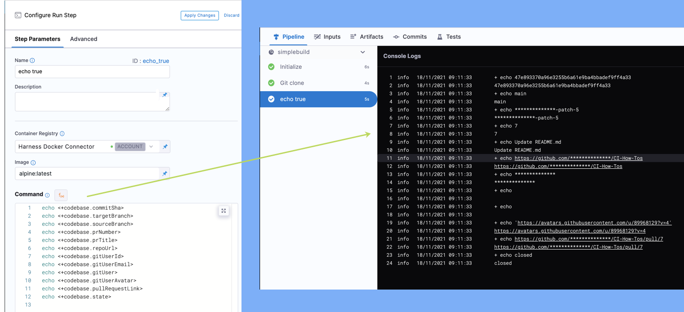

In Harness, you set up your [Codebase](../use-ci/codebase-configuration/create-and-configure-a-codebase.md) through a [Harness connector](https://docs.harness.io/article/zbhehjzsnv-connect-to-code-repo) to a Git repo to clone the code you want to build and test in your Pipeline. Once a Pipeline is executed, Harness also fetches your Git details and displays them in your **Build**. You can reference the various attributes of your Codebase in Harness stages using Harness built-in expressions. These variables are available for GitHub, Bitbucket, and GitLab codebases.

This topic describes the default built-in Harness expressions to refer to your Codebase attributes.

For the list of all Harness built-in expressions, see [Built-in and Custom Harness Variables Reference](https://docs.harness.io/article/lml71vhsim-harness-variables).

### How and When Codebase Variables Get Resolved

If you want to use Codebase variables in your Pipelines, you need to be aware of how and when these variables get resolved. 

Codebase variables are based on the Codebase defined for the Pipeline and the information in the Triggers and Input Sets used to start a Build. A Codebase variable is resolved only if the Build has the relevant information. For example, a variable like `<+codebase.prNumber>` gets resolved only if there is a Pull Request associated with the Build. 

To return codebase variables to Harness, the Connector must use the Enable API access option and Username and Token authentication. See [Connect to a Git Repo](https://ngdocs.harness.io/article/zbhehjzsnv). Codebase variables are local to the Stage that ran the Build. Thus if your Pipeline includes a CI Build Stage and a CD Deploy Stage, the Codebase variables are accessible in the CI Stage only.  The following use cases specify which Codebase variables get resolved and when.

#### Manual Builds

When a user starts a Build manually using an Input Set, the variables are based on the Input Set defined for the Trigger: 

* Branch: [Manual Branch Build](#manual-branch-build) variables only.
* Tag: [Manual Tag Build](#manual-tag-build) variables only.
* Pull Request: [Manual Pull Request](#manual-pull-request-build) variables only.

#### Builds from Git Webhook Triggers

The most common use case for triggering CI Builds is in response to a Git event. When the Pipeline receives a webhook payload that matches a Trigger, it starts a Build. The Build maps the Trigger variables in the payload to the Codebase variables in the Build. The variables that get resolved are based on the event type and the payload:

* Pull Request event: [Pull Request Webhook Event](#pull-request-webhook-event) variables only.
* Push event: [Push Webhook Event](#push-webhook-event) variables only.

#### Builds Cannot Always Use Webhook Payloads to Set Codebase Variables

A Build cannot always use webhook payloads to set Codebase variables. These Builds are considered manual. Thus you'll get [Manual Branch Build](#manual-branch-build), [Manual Tag Build](#manual-tag-build), or [Manual Pull Request](#manual-pull-request-build) variables, based on the Input Set defined for the Trigger. Here are some examples of when this might happen:

* You can set up a Cron Trigger to start a new Build every night at midnight. In this case, the incoming payload has no information about a specific Git event.
* You have a Run Step that clones a repo, then builds and pushes an image using Docker-in-Docker commands. This repo is not specified in the Codebase for the Build Stage. In this case, the Codebase variables will not apply to this repo. If a Git event arrives from this repo and triggers a build, the [Trigger variables](https://ngdocs.harness.io/article/rset0jry8q) will describe this build.

### Expression Example

Here is a simple example of a Shell Script step echoing some common Codebase variable expressions:


```
echo <+codebase.commitSha>  
echo <+codebase.targetBranch>  
echo <+codebase.sourceBranch>  
echo <+codebase.prNumber>  
echo <+codebase.prTitle>  
echo <+codebase.commitRef>  
echo <+codebase.repoUrl>  
echo <+codebase.gitUserId>  
echo <+codebase.gitUserEmail>  
echo <+codebase.gitUser>  
echo <+codebase.gitUserAvatar>  
echo <+codebase.pullRequestLink>  
echo <+codebase.pullRequestBody>  
echo <+codebase.state>
```
Here's the output of the example expressions:


```
+ echo 85116fa2f04858cd5e946d69f24d7359205a0737  
85116fa2f04858cd5e946d69f24d7359205a0737  
+ echo main  
main  
+ echo **************-patch-5-1  
**************-patch-5-1  
+ echo 8  
8  
+ echo Update README.md  
Update README.md  
+ echo https://github.com/**************/CI-How-Tos  
https://github.com/**************/CI-How-Tos  
+ echo **************  
**************  
+ echo  
  
+ echo  
  
+ echo 'https://avatars.githubusercontent.com/u/89968129?v=4'  
https://avatars.githubusercontent.com/u/89968129?v=4  
+ echo https://github.com/**************/CI-How-Tos/pull/8  
https://github.com/**************/CI-How-Tos/pull/8  
+ echo open  
Open
```
Here's the output in the Harness UI:



### Manual Tag Build

Manual Tag Builds are the builds that occur when you manually run your Harness Pipeline from the Harness UI and select your Codebase as **Git Tag**. Harness will look for the source code attached to the **Git Tag** that you specify in your **Codebase** and will clone that specific source code for the build.

You can refer to the Manual Tag Builds in Harness with the expression `<+codebase.build.type> == “tag”`.

Use the following expressions in Harness Stages to refer to the following Git attributes for manual tag builds.

#### <+codebase.tag>

Git tag of the build.

#### <+codebase.commitSha>

Git commit Id of the build.

### Manual Branch Build

Manual Branch Builds are the builds that occur when you manually run your Pipeline in the Harness UI and select your Codebase as **Git** **Branch**. Harness looks for the source code attached to the **Git Branch** that you specify in your **Codebase** and clones that specific source code for the build.

You can refer to the manual branch builds in Harness with the expression`<+codebase.build.type> == “branch”`.

Use the following expressions in Harness to refer to the various Git attributes for manual branch builds.

#### <+codebase.branch>

Git branch name of the build.

#### <+codebase.commitSha>

Git commit id of the build.

### Manual Pull Request Build

Manual Pull Request Builds are the builds that occur when you manually run your Pipeline in the Harness UI and select your Codebase as **Git Pull Request Number**. Harness looks for the source code attached to the **Git Pull Request Number** that you specify in your **Codebase** and clones that specific source code for the build.

You can refer to the manual pull request builds in Harness with the expression`<+codebase.build.type> == “PR”`.

Use the following expressions in Harness to refer to the various Git attributes for manual pull request builds.

#### <+codebase.branch>

Git branch name of the pull request.

#### <+codebase.tag>

Git tag of the build. 

#### <+codebase.commitSha>

Git commit id of the build. 

#### <+codebase.targetBranch>

Git Target branch of the build.

#### <+codebase.sourceBranch>

Git Source branch of the build.

#### <+codebase.prNumber>

Git pull request number. 

#### <+codebase.prTitle>

Git pull request description. 

#### <+codebase.commitSha>

Git commit id of the build. 

#### <+codebase.baseCommitSha>

Git base commit id of the build.

#### <+codebase.commitRef>

Git Commit ID Reference.

#### <+codebase.repoUrl>

Git repo url of the build. 

#### <+codebase.gitUserId>

User id of the Git account.

#### <+codebase.gitUserEmail>

User email of the Git account.

#### <+codebase.gitUser>

User name of the Git account.

#### <+codebase.gitUserAvatar>

User avatar of the Git account.

#### <+codebase.pullRequestLink>

Git pull request link.

#### <+codebase.pullRequestBody>

Git pull request body.

#### <+codebase.state>

State of the Git working directory.

### Pull Request Webhook Event

You can configure [Triggers](https://docs.harness.io/category/oya6qhmmaw-trigger-category) in Harness for events in your Git repo. Harness automatically triggers a build whenever there's a new action on your Git repo. A **Pull Request Webhook Event** is when your build is automatically triggered in Harness due to a new pull event on your Git repo. See [Trigger Pipelines using Git Events](https://docs.harness.io/article/hndnde8usz-triggering-pipelines) to set up a **Trigger** in Harness.

You can refer to the webhook pull request in Harness with the expression`<+codebase.build.type> == “PR”`.

Use the following expressions in Harness to refer to the following Git attributes for webhook-triggered pull request events.

#### <+codebase.branch>

Git branch name of the pull request.

#### <+codebase.tag>

Git tag of the build. 

#### <+codebase.commitSha>

Git commit id of the build. 

#### <+codebase.targetBranch>

Git Target branch of the build.

#### <+codebase.sourceBranch>

Git Source branch of the build.

#### <+codebase.prNumber>

Git pull request number. 

#### <+codebase.prTitle>

Git pull request description. 

#### <+codebase.commitSha>

Git commit id of the build. 

#### <+codebase.baseCommitSha>

Git base commit id of the build.

#### <+codebase.commitRef>

Git Commit ID Reference.

#### <+codebase.repoUrl>

Git repo url of the build. 

#### <+codebase.gitUserId>

User id of the Git account.

#### <+codebase.gitUserEmail>

User email of the Git account.

#### <+codebase.gitUser>

User name of the Git account.

#### <+codebase.gitUserAvatar>

User avatar of the Git account.

#### <+codebase.pullRequestLink>

Git pull request link.

#### <+codebase.pullRequestBody>

Git pull request body.

#### <+codebase.state>

State of the Git working directory.

### Push Webhook Event

You can configure [Trigger](https://docs.harness.io/category/oya6qhmmaw-trigger-category) in Harness for an event on your Git repo, and Harness will automatically trigger a build whenever there is a new action on your Git repo. A **Push Webhook Event** is when your build is automatically triggered in Harness due to a new push action on your Git repo. See [Trigger Pipelines using Git Events](https://docs.harness.io/article/hndnde8usz-triggering-pipelines) to set up a **Trigger** in Harness.

You can refer to the webhook pull request in Harness with the expression`<+codebase.build.type> == “Push”`.

Use the following expressions in Harness to refer to the following Git attributes for webhook-triggered push request events.

#### <+codebase.branch>

Git branch name of the Push webhook event. 

#### <+codebase.tag>

Git tag of the build for the Push webhook event.

#### <+codebase.commitSha>

Git commit ID of the build for the Push webhook event.

#### <+codebase.targetBranch>

Git Target branch of the build for the Push webhook event.

#### <+codebase.repoUrl>

Git repo URL of the build for the Push webhook event.

#### <+codebase.gitUserId>

User Id of the Git account for the Push webhook event.

#### <+codebase.gitUserEmail>

User email of the Git account for the Push webhook event.

#### <+codebase.gitUser>

User name of the Git account for the Push webhook event. 

#### <+codebase.gitUserAvatar>

User avatar of the Git account for the Push webhook event.

For Bitbucket PR builds (whether by Trigger, Manual, or PR Number), the variable `<+codebase.commitSha>` returns a short sha. This is due to the Bitbucket webhook payload only sending short sha.

### See Also

[Built-in Git Trigger Reference](https://docs.harness.io/article/rset0jry8q-triggers-reference#built_in_git_trigger_and_payload_expressions)

