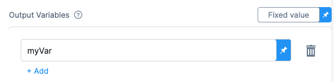
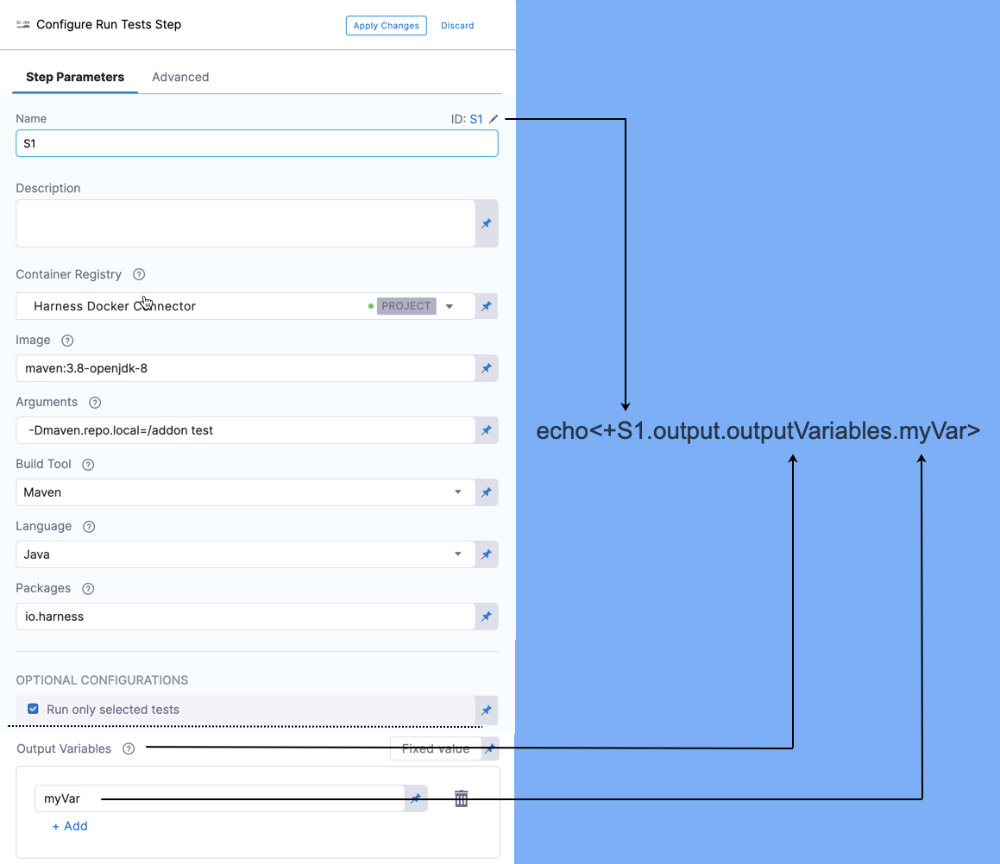

This topic provides settings and permissions for the Harness CI Run Tests step, which executes one or more tests on a container image.

### Name

The unique name for this step.

### ID

See [Entity Identifier Reference](https://ngdocs.harness.io/article/li0my8tcz3-entity-identifier-reference).

### Description

Text string.

### Container Registry

The Harness Connector for a container registry. This is the container registry for the image Harness will use run build commands on, such as DockerHub.

### Image

The name of the Docker image to use when running commands. For example: `maven:3.6.3-jdk-8`.

The image name should include the tag and will default to the latest tag if unspecified. You can use any docker image from any docker registry, including docker images from private registries.

Different container registries require different name formats:

* Docker Registry: enter the name of the artifact you want to deploy, such as library/tomcat. Wildcards are not supported.
* GCR: enter the name of the artifact you want to deploy. Images in repos need to reference a path starting with the project ID that the artifact is in, for example: `us.gcr.io/playground-243019/quickstart-image:latest`.
* ECR: enter the name of the artifact you want to deploy. Images in repos need to reference a path, for example: `40000005317.dkr.ecr.us-east-1.amazonaws.com/todolist:0.2`.

### Arguments (*Java*)

The runtime arguments for the test. This field is required. Example format: `Test -Dmaven.test.failure.ignore=true -DfailIfNoTests=false`

### Arguments (*C#*)

The runtime arguments for the test. This field is required. **Do not** inject another instrumenting agent, such as a code-coverage agent, in the argument string. Example format: `/path/to/test.dll /path/to/testProject.dll`

### Arguments (*C# / Nunit*)

The runtime executable and arguments for the test. This field is required. You must include the executable in the string. **Do not** inject another instrumenting agent, such as a code-coverage agent, in the string. Example format: `. "path/to/nunit3-console.exe" path/to/TestProject.dll --result="UnitTestResults.xml" /path/to/testProject.dll`

### Namespaces (*C#*)

A comma-separated list of the Namespace prefixes that you want to test.

### Build Tool

Select the build automation tool.

### Language

Select the source code language to build, such as Java or C#.

### Packages

List of source code package prefixes separated by a comma. For example: `com.company.`, `io.company.migrations`.

### Run Only Selected Tests

 If this option is unchecked, Test Intelligence is disabled and all tests will run.

### Test Annotations

Enter the list of test annotations used in unit testing, separated by commas. Any method annotated with this will be treated as a test method. The defaults are: `org.junit.Test`, `org.junit.jupiter.api.Test`, `org.testng.annotations.Test`

### Pre-Command

Enter the commands for setting up the environment before running the tests. For example,`printenv` prints all or part of the environment.

### Post-Command

Enter the commands used for cleaning up the environment after running the tests. For example, `sleep 600` suspends the process for 600 seconds.

### Report Paths

The path to the file(s) that store results in the JUnit XML format. You can enter multiple paths. [Glob](https://en.wikipedia.org/wiki/Glob_(programming)) is supported.

This variable must be set for the Run Tests tep to publish test results.

### Environment Variables

Variables passed to the container as environment variables and used in the Commands.

### Output Variables

Output variables expose Environment Variables for use by other steps/stages of the Pipeline. You reference the output variable of a step using the step ID and the name of the variable in Output Variables.

Let's look at a simple example.

In a step with the ID S1, in Command, export a new variable:

`export myVar=varValue`

In Output Variables, list the exported variable name:

In a later Run step, in Command, reference the output variable:

`echo <+S1.output.outputVariables.myVar>`

Here's how the S1 step's output variable is referenced:

Syntax for referencing output variables between steps in the same stage:

`<+[stepID].output.outputVariables.[varName]>`

Syntax for referencing output variables between steps in different stages:

`<+stages.[stageID].execution.steps.[stepID].output.outputVariables.[varName]>`

### Image Pull Policy

Select an option to set the pull policy for the image.

* **Always**: The kubelet queries the container image registry to resolve the name to an image digest every time the kubelet launches a container. If the kubelet encounters an exact digest cached locally, it uses its cached image; otherwise, the kubelet downloads (pulls) the image with the resolved digest, and uses that image to launch the container.
* **If Not Present**: The image is pulled only if it isn't already present locally.
* **Never**: The kubelet assumes that the image exists locally and doesn't try to pull the image.

### Run as User

Set the value to specify the user id for all processes in the pod, running in containers. See [Set the security context for a pod](https://kubernetes.io/docs/tasks/configure-pod-container/security-context/#set-the-security-context-for-a-pod).

### Set container resources

These settings specify the maximum resources used by the container at runtime.

##### Limit Memory

Maximum memory that the container can use. You can express memory as a plain integer or as a fixed-point number using the suffixes `G` or `M`. You can also use the power-of-two equivalents `Gi` and `Mi`.

##### Limit CPU

The maximum number of cores that the container can use. CPU limits are measured in cpu units. Fractional requests are allowed: you can specify one hundred millicpu as `0.1` or `100m`. See [Resource units in Kubernetes](https://kubernetes.io/docs/concepts/configuration/manage-resources-containers/#resource-units-in-kubernetes).

##### Timeout

Timeout for the step. Once the timeout is reached, the step fails and the Pipeline execution continues.

### See Also

* [Step Skip Condition Settings](https://ngdocs.harness.io/article/i36ibenkq2-step-skip-condition-settings)
* [Step Failure Strategy Settings](https://ngdocs.harness.io/article/htrur23poj-step-failure-strategy-settings)

