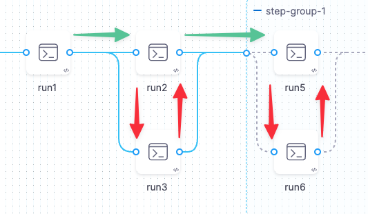

You can add Steps to Pipelines individually or as a Step Group. You can run Steps and Step Groups serially or in parallel. Unlike individual steps, a step group can apply Conditional Execution (skip conditions) and Failure Strategy to all steps in the group.

One key use case for Step Groups is to speed up Pipelines that include a lot of tests. This is one of the [available methods](../troubleshoot/optimizing-ci-build-times.md) you can use to speed up your CI Pipelines.

### Important Notes

* Steps running in parallel cannot reference output data from each other, since the data might not be available. A Step can reference outputs only from other Steps that have already finished running.

* You cannot include a Step Group inside another Step Group, but you can arrange Steps within a Group to run serially or in parallel.
* You can run multiple Step Groups in parallel.

### Parallel Steps, Step Groups, and Resource Consumption

You should carefully consider how a Pipeline reserves resources for Steps that run in parallel. The Pipeline reserves memory and CPU resources in advance for each Stage. The amount of memory and CPU reserved is determined by the highest utilization at any point in the stage.

Consider the following Pipeline. In this case, the maximum consumption takes place when Step Group 1 is running. Given this, the Pipeline reserves 1700Mi of memory and 1200m of CPU. If the build infrastructure cannot reserve enough resources, the Pipeline fails.

### Step 1: Add and Name the Step Group

* In your stage, in **Execution**, click **Add Step** and then click **Step Group**.

* Enter a name for the step group.\

### Step 2: Add Steps to the Step Group

* Once the step group is added, in its **Execution** section, in the new step group, click **Add Step**.
* Add any step and configure its **Advanced** settings.

A step's **Advanced** settings override the **Advanced** settings of the step group.

### Option: Conditional Execution

A Step Group can have its own Conditional Execution settings separate from the Stage settings. The Conditional Execution settings of the step group apply to all of its steps. See [Step Skip Condition Settings](https://docs.harness.io/article/i36ibenkq2-step-skip-condition-settings).

The Conditional Execution settings of any step in a step group override the settings of the Step Group itself.

If a Step Group has no Conditional Execution settings defined, the Pipeline uses the Stage settings.

### Option: Step Group Failure Strategy

A Step Group can have its own Failure Strategy separate from the Stage strategy.

See [Step Failure Strategy Settings](https://docs.harness.io/article/htrur23poj-step-failure-strategy-settings).

The Failure Strategy of any step in a step group overrides the Failure Strategy of the step group.

If you do not use a step group Failure Strategy, then the Stage's Failure Strategy is used.

### Referencing Step Group Steps and Fields

You reference steps in step groups using the step group Id.

The FQN format is:

`<+execution.steps.<`*`step-group-name`*`>.steps.<`*`step-name`*`>.<`*`field-name`*`>`

For example, to reference the output variable in a Step that's a member of a Step Group, the FQN would be:

`<+execution.steps.myStepGroup.steps.runStep1.output.outputVariables.outvariable1>`

