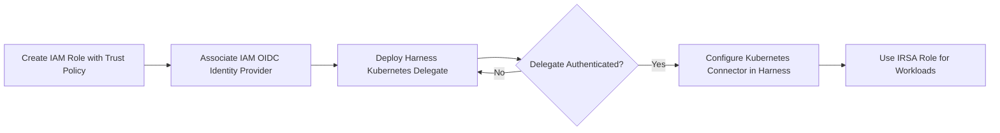

In this tutorial, we’ll walk through the process of setting up an Amazon Elastic Kubernetes Service (EKS) cluster with IAM Roles for Service Accounts (IRSA) for cross-account integration. Additionally, we will deploy a Harness Kubernetes Delegate to manage the Kubernetes workloads.

## Introduction

Amazon EKS provides a managed Kubernetes service that makes it easier to run Kubernetes clusters on AWS. One of the key security features in EKS is IAM Roles for Service Accounts (IRSA), which allows you to associate AWS IAM roles directly with Kubernetes service accounts. This enables workloads in EKS to securely access AWS resources without using static AWS credentials.

Harness provides an easy way to manage Kubernetes deployments using a Kubernetes Delegate, which integrates with EKS and allows seamless CI/CD workflows.
In this blog, we will go step-by-step through the process of setting up an EKS cluster, configuring IRSA for cross-account integration, and deploying a Harness Kubernetes Delegate.

## Prerequisites

- A Harness account with access to the Continuous Integration module. If you are new to Harness, you can [sign up for free](https://app.harness.io/auth/#/signup/?&utm_campaign=ci-devrel).
- AWS CLI configured with access keys.
- kubectl installed and configured.
- eksctl for managing EKS clusters.
- IAM roles and policies for cross-account access.

## Design

To securely authenticate AWS resources within an EKS cluster, we leverage IAM Roles for Service Accounts (IRSA). This method allows Kubernetes workloads to assume an IAM role, enabling fine-grained access control without using long-term credentials like static IAM keys.

The flowchart below illustrates the step-by-step process of setting up IRSA and integrating it with Harness for secure workload deployment:


## Step-by-Step Guide to Setting Up EKS IRSA with Harness

This section provides a detailed walkthrough of setting up IAM Roles for Service Accounts (IRSA) in Amazon EKS and integrating it with Harness for secure workload authentication and deployment. Follow these steps to configure IRSA, create IAM roles, deploy a Kubernetes Delegate in Harness, and verify the setup. 

### Step 1: Login to AWS Using Access Keys

Before setting up the EKS cluster, make sure you have configured AWS CLI with your AWS access keys.
Run the following command to configure AWS CLI with your access keys:

```bash
aws configure
```

Alternatively, you can set the AWS access keys as environment variables:

```bash
export AWS_ACCESS_KEY_ID="your-access-key-id"
export AWS_SECRET_ACCESS_KEY="your-secret-access-key"
export AWS_DEFAULT_REGION="us-east-1"
```

### Step 2: Enable Fine-Grained IAM Roles for Service Accounts (IRSA)

IRSA enables Kubernetes workloads in EKS to securely assume IAM roles and interact with AWS resources like S3, EC2, etc. To enable fine-grained IAM roles for service accounts in EKS, follow the [AWS documentation](https://aws.amazon.com/blogs/opensource/introducing-fine-grained-iam-roles-service-accounts/).

Once enabled, you can create an EKS cluster and associate it with an IAM Identity Provider (IDP) for OIDC authentication.

### Step 3: Create EKS Cluster

To create the EKS cluster, you can use eksctl, a simple CLI tool for creating and managing EKS clusters.
Run the following command to create the EKS cluster:

```bash
eksctl create cluster --name $cluster_name --region us-east-1
```

After the cluster is created, verify its status using:

```bash
kubectl get nodes
``` 

### Step 4: Associate IAM IDP with EKS Cluster

Next, associate the IAM OIDC identity provider with your EKS cluster. This step allows your Kubernetes service accounts to assume IAM roles.
Run the following command:

```bash
eksctl utils associate-iam-oidc-provider --cluster $cluster_name --approve
```

This command enables OIDC for the EKS cluster, allowing for secure identity federation between AWS IAM and Kubernetes service accounts.

### Step 5: Create IAM Service Account

Once OIDC is enabled, you can create an IAM service account for the Kubernetes namespace. This service account will be used by the applications running in the Kubernetes cluster to assume IAM roles.

Run the following command to create the IAM service account:

```bash
eksctl create iamserviceaccount \
  --name $name \
  --namespace $namespace \
  --cluster $cluster_name \
  --attach-policy-arn arn:aws:iam::aws:policy/AmazonS3ReadOnlyAccess \
  --approve
```
 
This creates an IAM service account with the AmazonS3ReadOnlyAccess policy, which grants access to Amazon S3 resources.
 
### Step 6: Create Two IAM Roles and Attach Policies

You will need two IAM roles with specific policies for your workloads.

#### Role-1

Create Role-1 with the following policies attached:
* DescribeRegions
* AmazonEC2FullAccess
* AmazonS3FullAccess

Additionally, create a custom inline policy with the following JSON to allow assuming the role:
 
```bash
{
  "Version": "2012-10-17",
  "Statement": [
    {
      "Effect": "Allow",
      "Action": "sts:AssumeRole",
      "Resource": "arn:aws:iam::aws:policy/AmazonS3FullAccess"
    }
  ]
}
```
 
#### Role-2

Create Role-2 with these policies attached:

* AmazonS3FullAccess
* DescribeRegions

### Step 7: Edit Trust Relationship for Role-1

After creating Role-1, you need to edit its trust relationship to allow the service account to assume the role.
Update the trust relationship with the following JSON:
 
```bash
{
  "Version": "2012-10-17",
  "Statement": [
    {
      "Effect": "Allow",
      "Principal": {
        "Federated": "arn_of_IDP"
      },
      "Action": "sts:AssumeRoleWithWebIdentity",
      "Condition": {
        "StringEquals": {
          "provider_of_IDP:aud": "sts.amazonaws.com",
          "provider_of_IDP:sub": "system:serviceaccount:$namespace:$service_account_name"
        }
      }
    }
  ]
}
```
 
This allows the service account in your Kubernetes cluster to assume the IAM role.

### Step 8: Associate Role-1 with Service Account

You now need to associate Role-1 with the service account. This step enables the service account to assume the role.
Run the following command to annotate the service account with the IAM role ARN:


```bash
kubectl annotate serviceaccount $service_account_name \
  -n $namespace \
  eks.amazonaws.com/role-arn=$role_1 --overwrite
```

### Step 9: Create Kubernetes Delegate

Next, create a Kubernetes Delegate in Harness. This will allow you to use Kubernetes for continuous deployment through Harness.

* Navigate to the Harness UI and create a new Kubernetes Delegate of type Kubernetes-manifest.
* Download the YAML configuration file for the delegate.
 
### Step 10: Edit the Delegate YAML File

Once you have the YAML configuration file for the delegate, you need to modify it to:

* Set the correct name and namespace for the service account.
* Update the ClusterRoleBinding section to use the service account with the attached IAM role. For example, update the ClusterRoleBinding:
 
```bash
apiVersion: rbac.authorization.k8s.io/v1beta1
kind: ClusterRoleBinding
metadata:
  name: harness-delegate-cluster-admin
subjects:
kind: ServiceAccount
    name: myserviceaccount
    namespace: harness-delegate-ng
roleRef:
  kind: ClusterRole
  name: cluster-admin
  apiGroup: rbac.authorization.k8s.io
```

Also, ensure the serviceAccountName is set correctly in the Deployment section:
 
```bash
spec:
  serviceAccountName: myserviceaccount
  containers:
image: harness/delegate:latest
      imagePullPolicy: Always
      name: harness-delegate-instance
      ports:
containerPort: 8080
```

### Step 11: Apply the YAML File

Apply the modified YAML file to create the Kubernetes Delegate:

```bash
kubectl apply -f harness-delegate.yml
``` 

### Step 12: Verify Delegate in Harness UI

Once the delegate is deployed, navigate to the Harness UI to verify that the delegate has connected successfully. You can check the delegate status under the Delegates section in the UI.

## Test the Setup

Once the setup is complete, follow these steps to verify the integration:

### Create a Kubernetes Cluster Connector

* In the Harness UI, navigate to Connectors → Kubernetes Cluster.
* Select the Kubernetes Delegate that we deployed in the previous steps.
* Save and test the connector to ensure it successfully connects to the EKS cluster.

### Set Up an AWS Connector for S3 Cache with Cross-Account Access

* Go to Connectors → Create AWS Connector.
* Enable Cross-Account Access and provide the IAM Role ARN.
* Select the Kubernetes Delegate that we created.
* Save and test the AWS connector to validate access.


### Run a Pipeline to Validate the Setup

* Create a pipeline in Harness and add a stage that utilizes the Kubernetes connector.
* Include a step that interacts with an S3 bucket using the AWS connector.
* Execute the pipeline and check the logs to confirm successful execution.
* If the pipeline runs successfully without authentication issues, the setup is complete! :rocket:


 
## Conclusion
 
You’ve now set up an Amazon EKS cluster with IRSA for cross-account integration, configured IAM roles and policies, and deployed a Harness Kubernetes Delegate. This setup enables secure and scalable Kubernetes workloads in EKS that can seamlessly interact with AWS resources.

This configuration ensures that your Kubernetes workloads can assume IAM roles with the appropriate permissions, making your cloud-native applications more secure and efficient. Happy deploying!

