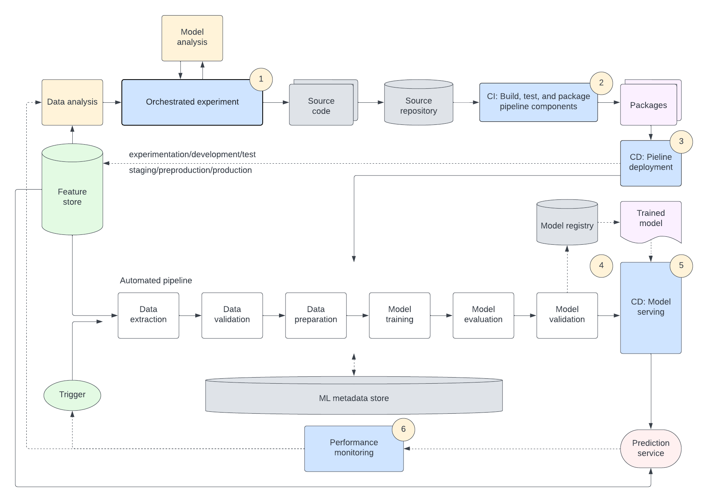

MLOps (Machine Learning Operations) and DevOps (Development Operations) represent two crucial paradigms in modern software development, each addressing distinct but interconnected aspects of the software lifecycle.

## What is DevOps

DevOps emphasizes the integration and collaboration between development and operations teams, aiming to automate and streamline the delivery pipeline from code commit to deployment. It emphasizes practices such as continuous integration, continuous delivery (CI/CD), infrastructure as code (IaC), and monitoring, fostering a culture of rapid iteration, feedback, and accountability. DevOps ensures that software is delivered quickly, reliably, and with high quality, enabling organizations to respond swiftly to market demands and deliver value to customers efficiently

## MLOps extends DevOps

MLOps extends the principles of DevOps to the realm of machine learning, focusing on the operationalization and management of machine learning models throughout their lifecycle. MLOps integrates data engineering, model development, deployment, monitoring, and governance into a cohesive workflow, enabling organizations to efficiently develop, deploy, and manage machine learning applications at scale. MLOps addresses challenges unique to machine learning, such as data drift, model decay, versioning, and reproducibility, by applying DevOps practices like automation, version control, and collaboration.

**By bridging the gap between data science and operations, MLOps ensures that machine learning models are deployed reliably, monitored effectively, and continually improved to meet evolving business needs.**

## Accelerate velocity with MLOps and Harness

Developer velocity is about removing barriers and friction points by adopting the best tools and practices to enable your developers to achieve their full potential.

Harness can help orchestrate and govern the practices of deploying secure code. Here's an example of a typical application flow combining MLOps and DevOps.

Watch this short demo on how Harness can automate the process of training, deploying, monitoring a machine learning model for a credit card loan application.

<DocVideo src="https://www.youtube.com/watch?v=T6O7m15O-VQ" />

import CISignupTip from '/docs/continuous-integration/shared/ci-signup-tip.md';

<CISignupTip />
