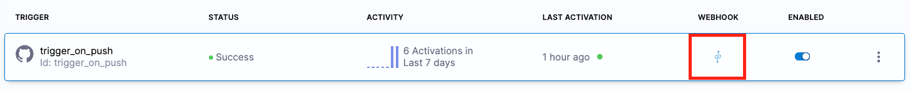
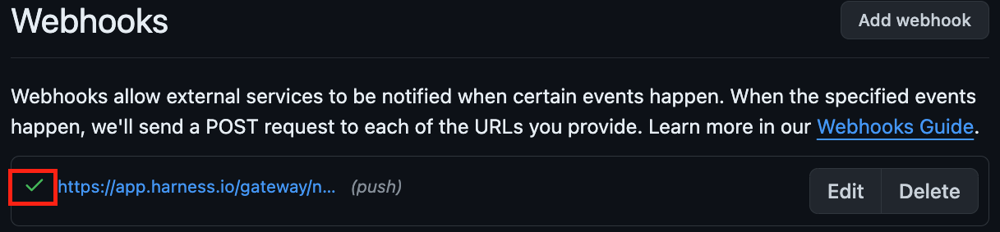

MLOps tackles the complexities of building, testing, deploying, and monitoring machine learning models in real-world environments.

Integrating machine learning into the traditional software development lifecycle poses unique challenges due to the intricacies of data, model versioning, scalability, and ongoing monitoring.

In this tutorial, you'll create an end-to-end MLOps CI/CD pipeline that will:

* Build and push an ML model to AWS ECR.
* Run security scans and tests.
* Deploy the model to AWS Lambda.
* Add policy enforcement and monitoring for the model.

## The story

This tutorial uses a fictional bank called _Harness Bank_. Assume that this fictional bank recently launched a website where clients can apply for a credit card. Based on the information provided in the form, the customer's application is approved or denied in seconds. This online credit card application is powered by a machine learning (ML) model trained on data that makes the decision accurate and unbiased.

Assume that the current process to update this hypothetical ML model is manual. A data scientist builds a new image locally, runs tests, and manually ensures that the model passes the required threshold for accuracy and fairness.

In this tutorial, you'll automate the model maintenance process and increase the build and delivery velocity.

### Design and architecture

Before diving into the implementation, review the MLOps architecture.


For this tutorial, assume you are given a Python data science project, and you are requested to do the following:

- Build and push an image for this project.
- Run security scans on the container image.
- Upload model visualization data to S3.
- Publish model visualization data within the pipeline.
- Run test on the model to find out accuracy and fairness scores.
- Based on those scores, use Open Policy Agent (OPA) policies to either approve or deny the model.
- Deploy the model.
- Monitor the model and ensure the model is not outdated.
- Trigger the pipeline based on certain git events.
- (Optional) Add approval gates for production deployment.

For this tutorial, assume that the data is already processed.

## Prerequisites

This tutorial requires:

* A Harness account with access to the Continuous Integration, Continuous Delivery, and Security Testing Orchestration modules. If you are new to Harness, [you can sign up for free](https://app.harness.io/auth/#/signup/?&utm_campaign=cicd-devrel).
* [An AWS account, credentials, and a Harness AWS connector.](#prepare-aws)
* [A GitHub account, credentials, and a Harness GitHub connector.](#prepare-github)

### Prepare AWS

You need an AWS account with sufficient permissions to create/modify/view resources used in this tutorial.

1. Prepare AWS credentials.

   This tutorial requires two sets of AWS credentials. One set is for a [Harness AWS connector](/docs/platform/connectors/cloud-providers/add-aws-connector), and the other is for the [AWS ECR scanner for STO](/docs/security-testing-orchestration/sto-techref-category/aws-ecr-scanner-reference).

   You can use an AWS Vault plugin to generate AWS credentials for the AWS connector, and you can use the AWS console to generate the AWS Access Key ID, AWS Secret Access Key, and AWS Session Token, which are valid for a shorter time.

   **Save these credentials securely and make a note of your AWS account ID and AWS region.**

   :::tip

   If you are using a personal, non-production AWS account for this tutorial, you can initially grant admin access for these credentials. Once the demo works, reduce access to adhere to the principle of least privilege.

   :::

2. Create ECR repos. From your AWS console, navigate to Elastic Container Registry (ECR) and create two private repositories named `ccapproval` and `ccapproval-deploy`. Under **Image scan settings**, enable **Scan on Push** for both repositories.

3. Create an S3 bucket. Navigate to S3 and create a bucket named something like `mlopswebapp`. You'll use this bucket to host a static website for the credit card approval application demo, along with a few other artifacts.

   Make sure all options under **Block public access (bucket settings)** are unchecked, and then apply the following bucket policy:

   ```
   {
       "Version": "2012-10-17",
       "Statement": [
           {
               "Effect": "Allow",
               "Principal": "*",
               "Action": "s3:GetObject",
               "Resource": "arn:aws:s3:::YOUR_S3_BUCKET_NAME/*"
           }
       ]
   }
   ```

   After making the bucket public, your bucket page should show a `Publicly accessible` flag.

   

4. From your AWS console, go to **AWS Lambda**, select **Functions**, and create a function from a container image using the following configuration:

   * Name: `creditcardapplicationlambda`
   * Container image URI: Select **Browse images** and find the `ccapproval-deploy` image. You can choose any image tag.
   * Architecture: `x86_64`
   * From Advanced: Select **Enable function URL** to make the function URL public. Anyone with the URL can access your function. For more information, go to the [AWS documentation on Lambda function URLs](https://docs.aws.amazon.com/lambda/latest/dg/lambda-urls.html).

5. Select **Create function** to create the function. You'll notice an info banner confirming that the function URL is public.

   

### Prepare GitHub

This tutorial uses a GitHub account for source control management.

1. Fork the [MLops sample app repository](https://github.com/harness-community/mlops-creditcard-approval-model) into your GitHub account.
2. Create a [GitHub personal access token](https://docs.github.com/en/authentication/keeping-your-account-and-data-secure/managing-your-personal-access-tokens) with following permissions on your forked repository:

   - repo/content: read+write
   - repo/pull requests: read
   - repo/webhooks: read+write

### Create Harness secrets

Store your GitHub and AWS credentials as secrets in Harness.

1. In your Harness account, create or select a [project](/docs/platform/organizations-and-projects/projects-and-organizations) to use for this tutorial.
2. In your project settings, select **Secrets**, select **New Secret**, and then select **Text**.
3. Create the following [Harness text secrets](/docs/platform/secrets/add-use-text-secrets):

   - `git_pat` - GitHub personal access token
   - `aws_access_key_id` - Generated from AWS console
   - `aws_secret_access_key` - Generated from AWS console
   - `aws_session_token` - Generated from AWS console
   - `aws_vault_secret` - Secret access key generated by Vault plugin

   Make sure the **Name** and **ID** match for each secret, because you reference secrets by their IDs in Harness pipelines.

### Create AWS and GitHub connectors

Create Harness connectors to connect to your AWS and GitHub accounts.

1. In your Harness project settings, go to **Connectors**.
2. Select **New Connector**, select the **AWS** connector, and then create an [AWS connector](/docs/platform/connectors/cloud-providers/add-aws-connector) with the following configuration:

   - Name: `mlopsawsconnector`
   - Access Key: AWS Vault plugin generated
   - Secret Key: Use  your `aws_vault_secret` secret
   - Connectivity Mode: Connect through Harness Platform

   Leave all other settings as is, and make sure the connection test passes.

   

3. Create another connector. This time, select the [GitHub connector](/docs/platform/connectors/code-repositories/ref-source-repo-provider/git-hub-connector-settings-reference) and and use the following configuration:

   - Name: `mlopsgithubconnector`
   - URL Type: `Repository`
   - Connection Type: `HTTP`
   - GitHub Repository URL: Enter the URL to your fork of the demo repo, such as `https://github.com/:gitHubUsername/mlops-creditcard-approval-model`
   - Username: Enter your GitHub username
   - Personal Access Token: Use your `git_pat` secret
   - Connectivity Mode: Connect through Harness Platform

## Create the Harness pipeline

In Harness, you create pipeline to represent workflows. Pipeline can have multiple stages, and each stage can have multiple steps.

1. In your Harness project, [create a pipeline](/docs/continuous-integration/use-ci/prep-ci-pipeline-components.md) named `Credit Card Approval MLops`.
2. Add a **Build** stage named `Train Model`.
3. Make sure **Clone Codebase** is enabled.
4. Select **Third-party Git provider**, and then select your `mlopsgithubconnector` GitHub connector. The repository name should populate automatically.
5. Select **Set Up Stage**.

In the following sections of this tutorial, you'll configure this stage to build and push the data science image, and you'll add more stages to the pipeline to meet the [tutorial's objectives](#design-and-architecture).

:::tip

You can find a [sample pipeline for this tutorial in the demo repo](https://github.com/harness-community/mlops-creditcard-approval-model/blob/main/sample-mlops-pipeline.yaml). If you use this pipeline, you must replace the placeholder and sample values accordingly.

:::

### Build, push, and scan the image

Configure your `Train Model` stage to build and push the data science image and then retrieve the ECR scan results.

1. Select the **Infrastructure** tab and configure the build infrastructure for the `Train Model` stage:

   * Select **Cloud** to use [Harness Cloud build infrastructure](/docs/continuous-integration/use-ci/set-up-build-infrastructure/use-harness-cloud-build-infrastructure).
   * For **Platform**, select **Linux**.
   * For **Architecture**, select **AMD64**.

2. Select the **Execution** tab to add steps to the stage.
3. Select **Add Step**, select the [Build and Push to ECR step](/docs/continuous-integration/use-ci/build-and-upload-artifacts/build-and-push/build-and-push-to-ecr-step-settings), and configure the step as follows:

   - For **Name**, enter `Harness Training`.
   - For **AWS Connector**, select your `mlopsawsconnector` AWS connector.
   - For **Region**, enter your AWS region.
   - For **Account ID**, enter your AWS account ID.
   - For **Image Name**, enter `ccapproval`.
   - For **Tags**, enter `<+pipeline.executionId>`. You can select the **Input type** icon to change the input type to expression (**f(x)**).
   - For **Dockerfile** (under **Optional Configuration**), enter `Dockerfile_Training_Testing`.

4. Select **Apply Changes** to save the step, and then select **Save** to save the pipeline.

Next, you'll add steps to your build stage to retrieve the results of the ECR repo security scan.

Because scanning is enabled on your ECR repositories, each image pushed to the repo by the **Build and Push to ECR** step is scanned for vulnerabilities. In order to successfully retrieve the scan results, your pipeline needs to wait for the scan to finish and then request the results.

5. Before adding the step to retrieve the scan result, use a [Run step](/docs/continuous-integration/use-ci/run-step-settings) to add a 15-second wait to ensure that the scan is complete before the pipeline requests the scan results.

   * Select **Add Step** after the `Harness Training` step, and select the **Run** step.
   * For **Name**, enter `Wait for ECR Image Scan`.
   * For **Command**, enter the following, and then select **Apply Changes** to save the step.

   ```bash
   echo "ECR Image Scan In Progress..."
   sleep 15
   ```

6. Add an [AWS ECR Scan step](/docs/security-testing-orchestration/sto-techref-category/aws-ecr-scanner-reference) to get the scan results.

   * Select **Add Step** after the `Wait` step, and select the **AWS ECR Scan** step.
   * For **Name**, enter `Security Scans for ML Model`.
   * For **Target/Name**, enter `ccapproval-ecr-scan`.
   * For **Variant**, enter `<+pipeline.executionId>`. You can select the **Input type** icon to change the input type to expression (**f(x)**).
   * For **Container Image/Name**, enter `ccapproval`.
   * For **Container Image/Tag**, enter `<+pipeline.executionId>`.
   * For **Region**, enter your AWS region.
   * Under **Authentication**, use [Harness expressions](/docs/platform/variables-and-expressions/harness-variables) referencing your AWS credential secrets:
      * For **Access ID**, enter `<+secrets.getValue("aws_access_key_id")>`.
      * For **Access Token**, enter `<+secrets.getValue("aws_secret_access_key")>`.
      * For **Access Region**, enter your AWS region.
      * For **Log Level**, enter `Info`.
  * Under **Settings**, add the following key-value pair: `AWS_SESSION_TOKEN: <+secrets.getValue("aws_session_token")>`

7. Select **Apply Changes** to save the step, and then select **Save** to save the pipeline.

At this point, you can run the pipeline to test the Build stage.

8. Select **Run Pipeline** to test the Build stage. For **Git Branch**, enter `main`.
9. Wait while the pipeline runs, and then check your `ccapproval` ECR repository to find an image with a SHA matching the pipeline execution ID. Select **Copy URI** to copy the image URI; you'll need it in the next section.
10. Make sure the image scan also ran. In the Harness [Build details](/docs/continuous-integration/use-ci/viewing-builds), you can find the scan results in the **AWS ECR Scan** step logs. For example:

   ```shell
   Scan Results: {
       "jobId": "xlf06YX6a8AupG_5igGA6I",
       "status": "Succeeded",
       "issuesCount": 10,
       "newIssuesCount": 10,
      "issuesBySeverityCount": {
           "ExternalPolicyFailures": 0,
           "NewCritical": 0,
           "NewHigh": 1,
           "NewMedium": 5,
           "NewLow": 4,
           "NewInfo": 0,
           "Unassigned": 0,
           "NewUnassigned": 0,
           "Critical": 0,
           "High": 1,
           "Medium": 5,
           "Low": 4,
           "Info": 0,
           "Ignored": 0
       }
   }
   ```

You've successfully completed the first part of this tutorial: Configuring a Build stage that builds, pushes, and scans a trained data science image.

Continue the tutorial in the next sections and continue building your MLOps pipeline.

### Test and upload artifacts

Add another **Build** stage to your pipeline that will run tests, build a Lambda image, and upload artifacts to S3.

1. Edit your MLOps pipeline and add another **Build** stage after the `Train Model` stage. Name the stage `Run test and upload artifacts` and make sure **Clone Codebase** is enabled.
2. On the stage's **Overview** tab, locate **Shared Paths**, and add `/harness/output`.
3. On the **Infrastructure** tab, select **Propagate from existing stage**, and select your `Train Model` stage.
4. On the **Execution** tab, add a **Run** step to run pytest on the demo copebase. Select **Add Step**, select the **Run** step, and configure it as follows:

   * For **Name**, enter `pytest`.
   * For **Shell**, select **Sh**.
   * For **Command**, enter:

   ```
   pytest --nbval-lax credit_card_approval.ipynb --junitxml=report.xml
   ```

   * Under **Optional Configuration**, locate **Container Registry**, and select your `mlopsawsconnector` AWS connector.
   * Under **Optional Configuration**, locate **Image**, and enter the image URI from your `Train Model` stage execution with the image tag replaced with `<+pipeline.executionId>`. For example:

   ```
   AWS_ACCOUNT_ID.dkr.ecr.AWS_REGION.amazonaws.com/AWS_ECR_REPO_NAME:<+pipeline.executionId>
   ```

The data science project includes two Dockerfiles: One for building the source and one for AWS Lambda deployment. Next, you'll add a step to build and push the image using the Dockerfile designed for AWS Lambda deployment.

5. Select **Add Step** and add a **Build and Push to ECR** step configured as follows:

   * For **Name**, enter `Build and Push Lambda Deployment Image`.
   * For **AWS Connector**, select your `mlopsawsconnector` AWS connector.
   * For **Region**, enter your AWS region.
   * For **Account ID**, enter your AWS account ID.
   * For **Image Name**, enter `ccapproval-deploy`.
   * For **Tags**, enter `<+pipeline.executionId>`.
   * Under **Optional Configuration**, locate **Dockerfile**, and enter `Dockerfile_Inference_Lambda`.

The `pytest` command from the **Run** step generates an HTML file with some visualizations for the demo ML model. Next, add steps to upload the visualizations artifact to your AWS S3 bucket and post the artifact URL on the Artifacts tab of the [Build details page](/docs/continuous-integration/use-ci/viewing-builds).

6. Select **Add Step**, and add an [Upload Artifacts to S3 step](/docs/continuous-integration/use-ci/build-and-upload-artifacts/upload-artifacts/upload-artifacts-to-s3) configured as follows:

   * For **Name**, enter `Upload artifacts to S3`.
   * For **AWS Connector**, select your `mlopsawsconnector` AWS connector.
   * For **Region**, enter your AWS region.
   * For **Bucket**, enter your S3 bucket name.
   * For **Source Path**, enter `/harness/output/model_metrics.html`. This is where the model visualization file from the `pytest` step is stored.

7. Use the [Artifact Metadata Publisher plugin](/docs/continuous-integration/use-ci/build-and-upload-artifacts/artifacts-tab) to post the visualization artifact URL on the build's Artifacts tab.

   * Add a **Plugin** step after the **Upload Artifacts to S3** step.
   * For **Name**, enter `Publish ML model visualization`.
   * For **Container Registry**, select the built-in **Harness Docker Connector**.
   * For **Image**, enter `plugins/artifact-metadata-publisher`.
   * Under **Optional Configuration**, locate **Settings**, and add the following key-value pairs:

   ```
   file_urls: https://S3_BUCKET_NAME.s3.AWS_REGION.amazonaws.com/harness/output/model_metrics.html
   artifact_file: artifact.txt
   ```

In addition to the model visualization, the `pytest` command also generates a `shared_env_variables.txt` file to export the model's accuracy and fairness metrics. However, this data is lost when the build ends because Harness stages run in isolated containers. Therefore, you must add a step to export the `ACCURACY` and `EQUAL_OPPORTUNITY_FAIRNESS_PERCENT` values as [output variables](/docs/continuous-integration/use-ci/run-step-settings.md#output-variables).

8. After the **Plugin** step, add a **Run** step configured as follows:

   * For **Name**, enter `Export accuracy and fairness variables`.
   * For **Shell**, select **Sh**.
   * For **Commmand**, enter:

   ```
   # File path
   FILE_PATH="/harness/output/shared_env_variables.txt"

   # Read the file and export variables
   while IFS='=' read -r key value; do
       case $key in
           ACCURACY)
               export ACCURACY="$value"
               ;;
           EQUAL_OPPORTUNITY_FAIRNESS_PERCENT)
               export EQUAL_OPPORTUNITY_FAIRNESS_PERCENT="$value"
               ;;
           *)
               echo "Ignoring unknown variable: $key"
               ;;
       esac
   done < "$FILE_PATH"

   echo $ACCURACY
   echo $EQUAL_OPPORTUNITY_FAIRNESS_PERCENT
   ```

   * Under **Optional Configuration**, locate **Output Variables**, and add the following two output variables:

   ```
   ACCURACY
   EQUAL_OPPORTUNITY_FAIRNESS_PERCENT
   ```

9. Save the pipeline, and then run it. Again, use `main` for the **Git Branch**.
10. Wait while the pipeline runs, and then make sure:

   * Your `ccapproval` and `ccapproval-deploy` ECR repositories have images with SHAs matches the pipeline execution ID.
   * Your S3 bucket has `/harness/output/model_metrics.html`.
   * The URL to the `model_metrics` artifact appears on the Artifacts tab in Harness.

   

   * The output variable values are in the log for the `Export accuracy and fairness variables` step, such as:

   ```shell
   0.92662
   20.799999999999997
   ```

Congratulations! So far, you've completed half the requirements for this MLOps project:

- [x] Build and push an image for this project.
- [x] Run security scans on the container image.
- [x] Upload model visualization data to S3.
- [x] Publish model visualization data within the pipeline.
- [x] Run test on the model to find out accuracy and fairness scores.
- [ ] Based on those scores, use Open Policy Agent (OPA) policies to either approve or deny the model.
- [ ] Deploy the model.
- [ ] Monitor the model and ensure the model is not outdated.
- [ ] Trigger the pipeline based on certain git events.
- [ ] (Optional) Add approval gates for production deployment.

Continue on with policy enforcement in the next section.

### Add ML model policy checks

In this section, you'll author OPA policies in Harness and use a **Custom** stage to add policy enforcement to your pipeline.

Harness [Policy As Code](/docs/platform/governance/policy-as-code/harness-governance-overview) uses Open Policy Agent (OPA) as the central service to store and enforce policies for the different entities and processes across the Harness platform. You create individual policies, add them to policy sets, and select the entities (such as pipelines) to evaluate those policies against.

For this tutorial, the policy requirements are that the model accuracy is over 90% and the fairness margin for equal opportunity is under 21%.

1. In your Harness project settings, go to **Policies**, select the **Policies** tab, and then select **New Policy**.
2. For **Name**, enter `Check fairness and accuracy scores`.
3. For **How do you want to setup your Policy**, select **Inline**.
4. Enter the following policy definition, and then select **Save**.

   ```rego
   package main

   default allow = false

   allow {
       input.accuracy >= 0.9
       input.fairnessScoreEqualOpportunity <= 21
   }

   deny[msg] {
       not allow
       msg = "Deny: Accuracy less than 90% or fairness score difference greater than 21%"
   }
   ```

5. Select the **Policy Sets** tab, and then select **New Policy Set**. Use the following configuration:

   * For **Name**, enter `Credit Card Approval Policy Set`.
   * For **Entity Type that this policy set applies to**, select **Custom**.
   * For **On what event should the policy set be evaluated**, select **On Step**.
   * Select **Add Policy**, and select your `Check fairness and accuracy scores` policy.
   * For **What should happen if a policy fails?**, select **Warn and Continue**.
   * Select **Finish**, and make sure the **Enforced** switch is enabled.

6. Edit your MLOps pipeline, and add a **Custom** stage after the second **Build** stage. Name the stage `Model Policy Checks`.
7. Select a Harness Delegate to use for the **Custom** stage.

   The **Build** stages run on Harness Cloud build infrastructure, which doesn't require a Harness Delegate. However, **Custom** stages can't use this build infrastructure, so you need a [Harness Delegate](/docs/platform/delegates/delegate-concepts/delegate-overview).

   If you don't already have one, [install a delegate](https://developer.harness.io/docs/platform/get-started/tutorials/install-delegate). Then, on the **Custom** stage's **Advanced** tab, select your delegate in **Define Delegate Selector**.

8. Add a **Shell Script** step to relay the accuracy and fairness output variables from the previous stage to the current stage. Configure the **Shell Script** step as follows:

   * For **Name**, enter `Accuracy and Fairness`.
   * For **Timeout**, enter `10m`.
   * For **Script Type**, select **Bash**.
   * For **Select script location**, select **Inline**.
   * For **Script**, enter the following:

      ```
      accuracy=<+pipeline.stages.Harness_Training.spec.execution.steps.Export_accuracy_and_fairness_variables.output.outputVariables.ACCURACY>
      fairness_equalopportunity=<+pipeline.stages.Harness_Training.spec.execution.steps.Export_accuracy_and_fairness_variables.output.outputVariables.EQUAL_OPPORTUNITY_FAIRNESS_PERCENT>
      ```

   * Under **Optional Configuration**, locate **Script Output Variables**, and add the following two variables:
      * `accuracy` - String - `accuracy`
      * `fairness_equalopportunity` - String - `fairness_equalopportunity`

   :::info

   While you can feed the output variables directly into **Policy** steps, this **Shell Script** step is a useful debugging measure that ensures the accuracy and fairness variables are populated correctly.

   :::

9. Add a **Policy** step after the **Shell Script** step.

   * For **Name**, enter `Enforce Fairness and Accuracy Policy`.
   * For **Timeout**, enter `10m`.
   * For **Entity Type**, select **Custom**.
   * For **Policy Set**, select your `Credit Card Approval Policy Set`.
   * For **Payload**, enter the following:

      ```
      {
          "accuracy": <+execution.steps.Accuracy_and_Fairness.output.outputVariables.accuracy>,
          "fairnessScoreEqualOpportunity": <+execution.steps.Accuracy_and_Fairness.output.outputVariables.fairness_equalopportunity>
      }
      ```

10. Save the pipeline.

The next time the pipeline runs, the policy is enforced to check if the model accuracy and fairness margins are within the acceptable limits. If not, the pipeline produces a warning and then continues (according to the policy set configuration). You could also configure the policy set so that the pipeline fails if there is a policy violation.

If you want to test the response to a policy violation, you can modify the policy definition's `allow` section to be more strict, such as:

```rego
allow {
    input.accuracy >= 0.95
    input.fairnessScoreEqualOpportunity <= 19
}
```

Since the model accuracy is around 92% and the fairness margin is around 20%, this policy definition should produce a warning. Make sure to revert the change to the policy definition once you're done experimenting.

## Deploy AWS Lambda function

In Harness, you can specify the location of a function definition, artifact, and AWS account, and then Harness deploys the Lambda function and automatically routes traffic from the old version of the Lambda function to the new version on each deployment. In this part of the tutorial, you'll update an existing Lambda function by adding a **Deploy** stage with service, environment, and infrastructure definitions.

1. Edit your MLOPs pipeline, and add a **Deploy** stage named `lambdadeployment`.
2. **Deployment Type**, select **AWS Lambda**, and then select **Continue**.
3. Create a [service definition](/docs/continuous-delivery/get-started/key-concepts.md#service) for the Lambda deployment.

   * Select **Add Service**.
   * For **Name**, enter `creditcardapproval-lambda-service`.
   * For **Set up service**, select **Inline**.
   * For **Deployment Type**, select **AWS Lambda**.
   * Under **AWS Lambda Function Definition**, for **Manifest Identifier**, enter `lambdadefinition`, and for **File/Folder Path**, enter `/lambdamanifest`.

4. After creating the manifest under Harness File Store, add the following to the service manifest, and select **Save**:

   ```
   functionName: `creditcardapplicationlambda`
   role: LAMBDA_FUNCTION_ARN
   ```

   Replace `LAMBDA_FUNCTION_ARN` with your Lambda function's ARN. You can find the **Function ARN** when viewing the function in the AWS console.

   

5. Under the **Artifacts** section for the service definition, provide the artifact details to use for the lambda deployment:

   * Artifact Source Identifier: `ccapprovaldeploy`
   * Region: YOUR_AWS_REGION
   * Image Path: `ccapproval-deploy`
   * Value - Tag: `<+input>` ([runtime input](/docs/platform/variables-and-expressions/runtime-inputs))

6. Create environment and infrastructure definitions for the Lambda deployment. On the **Deploy** stage's **Environment** tab, select **New Environment**, and use the following environment configuration:

   ```
   name: lambda-env
   type: PreProduction
   ```

7. From the `lambda-env`, go to the **Infrastructure Definitions** tab, and add an infrastructure definition with the following configuration:

   ```
   name: `aws-lambda-infra`
   deploymentType: `AwsLambda`
   type: AwsLambda
     spec:
       connectorRef: `mlopsawsconnector`
       region: YOUR_AWS_REGION
   ```

8. Select **Save** to save the infrastructure definition.
9. On the **Deploy** stage's **Execution** tab, add an **AWS Lambda Deploy** step named `Deploy Aws Lambda` for the name. No other configuration is necessary.
10. Save and run the pipeline. For **Git Branch**, enter `main`, and for **Tag**, enter `<+pipeline.executionId>`, and then select **Run Pipeline**.

   You need to provide the image tag value because the service definition's **Tag** setting uses runtime input (`<+input>`).

   While the pipeline runs, you can observe the build logs showing the lambda function being deployed with the latest artifact that was built and pushed from the same pipeline.

11. Test the response from the lambda function.

   * In your AWS console, go to **AWS Lambda**, select **Functions**, and select your `creditcardapplicationlambda` function.
   * On the **Test** tab, select **Create new event**, and create an event named `testmodel` with the following JSON:

   ```
   {
     "Num_Children": 2,
     "Income": 500000,
     "Own_Car": 1,
     "Own_Housing": 1
   }
   ```

   * Select **Test** to execute the function with your `testmodel` test event. Once the function finishes execution, you'll get the result with a **Function URL**.

   

12. Note the **Function URL** resulting from the lambda function test. This is the endpoint that your [ML web application](#use-the-ml-model-in-a-web-application) would call. Depending on the prediction of `0` or `1`, the web application either approves or denies the demo credit card application.

## Monitor the model

There are many ways to monitor ML models. In this tutorial, you'll monitor if the model was recently updated. If it hasn't been updated recently, Harness sends an email alerting you that the model might be stale.

1. Edit your MLOPs pipeline, and add a **Build** stage after the **Deploy** stage.

   * For **Name**, enter `Monitor Model stage`.
   * *Disable* **Clone Codebase**.
   * On the **Infrastructure** tab, select **Propagate from existing stage** and select the first **Build** stage.

2. Add a **Run** step to find out when the model was last updated.

   * For **Name**, enter `Monitor Model step`.
   * For **Shell**, select **Sh**.
   * For **Command**, enter:

   ```
   # GitHub repository owner
   OWNER="YOUR_GITHUB_USERNAME"

   # GitHub repository name
   REPO="mlops-creditcard-approval-model"

   # Path to the file you want to check (relative to the repository root)
   FILE_PATH="credit_card_approval.ipynb"

   # GitHub Personal Access Token (PAT)
   TOKEN=<+secrets.getValue("git_pat")>

   # GitHub API URL
   API_URL="https://api.github.com/repos/$OWNER/$REPO/commits?path=$FILE_PATH&per_page=1"

   # Get the current date
   CURRENT_DATE=$(date -u +"%Y-%m-%dT%H:%M:%SZ")

   # Calculate the date 7 days ago
   SEVEN_DAYS_AGO=$(date -u -d "7 days ago" +"%Y-%m-%dT%H:%M:%SZ")

   # Get the latest commit date for the file
   LATEST_COMMIT_DATE=$(curl -s -H "Authorization: token $TOKEN" $API_URL | jq -r '.[0].commit.committer.date')

   # Check if the file has been updated in the last 7 days
   if [ "$(date -d "$LATEST_COMMIT_DATE" +%s)" -lt "$(date -d "$SEVEN_DAYS_AGO" +%s)" ]; then
       export model_stale=true
   else
       export model_stale=false
   fi
   ```

   * Under **Optional Configuration**, add `model_stale` to **Output Variables**.

3. After the `Monitor Model` stage, add a **Custom** stage named `Email notification`. This stage will send the email notification if the model is stale.
4. Add an **Email** step to the last **Custom** stage.

   * For **Name**, enter `Email`.
   * For **Timeout**, enter `10m`.
   * For **To**, enter the email address to receive the notification, such as the email address for your Harness account.
   * For **Subject**, enter `Credit card approval ML model has not been updated in a week.`
   * For **Body**, enter `It has been 7 days since the credit card approval ML model was updated. Please update the model.`
   * On the step's **Advanced** tab, add a [conditional execution](/docs/platform/pipelines/step-skip-condition-settings) so the **Email** step only runs if the `model_stale` variable (from the `Monitor Model` step) is `true`:
      * For **Execute this step**, select **If the stage executes successfully up to this point**.
      * Select **And execute this step only if the following JEXL Condition evaluates to true**.
      * Enter the following JEXL condition:

         ```
         <+pipeline.stages.Monitor_Model_Stage.spec.execution.steps.Monitor_Model_Step.output.outputVariables.model_stale> == true
         ```

5. Save and run the pipeline. For **Git Branch**, enter `main`, and for **Tag**, enter `<+pipeline.executionId>`.

## Trigger pipeline based on Git events

So far, this tutorial used manually triggered builds. However, as the number of builds and pipeline executions grow, it's not scalable to manually trigger builds. In this part of the tutorial, you'll add a [Git event trigger](/docs/platform/triggers/triggering-pipelines).

Assume your team has a specific requirement where they want the MLOps pipeline to run *only* if there's an update to the Jupyter notebook in the codebase.

1. In your MLOps pipeline, select **Triggers** at the top of the Pipeline Studio, and then select **New Trigger**.
2. Select the GitHub webhook trigger.
3. On the trigger's **Configuration** tab:

   * For **Name**, enter `trigger_on_notebook_update`.
   * For **Connector**, select your `mlopsgithubconnector` GitHub connector.
   * The **Repository URL** should automatically populate.
   * For **Event**, select **Push**.

4. Select **Continue** to go to the **Conditions** tab.

   * For **Branch Name**, select the **Equals** operator, and enter `main` for the **Matches Value**.
   * For **Changed Files**, select the **Equals** operator, and enter `credit_card_approval.ipynb` for the **Matches Value**.

5. Select **Continue** to go to the **Pipeline Input** tab.

   * The **Git Branch** should automatically populate.
   * For **Primary Artifact**, enter `ccapprovaldeploy`.
   * For **Tag**, enter `<+pipeline.executionId>`.

6. Select **Create Trigger**.

   The trigger webhook should automatically register in your GitHub repository. If it doesn't, you'll need to manually register the webhook:

   * On the list of triggers in Harness, select the **Link** icon to copy the webhook URL for the trigger.

   

   * In your GitHub repository, navigate to **Settings**, select **Webhook**, and then select **Add Webhook**.
   * Paste the webhook URL in **Payload URL**.
   * Set the **Content type** to `application/json`.
   * Select **Add webhook**.

   A green checkmark in the GitHub webhooks list indicates that the webhook connected successfully.

   

With the trigger in place, whenever you push a change to the `credit_card_approval.ipynb` file on the `main` branch, the MLOps pipeline runs. In the trigger settings, you could adjust or remove the **Conditions** (branch name, changed files, and so on) according to your requirements, if you wanted to use a Git event trigger in a live development or production scenario.

## Add an approval gate before prod deployment

Your organization might require an approval gate for your CI/CD pipeline before an artifact is deployed to production. Harness offers built-in approval steps for Jira, ServiceNow, or Harness approvals.

Assume that you have a different image for production, and a different AWS Lambda function is deployed based on that container image. In your MLOps pipeline, you can create another `AWS Lambda deployment` stage with another `AWS Lambda deploy` step for the production environment and use the approval gate prior to running that production deployment stage.

1. To add the approval gate, add an **Approval** stage immediately prior to the **Deploy** stage that requires approval.

   * For **Name**, enter `approval-to-prod`.
   * For **Approval Type**, select **Harness Approval**.

2. Add an **Approval** step to the **Approval** stage.

   * For **Name**, enter `approval-to-prod`.
   * For **Timeout**, enter `1d`.
   * Use the default **Message**.
   * For **User Groups**, select **Select User Groups**, select **Project**, and select **All Project Users**.

3. Save the pipeline.

Next time you run the pipeline, someone from the Harness project must approve the promotion of artifact to the production environment before the final **Deploy** stage runs.

## Use the model in a web application

In a live MLOps scenario, the ML model would likely power a web application. While this app development is outside the scope of this tutorial, the following animation demonstrates a simple web application developed using plain HTML/CSS/JS. The outcome of the credit card application uses the response from the public AWS Lambda function URL invocation.


## Conclusion

Congratulations! Here's what you've accomplished in this tutorial:

- [x] Build and push an image for this project.
- [x] Run security scans on the container image.
- [x] Upload model visualization data to S3.
- [x] Publish model visualization data within the pipeline.
- [x] Run test on the model to find out accuracy and fairness scores.
- [x] Based on those scores, use Open Policy Agent (OPA) policies to either approve or deny the model.
- [x] Deploy the model.
- [x] Monitor the model and ensure the model is not outdated.
- [x] Trigger the pipeline based on certain git events.
- [x] (Optional) Add approval gates for production deployment.

Now that you've built an MLOps pipeline on Harness and used the Harness platform to train the model, check out the following guides to learn how you can integrate other popular ML tools and platforms into your Harness CI/CD pipelines:

- [AWS SageMaker](https://developer.harness.io/docs/continuous-integration/development-guides/mlops/mlops-sagemaker)
- [Databricks](https://developer.harness.io/docs/continuous-integration/development-guides/mlops/mlops-databricks)
- [Google Vertex AI](https://developer.harness.io/docs/continuous-integration/development-guides/mlops/mlops-vertexai)
- [Azure ML](https://developer.harness.io/docs/continuous-integration/development-guides/mlops/mlops-azureml)
- [MLflow](https://developer.harness.io/docs/continuous-integration/development-guides/mlops/mlops-mlflow)
