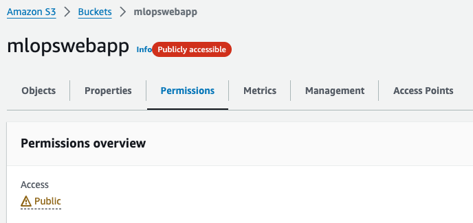
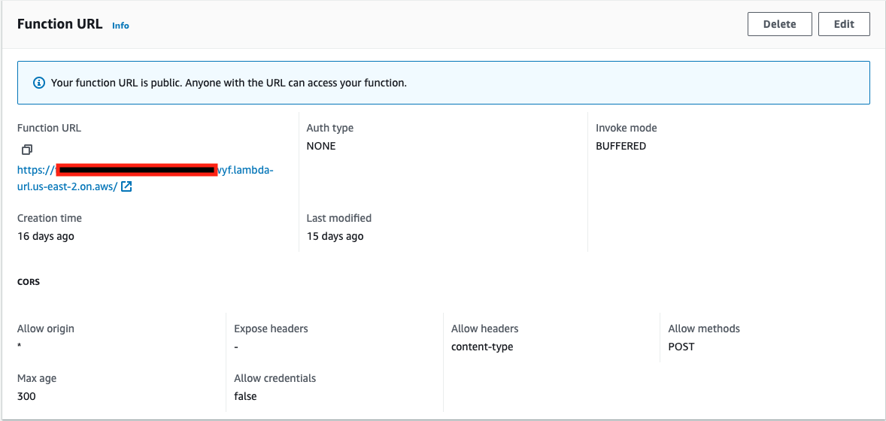
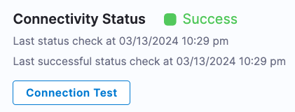
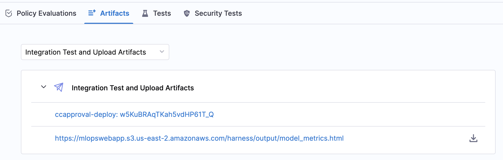
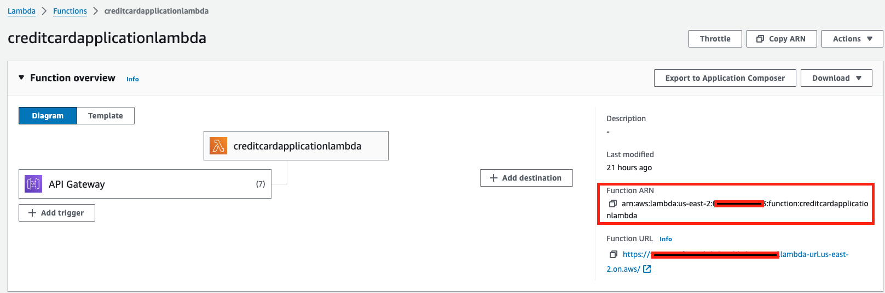
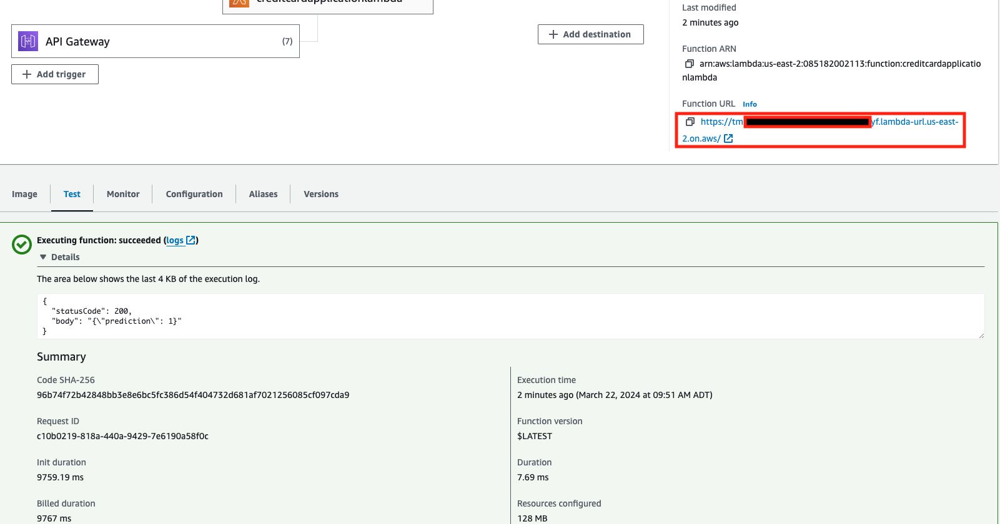
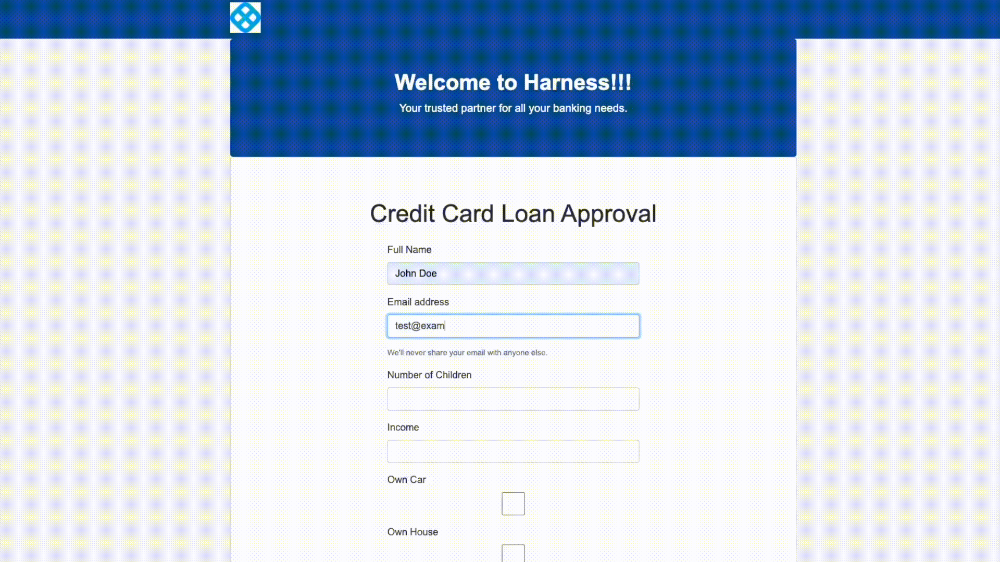

MLOps tackles the complexities of building, testing, deploying, and monitoring machine learning models in real-world environments. Integrating machine learning into traditional software development lifecycles poses unique challenges due to the intricacies of data, model versioning, scalability, and ongoing monitoring. In this tutorial, I will show you how to build and push an ML model to AWS ECR, run security scans and tests, and then deploy the model to AWS Lambda. We'll also add policy enforcement and monitoring for the model. 

## The Story

**Harness Bank** is a fictional bank that recently launched a website where clients can apply for a credit card. Based on the information provided in the form, their application either gets approved or denied in seconds. What powers this online credit card application is a machine learning (ML) model that is trained on data so that the decision is accurate and free of any bias. Right now, the process to update the ML model is manual. A data scientist builds a new image locally, runs tests, and manually ensures that the model passes the required threshold for accuracy and fairness. Our job is to automate this process and increase the velocity for build and delivery.

## Design and Architecture

Before diving into the implementation, let's take a high-level view of the architecture.


We are given a Python data science project and are requested to do the following:

- Build and push an image for this project
- Run security scans on the container image
- Upload model visualization data to S3
- Publish model visualization data within the pipeline
- Run test on the model to find out accuracy and fairness scores
- Based on those scores, use Open Policy Agent (OPA) policies to either approve or deny the model
- Deploy the model 
- Monitor the model and ensure the model is not outdated
- Trigger the pipeline based on certain git events
- (Optional) Add approval gates for production deployment

For this tutorial, we assume that the data is already processed.

## Prerequisites

- A Harness account. If you don't have one, [please sign up](https://app.harness.io/auth/#/signup/?&utm_campaign=cicd-devrel).
- Fork [MLops sample app](https://github.com/harness-community/mlops-sample-app) repository
- An AWS account with sufficient permissions to create/modify/view resources used in this tutorial.
- This tutorial uses two sets of AWS credentials - one for [AWS connector](https://developer.harness.io/docs/cloud-cost-management/use-ccm-cost-optimization/optimize-cloud-costs-with-intelligent-cloud-auto-stopping-rules/add-connectors/connect-to-an-aws-connector/) and another one is for the [AWS ECR scanner for STO](https://developer.harness.io/docs/security-testing-orchestration/sto-techref-category/aws-ecr-scanner-reference/). If this is a personal, non-production AWS account used for demo purposes, you can initially grant admin-level access for these credentials. Once the demo works, reduce access to adhere to the principle of least privilege.

## Setup and configuration

### AWS access and resources

The AWS credentials for AWS connector is generated using AWS Vault plugin which is valid for 24 hours. AWS Access Key ID, AWS Secret Access Key, and AWS Session Token are generated from AWS console which are valid for much shorter time. Once you generate these two sets of AWS credentials, save them securely. Also make a note of your AWS account ID and AWS region.

From your AWS console, navigate to Elastic Container Registry (ECR) and create two private repositories - `ccapproval` and `ccapproval-deploy`. Make sure that **Scan on Push** is enabled for both repositories under the **Image scan settings**.

Next, navigate to S3 and create a bucket. For example, `mlopswebapp`. We'll use this bucket to host a static website for the credit card approval application, along with a few other artifacts. To proceed, ensure that all checkboxes under **Block public access (bucket settings)** are unchecked and apply the following bucket policy:

```
{
    "Version": "2012-10-17",
    "Statement": [
        {
            "Effect": "Allow",
            "Principal": "*",
            "Action": "s3:GetObject",
            "Resource": "arn:aws:s3:::YOUR_S3_BUCKET_NAME/*"
        }
    ]
}
```

After making the bucket public, you will see something similar to this:



Next, go to **AWS Lambda --> Functions** from your AWS console and create a function from a container image. Use the following configuration:

Name: `creditcardapplicationlambda`
Container image URI: Click **Browse images** and find the `ccapproval-deploy` image. You can choose any image tag.
Architecture: `x86_64`
From Advanced: *Enable function URL* (this will make the function URL public. Anyone with the URL can access your function.) Learn more about Lambda function URLs from [AWS docs](https://docs.aws.amazon.com/lambda/latest/dg/lambda-urls.html).

Click **Create function**. Once the function is created, you can notice this tooltip confirming that the function URL is public.



### GitHub PAT

Create a [GitHub PAT](https://docs.github.com/en/authentication/keeping-your-account-and-data-secure/managing-your-personal-access-tokens) that has the following permissions on your forked repository:

- repo/content: read+write
- repo/pull requests: read
- repo/webhooks: read+write

### Create Harness secrets

From **Project Setup --> Secrets**, click **+ New Secret --> Text** and add the following secrets:

- `git_pat` (GitHub personal access token you already created)
- `aws_access_key_id` (generated from AWS console)
- `aws_secret_access_key` (generated from AWS console)
- `aws_session_token` (generated from AWS console)
- `aws_vault_secret` (secret access key generated by Vault)

Ensure that these secret names and IDs are consistent, as we will reference them in the pipeline blueprint provided at the end of this tutorial.

### Create AWS and GitHub connectors

From **Project Setup --> Connectors**, click **+ New Connector --> AWS** and use the following to create the connector:

- name: `mlopsawsconnector`
- Access Key: AWS Vault plugin generated 
- Secret Key: Use `aws_vault_secret` secret
- Connectivity Mode: Connect through Harness Platform

Leave all other settings as is. The connectivity status should show **Success**.



Next, from **Project Setup --> Connectors**, click **+ New Connector --> GitHub** and use the following to create the connector:

- name: `mlopsgithubconnector`
- URL Type: `Repository`
- Connection Type: `HTTP`
- GitHub Repository URL: `https://github.com/YOUR_GITHUB_USERNAME/mlops-sample-app` (this is the forked version)
- Username: Your GitHub username
- Personal Access Token: Use `git_pat` secret
- Connectivity Mode: Connect through Harness Platform

### Create the pipeline

From **Project --> Pipelines**, click **+ Create a Pipeline**, and name this pipeline `Credit Card Approval MLops`. Then, click **Start**.

In Harness, a pipeline can have one or more stages, and each stage can have one or more steps. Let's add the first stage to build and push the data science image. Choose **Build** for stage type and name this stage `Train Model`, ensure that **Clone Codebase** is enabled, and select the `mlopsgithubconnector` from **Third-party Git provider --> Connector**. The repository name should be automatically populated. Click **Set Up Stage**.

In the following sections, we'll configure this stage and add more stages to this pipeline to meet the requirements outlined earlier.

## Build an image, push to ECR, run security scan

Under **Infrastructure**, select **Cloud** to execute the stage in a Harness hosted environment. For **Platform**, choose `Linux`, and for **Architecture**, select `AMD64`.

Next, under **Execution**, click **Add Step** and find **Build and Push to ECR** from the **Step Library --> Build** section.  The Harness CI module offers numerous out-of-the-box steps like this one, eliminating the need to write scripts for common tasks. Configure the step with the following settings:

- Name: `Harness Training`
- AWS Connector: `mlopsawsconnector` (previously created)
- Region: YOUR_AWS_REGION (previously noted)
- Account Id: YOUR_AWS_ACCOUNT_ID (previously noted)
- Image Name: `ccapproval` (repository previously created)
- Tags: `<+pipeline.executionId>` (click the pin icon and change to f(x) for Harness expression)
- Dockerfile: `Dockerfile_Training_Testing` (expand Optional Configuration to see this setting)

Click **Apply Changes** and click **Save** to save the pipeline. 

Since we have scanning enabled on the ECR repositories, it may take some time for the image to be scanned for vulnerabilities after each push. Before adding the step to retrieve the scan result, let's include a 15-second wait to ensure that the scan is completed by the time we request the result.

Click **Add Step** after the Harness Training step and add a **Run** step from the **Step Library --> Build**. Give this step a name: `Wait for ECR Image Scan` and add the following script under **Command**:

```bash
echo "ECR Image Scan In Progress..."
sleep 15
```

Click **Apply Changes**.

Next, click **Add Step** after `Wait for ECR Image Scan` step and add **AWS ECR Scan** step from the **Step Library --> Security Tests**. Use the following configuration:

- Name: `Security Scans for ML Model`
- Target/Name: `ccapproval-ecr-scan`
- Variant: `<+pipeline.executionId>` (click the pin icon, change to f(x) for Harness expression, and then paste this expression)
- Container Image/Name: `ccapproval`
- Container Image/Tag: `<+pipeline.executionId>` (click the pin icon, change to f(x) for Harness expression, and then paste this expression)
- Region: YOUR_AWS_REGION (previously noted)

Authentication:

Ensure that you've used the same names for the credentials as noted in the previous section.

Access Id: `<+secrets.getValue("aws_access_key_id")>` (click the pin icon, change to f(x) for Harness expression, and then paste this expression)
Access Token: `<+secrets.getValue("aws_secret_access_key")>` (click the pin icon, change to f(x) for Harness expression, and then paste this expression)
Access Region: YOUR_AWS_REGION (previously noted)
Log Level: `Info`

Settings:

| Key  | Value  |
|---|---|
| AWS_SESSION_TOKEN  | `<+secrets.getValue("aws_session_token")`>  |

Click **Apply Changes** and then **Save** to save the pipeline.

Click **Run** and then **Run Pipeline** to execute this pipeline. Use `main` for **Git Branch** if prompted. Once the pipeline finishes execution, check the `ccapproval` ECR repository to find an image with a SHA that matches the pipeline execution ID. Copy the image URI by clicking the button **Copy URI**. You'll need this in the next section. Ensure that the image scan has also been completed, and review the `Security Scans for ML Model` step logs for the scan results as follows:

```shell
Scan Results: {
    "jobId": "xlf06YX6a8AupG_5igGA6I",
    "status": "Succeeded",
    "issuesCount": 10,
    "newIssuesCount": 10,
    "issuesBySeverityCount": {
        "ExternalPolicyFailures": 0,
        "NewCritical": 0,
        "NewHigh": 1,
        "NewMedium": 5,
        "NewLow": 4,
        "NewInfo": 0,
        "Unassigned": 0,
        "NewUnassigned": 0,
        "Critical": 0,
        "High": 1,
        "Medium": 5,
        "Low": 4,
        "Info": 0,
        "Ignored": 0
    }
}
```

Congratulations! In this stage, you successfully built and pushed the data science image, which has been trained. Additionally, you fetched the result of a security scan to inspect vulnerabilities in the image.

## Run test and upload artifacts

### Run pytest

After the successful execution of `Harness Training` stage, click **Edit Pipeline** and then **Add Stage**. Choose **Build** as the stage type. Use the following configuration:

- Name: Run test and upload artifacts
- Clone Codebase: enabled
- Shared Paths: /harness/output (path shared between steps)
- Use a New Infrastructure: Cloud
- Operating System: Linux
- Architecture AMD64

Click **Add Step** and select **Run** step from the step library. Use the following configuration for this step:

Name: pytest
Shell: Sh
Command: pytest --nbval-lax credit_card_approval.ipynb --junitxml=report.xml

**Optional Configuration**

Container Registry: `mlopsawsconnector` (previously created)
Image: Click the pin icon to change fixed value to expression.  Use the image URI you previously copied except the image tag. The image tag follows the pipeline execution ID. Example: `YOUR_AWS_ACCOUNT_ID.dkr.ecr.YOUR_AWS_REGION.amazonaws.com/YOUR_AWS_ECR_REPO_NAME:<+pipeline.executionId>`

Click **Apply Changes**.

### Build image for Lambda

The data science project includes two Dockerfiles: one for building the source and the other for AWS Lambda deployment. In this step, we'll build and push the image using the Dockerfile designed for AWS Lambda deployment.

Click **Add Step** and find **Build and Push to ECR** from the **Step Library --> Build** section. Configure the step with the following settings:

Name: `Build and Push Lambda Deployment Image`
AWS Connector: `mlopsawsconnector`
Region: YOUR_AWS_REGION (previously noted)
Account ID: YOUR_AWS_ACCOUNT_ID (previously noted)
Image Name: `ccapproval-deploy` (repository previously created)
Tags: `<+pipeline.executionId>` (click the pin icon and change to f(x) for Harness expression)
- Dockerfile: `Dockerfile_Inference_Lambda` (expand Optional Configuration to see this setting)

Click **Apply Changes** and **Save** to save the pipeline.

### Upload artifacts to S3

The pytest command from the previous test generated an HTML file with some visualizations for our ML model. In this step, we'll upload that artifact to an AWS S3 bucket that you previously created. 

Click **Add Step** and find **Upload Artifacts to S3** from step library. Use the following configuration:

Name: `Upload artifacts to S3`
AWS Connector: `mlopsawsconnector`
Region: YOUR_AWS_REGION (previously noted)
Bucket: YOUR_S3_BUCKET_NAME (previously created)
Source Path: `/harness/output/model_metrics.html` (this is where the model visualization file from the previous step is generated)

Click **Apply Changes** and **Save** to save the pipeline.

### Artifact Metadata Publisher

You can use the [Artifact Metadata Publisher plugin](https://github.com/drone-plugins/artifact-metadata-publisher) to publish any URL on the Artifacts tab of the [Build details page](https://developer.harness.io/docs/continuous-integration/use-ci/viewing-builds). In this step, we'll publish the model visualization file to the Artifacts tab.

Click **Add Step** and find **Plugin** from the **Step Library --> Build** section. Use the following configuration:

Name: `Publish ML model visualization`
Container Registry: `Harness Docker Connector` (a preconfigured docker connector available to you)
Image: `plugins/artifact-metadata-publisher`

**Optional Configuration/Settings**

Key: file_urls

Value: https://YOUR_S3_BUCKET_NAME.s3.YOUR_AWS_REGION.amazonaws.com/harness/output/model_metrics.html

Click **Apply Changes** and **Save** to save the pipeline.

### Use step output variables

In addition to the model visualization, running the pytest command in the previous step also generates another file (shared_env_variables.txt) to export the model's accuracy and fairness metrics. Since the test runs in a container, the data is lost with the container's lifecycle. Therefore, in this step, we export two values, ACCURACY and EQUAL_OPPORTUNITY_FAIRNESS_PERCENT, as [step output variables](https://developer.harness.io/kb/continuous-delivery/articles/chained-pipeline-output-variables/). 

Click **Add Step** and add a **Run** step. Use the following configuration:

Name: Export accuracy and fairness variables
Shell: Sh
Commmand:

```
# File path
FILE_PATH="/harness/output/shared_env_variables.txt"

# Read the file and export variables
while IFS='=' read -r key value; do
    case $key in
        ACCURACY)
            export ACCURACY="$value"
            ;;
        EQUAL_OPPORTUNITY_FAIRNESS_PERCENT)
            export EQUAL_OPPORTUNITY_FAIRNESS_PERCENT="$value"
            ;;
        *)
            echo "Ignoring unknown variable: $key"
            ;;
    esac
done < "$FILE_PATH"

echo $ACCURACY
echo $EQUAL_OPPORTUNITY_FAIRNESS_PERCENT

```

**Optional Configuration/Output Variables**

- ACCURACY
- EQUAL_OPPORTUNITY_FAIRNESS_PERCENT

Click **Apply Changes** and **Save** to save the pipeline.

Now execute the pipeline by clicking **Run** --> **Run Pipeline**. Use `main` for **Git Branch** if prompted. Once the pipeline finishes execution, check the `ccapproval` and `ccapproval-deploy` ECR repositories to find images with a SHA that matches the pipeline execution ID. You should also see the model_metrics.html file on your S3 bucket (under /harness/output directory) as well as under the Artifacts tab for your pipeline.



Click the **Export accuracy and fairness variables** step after the pipeline finishes execution, and you should see something like the following result from the ML model.:

```shell
0.92662
20.799999999999997
```

Congratulations! We have completed half of the requirements for this MLOps project:

- [x] Build and push an image for this project
- [x] Run security scans on the container image
- [x] Upload model visualization data to S3
- [x] Publish model visualization data within the pipeline
- [x] Run test on the model to find out accuracy and fairness scores
- [ ] Based on those scores, use Open Policy Agent (OPA) policies to either approve or deny the model
- [ ] Deploy the model 
- [ ] Monitor the model and ensure the model is not outdated
- [ ] Trigger the pipeline based on certain git events
- [ ] (Optional) Add approval gates for production deployment

Let's tackle policy enforcement in the next section.

## ML Model Policy Check

Click **Edit Pipeline** and then **Add Stage**. Choose **Custom** as the stage type. Click **Add Step** and then **Shell Script** from the step library. 

### Accuracy and Fairness

In this step, we'll relay the accuracy and fairness step output variables from the previous stage to the current stage. Use the following configuration for this shell script step:

Name: Accuracy and Fairness
Timeout: 10m
Script Type: Bash
Select script location: Inline
Script:

```
accuracy=<+pipeline.stages.Harness_Training.spec.execution.steps.Export_accuracy_and_fairness_variables.output.outputVariables.ACCURACY>
fairness_equalopportunity=<+pipeline.stages.Harness_Training.spec.execution.steps.Export_accuracy_and_fairness_variables.output.outputVariables.EQUAL_OPPORTUNITY_FAIRNESS_PERCENT>
```

Optional Configuration/Script Output Variables:

| Name  | Type  | Bash Output Variable  |
|---|---|---|
| accuracy  | String  | accuracy  |
| fairness_equalopportunity  | String  | fairness_equalopportunity  |

> **_NOTE:_** It's possible to skip this step and feed the output variable directly to the policy step. However, including this step serves as a useful debugging measure to ensure that the accuracy and fairness variables are populated correctly. 

Click **Apply Changes** and **Save** to save the pipeline.

### Author policies

Before we create the policy enforcement step, we have to author the policy. Harness Policy As Code uses Open Policy Agent (OPA) as the central service to store and enforce policies for the different entities and processes across the Harness platform. 

From **Project Setup --> Policies**, click the **Policies** tab and then **+ New Policy**. Use the following configuration:

Name: Check fairness and accuracy scores
How do you want to setup your Policy?: Inline

We want the model accuracy to be over 90% and the fairness margin for equal opportunity to be under 21%. Based on this, let's author the OPA policy:

```rego
package main

default allow = false

allow {
    input.accuracy >= 0.9
    input.fairnessScoreEqualOpportunity <= 21
}

deny[msg] {
    not allow
    msg = "Deny: Accuracy less than 90% or fairness score difference greater than 21%"
}
```
Click **Save**. 

In Harness, you add policies to a Policy Set and select the Harness entities (e.g. Pipelines or Custom) for evaluation. Click **Policy Sets** tab and then **+ New Policy Set**. Use the following configuration:

Name: Credit Card Approval Policy Set
Entity Type that this policy set applies to: Custom
On what event should the policy set be evaluated: On Step

Click **Add Policy** and select `Check fairness and accuracy scores` policy. For **What should happen if a policy fails?**, use **Warn * continue**. Click **Finish**. Ensure that the toggle switch under the **Enforced** column is enabled.

### Create policy step

Click on **Pipelines** from the left navigation and click `Credit Card Approval MLops` pipeline to open it. Click **Edit** and then add a **Policy** step from the **Step Library --> Governance**. Use the following configuration:

Name: Enforce Fairness and Accuracy Policy
Timeout: 10m
Entity Type: Custom
Policy Set: Credit Card Approval Policy Set (choose from the list)
Payload:
```
{
    "accuracy": <+execution.steps.Accuracy_and_Fairness.output.outputVariables.accuracy>,
    "fairnessScoreEqualOpportunity": <+execution.steps.Accuracy_and_Fairness.output.outputVariables.fairness_equalopportunity>
}
```

Click **Apply Changes** and **Save** to save the pipeline. Next time you execute the pipeline, the policy will be enforced to check if the model accuracy and fairness margin are within limits. If not, the pipeline will produce a warning. You can also configure the policy set so that it fails the pipeline if there's a policy violation. 

### Need for a Harness delegate

So far, we've utilized the Harness hosted build stage, so we didn't require a Harness delegate. However, since this is a custom stage, we'll need a delegate. Check out [this developer documentation](https://developer.harness.io/docs/platform/delegates/delegate-concepts/delegate-overview/) to learn about Harness delegate. Follow the instructions to [install a delegate](https://developer.harness.io/docs/platform/get-started/tutorials/install-delegate).

Once the delagate is installed, click **Advanced Options** from the right navigation of the pipeline and choose your delegate from **Delegate Selector**. 

### Test the policy in action
To test the policy set in action, you can update the policy definition as follows (only partial code is shown):

```rego
...

allow {
    input.accuracy >= 0.95
    input.fairnessScoreEqualOpportunity <= 19
}

...
```

Since we know that the model accuracy is around 92% and the fairness margin is around 20%, the policy set should produce a warning. Revert the change once you're done experimenting.

## AWS Lambda Deployment

In Harness, you can specify the location of the function definition and artifact and AWS account and Harness will deploy the Lambda function and automatically route the traffic from the old version of the Lambda function to the new version on each deployment. In this tutorial, we'll update an existing Lambda function.

### Add AWS Lambda Stage

Click **Edit** to edit the pipeline and click **Add Stage**. Choose **Deploy** as the stage type and give the stage a name: `lambdadeployment`. For Deployment Type, select **AWS Lambda** and click **Continue**. 

### Create a Harness service for AWS Lambda

Next, you'll have to create a service. A Harness service represents what you're deploying. Click **Add Service** and use the following configuration for the service:

Name: `creditcardapproval-lambda-service`
Set up service: Inline
Deployment Type: AWS Lambda
AWS Lambda Function Definition: 
    Manifest Identifier: lambdadefinition
    File/Folder Path: /lambdamanifest

Once the manifest is created under Harness File Store, add the following to the manifest and click **Save**:

```
functionName: `creditcardapplicationlambda`
role: COPY_YOUR_LAMBDA_FUNCTION_ARN
```

You'll find the lambda function ARN here:



Under the **Artifacts** section for the service definition, provide the artifact details that'll be used for the lambda deployment:

Artifact Source Identifier: `ccapprovaldeploy`
Region: YOUR_AWS_REGION
Image Path: `ccapproval-deploy`
Value:
    Tag: `<+input>` (Click the pin and change to Runtime Input)

The runtime input for the image tag means that we'll provide this value when we run the pipeline.

This completes the service configuration for AWS Lambda deployment in the Harness pipeline. 

### Create Environment and Infrastructure Definition

Next, navigate to the **Environment** tab and click **+ New Environment**. Then, use the following configuration for the environment:

name: `lambda-env`
type: `PreProduction`

From the `lambda-env`, go to **Infrastructure Definitions** tab and click **+ Infrastructure Definition**. Use the following configuration:

name: `aws-lambda-infra`
deploymentType: `AwsLambda`
type: AwsLambda
  spec:
    connectorRef: `mlopsawsconnector`
    region: YOUR_AWS_REGION

Click **Save** to save the infrastructure definition.

### Add AWS Lambda Step

Finally, under the **Execution** tab, click **Add Step** and find **AWS Lambda Deploy** from the step library. Click **Save**. When you click **Run** to execute the pipeline, you'll need to provide both the git branch and an image tag for the lambda deployment. For git branch, use `main`. For image tag, change the pin to expressions and use `<+pipeline.executionId>` as the runtime input for the artifact. Click **Run Pipeline** and observe that your lambda function will be deployed with the latest artifact that was built and pushed from the same pipeline. 

### Response from the Lambda function

From your AWS console, go to **AWS Lambda --> Functions** and select **creditcardapplicationlambda**. From the **Test** tab, click **Create new event** and use the following configuration:

Event name: `testmodel`
Event JSON:
```
{
  "Num_Children": 2,
  "Income": 500000,
  "Own_Car": 1,
  "Own_Housing": 1
}
```

Click **Test**. Once the function finishes execution, you should see a similar response:



Make a note of the function URL. This is the endpoint that your web application will call. Depending on the prediction of `0` or `1`, the web application will either approve or deny a credit card application.

## Monitor the model

Your team may wish to monitor whether the model has been recently updated. If not, an email will be sent to alert that the model may be stale. 

### Find out when was the model last updated

To achieve this with Harness pipeline, click **Edit** to go to the edit mode and add a stage after the lambda deployment stage.

Choose **Build** as the stage type. Use the following configuration:

- Name: Monitor Model Stage
- Clone Codebase: disabled
- Use a New Infrastructure: Cloud
- Operating System: Linux
- Architecture AMD64

Click **Add Step** and select **Run** step from the step library. Use the following configuration for this step:

- Name: Monitor Model Step
- Shell: Sh
- Command:

```
# GitHub repository owner
OWNER="YOUR_GITHUB_USERNAME"

# GitHub repository name
REPO="mlops-sample-app"

# Path to the file you want to check (relative to the repository root)
FILE_PATH="credit_card_approval.ipynb"

# GitHub Personal Access Token (PAT)
TOKEN=<+secrets.getValue("git_pat")>

# GitHub API URL
API_URL="https://api.github.com/repos/$OWNER/$REPO/commits?path=$FILE_PATH&per_page=1"

# Get the current date
CURRENT_DATE=$(date -u +"%Y-%m-%dT%H:%M:%SZ")

# Calculate the date 7 days ago
SEVEN_DAYS_AGO=$(date -u -d "7 days ago" +"%Y-%m-%dT%H:%M:%SZ")

# Get the latest commit date for the file
LATEST_COMMIT_DATE=$(curl -s -H "Authorization: token $TOKEN" $API_URL | jq -r '.[0].commit.committer.date')

# Check if the file has been updated in the last 7 days
if [ "$(date -d "$LATEST_COMMIT_DATE" +%s)" -lt "$(date -d "$SEVEN_DAYS_AGO" +%s)" ]; then
    export model_stale=true
else
    export model_stale=false
fi
```

**Optional Configuration/Output Variables**

- model_stale

Click **Apply Changes**.

### Email notification

In Harness Pipeline, email notification step is listed under custom stage so we'll have to add another stage. Click **Add Stage** and choose **Custom** as the stage type. Find **Email** from the step library and use the following configuration:

Name: Email
Timeout: 10m
To: YOUR_EMAIL
Subject: Credit card approval ML model has not been updated in a week.
Body: It has been 7 days since the credit card approval ML model was updated. Please update the model.

Click on the **Advanced** tab for the email step and check the box **And execute this step only if the following JEXL Condition evaluates to true**. Use the following JEXL condition:

```
<+pipeline.stages.Monitor_Model_Stage.spec.execution.steps.Monitor_Model_Step.output.outputVariables.model_stale> == true
```

This ensures that the email notification is sent only if the `model_stale` variable value is `true` which is based on the condition from the previous stage.

Click **Apply Changes**. Click **Save** and then **Run** to execute the pipeline. For git branch, use `main`. For image tag, change the pin to expressions and use `<+pipeline.executionId>` as the runtime input for the artifact.

## Trigger pipeline based on git events

So far, we've triggered the pipeline manually. However, as the number of builds and pipeline executions grow, it's not scalable to manually trigger the builds. Your team has a specific requirement where they want the data science pipeline to execute **only** if there's an update to the Jupyter notebook. Let's implement this on Harness.

Click **Triggers** and then **+ New Trigger**. Choose **GitHub** from the Webhook section. Use the following configuration:

Name: `trigger_on_notebook_update`
Connector: `mlopsgithubconnector` (Select from the list)
Repository URL: *prepopulated*
Event: `Push`

Click **Continue** and then configure rest of the trigger:

Branch Name: **Equals** | **main**
Changed Files: **Equals** | **credit_card_approval.ipynb**

Click **Continue** and then configure rest of the trigger:

Git Branch: *prepopulated*
Primary Artifact: `ccapprovaldeploy`
Tag: `<+pipeline.executionId>` (click the pin icon, change to f(x) for Harness expression, and then paste this expression)

Click **Create Trigger**. Now, whenever the `credit_card_approval.ipynb` file on the `main` branch is updated, the pipeline will be triggered. You can adjust or remove the branch name and changed files values according to your requirements.

## Approval gate before production deployment

Your organization might require an approval gate for your CI/CD pipeline before an artifact is deployed to production. Harness offers built-in approval steps for Jira, ServiceNow, or Harness approval. Imagine that you have a different image for production and a different AWS Lambda function is deployed based on that container image. You can create another **AWS Lambda** deployment stage and **AWS Lambda Deploy** step for production environment and use the approval gate prior to that. 

To create an approval stage, click on **Add Stage**. Give this stage a name `approval-to-prod` and choose the approval type Harness Approval. Next, configure the approval step as follows:

Name: `approval-to-prod`
Timeout: 1d
Message: *leave as default*
User Groups: Select User Group(s) --> Project --> All Project Users

Click **Apply Changes** and click **Save** to save the pipeline.

Next time you run the pipeline, someone from the project will need to approve the promotion of artifact to the production environment.

## The ML model powering the web application

The following is a simple web application developed using plain HTML/CSS/JS. The decision for credit card application approval uses the response from the public AWS Lambda function URL invokation. 



## Next steps

Congratulations! The following checklist will provide you with an overview of what we have accomplished together:

- [x] Build and push an image for this project
- [x] Run security scans on the container image
- [x] Upload model visualization data to S3
- [x] Publish model visualization data within the pipeline
- [x] Run test on the model to find out accuracy and fairness scores
- [x] Based on those scores, use Open Policy Agent (OPA) policies to either approve or deny the model
- [x] Deploy the model 
- [x] Monitor the model and ensure the model is not outdated
- [x] Trigger the pipeline based on certain git events
- [x] (Optional) Add approval gates for production deployment

Now that you've built an MLOps pipeline on Harness and used the Harness platform to train the model, check out the following guides on how you can integrate other popular ML tools and platforms into your Harness CI/CD pipeline:

- [AWS SageMaker](https://developer.harness.io/docs/continuous-integration/development-guides/mlops/mlops-sagemaker)
- [Databricks](https://developer.harness.io/docs/continuous-integration/development-guides/mlops/mlops-databricks)
- [Google Vertex AI](https://developer.harness.io/docs/continuous-integration/development-guides/mlops/mlops-vertexai)
- [Azure ML](https://developer.harness.io/docs/continuous-integration/development-guides/mlops/mlops-azureml)
- [MLflow](https://developer.harness.io/docs/continuous-integration/development-guides/mlops/mlops-mlflow)
