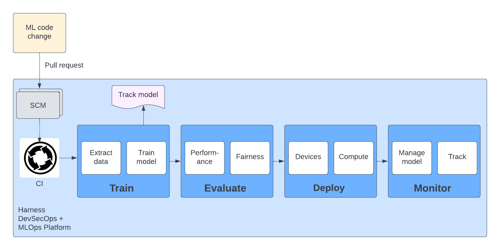

MLOps (Machine Learning Operations) and DevOps (Development Operations) represent two crucial paradigms in modern software development, each addressing distinct but interconnected aspects of the software lifecycle. The Harness vision is to reduce toil and enable Developer, DevOps, and MLOps teams to deliver functionality to end users quickly, reliably, and efficiently.

This guide explains how to get started with MLOps in Harness.

## MLOps and DevOps

DevOps emphasizes the integration and collaboration between development and operations teams, aiming to automate and streamline the delivery pipeline from code commit to deployment. It emphasizes practices such as continuous integration, continuous delivery (CI/CD), infrastructure as code (IaC), and monitoring, fostering a culture of rapid iteration, feedback, and accountability. DevOps ensures that software is delivered quickly, reliably, and with high quality, enabling organizations to respond swiftly to market demands and deliver value to customers efficiently

MLOps extends the principles of DevOps to the realm of machine learning, focusing on the operationalization and management of machine learning models throughout their lifecycle. MLOps integrates data engineering, model development, deployment, monitoring, and governance into a cohesive workflow, enabling organizations to efficiently develop, deploy, and manage machine learning applications at scale. MLOps addresses challenges unique to machine learning, such as data drift, model decay, versioning, and reproducibility, by applying DevOps practices like automation, version control, and collaboration.

**By bridging the gap between data science and operations, MLOps ensures that machine learning models are deployed reliably, monitored effectively, and continually improved to meet evolving business needs.**

To learn more about MLOps benefits and best practices, go to [MLOps best practices](./mlops-best-practices.md)

## Accelerate velocity with MLOps and Harness

Developer velocity is about removing barriers and friction points by adopting the best tools and practices to enable your developers to achieve their full potential. Modern apps use a combination of traditional apps and ML/Generative AI models. Teams have to collaborate together from development to testing and through deployment. A modern toolset must help all these personas collaborate and deliver modern apps to end users quickly, reliably, efficiently, and securely.

A typical MLOps project lifecycle includes:

1. **Exploration** (Problem framing, data collection, data exploration)
2. **Development** (Feature engineering, model training)
3. **Model validation**
4. **Model deployment**
5. **Monitoring** (Performance monitoring, drift monitoring, alerts/feedback loops)

DevOps complements MLOps. For example, here's a typical application flow combining MLOps and DevOps:



## Harness MLOps demo

Harness can help orchestrate and govern the practices of deploying secure ML code. Try it for yourself using the following demo.

To get started, you need to:

* Clone the [MLOps sample repository](https://github.com/harness-community/mlopssample).
* Create a [Docker connector](/docs/platform/connectors/cloud-providers/ref-cloud-providers/docker-registry-connector-settings-reference) for your Docker Hub account.
* Be familiar with [Harness CI pipeline creation](/docs/continuous-integration/use-ci/prep-ci-pipeline-components).

import CISignupTip from '/docs/continuous-integration/shared/ci-signup-tip.md';

<CISignupTip />

### Train model

In this team, a data scientist has built an ML model using `scikit-learn` in Jupyter Notebook. Data scientists can use any tools/framework, such as TensorFlow, PyTorch, scikit-learn,Keras , Jupyter Notebook, Pandas, NumPy, and Matplotlib, for data manipulation, analysis, and visualization.

Training can be done in Harness or through native integrations with any popular data science platforms, such as AWS SageMaker, Google Vertex AI, and more.

```yaml
             - step:
                 type: Run
                 name: train
                 identifier: train
                 spec:
                   shell: Sh
                   command: |-
                     pip install --upgrade pip
                     pip install -r requirements.txt
                     pytest --nbval-lax credit_card_approval.ipynb --junitxml=report.xml
```

### Deploy model (optional)

Deploying a machine learning model involves making it accessible for use in real-world applications, where it can make predictions or classifications based on new input data. This process varies from feature-engineering to exporting models to deployment platform to serving models to real-time monitoring.

Data scientists can use any tool/library for feature extraction and export models to common formats (such as pickle, joblib, TensorFlow, ONNX). Models can be deployed to cloud-based platforms, on-premises servers, or edge devices.

Harness can natively deploy to servers, containers, or serverless functions on Docker Hub, AWS, Google, Azure, and more.

This example shows how to use ECR as model registry and deploy a model to AWS Lambda. Note that you need your cloud provider's credentials to deploy and serve models.

<details>
<summary>YAML example: Deploy model to AWS Lambda</summary>

```yaml
             - step:
                 type: BuildAndPushECR
                 name: Harness Training
                 identifier: BuildAndPushCCAprovalECR
                 spec:
                   connectorRef: someawsconnector
                   region: us-east-2
                   account: "12345"
                   imageName: ccapproval
                   tags:
                     - latest
                   dockerfile: Dockerfile_Training_Testing
             - step:
                 type: Run
                 name: Integration Tests
                 identifier: runtest_ccapproval_deploy
                 spec:
                   connectorRef: someawsconnector
                   image: 12345.dkr.ecr.us-east-2.amazonaws.com/ccapproval-deploy:latest
                   shell: Sh
                   command: pytest --nbval-lax credit_card_approval.ipynb --junitxml=report.xml
                 failureStrategies:
                   - onFailure:
                       errors:
                         - AllErrors
                       action:
                         type: Ignore
             - step:
                 type: BuildAndPushECR
                 name: Export Model
                 identifier: BuildAndPushCCApprovalECR
                 spec:
                   connectorRef: someawsconnector
                   region: us-east-2
                   account: "12345"
                   imageName: ccapproval-deploy
                   tags:
                     - latest
                   caching: false
                   dockerfile: Dockerfile_Inference_Lambda
                 when:
                   stageStatus: Success
             - step:
                 type: Run
                 name: Deploy Model
                 identifier: Deploy_Model_via_Lambda
                 spec:
                   shell: Sh
                   command: |-
                     aws lambda update-function-code --function-name lambda-python --image-uri 12345.dkr.ecr.us-east-2.amazonaws.com/ccapproval-deploy:latest
                     aws lambda wait function-updated-v2 --function-name lambda-python

                     aws lambda invoke --function-name lambda-python response.json
                     cat response.json
                   envVariables:
                     APP_VERSION: latest
                     AWS_ACCESS_KEY_ID: <+secrets.getValue("aws_access_key_id")>
                     AWS_SECRET_ACCESS_KEY: <+secrets.getValue("aws_secret_access_key")>
                     AWS_SESSION_TOKEN: <+secrets.getValue("aws_session_token")>
                     AWS_ACCOUNT_ID: "12345"
                     AWS_REGION: us-east-2
```

</details>

### Next steps

Monitoring and managing machine learning models in production involves ensuring their reliability, performance, and alignment with business goals over time.

This involves setting up KPIs, monitoring infrastructure, drift detection, monitoring model performance, alerts, A/B Testing, automated deployments, track model experiments, model freshness/retirement, and so on.

This video demonstrates how Harness can automate the process of training, deploying, and monitoring a machine learning model for a sample credit card loan application.

<DocVideo src="https://www.youtube.com/watch?v=T6O7m15O-VQ"/>

Harness integrates with common ML tools, including:

* [AzureML](./mlops-azureml.md)
* [AWS Sagemaker](./mlops-sagemaker.md)
* [Databricks](./mlops-databricks.md)
* [Google VertexAI](./mlops-vertexai.md)
* [MLflow](./mlops-mlflow.md)
