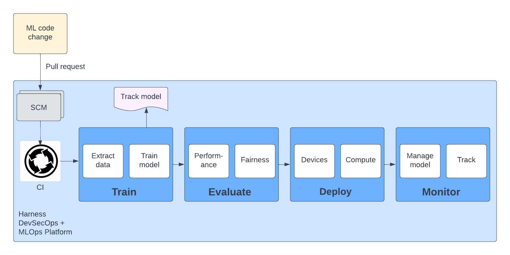

MLOps (Machine Learning Operations) applies DevOps practices to the machine learning lifecycle, covering data preparation, model training, validation, deployment, and monitoring. It addresses problems that traditional software delivery does not face, such as data drift, model decay, and reproducing a result from a specific combination of code, data, and parameters.

Harness treats a model as another artifact moving through a governed pipeline. You train and test models in Harness CI, enforce policy and security gates before promotion, deploy models with Harness CD, and monitor them after release.

---

## What you will learn from this topic

- **MLOps and DevOps:** How the two practices differ, and which parts of your existing delivery pipeline carry over to models.
- **Harness coverage by lifecycle stage:** Which Harness module or feature serves each stage of the MLOps lifecycle.
- **Pipeline anatomy:** What a Harness MLOps pipeline contains, from training through deployment.
- **Platform integrations:** How Harness connects to Azure ML, AWS SageMaker, Databricks, Google Vertex AI, and MLflow.
- **Boundaries:** Which MLOps responsibilities Harness does not cover, and what you pair it with.

---

## MLOps and DevOps

DevOps integrates development and operations to automate delivery from code commit to deployment. It relies on continuous integration, continuous delivery, infrastructure as code, and monitoring to produce rapid iteration and accountability.

MLOps extends those practices to machine learning. It adds data engineering, model development, and model governance to the workflow, so teams develop, deploy, and manage machine learning applications at scale. The additions matter because a model depends on more than its source code: the same code trained on different data produces a different model, and a model that performs well at release degrades as production data shifts away from its training distribution.

The practical consequence is that a model pipeline versions three things instead of one: code, data, and the trained model itself. Go to [MLOps best practices](/docs/continuous-integration/development-guides/mlops/mlops-best-practices) to review the practices that keep those three in sync.

---

## The MLOps lifecycle

A typical MLOps project lifecycle includes five stages:

1. **Exploration:** Problem framing, data collection, and data exploration.
2. **Development:** Feature engineering and model training.
3. **Model validation:** Accuracy, fairness, and regression checks against a held-out dataset.
4. **Model deployment:** Packaging the model and serving it behind an endpoint.
5. **Monitoring:** Performance monitoring, drift detection, and feedback loops.

DevOps complements MLOps rather than replacing it. The following diagram shows an application flow that combines both:



---

## Harness coverage by lifecycle stage

Harness does not own the data science work in stages 1 and 2. It owns the automation, governance, and delivery around them.

| Lifecycle stage | Harness capability |
|---|---|
| Exploration | Outside Harness. Data scientists work in notebooks and their chosen ML platform. |
| Development (training) | [Harness CI](/docs/continuous-integration) runs training as a pipeline step, either directly or through a [platform integration](/docs/continuous-integration/development-guides/mlops/mlops-integrations). |
| Model validation | CI [Run steps](/docs/continuous-integration/use-ci/run-step-settings) for accuracy and fairness tests, [Harness STO](/docs/security-testing-orchestration) for scanning the model image, and [Policy as Code](/docs/platform/governance/policy-as-code/harness-governance-overview) to fail a pipeline when a model misses a threshold. |
| Model deployment | [Harness CD](/docs/continuous-delivery) for serverless, container, and Kubernetes targets, with [approval steps](/docs/platform/approvals/approvals-tutorial) before production. |
| Monitoring | [Triggers](/docs/platform/triggers/triggers-reference) and scheduled pipelines for retraining and freshness checks, plus your own observability stack for drift and performance. |

Governance runs across every stage. [RBAC](/docs/platform/role-based-access-control/rbac-in-harness) controls who promotes a model, and [audit trails](/docs/platform/governance/audit-trail) record who did it.

---

## Anatomy of a Harness MLOps pipeline

The following examples come from a credit card approval model. To run them yourself, you need:

- **Sample repository:** Clone the [MLOps sample repository](https://github.com/harness-community/mlopssample).
- **Docker connector:** Create a [Docker connector](/docs/platform/connectors/cloud-providers/ref-cloud-providers/docker-registry-connector-settings-reference) for your Docker Hub account.
- **CI familiarity:** Go to [CI pipeline components](/docs/continuous-integration/use-ci/prep-ci-pipeline-components) to review how stages and steps fit together.

import CISignupTip from '/docs/continuous-integration/shared/ci-signup-tip.md';

<CISignupTip />

### Model training

Data scientists work in any framework: TensorFlow, PyTorch, scikit-learn, Keras, Jupyter Notebook, pandas, NumPy, or Matplotlib. Harness runs their training code without prescribing the toolchain.

This Run step installs dependencies, executes the notebook as a test to confirm it still produces a valid model, and writes the serialized model to the workspace so later steps can package it:

```yaml
             - step:
                 type: Run
                 name: Train and validate model
                 identifier: train_and_validate_model
                 spec:
                   shell: Sh
                   command: |-
                     pip install --upgrade pip
                     pip install -r requirements.txt
                     pytest --nbval-lax credit_card_approval.ipynb --junitxml=report.xml
                   reports:
                     type: JUnit
                     spec:
                       paths:
                         - report.xml
```

Training can also run on a managed ML platform instead of on the build machine. Go to [Integrate ML platforms with Harness CI](/docs/continuous-integration/development-guides/mlops/mlops-integrations) to configure Azure ML, AWS SageMaker, Databricks, Google Vertex AI, or MLflow.

### Model packaging and deployment

Deployment makes a model available to applications so it can return predictions on new input. The path runs from feature engineering, through export to a portable format such as pickle, joblib, TensorFlow SavedModel, or ONNX, to a served endpoint.

Harness deploys to servers, containers, and serverless functions on Docker Hub, AWS, Google Cloud, Azure, and more. The following example uses Amazon ECR as the model registry and AWS Lambda as the serving target. You need your cloud provider credentials to deploy and serve models.

The step order matters: build the training image, test against that image, then build the inference image, and deploy only after the inference image exists.

<details>
<summary>YAML example: Deploy a model to AWS Lambda</summary>

```yaml
             - step:
                 type: BuildAndPushECR
                 name: Build training image
                 identifier: build_training_image
                 spec:
                   connectorRef: YOUR_AWS_CONNECTOR
                   region: us-east-2
                   account: "123456789012"
                   imageName: ccapproval
                   tags:
                     - latest
                   dockerfile: Dockerfile_Training_Testing
             - step:
                 type: Run
                 name: Integration tests
                 identifier: integration_tests
                 spec:
                   connectorRef: YOUR_AWS_CONNECTOR
                   image: 123456789012.dkr.ecr.us-east-2.amazonaws.com/ccapproval:latest
                   shell: Sh
                   command: pytest --nbval-lax credit_card_approval.ipynb --junitxml=report.xml
             - step:
                 type: BuildAndPushECR
                 name: Build inference image
                 identifier: build_inference_image
                 spec:
                   connectorRef: YOUR_AWS_CONNECTOR
                   region: us-east-2
                   account: "123456789012"
                   imageName: ccapproval-deploy
                   tags:
                     - latest
                   caching: false
                   dockerfile: Dockerfile_Inference_Lambda
                 when:
                   stageStatus: Success
             - step:
                 type: Run
                 name: Deploy model
                 identifier: deploy_model_via_lambda
                 spec:
                   shell: Sh
                   command: |-
                     aws lambda update-function-code --function-name lambda-python --image-uri 123456789012.dkr.ecr.us-east-2.amazonaws.com/ccapproval-deploy:latest
                     aws lambda wait function-updated-v2 --function-name lambda-python

                     aws lambda invoke --function-name lambda-python response.json
                     cat response.json
                   envVariables:
                     APP_VERSION: latest
                     AWS_ACCESS_KEY_ID: <+secrets.getValue("aws_access_key_id")>
                     AWS_SECRET_ACCESS_KEY: <+secrets.getValue("aws_secret_access_key")>
                     AWS_SESSION_TOKEN: <+secrets.getValue("aws_session_token")>
                     AWS_ACCOUNT_ID: "123456789012"
                     AWS_REGION: us-east-2
```

</details>

The integration test step tolerates failure only if your workflow treats notebook test failures as advisory. Remove any `Ignore` failure strategy before you promote a model to production, otherwise a failing accuracy test permits the deployment it was added to prevent.

### Model monitoring

Monitoring a production model covers reliability, prediction quality, and continued alignment with business goals. In practice it means setting KPIs, watching infrastructure, detecting drift, tracking model performance, alerting on regressions, running A/B tests, and deciding when a model is stale enough to retire.

Harness contributes the automation: scheduled pipelines that retrain on a cadence, triggers that rebuild on new data, and notifications when a model exceeds a freshness threshold. The following video demonstrates training, deploying, and monitoring a credit card approval model:

<DocVideo src="https://www.youtube.com/watch?v=T6O7m15O-VQ"/>

---

## What Harness does not provide

Harness orchestrates and governs an MLOps workflow. It is not a data science platform, so pair it with tools that cover these responsibilities:

- **Model registry:** Harness has no dedicated model registry. Use your ML platform registry, such as the MLflow Model Registry or the SageMaker Model Registry, or store model images in a container registry.
- **Feature store:** Feature engineering and feature serving stay with your ML platform.
- **Drift and quality detection:** Harness triggers retraining, but the drift signal itself comes from your monitoring stack or your ML platform.
- **Experiment tracking UI:** Use MLflow Tracking or an equivalent. Go to [Integrate ML platforms with Harness CI](/docs/continuous-integration/development-guides/mlops/mlops-integrations) to run MLflow Tracking from a pipeline.
- **Notebook development:** Harness runs notebooks as pipeline steps but does not host an interactive notebook environment.

---

## FAQs

import { FAQ } from '@site/src/components/AdaptiveAIContent';

<FAQ
  question="Do I need Harness CD to run MLOps pipelines, or is Harness CI enough?"
  mode="docs"
  fallback="Harness CI alone covers training, testing, and pushing a model image, and it can deploy through a Run step that calls your cloud CLI. Harness CD adds deployment strategies, rollback, environment management, and approval gates, which matter once a model serves production traffic."
/>

<FAQ
  question="Can Harness track machine learning experiments and model metrics?"
  mode="docs"
  fallback="Harness does not store experiment metadata. Run MLflow Tracking or your ML platform tracking service from a pipeline step, and publish test results to Harness as JUnit reports so pass and fail status appears in the execution."
/>

<FAQ
  question="How do I stop a model that fails an accuracy or fairness threshold from reaching production?"
  mode="docs"
  fallback="Write the threshold check as a pipeline step that exits non-zero when the model misses the bar, and do not attach an Ignore failure strategy to it. Add a Policy as Code step and an approval step before the deployment stage for a second gate."
/>

---

## Next steps

Start with the platform integration that matches your ML stack, then work through the end-to-end tutorial to see a complete governed pipeline.

- [Integrate ML platforms with Harness CI](/docs/continuous-integration/development-guides/mlops/mlops-integrations): Configure Azure ML, AWS SageMaker, Databricks, Google Vertex AI, or MLflow in a pipeline.
- [Tutorial - End-to-end MLOps CI/CD pipeline with Harness and AWS](/docs/continuous-integration/development-guides/mlops/e2e-mlops-tutorial): Build, scan, govern, and deploy a model to AWS Lambda.
- [MLOps best practices](/docs/continuous-integration/development-guides/mlops/mlops-best-practices): Review the practices that keep model pipelines reproducible and auditable.
