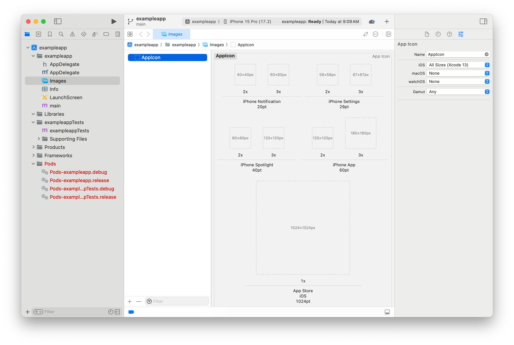
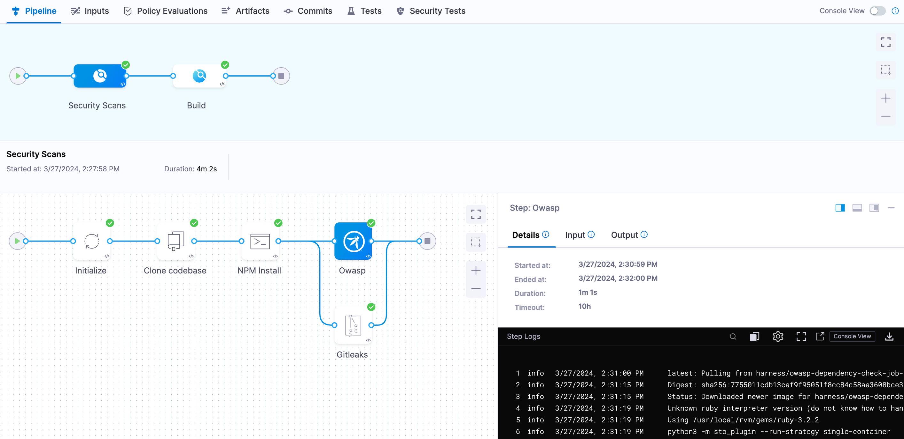
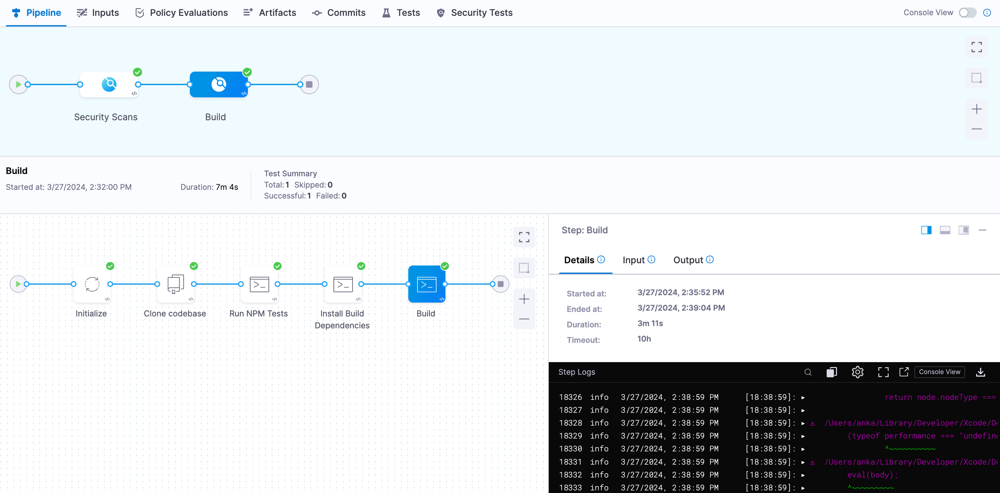

[Harness CI Cloud](/docs/continuous-integration/use-ci/set-up-build-infrastructure/use-harness-cloud-build-infrastructure) offers Mac infrastructure that you can use to build, test, and publish iOS applications.

[React Native](https://reactnative.dev/) is an open source UI framework from [Meta](https://www.meta.com/). React Native enables developers to write natively-rendered Android and iOS applications in the [React](https://react.dev/) framework.

This tutorial covers how to build, test, and publish a React Native iOS app to Apple's [TestFlight](https://testflight.apple.com/) service with [Fastlane](https://fastlane.tools/).

## Prerequisites

For this tutorial, you need the following:

- A Harness account with Harness CI Cloud Mac infrastructure enabled.
- Access to a Git provider.
- An Apple account enrolled in the [Apple Developer Program](https://developer.apple.com/support/compare-memberships/) or admin access to [App Store Connect](https://developer.apple.com/help/app-store-connect/get-started/app-store-connect-homepage) for an existing account.

:::info

Currently, macOS platforms for Harness Cloud are behind a feature flag with limited availability. You can [submit a request to enable the feature](https://forms.gle/CWCcuE3nxqEdFJcZ6).

:::

## Create React Native app

:::tip

Some of the steps demonstrated in this tutorial are also available in the [React Native quickstart guide](https://reactnative.dev/docs/environment-setup?guide=native). More details are provided for those who are new to React Native.

:::

1. Generate a sample project with the [react-native-cli](https://github.com/react-native-community/cli/tree/v12.3.6?tab=readme-ov-file#creating-a-new-react-native-project).

   ```
   npx react-native@0.73.6 init --package-name PACKAGE_NAME APP_NAME
   ```

   Passing `--package-name PACKAGE_NAME` ensures a unique [Bundle ID](https://developer.apple.com/documentation/appstoreconnectapi/bundle_ids) for the application. `PACKAGE_NAME` should be in reverse-DNS format.

   For example, since Apple owns [apple.com](http://apple.com/), all Apple [bundle IDs](https://support.apple.com/en-gb/guide/deployment/depece748c41/web) are prefixed with `com.apple.`.

   Your app's bundle ID must be a [uniform type identifier](https://developer.apple.com/documentation/uniformtypeidentifiers) (UTI) and case insensitive.

   `APP_NAME` is the name of your application, it must be alphanumeric and less than 30 characters.

2. Answer the necessary prompts.

## iOS simulator

1. Change to the application directory

   ```
   cd APP_NAME
   ```

2. Run your app in the iOS Simulator.

   ```
   npm run ios
   ```

The app takes a few minutes to build and install the app in the simulator.

import Simulator from './static/simulator.png';


Changes to the `App.tsx` file are immediately reflected in the simulator.

## Git repository

1. Create a new repository in your Git provider, and then commit and push the contents of your application.

## App icons

This sample application won't have an [app icon](https://developer.apple.com/design/human-interface-guidelines/app-icons); however, an icon is required to submit the app to TestFlight.

1. Open `ios/APP_NAME.xcodeproj` in Xcode, and then select **Images** and **AppIcon**.

   

2. Generate a set of icons with a service like [appicon.co](http://appicon.co/), and then drag each generated icon into the appropriate location.

3. Commit and push these changes to your Git repository.

## Fastlane

[Fastlane](https://fastlane.tools/) is a command line tool that helps automate beta deployments and releases for mobile applications.

1. Follow the [setup guide](https://docs.fastlane.tools/getting-started/ios/setup/) to configure Fastlane in your app's `ios` directory. When running `fastlane init`, choose the "Manual setup" option. This creates a `fastlane` directory with two files: `Appfile` and `Fastfile`.

### Appfile

1. At a minimum, you must set `app_identifier` and `apple_id` in `fastlane/Appfile`.

   `app_identifier` is the Bundle ID of the app (referred to as `PACKAGE_NAME` in the `init` command in [Create React Native app](#create-react-native-app)).

   `apple_id` is the Apple email address used to authenticate when publishing the app.

   These values can be hard-coded or they can passed as environment variables, for example:

   ```
   app_identifier ENV["APP_BUNDLE_ID"]
   apple_id ENV["APPLE_USERNAME"]
   ```

2. If you have different credentials for App Store Connect and the Apple Developer, you must set `team_id` and `itc_team_id`.

   Go to [Fastlane's Appfile documentation](https://docs.fastlane.tools/advanced/Appfile/#appfile) for details on writing this file for your App Store Connect account.

3. Commit and push all changes to your Git repository.

### Match

Fastlane has an [action](https://docs.fastlane.tools/actions/) called [match](https://docs.fastlane.tools/actions/match/) that makes it easier to share signing credentials across teams and to your Harness pipeline.

`match` creates the required certificates and provisioning profiles, and then stores them in a separate Git repository, Google Cloud storage, or Amazon S3 bucket. Every team member with access to the selected storage can use those credentials for code signing.

1. Follow the [setup guide](https://docs.fastlane.tools/actions/match/#setup) to configure match in your app project's `ios` directory. This creates the `fastlane/Matchfile` file.

:::info

The next step requires __Developer__ permissions in your App Store Connect account.

:::

2. When using a Git repository for storage, you are prompted for a password to encrypt all files in the repository. __Securely store this password__, and then [create a Harness text secret](/docs/platform/secrets/add-use-text-secrets) named `MATCH_PASSWORD` containing this password in your project.

3. Commit and push all changes to your Git repository.

### App Store Connect API Key

1. Follow Apple's documentation to [Create API Keys for App Store Connect API](https://developer.apple.com/documentation/appstoreconnectapi/creating_api_keys_for_app_store_connect_api) to create a *Team Key*. An *Individual Key* won't work.

:::info

This step requires __Admin__ permissions in your App Store Connect account.

:::

2. Store the *Issuer ID* as a [text secret](/docs/platform/secrets/add-use-text-secrets) named `APPLE_API_KEY_ISSUER_ID` in your project.

3. Store the *Key ID* as a [text secret](/docs/platform/secrets/add-use-text-secrets) named `APPLE_API_KEY_ID` in your project.

The API key itself is a file, so it must be base64 encoded before it can be stored as a secret.

4. Save the API key to a file (such as `api-key.p8`), and then encode it using your terminal. For example:

   ```
   cat api-key.p8 | base64
   ```

5. Save the encoded string as a [text secret](/docs/platform/secrets/add-use-text-secrets) named `APPLE_API_KEY_CONTENT` in your project.

### Fastfile

The `fastlane/Fastfile` file stores the automation configuration that you can run with Fastlane. The file consists of [lanes](https://docs.fastlane.tools/advanced/lanes/#lanes) that define each step in your app's workflow.

In this example, you'll create lanes to build and sign the app, and then publish it to Apple's [TestFlight](https://developer.apple.com/testflight/) service with a unique build number based on the Harness pipeline execution ID.

Your `fastlane/Fastfile` currently looks like this:

```ruby {} showLineNumbers
default_platform(:ios)

platform :ios do
  desc "Description of what the lane does"
  lane :custom_lane do
    # add actions here: https://docs.fastlane.tools/actions
  end
end
```

Modify this file to add lanes to the `platform: ios` section.

1. Add a lane to run an action that [loads the Apple Store Connect API key information](https://docs.fastlane.tools/actions/app_store_connect_api_key/):

   ```ruby
     desc "Load ASC API Key information to use in subsequent lanes"
     lane :load_asc_api_key do
       app_store_connect_api_key(
           key_id: ENV["APPLE_API_KEY_ID"],
           issuer_id: ENV["APPLE_API_KEY_ISSUER_ID"],
           key_content: ENV["APPLE_API_KEY_CONTENT"],
           is_key_content_base64: true,
           in_house: false
     )
     end
   ```

2. Add a lane to run the [match action](https://docs.fastlane.tools/actions/match/):

   ```ruby
     desc "Uses match to pull in developer profile and certificates from git repo specified in Matchfile"
     lane :prep_build_release do
       api_key = lane_context[SharedValues::APP_STORE_CONNECT_API_KEY]
       match(type: "appstore", api_key: api_key)
     end
   ```

3. Add a lane to run the [deliver action](https://docs.fastlane.tools/actions/deliver/) to upload the app to TestFlight:

   ```ruby
     desc "Upload to TestFlight / ASC"
     lane :deliver_to_testflight do
       api_key = lane_context[SharedValues::APP_STORE_CONNECT_API_KEY]

       deliver(
           api_key: api_key,
           skip_screenshots: true,
           skip_metadata: true,
           skip_app_version_update: true,
           force: true,
           run_precheck_before_submit: false
       )
     end
   ```

4. Add a lane to run all lanes and publish the app to TestFlight. This lane uses the [update_code_signing_settings](https://docs.fastlane.tools/actions/update_code_signing_settings/), [increment_build_number](https://docs.fastlane.tools/actions/increment_build_number/), and [build_app](https://docs.fastlane.tools/actions/build_app/) actions.

   ```ruby
     desc "Push a new beta build to TestFlight"
     lane :beta do
       setup_ci if ENV['CI']
       load_asc_api_key
       prep_build_release

       # Read app_identifier from Appfile
       app_identifier = CredentialsManager::AppfileConfig.try_fetch_value(:app_identifier)

       profile_name = "match AppStore PACKAGE_NAME"
       output_name = "APP_NAME"

       # turn off automatic signing, signing is handled by 'match'
       update_code_signing_settings(
           use_automatic_signing: false,
           targets: ["APP_NAME"],
           code_sign_identity: "Apple Distribution",
           bundle_identifier: app_identifier,
           profile_name: profile_name,
           build_configurations: ["Release"],
           team_id: "TEAM_ID"
       )

       # Set the build number based on the Harness pipeline execution ID
       increment_build_number(
           build_number: ENV["HARNESS_BUILD_ID"],
       )

       build_app(
         workspace: "APP_NAME.xcworkspace",
         scheme: "APP_NAME",
         output_name: output_name,
         configuration: "Release",
         export_options: {
             method: "app-store"
         }
       )

       deliver_to_testflight
     end
   ```

   Replace instances of `APP_NAME` and `PACKAGE_NAME` with the values from the [init command](#create-react-native-app).

   Replace `TEAM_ID` with your App Store Connect team ID.

5. Add a lane that builds, but doesn't publish, the app. You can use this lane in pull request pipelines to ensure the app can be built successfully.

   ```ruby
     desc "Build without code sign. Just to see if the build is working."
     lane :build do
       build_app(
         workspace: "APP_NAME.xcworkspace",
         scheme: "APP_NAME",
         skip_package_ipa: true,
         skip_archive: true,
         skip_codesigning: true,
         silent: true,
         clean: true
       )
     end
   ```

   Replace instances of `APP_NAME` with the value from the [init command](#create-react-native-app).

6. Commit and push all changes to your Git repository.

## Create Harness pipeline

1. In your Harness account, select a Harness project, then select the Continuous Integration module.
2. Use the **Get Started** wizard to connect your Git provider, activate your iOS app repository, and create an initial pipeline.

### Add security scans stage

1. Add a Build stage to your pipeline named `Security`.
2. On the stage **Infrastructure** tab, select the Harness CI Cloud **Linux** platform.
3. Switch to the YAML editor using the switch at the top of the Pipeline Studio.
4. In the pipeline YAML editor, add a `Run` step named `NPM Install`:

   ```yaml

                 - step:
                     type: Run
                     name: NPM Install
                     identifier: NPM_Install
                     spec:
                       shell: Sh
                       command: |-
                         mkdir $HOME/nodejs
                         curl -L https://nodejs.org/dist/v${NODE_VERSION}/node-v${NODE_VERSION}-linux-x64.tar.xz | tar xJ -C $HOME/nodejs
                         export PATH=$HOME/nodejs/node-v${NODE_VERSION}-linux-x64/bin:$PATH
                         npm install --global yarn
                         yarn
                       envVariables:
                         NODE_VERSION: 18.16.0
   ```

5. Add [parallel](/docs/platform/pipelines/looping-strategies/looping-strategies-matrix-repeat-and-parallelism) steps for [Owasp](/docs/security-testing-orchestration/sto-techref-category/owasp-scanner-reference) and [Gitleaks](/docs/security-testing-orchestration/sto-techref-category/gitleaks-scanner-reference) scans.

   ```yaml
                 - parallel:
                     - step:
                         type: Owasp
                         name: Owasp
                         identifier: Owasp
                         spec:
                           mode: orchestration
                           config: default
                           target:
                             type: repository
                             name: iOS app
                             variant: main
                           advanced:
                             log:
                               level: info
                             fail_on_severity: none
                     - step:
                         type: Gitleaks
                         name: Gitleaks
                         identifier: Gitleaks
                         spec:
                           mode: orchestration
                           config: default
                           target:
                             type: repository
                             detection: auto
                           advanced:
                             log:
                               level: info
                             fail_on_severity: low
   ```

### Add unit tests

You'll make some code changes related to unit tests. Your project will have a `tests/App.test.tsx` file with one [Jest](https://jestjs.io/) unit test.

1. Run the tests from the root of your repository.

   ```
   npm test
   ```

   You'll get the following output:

   ```
   > io.harness.exampleapp@0.0.1 test
   > jest

    PASS  __tests__/App.test.tsx
     ✓ renders correctly (97 ms)

   Test Suites: 1 passed, 1 total
   Tests:       1 passed, 1 total
   Snapshots:   0 total
   Time:        0.495 s, estimated 1 s
   Ran all test suites.
   ```

Harness supports test results that are in [JUnit XML format](/docs/continuous-integration/use-ci/run-tests/test-report-ref), which is supported by jest-junit.

1. Install jest-junit.

   ```
   npm install --save-dev jest-junit
   ```

2. Edit the file `jest.config.js`.

   ```
   module.exports = {
     preset: 'react-native',
     reporters: [ "default", "jest-junit" ],
   };
   ```

3. Run the tests again.

   ```
   npm test
   ```

   The tests generate a `junit.xml` file that Harness can ingest.

4. Optionally, you can optionally add `junit.xml` to your repository's `.gitignore` file.

   There is no need to check this file into your repository, since it is automatically generated.

5. Commit and push all changes to your Git repository.

### Build stage

1. Add a Build stage to your pipeline named `Build`.
2. On the stage **Infrastructure** tab, select the Harness CI Cloud **macOS** platform.
3. Switch to the YAML editor using the switch at the top of the Pipeline Studio.
4. In the pipeline YAML editor, add a `Run` step named `Run NPM Tests`.

   ```yaml
                 - step:
                     type: Run
                     name: Run NPM Tests
                     identifier: Run_NPM_Tests
                     spec:
                       shell: Sh
                       reports:
                         type: JUnit
                         spec:
                           paths:
                             - junit.xml
                       command: |
                         yarn
                         npm test
   ```

5. Add a `Run` step named `Install Build Dependencies`.

   ```yaml
                 - step:
                     identifier: Install_Build_Dependencies
                     type: Run
                     name: Install Build Dependencies
                     spec:
                       shell: Sh
                       envVariables:
                         BUNDLE_JOBS: "4"
                         BUNDLE_RETRY: "3"
                       command: |-
                         cd ios

                         gem update --system
                         gem install bundler
                         bundle install
                         gem install cocoapods

                         chmod 0600 /Users/anka/.netrc
                         pod install
   ```

6. Add a `Run` step named `Build`.

   ```yaml
                 - step:
                     identifier: Build
                     type: Run
                     name: Build
                     spec:
                       shell: Bash
                       envVariables:
                         CI: "true"
                         APPLE_USERNAME: <+secrets.getValue("APPLE_USERNAME")>
                         APPLE_API_KEY_ID: <+secrets.getValue("APPLE_API_KEY_ID")>
                         APPLE_API_KEY_ISSUER_ID: <+secrets.getValue("APPLE_API_KEY_ISSUER_ID")>
                         APPLE_API_KEY_CONTENT: <+secrets.getValue("APPLE_API_KEY_CONTENT")>
                         MATCH_PASSWORD: <+secrets.getValue("MATCH_PASSWORD")>
                         MATCH_USERNAME: APPLE_ID_USERNAME
                       command: |-
                         cd ios

                         # Pin Xcode version
                         sudo xcode-select -switch /Applications/Xcode_15.2.app

                         if [ "$CI_BUILD_EVENT" == "pull_request" ]; then
                           FASTLANE_LANE=build
                         else
                           FASTLANE_LANE=beta
                         fi
                         bundle exec fastlane $FASTLANE_LANE
   ```

   Replace `APPLE_ID_USERNAME` with your Apple ID username.

   :::tip

   You may need to pass additional [match](https://docs.fastlane.tools/actions/match/) secrets.

   For example, if you are storing your certificates in Git, you will also need to pass `MATCH_GIT_BASIC_AUTHORIZATION`.

   :::

## Trigger pipeline

1. Save and run the pipeline.

2. Observe the [build logs](/docs/continuous-integration/use-ci/viewing-builds) while the pipeline runs.

   Here's an example of the __Security Scans__ stage execution:

   

   And this is an example of the __Build__ stage execution:

   

   When complete, Fastlane prints a success message:

   ```
   fastlane.tools finished successfully 🎉
   ```

3. To see your published build:
   1. Login to `https://appstoreconnect.apple.com`.
   2. Select **Apps**.
   3. Select your app from the list.
   4. Select the **TestFlight** tab.
   5. Your app's build appears in the list.

## Next steps

- Learn about [TestFlight](https://testflight.apple.com/), and install your app on your iOS devices.
- [Invite testers](https://developer.apple.com/help/app-store-connect/test-a-beta-version/invite-external-testers/) to try your app on their devices.
- Learn how to [submit your app for review](https://developer.apple.com/help/app-store-connect/manage-submissions-to-app-review/submit-for-review/).
