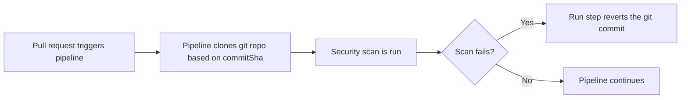

At times, you might want to undo changes introduced by a pull request (PR) in a Git repository. This can happen for various reasons, such as if the changes introduced by the PR are found to be problematic, introduce bugs, or if they are no longer needed. This guide shows an example where a pipeline is triggered based on a pull request, runs security scans, and if the test fails, the pipeline reverts the last commit introduced by the PR. 

## Prerequisites

- A Harness account with access to the Continuous Integration module. If you are new to Harness, you can [sign up for free](https://app.harness.io/auth/#/signup/?&utm_campaign=ci-devrel).
- A GitHub account and a sample repository. Any other SCM provider should be fine, but this guide uses GitHub as an example.
- A [GitHub Personal Access Token (PAT)](https://docs.github.com/en/authentication/keeping-your-account-and-data-secure/managing-your-personal-access-tokens) with read/write access to the repository and read/write access to webhook creations. You can create a PAT from your GitHub account's **Settings > Developer settings > Personal access tokens**.
- A [Docker Hub Personal Access Token (PAT)](https://docs.docker.com/security/for-developers/access-tokens/). You can create a PAT from your Docker Hub account's **Account Settings > Security > New Access Token**.

## Design

When a pull request is merged, a CI pipeline is triggered that clones the Git repository based on the commit SHA. The pipeline then runs a set of tests (e.g., security scans). If any of those tests fail, [a **Run** step reverts the Git commit(s)](../../use-ci/codebase-configuration/git-revert-commit).



## Setup Harness secret and connectors

Create a [Harness secret](../../../platform/secrets/add-use-text-secrets) for your GitHub Personal Access Token (PAT).

Create a [Harness GitHub Connector](../../../platform/connectors/code-repositories/ref-source-repo-provider/git-hub-connector-settings-reference) and [enable API access](../../../platform/connectors/code-repositories/ref-source-repo-provider/git-hub-connector-settings-reference/#enable-api-access). API access is required for any operations that require Harness to call GitHub APIs, such as using the Harness Git Experience, cloning codebases from PRs, automatically detecting branch names when you manually run pipelines, using Git webhook triggers, and updating Git statuses. Select **Connect through Harness Platform**.

Create a [Docker connector](../../../platform/connectors/cloud-providers/ref-cloud-providers/docker-registry-connector-settings-reference) to be able to pull docker images in the CI pipeline.

## Pipeline to revert git commit based on security scans

If this is the first time you're using Harness CI, please check out [CI onboarding guide](../../get-started/onboarding-guide). Create a new pipeline using the following YAML:

```yaml
pipeline:
  name: git_revert_pipeline
  identifier: git_revert_pipeline
  projectIdentifier: default_project
  orgIdentifier: default
  tags: {}
  stages:
    - stage:
        name: git-revert-stage
        identifier: clone
        description: ""
        type: CI
        spec:
          cloneCodebase: false
          execution:
            steps:
              - step:
                  type: GitClone
                  name: GitClone
                  identifier: GitClone
                  spec:
                    connectorRef: YOUR_GITHUB_CONNECTOR_ID
                    build:
                      type: commitSha
                      spec:
                        commitSha: <+trigger.commitSha>
              - step:
                  type: Owasp
                  name: Owasp Scan
                  identifier: Owasp_Scan
                  spec:
                    mode: orchestration
                    config: default
                    target:
                      type: repository
                      workspace: /harness/YOUR_GIT_REPO
                      detection: manual
                      name: YOUR_GIT_REPO
                      variant: main
                    advanced:
                      log:
                        level: info
                      fail_on_severity: high
              - step:
                  type: Run
                  name: rollback
                  identifier: rollback
                  spec:
                    connectorRef: YOUR_DOCKER_CONNECTOR_ID
                    image: alpine/git
                    shell: Sh
                    command: |-
                      git config --global user.email "GIT_USER_EMAIL"
                      git config --global user.name "GIT_USER_NAME"
                      git config --global --add safe.directory /harness
                      git config --global credential.helper 'cache --timeout 600'
                      << eof tr -d ' ' | git credential-cache store 
                        protocol=https
                        host=github.com
                        username="GIT_USER_ID"
                        password=<+secrets.getValue("YOUR_HARNESS_GIT_PAT_SECRET")>
                      eof
                      git pull origin main
                      echo "Last Commit"
                      git rev-parse HEAD
                      git revert -m 1 <+codebase.commitSha>
                      echo "Restored Commit"
                      git rev-parse HEAD
                      git push --set-upstream origin main
                  when:
                    stageStatus: Failure
          platform:
            os: Linux
            arch: Amd64
          runtime:
            type: Cloud
            spec: {}
          caching:
            enabled: false
            paths: []
```

## Trigger the pipeline based on Git events

[Add a trigger](../../../platform/triggers/triggers-overview/#add-a-trigger-to-a-pipeline) to your pipeline that will execute the pipeline when a pull request is merged in your target repository. Use the following trigger definition:

```YAML
trigger:
  name: trigger_on_pr_merge
  identifier: trigger_on_pr_merge
  enabled: true
  encryptedWebhookSecretIdentifier: ""
  description: ""
  tags: {}
  orgIdentifier: default
  stagesToExecute: []
  projectIdentifier: default_project
  pipelineIdentifier: git_revert_pipeline
  source:
    type: Webhook
    spec:
      type: Github
      spec:
        type: PullRequest
        spec:
          connectorRef: YOUR_GITHUB_CONNECTOR_ID
          autoAbortPreviousExecutions: false
          payloadConditions:
            - key: targetBranch
              operator: Equals
              value: main
          headerConditions: []
          actions:
            - Close
  inputYaml: |
    pipeline:
      identifier: git_revert_pipeline
      properties:
        ci:
          codebase:
            build:
              type: PR
              spec:
                number: <+trigger.prNumber>
```

## Test the setup

This guide uses [OWASP Dependency-check Scanner](../../../security-testing-orchestration/sto-techref-category/owasp-scanner-reference) as a sample test step. You can set different severity levels for this scanner. In this example,  `fail_on_severity` is set to **high** which means if the scan finds any vulnerability in the code with **high** or **critical**  severity levels, the **OWASP Scan** and the pipeline fail automatically.

The **Run** step executes if the security scan fails which then reverts the Git commit that triggered the pipeline. This example shows the Git revert of a single commit but you can modify the script to revert multiple commits.

Create a pull request in your target Git repo with some known high/critical vulnerabilities and then merge the PR. This will trigger the pipeline, the **OWASP Scan** will find these vulnerabilities, and the **Run** step will revert the commit that triggered the pipeline. You can check the pipeline execution logs to see the output of the **Run** step. The pipeline will continue to run after the **Run** step and you can add more steps to the pipeline as needed.