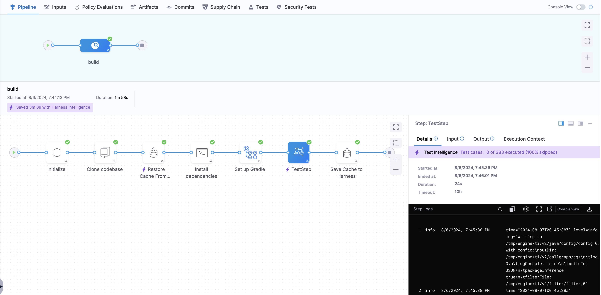

Harness Continuous Integration (CI) Intelligence features are designed to smartly speed up builds and boost efficiency.

## Test Intelligence

Testing is an important part of Continuous Integration. Testing safeguards the quality of your product before shipping. However, test cycles often involve many tests, and it can take a significant amount of time for the tests to run. Additionally, the tests that run might be irrelevant to the code changes that triggered the build.

Harness Test Intelligence (TI) helps your test cycle move faster without compromising quality. TI can dramatically improve test times by running only the unit tests required to confirm the quality of the code changes that triggered the build.Instead of always running all unit tests, TI selects the subset of relevant unit tests and skips the rest. You can also configure Harness TI to automatically split tests and run them in parallel.

Test Intelligence gives you full visibility into which tests were selected and why. This can help you identify negative trends and gain insights to improve test quality and coverage. Using TI doesn't require you to change your build and test processes.

To learn more about the Test Intelligence architecture, how it works, and how to enable it, go to [Test Intelligence overview](/docs/continuous-integration/use-ci/run-tests/ti-overview.md).

While Test Intelligence is only for unit tests, you can [run a variety of tests in your CI pipelines](/docs/continuous-integration/use-ci/run-tests/run-tests-in-ci.md).

Example: Time and cost savings with Test Intelligence

We ran Test Intelligence on our biggest repository, Harness-Core. Here's what we achieved:

- PRs checked: 3000
- Average UT time without TI: 75 minutes
- Average UT time with TI: 25 minutes

Here's how Harness Test Intelligence performed with some popular open-source repositories:

| **Project name**     | **Average test run time without TI** | **Average test run time with TI** |
| -------------------- | ------------------------------------ | --------------------------------- |
| Harness-Core         | 75 mins                              | 25 mins                           |
| Incubator Pinot      | 338 mins                             | 228 mins                          |
| Hudi                 | 58 mins                              | 43 mins                           |
| RocketMQ             | 4.6 mins                             | 3.1 mins                          |
| Spring Cloud Alibaba | 0.744 mins                           | 0.59 mins                         |
| Incubator Shenyu     | 1.16 min                             | 0.4 min                           |
| Sentinel             | 1.90 min                             | 1 min                             |

## Cache Intelligence

Modern continuous integration systems execute pipelines inside ephemeral environments that are provisioned solely for pipeline execution and are not reused from prior pipeline runs. As builds often require downloading and installing many library and software dependencies, caching these dependencies for quick retrieval at runtime can save a significant amount of time.

With [Cache Intelligence](/docs/continuous-integration/use-ci/caching-ci-data/cache-intelligence.md), Harness automatically caches and restores software dependencies to speed up your builds - hassle free.

You can use Cache Intelligence with any [build infrastructure](/docs/continuous-integration/use-ci/set-up-build-infrastructure/which-build-infrastructure-is-right-for-me.md).

When you use Cache Intelligence with Harness CI Cloud, the cache is stored in the Harness-managed environment. When running builds in self-managed infrastructures, [configure S3-compatible  default object storage](/docs/platform/settings/default-settings.md#continuous-integration) that Harness can use to seamlessly store and manage the cache.

## Docker Layer Caching (DLC)

In modern CI systems, Docker images are frequently built in ephemeral environments, created solely for pipeline execution. 

With [Docker Layer Caching (DLC)](/docs/continuous-integration/use-ci/caching-ci-data/docker-layer-caching.md), Harness seamlessly caches Docker image layers between builds to significantly accelerate the time it takes to build Docker images.

You can use DLC with any [build infrastructure](/docs/continuous-integration/use-ci/set-up-build-infrastructure/which-build-infrastructure-is-right-for-me.md).

When you use DLC with Harness CI Cloud, the cache is stored in the Harness-managed environment. When running builds in self-managed infrastructures, [configure S3-compatible  default object storage](/docs/platform/settings/default-settings.md#continuous-integration) that Harness can use to seamlessly store and manage the cache.

## Intelligence Savings 

Harness Intelligence optimizes your build stages by reducing execution times and providing insights into where time savings are achieved. This section explains how the time savings are calculated and displayed, helping you understand the benefits of using Harness Intelligence features.
:::note
This feature is currently in beta, and is available with `CI_PARSE_SAVINGS` feature flag. Please contact [Harness Support](mailto:support@harness.io) to enable the feature.
:::

Below is a screen shot showing time saving for a Build stage using Cache Intelligence and Test Intelligence. 

### How is Build stage time saving calculated 

Harness calculates time savings by comparing the duration of the Build stage before and after Harness intelligence time savings are observed. When you first run your pipeline with Harness Intelligence features, a full run is executed, creating a baseline duration for the Build stage without any smart optimizations.

When Build stages are optimized with Intelligence features and savings are observed, the savings are shown compared to the baseline. A baseline can also be updated in subsequent runs where intelligence features are enabled but a full run (non-optimized) is executed. For example, depending on the code change, Test Intelligence may choose to run all tests, generating a new baseline.

:::note
If a stage contains parallel steps, the reported savings will be based on the CPU time saved by each parallel step from previous non-optimized runs. However, these savings are not reflective of wall clock time. Therefore, summing the CPU time savings may not accurately represent the actual time saved in minutes. Additionally, any changes in the stage logic, such as adding or removing steps, can impact the accuracy of time savings calculations.
:::

<!-- ## Build Intelligence -->

<!-- Build Cache feature. Caches outputs (like artifacts) rather than inputs (like Cache Intelligence) or image layers (like DLC). -->
