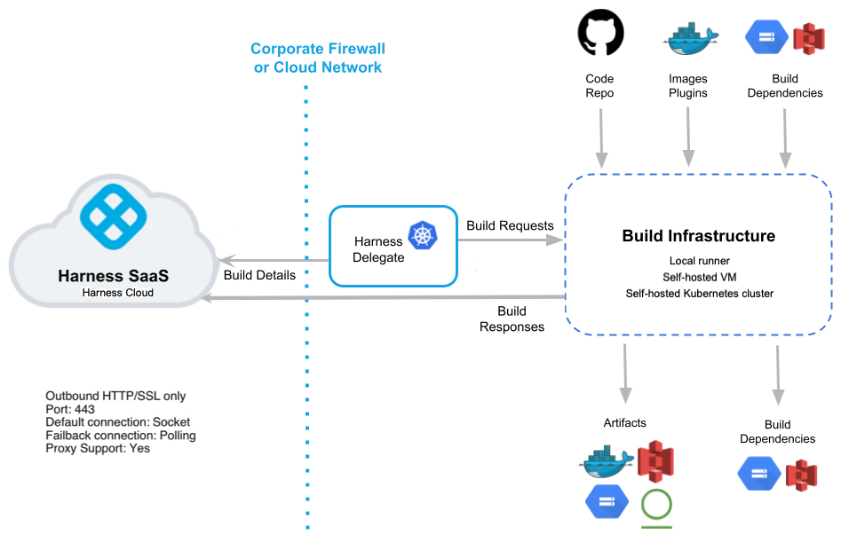

Harness is a leading provider of the Continuous Delivery-as-a-Service platform. Harness Continuous Integration (CI) extends this functionality with Continuous Integration-as-a-Service. Harness CI simplifies the code development and testing process.

This topic introduces some key Harness CI features. For information about upcoming and recently released features, go to the [CI product roadmap](https://developer.harness.io/roadmap/#ci), [CI release notes](/release-notes/continuous-integration), and [CI early access features](/docs/continuous-integration/ci-supported-platforms/#harness-ci-early-access-features).

For information about general Harness Platform concepts and features, go to [Harness Platform key concepts](/docs/platform/get-started/key-concepts).

## Workflows as pipelines

In Harness CI, you model your build and test workflows in pipelines. Within pipelines, work is divided into stages. Each stage can include steps that build and test code, upload artifacts, send notifications, and more. You can run pipelines manually or set up automated triggers.

CI pipeline steps run as containers, making it language-agnostic. Containers are lightweight abstractions of the host operating system that can package code and dependencies independently of the steps. You can specify a container in the pipeline itself, and the agent will fetch and start the container where the job runs. Because all the steps run in containers, and plugins have their own containers, you don't need to worry about dependencies.

Video: Introduction to Harness CI

The following videos introduce Harness CI and create basic Harness CI pipelines.

<DocVideo src="https://youtu.be/yQRwVjPTQ5E" />

<DocVideo src="https://www.youtube.com/watch?v=r1GLYtOmJmM" />

For information about CI pipeline components, go to the [CI key concepts](/docs/continuous-integration/get-started/key-concepts).

## Harness CI Cloud

You can run builds on your own build infrastructure or on Harness-managed build infrastructure. For a comparison of build infrastructure options, go to [Which build infrastructure is right for me](/docs/continuous-integration/use-ci/set-up-build-infrastructure/which-build-infrastructure-is-right-for-me).

With [Harness CI Cloud](/docs/continuous-integration/use-ci/set-up-build-infrastructure/use-harness-cloud-build-infrastructure), you can run builds in isolation on Harness-managed virtual machines (VMs). You can run builds at scale on Linux, Windows, and macOS machines that are preconfigured with tools, packages, and settings commonly used in CI pipelines.

Harness hosts, maintains, and upgrades these machines so that you can focus on building software instead of maintaining build infrastructure.

What happens during a Harness Cloud build?

When a pipeline builds on Harness Cloud build infrastructure, Harness runs each CI stage in a new, ephemeral VM.

The steps in each stage execute on the stage's dedicated VM. This allows the stage's steps to share information through the underlying filesystem. You can run CI steps directly on the VM or in a Docker container. When the stage is complete, the VM automatically shuts down.

:::info

The Harness CI Cloud build infrastructure is also referred to as *Harness Cloud* in the context of Harness CI.

This is different from the Harness Platform Cloud or Harness SaaS operations, as described in [Harness Cloud Operations](/docs/harness-cloud-operations)

:::

## Harness CI Intelligence

[Harness CI Intelligence](./harness-ci-intelligence.md) optimizes your builds by leveraging a suite of smart features including Test Intelligence, Cache Intelligence, Harness-managed Docker Layer Caching, and more.

## Platform integration

Harness CI is seamlessly integrated with other Harness modules, such as [Continuous Delivery](/docs/continuous-delivery), [Cloud Cost Management](/docs/cloud-cost-management), [Feature Flags](/docs/feature-flags), and [Security Testing Orchestration](/docs/security-testing-orchestration). The Harness Platform offers unified CI/CD pipelines with visual controls and approval gates. You no longer have to navigate between applications to follow the phases of your pipelines.

## Harness Git Experience

The [Harness Git Experience](/docs/category/git-experience) provides seamless integration between your Harness projects, pipelines, and resources and your Git repos. You can work entirely from Git or use a hybrid method of Git and the Harness Manager. Harness CI integrates with all the popular source control management tools, including GitHub, GitLab, and Bitbucket. To get started, you need to activate the repository and include a `.harness` folder for the configuration files. This triggers a build within Harness CI once a commit is detected.

## Visual and YAML editors

Scripting pipelines can be time-consuming and tedious. It may be difficult to envision the sequence of events in more complex pipelines. The Harness Pipeline Studio has both a YAML editor and a visual editor.

In the visual editor, you can easily add, remove, edit, and rearrange steps and stages. The YAML editor functions similarly to any other text editor where you can configure your pipelines-as-code. You can also switch between the two for a combined approach.

The YAML editor is also available for other components, such as connectors and triggers, in addition to pipelines.

For more information about YAML in Harness, go to [Write pipelines in YAML](/docs/platform/pipelines/harness-yaml-quickstart.md).

## Harness CI architecture

<figure>

<figcaption>Harness CI architecture diagram.</figcaption>
</figure>

The [Harness Delegate](/docs/platform/delegates/delegate-concepts/delegate-overview) is central to CI processes and is in charge of CI operations. It runs in your environment, such as your local network, virtual private cloud, or cluster.

The delegate connects the Harness Manager in your SaaS instance to all of your code repositories, artifacts, infrastructure, and cloud providers.

Through a designated delegate or the Harness Platform, your [build infrastructure](/docs/continuous-integration/use-ci/set-up-build-infrastructure/which-build-infrastructure-is-right-for-me) integrates with your repos, registries, cloud providers, and other services.

You can maintain your code and artifacts internally or on public platforms, such as GitHub or Docker Hub.

The delegate manages your build infrastructure to run build jobs and tests as needed, and sends data back to the Harness Manager. You can use this data for DAG orchestration, debugging, health checks, analytics, notifications, and the generation of ML models.

When a CI pipeline build finishes successfully, the pipeline can send artifacts to the registry of your choice, depending on your pipeline steps and configuration. The Harness Platform also records build logs and output that you can inspect during and after each build.

## Try Harness CI

Ready to try Harness CI for yourself? [Try Harness CI now](./tutorials.md) or [request a demo](https://harness.io/demo).
