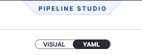
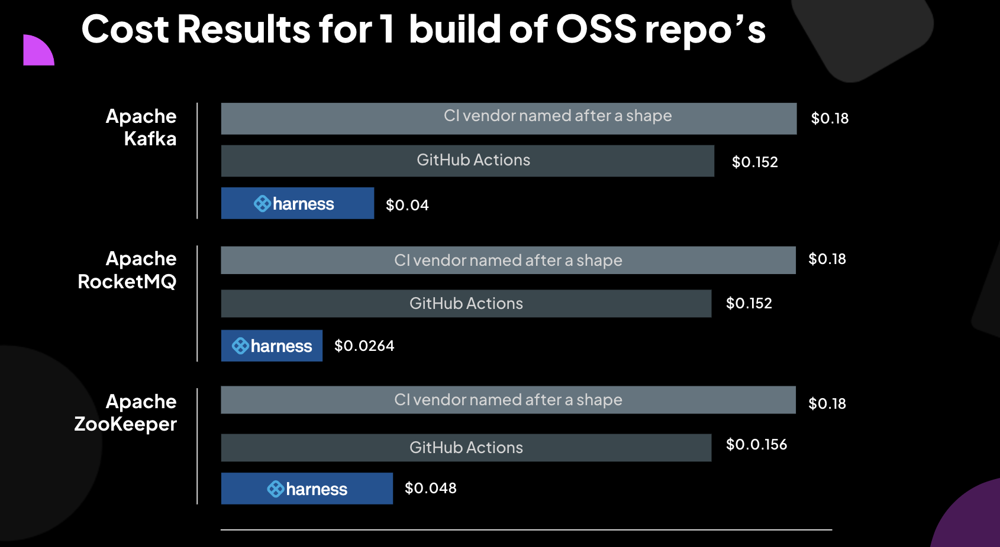

<CTABanner
  buttonText="Sign Up"
  title="THE WORLD'S FASTEST CI."
  tagline="Sign up today to get started for free!"
  link="https://app.harness.io/auth/#/signup/?module=ci&utm_source=HDH&utm_medium=&utm_campaign=Fastest-CI-HDH-Article&utm_term=sign-up&utm_content=CI-HDH-Top-Nav"
  closable={true}
  target="_blank"
/>

<DocsTag  text="Free plan" link="/docs/continuous-integration/ci-quickstarts/ci-subscription-mgmt" /> <DocsTag  text="Team plan" link="/docs/continuous-integration/ci-quickstarts/ci-subscription-mgmt" /> <DocsTag  text="Enterprise plan" link="/docs/continuous-integration/ci-quickstarts/ci-subscription-mgmt" />

Harness CI is a modern Continuous Integration platform that empowers busy teams to automate their build, test, and release workflows using a powerful, cloud-native pipeline engine.

<figure>


<figcaption></figcaption>
</figure>

## Build faster and be more productive

Developers are frustrated with the time it takes to ship code and often end up wasting their precious time waiting for the builds to complete.

<figure>


<figcaption></figcaption>
</figure>

With Harness CI, you can build faster and be more productive. Harness CI's pricing is competitive to other leading CI providers, which gives you more cost savings with the speed benefit.

Harness CI is built on Drone. Over the last 10 years, we focused on solving developers' frustration with the time it took to ship code with existing CI tools. Harness CI's vision is to create a CI tool that is fast, simple, open, and secure.

Developer productivity is a core pillar for Harness. We didn't want to build a CI tool that was fast but complex to use. You can get started quickly with any language in Harness CI, with out-of-the-box starter templates and code-first development. You can connect to any Source Code Management (SCM) system, build any apps for any language or platform, and host it anywhere.


Harness CI has great [features](./overview), like plugin support, that help you build faster and be more productive. Harness uses containers to drop pre‑configured steps into your pipeline. Choose from thousands of existing [plugins](/docs/continuous-integration/use-ci/use-drone-plugins/explore-ci-plugins) or [create your own](/docs/continuous-integration/use-ci/use-drone-plugins/custom_plugins) and run them on a container or build's host machine.

:::info

[Sign up for free to try the world's fastest CI.](https://app.harness.io/auth/#/signup/?module=ci&utm_source=HDH&utm_medium=&utm_campaign=Fastest-CI-HDH-Article&utm_term=sign-up&utm_content=CI-HDH-Get-Started-Free)

:::

## Try Harness CI

This tutorial helps you get started, for free, with the fastest CI on the planet. Create a Harness CI pipeline and explore some of the features that make Harness CI four times faster than the leading competitors.

### Create a pipeline

With Harness CI, you can build, test, and deploy applications in Node.js, Python, Java, Ruby, PHP, Go, Rust, C# (.NET Core), and more. You can use VMs or containers for Linux, Windows, and Mac operating systems.

import Tabs from '@theme/Tabs';
import TabItem from '@theme/TabItem';

<Tabs>
<TabItem value="Go" label="Go" default>

1. Fork the [Go sample repository](https://github.com/harness-community/gosample) into your GitHub account.
2. [Sign up](https://app.harness.io/auth/#/signup/?module=ci&utm_source=HDH&utm_medium=&utm_campaign=Fastest-CI-HDH-Article&utm_term=sign-up&utm_content=CI-HDH-Article) for a free Harness account.
3. Select the Harness CI module, and follow the **Get Started** wizard for Harness CI.
4. When asked **Which code repository do you use**, select GitHub, and then select either **OAuth** or **Access Token** as the authentication method that Harness CI will use to connect to your GitHub account.

   For new accounts, the Get Started wizard creates a codebase connector for you. If your account already has a connector, the Get Started wizard automatically selects the existing connector. You can [create codebase connectors](/docs/platform/connectors/code-repositories/connect-to-code-repo) by navigating to **Projects** and then **Connectors**.

5. When asked to select a repository, select the Go sample repository that you forked earlier, and then select **Configure Pipeline**.
6. Select **Generate my Pipeline configuration**, enter a branch name (such as `main`), and then select **Create Pipeline**.
7. Switch to the **YAML** editor, and select **Edit YAML**.

   

8. Replace the `echo` step with the following, and then save the pipeline.

```yaml
- step:
    type: Run
    identifier: build_go_app
    name: Build Go App
    spec:
      command: |-
        echo "Welcome to Harness CI"
        go build
        go test
```

</TabItem>
<TabItem value="Java" label="Java">

1. Fork the [JHTTP sample repository](https://github.com/harness-community/jhttp) into your GitHub account.
2. [Sign up](https://app.harness.io/auth/#/signup/?module=ci&utm_source=HDH&utm_medium=&utm_campaign=Fastest-CI-HDH-Article&utm_term=sign-up&utm_content=CI-HDH-Article) for a free Harness account.
3. Select the Harness CI module, and follow the **Get Started** wizard for Harness CI.
4. When asked **Which code repository do you use**, select GitHub, and then select either **OAuth** or **Access Token** as the authentication method that Harness CI will use to connect to your GitHub account.

   For new accounts, the Get Started wizard creates a codebase connector for you. If your account already has a connector, the Get Started wizard automatically selects the existing connector. You can [create codebase connectors](/docs/platform/connectors/code-repositories/connect-to-code-repo) by navigating to **Projects** and then **Connectors**.

5. When asked to select a repository, select the JHTTP sample repository that you forked earlier, and then select **Configure Pipeline**.
6. Select **Generate my Pipeline configuration**, enter a branch name (such as `main`), and then select **Create Pipeline**.
7. Switch to the **YAML** editor, and select **Edit YAML**.

   

8. Replace the `build` step with the following, and then save the pipeline.

```yaml
- step:
    type: Run
    identifier: build_java_app
    name: Build Java App
    spec:
      shell: Sh
      command: |-
        echo "Welcome to Harness CI"
        mvn -B package --file pom.xml
```

</TabItem>
<TabItem value="JavaScript" label="JavaScript">

1. Fork the [React calculator sample repository](https://github.com/harness-community/reactcalculator) into your GitHub account.
2. [Sign up](https://app.harness.io/auth/#/signup/?module=ci&utm_source=HDH&utm_medium=&utm_campaign=Fastest-CI-HDH-Article&utm_term=sign-up&utm_content=CI-HDH-Article) for a free Harness account.
3. Select the Harness CI module, and follow the **Get Started** wizard for Harness CI.
4. When asked **Which code repository do you use**, select GitHub, and then select either **OAuth** or **Access Token** as the authentication method that Harness CI will use to connect to your GitHub account.

   For new accounts, the Get Started wizard creates a codebase connector for you. If your account already has a connector, the Get Started wizard automatically selects the existing connector. You can [create codebase connectors](/docs/platform/connectors/code-repositories/connect-to-code-repo) by navigating to **Projects** and then **Connectors**.

5. When asked to select a repository, select the sample repository that you forked earlier, and then select **Configure Pipeline**.
6. Select **Generate my Pipeline configuration**, enter a branch name (such as `main`), and then select **Create Pipeline**.
7. Switch to the **YAML** editor, and select **Edit YAML**.

   

8. Replace the `steps` section (both `Run` steps) with the following, and then save the pipeline.

```yaml
steps:
  - step:
      type: Run
      identifier: build_javascript_app
      name: Build JavaScript App
      spec:
        shell: Sh
        command: |-
          echo "Welcome to Harness CI"
          node --version
          npm install
          npm run build --if-present
          npm test
```

</TabItem>
<TabItem value=".NET" label="C# (.NET Core)">

1. Fork the [C# (.NET Core) sample repository](https://github.com/harness-community/hello-dotnet-core) into your GitHub account.
2. [Sign up](https://app.harness.io/auth/#/signup/?module=ci&utm_source=HDH&utm_medium=&utm_campaign=Fastest-CI-HDH-Article&utm_term=sign-up&utm_content=CI-HDH-Article) for a free Harness account.
3. Select the Harness CI module, and follow the **Get Started** wizard for Harness CI.
4. When asked **Which code repository do you use**, select GitHub, and then select either **OAuth** or **Access Token** as the authentication method that Harness CI will use to connect to your GitHub account.

   For new accounts, the Get Started wizard creates a codebase connector for you. If your account already has a connector, the Get Started wizard automatically selects the existing connector. You can [create codebase connectors](/docs/platform/connectors/code-repositories/connect-to-code-repo) by navigating to **Projects** and then **Connectors**.

5. When asked to select a repository, select the sample repository that you forked earlier, and then select **Configure Pipeline**.
6. Select **Generate my Pipeline configuration**, enter a branch name (such as `main`), and then select **Create Pipeline**.
7. Switch to the **YAML** editor, and select **Edit YAML**.

   

8. Replace the `echo` step with the following, and then save the pipeline.

```yaml
- step:
    type: Run
    identifier: build_dotnet_app
    name: Build DotNet App
    spec:
      shell: Sh
      command: |-
        echo "Welcome to Harness CI"
        dotnet restore
        dotnet build --no-restore
        dotnet test --no-build --verbosity normal
```

</TabItem>
<TabItem value="Python" label="Python">

1. Fork the [Python sample repository](https://github.com/harness-community/python) into your GitHub account.
2. [Sign up](https://app.harness.io/auth/#/signup/?module=ci&utm_source=HDH&utm_medium=&utm_campaign=Fastest-CI-HDH-Article&utm_term=sign-up&utm_content=CI-HDH-Article) for a free Harness account.
3. Select the Harness CI module, and follow the **Get Started** wizard for Harness CI.
4. When asked **Which code repository do you use**, select GitHub, and then select either **OAuth** or **Access Token** as the authentication method that Harness CI will use to connect to your GitHub account.

   For new accounts, the Get Started wizard creates a codebase connector for you. If your account already has a connector, the Get Started wizard automatically selects the existing connector. You can [create codebase connectors](/docs/platform/connectors/code-repositories/connect-to-code-repo) by navigating to **Projects** and then **Connectors**.

5. When asked to select a repository, select the Python sample repository that you forked earlier, and then select **Configure Pipeline**.
6. Select **Generate my Pipeline configuration**, enter a branch name (such as `main`), and then select **Create Pipeline**.
7. Switch to the **YAML** editor, and select **Edit YAML**.

   

8. Replace the `build` step with the following, and then save the pipeline.

```yaml
- step:
    type: Run
    identifier: build_python_app
    name: Build Python App
    spec:
      shell: Sh
      command: |-
        echo "Welcome to Harness CI"
        python -m pip install --upgrade pip
        pip install  pytest
        if [ -f requirements.txt ]; then pip install -r requirements.txt; fi
```

</TabItem>
</Tabs>

### Run your pipeline

1. In the **Pipeline Studio**, select **Run**.
2. In the **Build Type** field, select **Git Branch**.
3. Enter `master` or `main` in the **Branch Name** field, depending on the repo you forked.
4. Select **Run Pipeline**.

You can watch the build progression and find build logs on the [Builds and Build details pages](/docs/continuous-integration/use-ci/viewing-builds).

Congratulations on building your first pipeline!

## Build pipelines four times faster than GitHub Actions

Harness CI is four times faster due to optimized defaults with hosted builds, so you don't have to set up and manage infrastructure or optimize caching and other technologies to improve build times.

[Cache Intelligence](/docs/continuous-integration/use-ci/caching-ci-data/cache-intelligence) dramatically reduces pipeline execution time by automatically caching well-known directories for Java, Node package managers, and more.

[Test Intelligence](/docs/continuous-integration/use-ci/run-tests/ti-overview.md) can improve build cycles by up to 90% with machine learning (ML) that runs only the necessary tests relevant to code changes. Once tests are identified, you can speed up test cycles even more by splitting and running tests concurrently.

In the following demo video, Harness goes head-to-head with GitHub Actions. [Sign up for free](https://app.harness.io/auth/#/signup/?module=ci&utm_source=HDH&utm_medium=&utm_campaign=Fastest-CI-HDH-Article&utm_term=sign-up&utm_content=CI-HDH-Get-Started-Free) and follow [these instructions](https://github.com/harness-community/kafka/blob/trunk/.harness/README.md) to reproduce the results and try it for yourself.

<DocVideo src="https://www.youtube.com/watch?v=ECF1BDlzb-I" />

## Build and test Apache Kafka four times faster

You can build even faster with Harness CI. Learn how you can build and test Apache Kafka four times faster on Harness CI:

- The data is in: [Harness CI is up to 4X faster than other solutions](https://harness.io/blog/fastest-ci-tool).
- Try it for yourself: [Sign up for free](https://app.harness.io/auth/#/signup/?module=ci&utm_source=HDH&utm_medium=&utm_campaign=Fastest-CI-HDH-Article&utm_term=sign-up&utm_content=CI-HDH-Get-Started-Free) and follow [these instructions](https://github.com/harness-community/kafka/blob/trunk/.harness/README.md) to reproduce the results for yourself.

<figure>


<figcaption></figcaption>
</figure>

Harness CI gives you speed benefits at a much lower cost. We compared the cost of running a single build for Apache Kafka, RocketMQ, and Zookeeper on Harness CI, GitHub Actions, and another CI provider:

- GitHub Actions cost $0.008 per build minute.
- CI Vendor 2 cost $0.0120 per build minute.
- Harness CI cost $0.008 per build minute, competitively priced relative to GitHub Actions and priced lower than CI Vendor 2.

With the advantage of being four times faster, your builds will take less time with Harness CI. Combined with the competitive pricing of $0.008 per build minute, your total cost could be 1/4th the cost of the other CI competitors. [Learn more about our test methodology in our fastest CI blog post.](https://harness.io/blog/fastest-ci-tool)

<figure>



<figcaption></figcaption>
</figure>
