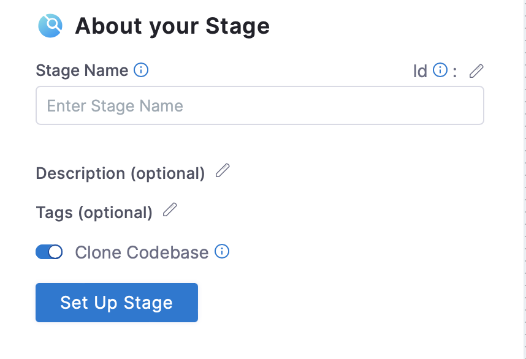

## Introduction

Harness CI and GitHub Actions both allow you to create workflows that automatically build, test, publish, release, and deploy code. Harness CI and GitHub Actions share some similarities in workflow configuration:
- Workflow configuration files are written in YAML and stored in the repository.
- Workflows include one or more stages/jobs.
- Stages include one or more steps or individual commands.
Steps or tasks can be reused and shared with the community.
For more information, see [Harness CI Concepts](https://developer.harness.io/docs/continuous-integration/ci-quickstarts/ci-concepts).

## Key differences

- With Harness, no scripting is needed and configurations are passed to pipelines securely and in a pragmatic way while Github Actions has third-party actions that you can use as semi-plug-and-play functionality.
- HashiCorp created an action to set up and configure the Terraform CLI in the GitHub Actions workflow. There’s also an action for CloudFormation. Harness provides both infrastructure provisioners with a simpler structure and configuration.
- GitHub Actions does not provide a native Accelerate metrics dashboard whereas Harness has a dashboard specifically for these metrics and allows you to set alerts as needed.
- The YAML file for Github actions is stored in the .github/workflows folder in a repository and for Harness CI it’s stored on the Harness itself and can be created from UI or by importing it from a Git Source.
- The Harness YAML editor provides schema validation and auto-complete recommendations to simplify and expedite the configuration experience. Harness is also equipped with a visual editor providing a guided experience that enables anyone to build, debug, and run pipelines easily. Users can switch back and forth between the YAML and Visual Editor as required.
- Harness CI is part of [The Harness Platform](https://developer.harness.io/docs/getting-started/harness-platform-architecture), which is a self-service CI/CD platform that enables end-to-end software delivery. The Harness Platform includes modules to help you build, test, deploy, and verify software.
- Harness provides an Enterprise Ready Self-Managed Edition, which is an end-to-end solution for continuous, self-managed delivery. You can install and update Harness Self-Managed Enterprise Edition using online or offline (air-gapped) methods.
- Harness provides Role-Based Access Control (RBAC) that enables you to control user and group access to Harness resources according to the user's role. By using RBAC, users can increase security and improve efficiency.
- Harness Policy as Code is a centralized policy management and rules service that leverages the Open Policy Agent (OPA) to meet compliance requirements across software delivery and enforce governance policies.

### Harness CI is 4X Faster

Harness CI provides proprietary technologies like Cache Intelligence and Test Intelligence™, which make Harness CI [four times faster](https://harness.io/blog/fastest-ci-tool) than other leading CI tools.

### Test Intelligence 

Harness [Test Intelligence](https://developer.harness.io/docs/continuous-integration/ci-quickstarts/test-intelligence-concepts) is a proprietary technology that speeds up test cycles by running only the tests required to confirm the quality of the code changes that triggered a build. It then ranks them in the best possible order to increase the rate of fault detection. It’s easy to see the code changes and gaps in the test plan. Test Intelligence also identifies negative trends and provides actionable insights to improve quality. Once the appropriate tests are identified, Harness CI runs split tests and runs them concurrently. It’s possible to reduce build cycle times by up to 90 percent without compromising application quality. This functionality is not built into GitHub Actions.

## Define a stage that executes a single build step

```mdx-code-block
import Tabs from '@theme/Tabs';
import TabItem from '@theme/TabItem';

<Tabs
    defaultValue="harness"
    values={[
        {label: 'Github Actions', value: 'github'},
        {label: 'Harness CI', value: 'harness'},
    ]}>
<TabItem value="github">
```

```yaml
jobs:
  build_test_and_run:
   name: build test and run
```

```mdx-code-block
</TabItem>
<TabItem value="harness">
```

```yaml
stages:
    - stage:
        name: build test and run   
```

```mdx-code-block
</TabItem>
</Tabs>
```

## Define a step inside a stage 

<Tabs
    defaultValue="harness"
    values={[
        {label: 'Github Actions', value: 'github-actions'},
        {label: 'Harness CI', value: 'harness'},
    ]}>
<TabItem value="github-actions">

```yaml
name: code compilation
   container:
         image: python:3.10.6-alpine
 run: |
        python -m compileall ./
```

```mdx-code-block
</TabItem>
<TabItem value="harness">
```

```yaml
 step:
      type: Run
      name: "code compilation "
      identifier: code_compilation
      spec:
          connectorRef: docker_Quickstart
          image: python:3.10.6-alpine
          shell: Sh
          command: python -m compileall ./ 
```

```mdx-code-block
</TabItem>
</Tabs>
```
## Log in to Docker registry

<Tabs
    defaultValue="harness"
    values={[
        {label: 'Github Actions', value: 'github-actions'},
        {label: 'Harness CI', value: 'harness'},
    ]}>
<TabItem value="github-actions">

```yaml
  name: login to dockerhub
   uses: docker/login-action@v2
   with: 
        username: {{ secrets.DOCKERHUB_USERNAME }}
        password: {{ secrets.DOCKERHUB_TOKEN }}
```

```mdx-code-block
</TabItem>
<TabItem value="harness">
```

```yaml
step:
    type: Run
    name: "code compilation "
    identifier: code_compilation
    spec:
        connectorRef: docker_Quickstart  
```

```mdx-code-block
</TabItem>
</Tabs>
```

In Harness CI we have connectors for logging into the Docker registry. To learn more about connectors, go to  [Connecting to Docker Registry](https://developer.harness.io/docs/platform/connectors/connect-to-harness-container-image-registry-using-docker-connector/).
A Connector in Harness is a configurable object that connects to an external resource automatically. We reference a Connector in your Pipeline by using its Id in `connectorRef`.

## Defining an environment variable

<Tabs
    defaultValue="harness"
    values={[
        {label: 'Github Actions', value: 'github-actions'},
        {label: 'Harness CI', value: 'harness'},
    ]}>
<TabItem value="github-actions">

```yaml
env:
  BUILD_PURPOSE: RELEASE
```
```mdx-code-block
</TabItem>
<TabItem value="harness">
```
```yaml
variables:
   - name: BUILD_PURPOSE
     type: String
     description: ""
     value: RELEASE 
```
```mdx-code-block
</TabItem>
</Tabs>
```
## Checkout Code

<Tabs
    defaultValue="harness"
    values={[
        {label: 'Github Actions', value: 'github-actions'},
        {label: 'Harness CI', value: 'harness'},
    ]}>
<TabItem value="github-actions">

```yaml
steps:
   - name: Checkout code
     uses: actions/checkout@v2
```
```mdx-code-block
</TabItem>
<TabItem value="harness">
```
```yaml
stage:
  name: build test and run
  identifier: build_test_and_run
  type: CI
      spec:
          cloneCodebase: true
```
```mdx-code-block
</TabItem>
</Tabs>
```
In Github Actions we use, `actions/checkout@v2`, which is the action that checks out your repository to the computer that runs the action.
In Harness CI, we have to create a GitHub connector as part of the first step which is basically a configurable object that connects to an external source automatically.
Harness Code Repository Connectors connect your Harness account with your Git platform.
To know about creating a git connector visit [GitHub Connector](https://docs.harness.io/article/jd77qvieuw-add-a-git-hub-connector).
Harness CI has a clone codebase option that acts similar to that of `actions/checkout@v2` in GitHub actions.

Each CI Pipeline has a Codebase that specifies the code repo (input) that the Pipeline uses to build the artifact (output). You specify the Codebase when you add the first Build Stage to the Pipeline. This becomes the default input for all other Stages in the Pipeline. By default, a Build Stage clones the repo from your Git provider into your build infrastructure when the Pipeline runs.



## Trigger a workflow

<Tabs
    defaultValue="harness"
    values={[
        {label: 'Github Actions', value: 'github-actions'},
        {label: 'Harness CI', value: 'harness'},
    ]}>
<TabItem value="github-actions">

```yaml
on:
  pull_request:
    branches:
      - main
jobs:
  gobuild:
    if: contains(github.event.pull_request.labels.*.name, 'go') || contains(github.event.pull_request.labels.*.name, 'gojava')
```
```mdx-code-block
</TabItem>
<TabItem value="harness">
```
```yaml
trigger:
  name: trigger
  identifier: trigger
  enabled: true
  orgIdentifier: default
  projectIdentifier: UNIQUE_IDENTIFIER
  pipelineIdentifier: Project_Name
  source:
    type: Scheduled
    spec:
      type: Cron
      spec:
        expression: 45 13 13 09 2
  inputYaml: |
    pipeline:
      identifier: Project_Name
      properties:
        ci:
          codebase:
            build:
              type: branch
              spec:
                branch: main
```
```mdx-code-block
</TabItem>
</Tabs>
```
In Harness CI you can trigger Pipelines in response to Git events that match specific payload conditions you set up in the Harness Trigger.
For example, when a pull request or push event occurs on a Git repo and your Trigger settings match the payload conditions, a CI Pipeline can execute.
In Harness , you trigger a workflow using the trigger option in the pipeline studio.
To know more about creating a trigger visit [Trigger Pipelines using Git Event Payload Conditions](https://docs.harness.io/article/10y3mvkdvk-trigger-pipelines-using-custom-payload-conditions)

## Build and Push to Docker Registry

<Tabs
    defaultValue="harness"
    values={[
        {label: 'Github Actions', value: 'github-actions'},
        {label: 'Harness CI', value: 'harness'},
    ]}>
<TabItem value="github-actions">

```yaml
    name: build and push docker image
    uses: docker/build-push-action@v3
    with:
      context:
        file: ./pythondockerfile
        push: true
        tags: user/pythonsample:latest
```
```mdx-code-block
</TabItem>
<TabItem value="harness">
```
```yaml
     - step:
          type: BuildAndPushDockerRegistry
          name: build and push to the docker registry
          identifier: build_and_push_to_the_docker_registry
          spec:
            connectorRef: docker_Quickstart
            repo: krishi0408/pythonsample
             tags:
                - latest
             dockerfile: pythondockerfile
```
```mdx-code-block
</TabItem>
</Tabs>
```

## Matrix

A matrix strategy lets you use variables in a single job definition to automatically create
multiple job runs that are based on the combinations of the variables. For example, you can use a matrix strategy to test your code in multiple versions of a language or on multiple operating systems.
To know more about matrix in Harness CI visit [Looping strategies in Harness](https://docs.harness.io/article/eh4azj73m4-looping-strategies-matrix-repeat-and-parallelism).
<Tabs
    defaultValue="harness"
    values={[
        {label: 'Github Actions', value: 'github-actions'},
        {label: 'Harness CI', value: 'harness'},
    ]}>
<TabItem value="github-actions">

```yaml
jobs:
 example_matrix:
  strategy:
   matrix:
     python: [ 3.10.6-alpine,3.10.4-alpine]
```
```mdx-code-block
</TabItem>
<TabItem value="harness">
```
```yaml
 strategy:
    repeat:
      items:
        - 3.10.6-alpine
        - 3.10.4-alpine
    maxConcurrency: 2
```
```mdx-code-block
</TabItem>
</Tabs>
```

## Complete Example 

<Tabs
    defaultValue="harness"
    values={[
        {label: 'Github Actions', value: 'github-actions'},
        {label: 'Harness CI', value: 'harness'},
    ]}>
<TabItem value="github-actions">

```yaml
name: Github_actions
on:
  pull_request:
    branches:
      - main
jobs:
  Stage_1:
   name: Stage_1
   runs-on: ubuntu-latest
   steps:
      - name: Checkout code
        uses: actions/checkout@v2
        
      - name: login to dockerhub
        uses: docker/login-action@v2
        with: 
          username: {{secrets.DOCKERHUB_USERNAME}}
          password: {{secrets.DOCKERHUB_TOKEN}}
          
      -  name: step_1 
         container:
               image: openjdk:17.0-jdk
         run: |
           echo "this runs on openjdk"
         services:
          postgres:
            image: postgres:10.8
            env:
              POSTGRES_USER: postgres
              POSTGRES_DB: postgres
              POSTGRES_PASSWORD: ""
  Stage_2:
     name: Stage_2
     runs-on: ubuntu-latest
     steps:
      - name: step_2 
        container:
              image: node:13.0.0
        run: |
            echo "pipeline var:" $pipeline_var
            echo "project level var:" $project_var
            echo "secret example :" ${{ secrets.Db_Password)}}
  Stage_3:
     name: Stage_3
     runs-on: ubuntu-latest
     strategy:
        matrix:
           version: ["node","python","ubuntu"]
     steps:
      - name: matrix
        run: |
           echo "Testing on ${{ matrix.version }}
```
```mdx-code-block
</TabItem>
<TabItem value="harness">
```
```yaml
pipeline:
 name: react
 identifier: react
 projectIdentifier:NgLabs
 orgIdentifier: default
 tags: {}
 stages:
   - stage:
       name: Stage1
       identifier: stage1
       type: CI
       spec:
         cloneCodebase: true
         execution:
           steps:
             - step:
                 type: Run
                 name: step1
                 identifier: step1
                 spec:
                   connectorRef: krishikaDocker
                   image: openjdk:17.0-jdk
                   shell: Bash
                   command: echo "this runs on openjdk"
         platform:
           os: Linux
           arch: Amd64
         runtime:
           type: Cloud
           spec: {}
         serviceDependencies:
           - identifier: PostgressDependecyService
             name: Postgress-Dependecy-Service
             type: Service
             spec:
               connectorRef: account.harnessImage
               image: postgres:10.8
               envVariables:
                 POSTGRES_USER: postgres
                 POSTGRES_PASSWORD: <+secrets.getValue("DbPasswordSecret")>
                 POSTGRES_DB: postgres
   - stage:
       name: Stage2
       identifier: Stage2
       type: CI
       spec:
         cloneCodebase: true
         execution:
           steps:
             - step:
                 type: Run
                 name: step1
                 identifier: step1
                 spec:
                   connectorRef: krishikaDocker
                   image: node:13.0.0
                   shell: Bash
                   command: |-
                     echo "pipeline var:" <+pipeline.variables.pipelinevar1>
                     echo "project level var:" <+variable.proj_var>
                     echo "secret example :" <+secrets.getValue("DbPasswordSecret")>
         platform:
           os: Linux
           arch: Amd64
         runtime:
           type: Cloud
           spec: {}
       variables: []
   - stage:
       name: matrix stage
       identifier: Stage4
       type: CI
       spec:
         cloneCodebase: true
         execution:
           steps:
             - step:
                 type: Run
                 name: step1
                 identifier: step1
                 spec:
                   shell: Bash
                   command: echo "Testing on  <+matrix.testparam>"
         platform:
           os: Linux
           arch: Amd64
         runtime:
           type: Cloud
           spec: {}
       strategy:
         matrix:
           testparam:
             - node
             - python
             - ubuntu
         maxConcurrency: 3
 properties:
   ci:
     codebase:
       connectorRef: gitforronak
       repoName: test
       build: <+input>
 variables:
   - name: pipelinevar1
     type: String
     description: ""
     value: someval
```
```mdx-code-block
</TabItem>
</Tabs>
```

We recommend going through the following list to make you more comfortable before going ahead with complex configiguration and migration:
- [Caching](https://developer.harness.io/docs/category/share-and-cache-ci-data)
- [Parallelism](https://developer.harness.io/docs/platform/Pipelines/speed-up-ci-test-pipelines-using-parallelism)
- [Platform Concepts](https://developer.harness.io/docs/platform)
