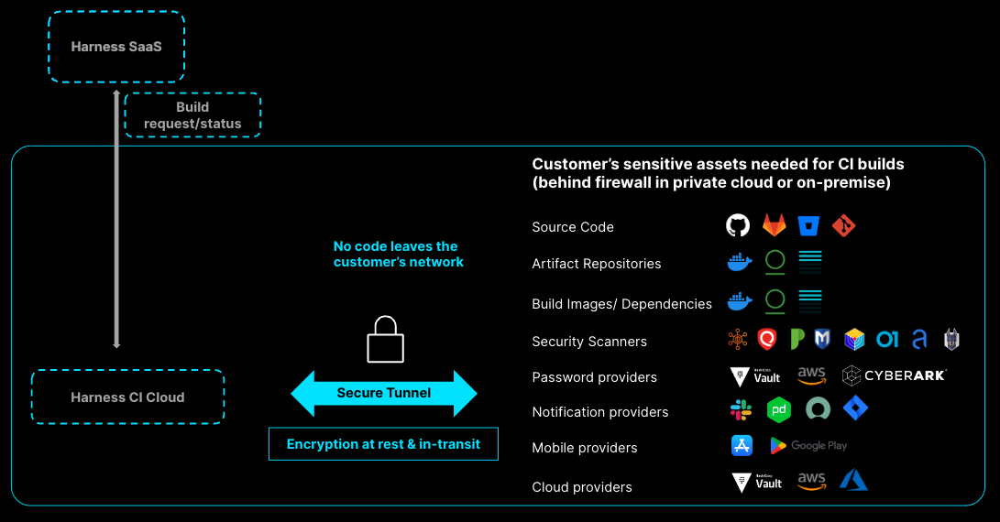

:::note

Currently, Secure Connect for Harness Cloud is behind the feature flag `CI_SECURE_TUNNEL`. Contact [Harness Support](mailto:support@harness.io) to enable the feature.

:::

[Harness CI Cloud (Harness-managed build infrastructure)](/docs/continuous-integration/use-ci/set-up-build-infrastructure/use-harness-cloud-build-infrastructure) addresses common challenges you might face when implementing a continuous integration tool in your infrastructure:

* **Can I trust Harness CI Cloud with my intellectual property (source code, artifacts, and so on)?** Yes. Harness CI Cloud doesn't retain your data after running a build.
* **Can Harness CI Cloud securely connect to my complex and private firewalled infrastructure?** Yes. You can use Secure Connect for Harness CI Cloud to connect to your private assets through a secure tunnel.
* **Can I prove that this tool is secure so I can get it approved quickly by the required stakeholders (security team, ARB, DevOps platform team, infrastructure teams, and so on)?** Yes. Harness CI Cloud has been penetration tested by external experts, and it is [ISO and SOC2](https://trust.harness.io/) certified. If you're already using Harness CI Cloud, additional approval isn't needed to enable Secure Connect to connect to your firewalled assets.

<!--

Harness CI Cloud enterprise readiness

| Secure | Trust | Govern |
| -----  | ----- | ------ |
| Connect with on-prem/private cloud network | Meet regulatory compliance standards | Fine grained access control |
| Dedicated build infrastructure | Pentested by external experts | Policy as code |
| Passwordless with OIDC | SLSA compliance (build L2 level only in Harness CI Cloud) | Templates |
| Encryption at rest and in transit | Business continuity and disaster recovery (No customer intervention) | Audit trail |
| Ensure artifact integrity and prevent tampering | Highly available (99.99% uptime SLA) | End-to-end visibility with dashboards and reports |
|  | Highly Scalable |  |
-->

## What is Secure Connect for Harness Cloud

With Secure Connect for Harness CI Cloud, you can connect to your sensitive assets through a secure tunnel. This allows you to use Harness Cloud build infrastructure with privately-hosted assets, such as internal artifacts repositories and on-premises code repositories. Secure Connect is a faster alternative to allowlisting IPs.

You can [configure Secure Connect](#configure-secure-connect) in minutes. If you're already using Harness Cloud build infrastructure, you don't need additional approval to enable Secure Connect.

| Secure | Effective |
| ------ | --------- |
| <ul><li>Extension of your existing private infrastructure</li><li>Dedicated infrastructure</li><li>Encryption at rest and in transit</li><li>No passwords stored using OIDC</li><li>No customer assets stored in CI Cloud</li></ul> | <ul><li>Enable Secure Connect in one click</li><li>Doesn't require admin approval</li><li>Multi-cloud/on-prem support</li></ul> |

### Secure Connect architecture

To use Harness Cloud in firewalled environments, such as a corporate network, you enable a secure tunnel between the Harness Cloud network and your private network.



## Configure Secure Connect

1. Run the Docker client in your firewalled environment. Where you run the client depends on what assets need to securely connect to Harness and your environment's network configuration.

   ```
   docker run -it -e REMOTE_PORT=ANY_PORT_FROM_30000_TO_30100  -e REMOTE_SERVER=sc.harness.io -e API_KEY=YOUR_HARNESS_API_KEY harness/frpc-signed
   ```

   * `REMOTE_PORT` can be any port from 30000 to 30100.
   * `API_KEY` can be any valid [Harness API key](/docs/platform/automation/api/add-and-manage-api-keys).

2. Enable **Secure Connect** for each connector you use with Harness Cloud that needs to route through a secure tunnel. This setting is available in the connector's **Connect to Provider** settings.

   For example, if you need to connect to an on-premise code repo, you need to enable **Secure Connect** in your code repo connector's settings.

   Compatible connectors include:
   * [GitHub connectors](/docs/platform/connectors/code-repositories/ref-source-repo-provider/git-hub-connector-settings-reference)
   * [GitLab connectors](/docs/platform/connectors/code-repositories/ref-source-repo-provider/git-lab-connector-settings-reference)
   * [Bitbucket connectors](/docs/platform/connectors/code-repositories/ref-source-repo-provider/bitbucket-connector-settings-reference)
   * [Git connectors](/docs/platform/connectors/code-repositories/ref-source-repo-provider/git-connector-settings-reference)
   * [Docker connectors](/docs/platform/connectors/cloud-providers/ref-cloud-providers/docker-registry-connector-settings-reference)
   * [GCP connectors](/docs/platform/connectors/cloud-providers/connect-to-google-cloud-platform-gcp)
   * [AWS connectors](/docs/platform/connectors/cloud-providers/add-aws-connector)

### Use Secure Connect environment variables to route other clients

When you enable Secure Connect, Harness sets two environment variables: `HARNESS_HTTP_PROXY` and `HARNESS_HTTPS_PROXY`.

You can use these environment variables in cURL commands to tunnel other clients through the established secure tunnel, for example:

```
curl -x HARNESS_HTTPS_PROXY YOUR_ENDPOINT_URL
```

Replace `YOUR_ENDPOINT_URL` with the URL that you want to route through the secure tunnel. For example, you could route a private Bitbucket domain like `https://bitbucket.myorg.com/`.

The client must support connection by proxy.
