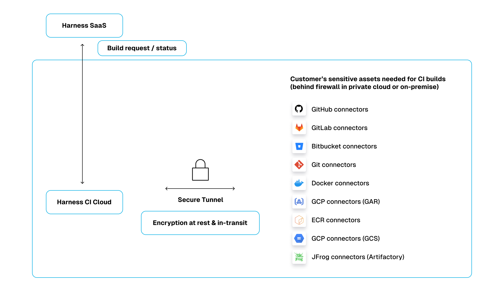

:::note

Currently, Secure Connect for Harness Cloud is behind the feature flag `CI_SECURE_TUNNEL`. Contact [Harness Support](mailto:support@harness.io) to enable the feature.

:::

To use [Harness Cloud build infrastructure](/docs/continuous-integration/use-ci/set-up-build-infrastructure/use-harness-cloud-build-infrastructure) in firewalled environments, such as a corporate network, you can create a secure connect tunnel between the Harness Cloud network and your private network. This allows you to use Harness Cloud build infrastructure with privately-hosted assets, such as internal artifacts repositories and on-premises code repositories. Secure connect is a faster alternative to allowlisting IPs.



## Configure secure connect

1. Run the Docker client in your firewalled environment. Where you run the client depends on what assets need to securely connect to Harness and your environment's network configuration.

   ```
   docker run -it -e REMOTE_PORT=ANY_PORT_FROM_30000_TO_30100  -e REMOTE_SERVER=sc.harness.io -e API_KEY=YOUR_HARNESS_API_KEY harness/frpc-signed
   ```

   * `REMOTE_PORT` can be any port from 30000 to 30100.
   * `API_KEY` must be a valid [Harness API key](/docs/platform/automation/api/add-and-manage-api-keys).

2. Enable **Secure Connect** for each connector you use with Harness Cloud that needs to route through a secure connect tunnel. This setting is available in the connector's **Connect to Provider** settings.

   For example, if you need to connect to an on-premise code repo, you need to enable **Secure Connect** in your code repo connector's settings.

   Compatible connectors include:
   * [GitHub connectors](/docs/platform/connectors/code-repositories/ref-source-repo-provider/git-hub-connector-settings-reference)
   * [GitLab connectors](/docs/platform/connectors/code-repositories/ref-source-repo-provider/git-lab-connector-settings-reference)
   * [Bitbucket connectors](/docs/platform/connectors/code-repositories/ref-source-repo-provider/bitbucket-connector-settings-reference)
   * [Git connectors](/docs/platform/connectors/code-repositories/ref-source-repo-provider/git-connector-settings-reference)
   * [Docker connectors](/docs/platform/connectors/cloud-providers/ref-cloud-providers/docker-registry-connector-settings-reference)
   * [GCP connectors](/docs/platform/connectors/cloud-providers/connect-to-google-cloud-platform-gcp)
   * [AWS connectors](/docs/platform/connectors/cloud-providers/add-aws-connector)

Once enabled, traffic related to the configured connector is tunneled through the FRPC.

## Secure connect environment variables

When you enable secure connect, Harness sets two environment variables: `HARNESS_HTTP_PROXY` and `HARNESS_HTTPS_PROXY`.

You can use these environment variables in cURL commands to tunnel other clients through the established secure connect tunnel, for example:

```
curl -x HARNESS_HTTPS_PROXY YOUR_ENDPOINT_URL
```

Replace `YOUR_ENDPOINT_URL` with the URL that you want to route through the secure connect tunnel. For example, you could route a private Bitbucket domain like `https://bitbucket.myorg.com/`.
