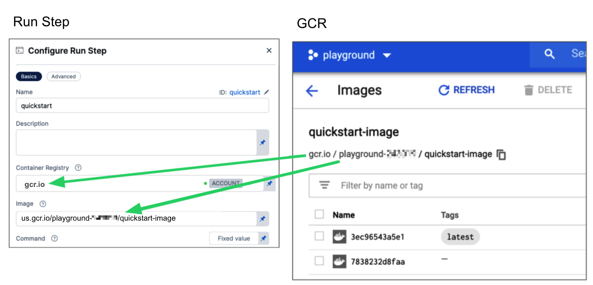

#### What are the expected values for Container Registry and Image

For **Container Registry** settings, provide a Harness container registry connector, such as a [Docker connector](/docs/platform/connectors/cloud-providers/ref-cloud-providers/docker-registry-connector-settings-reference/), that connects to a container registry, such as Docker Hub, where the **Image** is located.

For **Image**, provide the FQN (fully-qualified name) or artifact name and tag of the Docker image to use when this step runs commands, for example `us-docker.pkg.dev/gar-prod-setup/harness-public/harness/cache:latest` or `maven:3.8-jdk-11`. If you don't include a tag, Harness uses the `latest` tag.   Depending on the connector and feature flags set, **an FQN may be required**.

You can use any Docker image from any Docker registry, including Docker images from private registries. Different container registries require different name formats, for example:

* **Docker Registry:** Input the name of the artifact you want to deploy, such as `library/tomcat`. Wildcards aren't supported. FQN is required for images in private container registries.
* **ECR:** Input the FQN of the artifact you want to deploy. Images in repos must reference a path, for example: `40000005317.dkr.ecr.us-east-1.amazonaws.com/todolist:0.2`.
* **GAR:** Input the FQN of the artifact you want to deploy. Images in repos must reference a path starting with the project ID that the artifact is in, for example: `us-docker.pkg.dev/gar-prod-setup/harness-public/harness/cache:latest`.

    
    <figcaption>Configuring a Container Registry and Image settings.</figcaption>

:::note Remove FQN Requirement
Customers who want to utilize non-FQN references for non public Docker-registry connectors will need to contact Harness Support to add the feature flags, `CI_REMOVE_FQN_DEPENDENCY_FOR_PRIVATE_REGISTRY_CONNECTOR_DOCKER` and `CI_REMOVE_FQN_DEPENDENCY`.
:::

#### Pulling images from JFrog Artifactory Docker registries

If you need to pull images from a JFrog Artifactory Docker registry, create a Docker connector that connects to your JFrog instance. **Don't use the Harness Artifactory connector** - The Artifactory connector only supports JFrog non-Docker registries.

To create a Docker connector for a JFrog Docker registry:

1. Go to **Connectors** in your Harness project, organization, or account resources, and select **New Connector**.
2. Select **Docker Registry** under **Artifact Repositories**.
3. Enter a **Name** for the connector. The **Description** and **Tags** are optional.
4. For **Provider Type**, Select **Other**.
5. In **Docker Registry URL**, enter your JFrog URL, such as `https://mycompany.jfrog.io`.
6. In the **Authentication** settings, you must use **Username and Password** authentication.
   * **Username:** Enter your JFrog username.
   * **Password:** Select or create a [Harness text secret](/docs/platform/secrets/add-use-text-secrets) containing the password corresponding with the **Username**.
7. Complete any other settings and save the connector. For information all Docker Registry connector settings, go to the [Docker connector settings reference](/docs/platform/connectors/cloud-providers/ref-cloud-providers/docker-registry-connector-settings-reference).

One completed, please remember to use the FQN location of the image unless you have set the [appropriate feature flags as listed above](#what-are-the-expected-values-for-container-registry-and-image)

:::tip JFrog URLs
The JFrog URL format depends on your Artifactory configuration, and whether your Artifactory instance is local, virtual, remote, or behind a proxy. To get your JFrog URL, you can select your repo in your JFrog instance, select **Set Me Up**, and get the repository URL from the server name in the `docker-login` command.

For more information, go to the JFrog documentation on [Repository Management](https://www.jfrog.com/confluence/display/JFROG/Repository+Management) and [Configuring Docker Repositories](https://www.jfrog.com/confluence/display/RTF/Docker+Registry#DockerRegistry-ConfiguringDockerRepositories).
:::