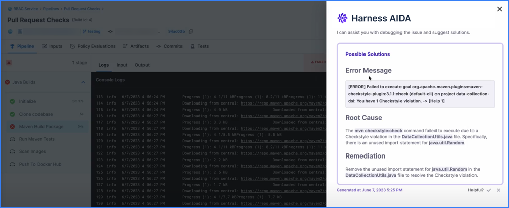

```mdx-code-block
import Intro from '/docs/continuous-integration/shared/aida-intro.md';
import Use from '/docs/continuous-integration/shared/aida-use.md';
import Legal from '/docs/continuous-integration/shared/aida-legal.md';
```

:::note

Currently, AIDA for CI is behind the feature flag `CI_AI_ENHANCED_REMEDIATIONS`. Contact [Harness Support](mailto:support@harness.io) to enable the feature.

:::

<Intro />

<!--  -->

<docimage path={require('./static/aida-dialog-example.png')} />

<Use />


You can find step logs on the [**Build details** page](../use-ci/viewing-builds.md).
