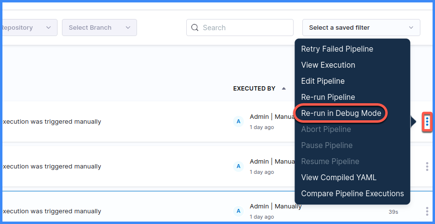
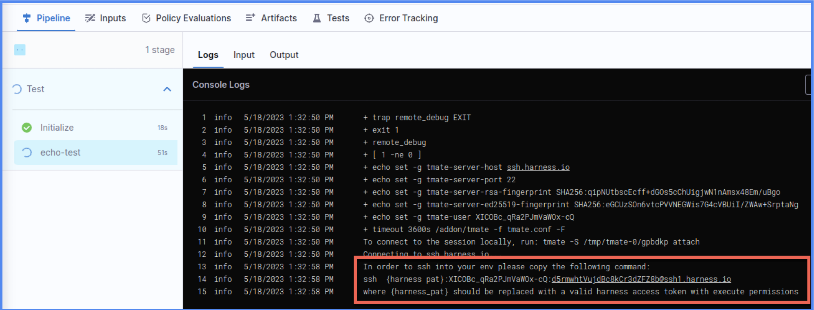

:::note
This is an early access feature and is behind the feature flag `CI_REMOTE_DEBUG`. Contact [Harness Support](mailto:support@harness.io) to enable the feature.
:::

You can use the Harness CI **Re-run in Debug Mode** feature to quickly and securely troubleshoot remote builds by SSH-ing into a debug session on the build's remote host. With debug mode, you:

* Get temporary, secure access to the build environment without the need for permanent permission changes.
* Troubleshoot directly in the build environment, not a recreation on your local machine.
* Troubleshoot in real time, rather than waiting for logs to output after each build.

You can also use **Re-run in Debug Mode** to troubleshoot local builds.

## Requirements

Debug mode is available if the following conditions are met:

* You have the feature flag `CI_REMOTE_DEBUG` enabled. Contact [Harness Support](mailto:support@harness.io) to enable this feature.
* The build fails at a [Run step](../use-ci/run-ci-scripts/run-step-settings.md) with a Bash, Shell, Python, or PowerShell Core (`pwsh`) script in a **Build** (`CI`) stage.
* The build runs on a Linux-based OS on any [build infrastructure](../use-ci/set-up-build-infrastructure/which-build-infrastructure-is-right-for-me.md) (Harness Cloud, a self-hosted VM, a Kubernetes cluster, or a local runner).

Debug mode is never available for a pipeline's first build. You must run the pipeline at least once before you can run the build in debug mode.

If debug mode isn't available for your pipeline, try [AIDA](./aida.md).

## Enable debug mode

```mdx-code-block
import Tabs from '@theme/Tabs';
import TabItem from '@theme/TabItem';
```

```mdx-code-block
<Tabs>
  <TabItem value="remote" label="Remote builds" default>
```

Use these steps to use debug mode for builds on Harness Cloud, self-hosted VM, or Kubernetes cluster build infrastructures.

1. Create a [Harness API key and token](/docs/platform/Resource-Development/APIs/add-and-manage-api-keys) with `pipeline execution` permissions. You must have pipeline execution permissions on your personal Harness account in order for the token to have those permissions.
2. Navigate to the [**Builds**](/docs/continuous-integration/use-ci/viewing-builds.md), **Execution**, or **Execution History** page.
3. Locate the build you want to troubleshoot, select **More Options** (&vellip;), and select **Re-run in Debug Mode**.

   <!--  -->

   <docimage path={require('./static/ci-rerun-build-in-debug-mode.png')} />

4. Wait while the build runs. If the Run step fails, the build stops and generates log output with an SSH command you can use to SSH into the session on the remote host.

   The SSH command is formatted as follows. Replace `{harness pat}` with your [token](/docs/platform/Resource-Development/APIs/add-and-manage-api-keys) that has `pipeline execution` permissions.

   ```
   ssh {harness pat}:<your-harness-account-ID>:<random-session-token>@tmate.harness.io
   ```

   <!--  -->

   <docimage path={require('./static/debug-remote-build-links.png')} />

5. While in the debug session, use the CLI to reproduce and troubleshoot the issue on the remote host.
6. To terminate the debug session, abort the build, and then run a new build to determine if the issue is resolved. Sessions automatically terminate after one hour or at the step timeout limit, whichever occurs first.

```mdx-code-block
  </TabItem>
  <TabItem value="local" label="Local builds">
```

Use these steps to use debug mode for builds on [local runner build infrastructures](/docs/continuous-integration/use-ci/set-up-build-infrastructure/define-a-docker-build-infrastructure).

1. [Download and install tmate](https://github.com/harness/tmate/releases/download/1.0/tmate-1.0-static-linux-amd64.tar.xz) on the runner's host machine.
2. If necessary, mount the install path. By default, Harness mounts the `/addon` path. If you installed tmate elsewhere, you need to mount that path.
3. In your CI pipeline, add the environment variable `TMATE_PATH` to your Run step. Set the value to the tmate mount path, such as `/addon/tmate`.
4. Create a [Harness API key and token](/docs/platform/Resource-Development/APIs/add-and-manage-api-keys) with `pipeline execution` permissions. You must have pipeline execution permissions on your personal Harness account in order for the token to have those permissions.
5. Navigate to the [**Builds**](/docs/continuous-integration/use-ci/viewing-builds.md), **Execution**, or **Execution History** page.
6. Locate the build you want to troubleshoot, select **More Options** (&vellip;), and select **Re-run in Debug Mode**.

   <!--  -->

   <docimage path={require('./static/ci-rerun-build-in-debug-mode.png')} />

7. Wait while the build runs. If the Run step fails, the build stops and generates log output with an SSH command you can use to SSH into the debug session.

   The SSH command is formatted as follows. Replace `{harness pat}` with your [token](/docs/platform/Resource-Development/APIs/add-and-manage-api-keys) that has `pipeline execution` permissions.

   ```
   ssh {harness pat}:<your-harness-account-ID>:<random-session-token>@tmate.harness.io
   ```

   <!--  -->

   <docimage path={require('./static/debug-remote-build-links.png')} />

8. While in the debug session, use the CLI to reproduce and troubleshoot the issue.
9. To terminate the debug session, abort the build, and then run a new build to determine if the issue is resolved. Sessions automatically terminate after one hour or at the step timeout limit, whichever occurs first.

```mdx-code-block
  </TabItem>
</Tabs>
```

:::tip

You can force a build to fail if you need to troubleshoot pipelines that appear to build successfully but still need remote troubleshooting. To do this, add a [Run step](/docs/continuous-integration/use-ci/run-ci-scripts/run-step-settings.md) with the command `exit 1`. This forces the build to fail so you can re-run it in debug mode.

:::
