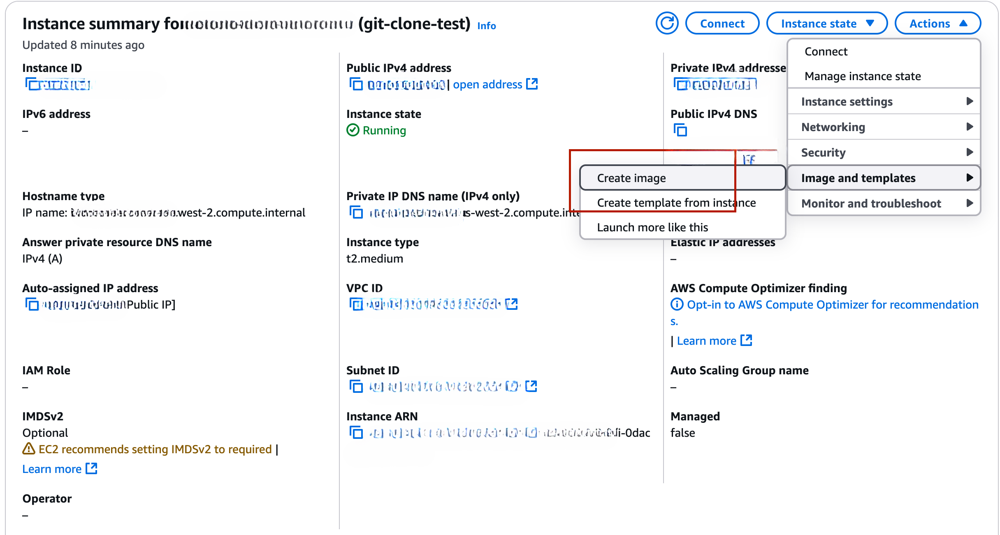
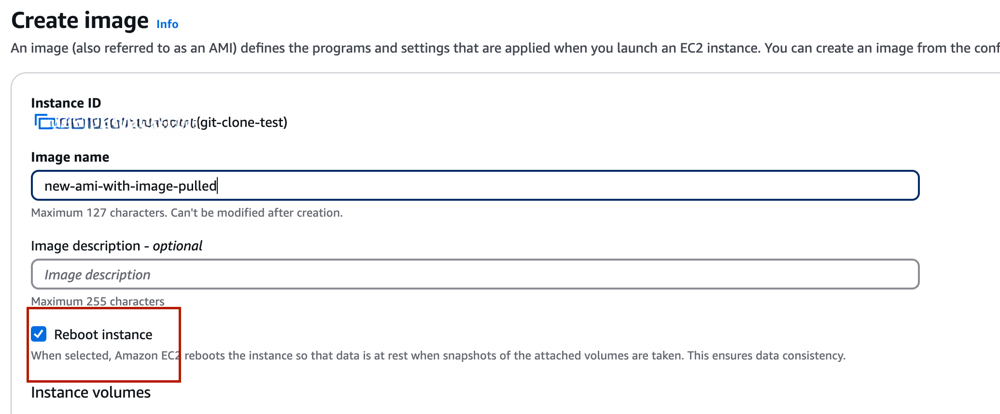
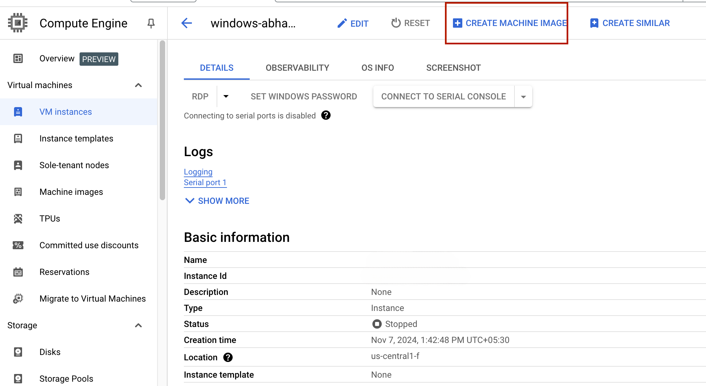
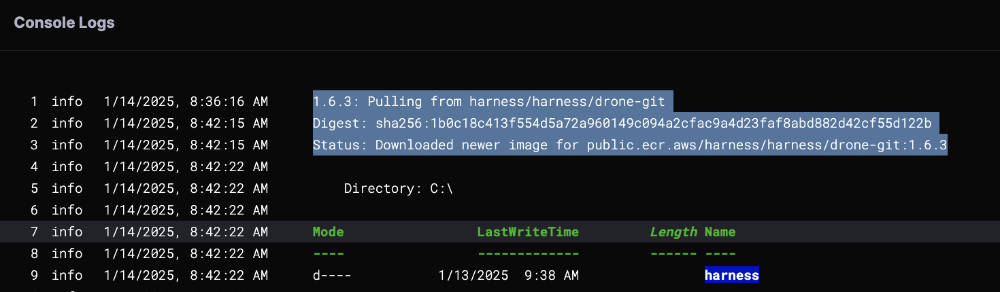

If a self-hosted Windows VM runner is slow to start or respond during pipeline execution, it may be due to long image pull times. To improve performance, repack the VM image with the required Docker image and use the new image in the runner pool.

## AWS: Repacking the AMI

1. Launch a Windows VM using the Base AMI.
2. RDP into the Windows VM.
    - Connect to the instance via Remote Desktop Protocol (RDP).
3. Pull the Required Docker Image.
```
docker pull harness/drone-git:1.6.3
```
4. Remove the EC2 Launch State File.
   - Delete the following file to prevent issues when creating the new AMI:
```
C:\ProgramData\Amazon\EC2Launch\state.run-once
```
:::tip
If `C:\ProgramData\Amazon\EC2Launch\state.run-once` is not found, run the following command instead:
```
C:\ProgramData\Amazon\EC2-Windows\Launch\Scripts\InitializeInstance.ps1 -Schedule
```
:::

5. Create a New AMI from the Updated VM.




6. Update the Runner Pool
    - Use the new AMI in the self-hosted runner pool configuration to ensure faster VM startup and response times.

## GCP: Repacking the Custom Windows Image

1. Create a Windows VM from an Existing Image.
2. Connect to the Windows VM
   - Use RDP to access the instance.
3. Pull the Required Docker Image
```
docker pull harness/drone-git:1.6.3
```
4. Prepare the VM for Image Creation
    - Stop the VM from the GCP Console.
5. Create a Custom Image from the Updated VM.

1. Use the New Image for Faster Startup
    - Update your runner configuration to use the new custom Windows image.

