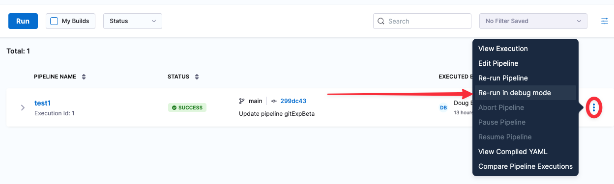
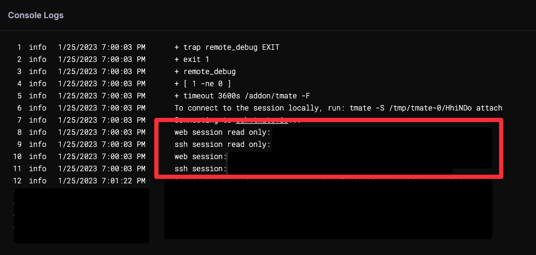

This topic contains general troubleshooting information for error messages and other issues that can arise.

If you cannot find a resolution, please contact [Harness Support](mailto:support@harness.io) or [Harness Community Forum](https://community.harness.io/).

In this topic, you will find help with the following:

* [Test Suites](troubleshooting-ci.md)

### Troubleshooting remote builds

Harness CI includes a Re-run in Debug Mode command for troubleshooting remote builds. This command is available only for the following build types:

* Must be a  CI pipeline build that ran in Harness Cloud, Kubernetes, or a VM instrastructure run in a remote platform such as AWS, Azure, or Google Cloud Platform.

* The build must have failed at a Run step within a CI stage. You must build a pipeline at least once before you can run the build in Debug mode.

The following steps describe the workflow.
  
1. Navigate to the **Builds**, **Execution**, or **Execution History** page in the Harness UI.

2. Choose **Re-run in Debug Mode** in the pull-down menu (**&equiv;**) for the build you want to troubleshoot.

    

3. When the build finishes or fails, the log output provides links to access the build logs on the remote host. Follow one of these links to troubleshoot the build:

     

   
  

### Test Suites

The following issues can occur when parsing test suites in Harness CI.

#### Test suites wrongly parsed

The parsed Test report in the Test tab comes strictly from the JUnit reports provided. It is important to adhere to the standard format to improve test suite parsing. 

Refer to the standard [JUnit format](https://llg.cubic.org/docs/junit/).

