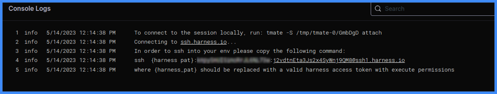

This topic contains troubleshooting information for error messages and other issues that can arise with Harness CI. For more Harness troubleshooting guidance, go to [Troubleshooting Harness](/docs/troubleshooting/troubleshooting-nextgen).

If you cannot find a resolution, please contact [Harness Support](mailto:support@harness.io) or visit the [Harness Community Forum](https://community.harness.io/).

## Git connector fails to connect to the SCM service

The following SCM service errors can occur with [Git connectors](/docs/platform/Connectors/Code-Repositories/ref-source-repo-provider/git-connector-settings-reference).

### SCM request failed with: UNKNOWN

This error may occur if your Git connector uses **SSH** authentication. To resolve this error, make sure HTTPS is enabled on port 443. This is the protocol and port used by the Harness connection test for Git connectors.

### SCM connection errors when using self-signed certificates

If you have configured your build infrastructure to use self-signed certificates, your builds may fail when the Git connector attempts to connect to the SCM service. Build logs may contain the following error messages:

```
Connectivity Error while communicating with the scm service
Unable to connect to Git Provider, error while connecting to scm service
```

To resolve this issue, add `SCM_SKIP_SSL=true` to the `environment` section of the delegate YAML.

For example, here is the `environment` section of a `docker-compose.yml` file with the `SCM_SKIP_SSL` variable:

```yaml
environment:
      - ACCOUNT_ID=XXXX
      - DELEGATE_TOKEN=XXXX
      - MANAGER_HOST_AND_PORT=https://app.harness.io
      - LOG_STREAMING_SERVICE_URL=https://app.harness.io/log-service/
      - DEPLOY_MODE=KUBERNETES
      - DELEGATE_NAME=test
      - NEXT_GEN=true
      - DELEGATE_TYPE=DOCKER
      - SCM_SKIP_SSL=true
```

For more information about self-signed certificates, delegates, and delegate environment variables, go to:

* [Delegate environment variables](../platform/2_Delegates/delegate-reference/delegate-environment-variables.md)
* [Docker delegate environment variables](../platform/2_Delegates/delegate-reference/docker-delegate-environment-variables.md)
* [Set up a local runner build infrastructure](./use-ci/set-up-build-infrastructure/define-a-docker-build-infrastructure.md)
* [Install delegates](https://developer.harness.io/docs/category/install-delegates)
* [Configure a Kubernetes build farm to use self-signed certificates](./use-ci/set-up-build-infrastructure/k8s-build-infrastructure/configure-a-kubernetes-build-farm-to-use-self-signed-certificates.md)

## Use debug mode to troubleshoot remote builds

The Harness CI **Re-run in Debug Mode** feature can troubleshoot remote builds.

:::info Requirements

Debug mode is only available if the following conditions are met:

* You have the feature flag `CI_REMOTE_DEBUG` enabled. Contact [Harness Support](mailto:support@harness.io) to enable this feature.
* The build infrastructure is remote. This includes Harness Cloud, Kubernetes clusters, or AWS VMs on remote hosts.
* The build infrastructure uses a Linux-based OS.
* The build fails at a Run step with a Bash or Shell script in a **Build** (`CI`) stage.

Debug mode is never available for a pipeline's first build. You must run the pipeline at least once before you can run the build in debug mode.

:::

To trigger debug mode:

1. Navigate to the **Builds**, **Execution**, or **Execution History** page in the Harness UI.
2. Locate the build you want to troubleshoot, select **More Options** (&vellip;), and select **Re-run in Debug Mode**.

   <!--  -->

   <docimage path={require('./static/ci-rerun-build-in-debug-mode.png')} />

3. Wait while the build runs. When the Run step fails, the build stops and generates log output with an SSH command you can use to SSH into the session on the remote host.

   * The SSH command is formatted as `ssh {harness pat}:<your-harness-account-ID>:<random-session-token>@tmate.harness.io`
   * Replace `{harness pat}` with your own [Harness personal access token](/docs/platform/user-management/add-and-manage-api-keys/#create-personal-access-token).

   <!--  -->

   <docimage path={require('./static/debug-remote-build-links.png')} />

4. When you're in the debug session, use the CLI to reproduce and troubleshoot the issue on the remote host.
5. To terminate the debug session, abort the build and then run a new build to determine if the issue is resolved.

:::tip

You can troubleshoot pipelines that appear to build successfully but still needs remote troubleshooting. To do this, add a Run step with the CLI command `exit 1`. This forces the build to fail so you can re-run it in Debug mode.

:::

## Truncated execution logs

Each CI step supports a maximum log size of 5MB. Harness truncates logs larger than 5MB.

## Step logs disappear

If step logs disappear from pipelines that are using a Kubernetes cluster build infrastructure, you must either allow outbound communication with `storage.googleapis.com` or contact [Harness Support](mailto:support@harness.io) to enable the `CI_INDIRECT_LOG_UPLOAD` feature flag.

For more information about configuring connectivity, go to:

* [Delegate system requirements - Network requirements](/docs/platform/delegates/delegate-concepts/delegate-requirements/#network-requirements)
* [Allowlist Harness Domains an IPs](/docs/platform/References/allowlist-harness-domains-and-ips)

## AKS builds timeout

Azure Kubernetes Service (AKS) security group restrictions can cause builds running on an AKS build infrastructure to timeout.

If you have a custom network security group, it must allow inbound traffic on port 8080, which the Delegate service uses.

For more information, refer to the following Microsoft Azure troubleshooting documentation: [A custom network security group blocks traffic](https://learn.microsoft.com/en-us/troubleshoot/azure/azure-kubernetes/custom-nsg-blocks-traffic).

## CI pods appear to be evicted by Kubernetes autoscaling

 Harness CI pods shouldn't be evicted due to autoscaling of Kubernetes nodes because [Kubernetes doesn't evict pods that aren't backed by a controller object](https://github.com/kubernetes/autoscaler/blob/master/cluster-autoscaler/FAQ.md#what-types-of-pods-can-prevent-ca-from-removing-a-node). However, if you notice either sporadic pod evictions or failures in the Initialize step in your [Build logs](./use-ci/viewing-builds.md), add the following annotation to your [Kubernetes cluster build infrastructure settings](./use-ci/set-up-build-infrastructure/ci-stage-settings.md#infrastructure):

```
"cluster-autoscaler.kubernetes.io/safe-to-evict": "false"
```

## Delegate is not able to connect to the created build farm

If you get this error when using a Kubernetes cluster build infrastructure, and you have confirmed that the delegate is installed in the same cluster where the build is running, you may need to allow port 20001 in your network policy to allow pod-to-pod communication.

For more delegate and Kubernetes troubleshooting guidance, go to [Troubleshooting Harness](/docs/troubleshooting/troubleshooting-nextgen).

## Docker Hub rate limiting

By default, Harness uses anonymous access to [Harness Docker Hub](https://hub.docker.com/u/harness) to [pull Harness images](/docs/continuous-integration/use-ci/set-up-build-infrastructure/harness-ci.md). If you experience rate limiting issues when pulling images, [use a Docker connector to connect to the Harness container image registry](https://developer.harness.io/docs/platform/connectors/artifact-repositories/connect-to-harness-container-image-registry-using-docker-connector/) and provide login information in the [connector's authentication settings](/docs/platform/Connectors/Artifact-Repositories/connect-to-harness-container-image-registry-using-docker-connector#step-2-enter-credentials).

## Out of memory errors with Gradle

If a build that uses Gradle experiences out of memory errors, add the following to your `gradle.properties` file:

```
-XX:+UnlockExperimentalVMOptions -XX:+UseContainerSupport
```

Your Java options must use [UseContainerSupport](https://www.eclipse.org/openj9/docs/xxusecontainersupport/) instead of `UseCGroupMemoryLimitForHeap`, which was removed in JDK 11.
