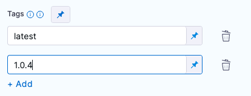
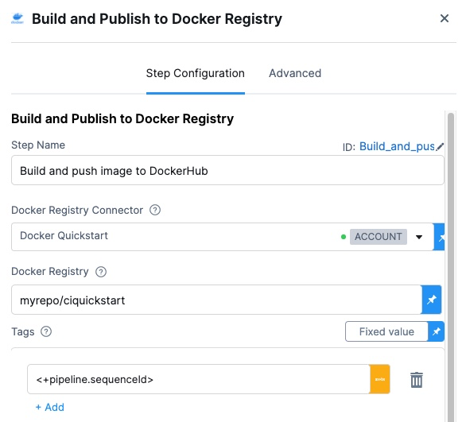
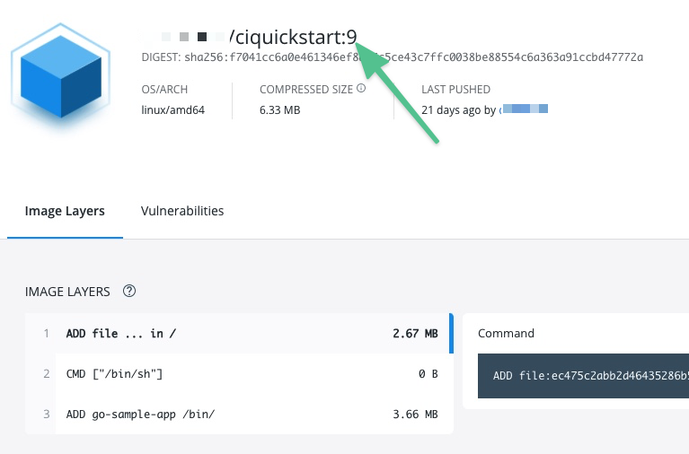
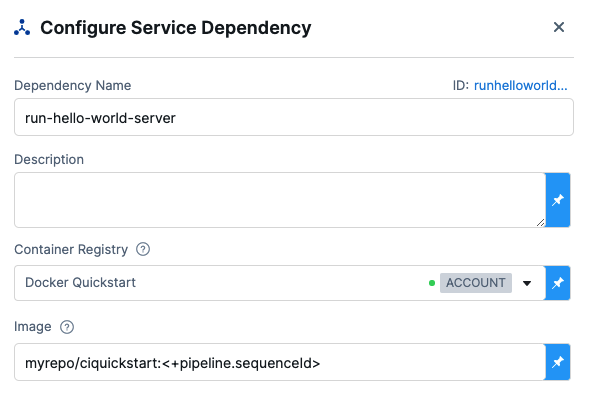
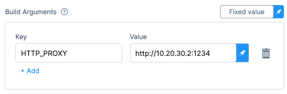

This topic describes settings and techniques for the **Build and Push an image to Docker Registry** step, which creates a Docker image from a [Dockerfile](https://docs.docker.com/engine/reference/builder/) and pushes it to a Docker registry. For more information, go to [Build and push an artifact](/docs/continuous-integration/use-ci/build-and-upload-artifacts/build-and-upload-an-artifact).

:::info Kubernetes cluster build infrastructures

With Kubernetes cluster build infrastructures, **Build and Push** steps use [kaniko](https://github.com/GoogleContainerTools/kaniko/blob/main/README.md). Other build infrastructures use [drone-docker](https://github.com/drone-plugins/drone-docker/blob/master/README.md). Kaniko requires root access to build the Docker image. It doesn't support non-root users.

If your build runs as non-root (`runAsNonRoot: true`), and you want to run the **Build and Push** step as root, you can set **Run as User** to `0` on the **Build and Push** step to use the root user for that individual step only.

If your security policy doesn't allow running as root, go to [Build and push with non-root users](./build-and-push-nonroot.md).

:::

:::tip Azure Container Registry

Because the **Build and Push an image to Docker Registry** step is equivalent to the Docker [build](https://docs.docker.com/engine/reference/commandline/build/) and [push](https://docs.docker.com/engine/reference/commandline/push/) commands, you can use this step or the [Build and Push to ACR step](/docs/continuous-integration/use-ci/build-and-upload-artifacts/build-and-push-to-acr) to push to Azure Container Registry (ACR).

:::

## Settings

Depending on the stage's build infrastructure, some settings may be unavailable or optional. Settings specific to containers, such as **Set Container Resources**, are not applicable when using the step in a stage with VM or Harness Cloud build infrastructure.

### Name

Enter a name summarizing the step's purpose. Harness automatically assigns an **Id** ([Entity Identifier Reference](../../../platform/20_References/entity-identifier-reference.md)) based on the **Name**. You can change the **Id**.

### Docker Connector

The Harness Docker Registry connector where you want to upload the image. For more information, go to [Docker connector settings reference](/docs/platform/Connectors/Cloud-providers/ref-cloud-providers/docker-registry-connector-settings-reference).

This step supports Docker connectors that use username and password authentication.

### Docker Repository

The name of the repository where you want to store the image, for example, `<hub-user>/<repo-name>`.

For private Docker registries, specify a fully qualified repo name.

### Tags

Add [Docker build tags](https://docs.docker.com/engine/reference/commandline/build/#tag). This is equivalent to the `-t` flag.

Add each tag separately.



:::tip

Harness expressions are a useful way to define tags. For example, `<+pipeline.sequenceId>` is a built-in Harness expression. It represents the Build ID number, such as `9`. You can use the same tag in another stage to reference the same build by its tag.

<details>
<summary>Use Harness expressions for tags</summary>

When you push an image to a registry, you tag the image so you can identify it later. For example, in one pipeline stage, you push the image, and, in a later stage, you use the image name and tag to pull it and run integration tests on it.

There are several ways to tag images, but Harness expressions can be useful.



For example, `<+pipeline.sequenceId>` is a built-in Harness expression that represents the **Build Id** number, for example `9`.

After the pipeline runs, you can see the `Build Id` in the output.


The ID also appears as an image tag in your target image repo:



The `Build Id` tags an image that you pushed in an earlier stage of your pipeline. You can use the `Build Id` to pull the same image in later stages of the same pipeline. By using a variable expression, rather than a fixed value, you don't have to use the same image name every time.

For example, you can use the `<+pipeline.sequenceId>` expression as a variable tag to reference images in future pipeline stages by using syntax such as: `harnessdev/ciquickstart:<+pipeline.sequenceId>`.

As a more specific example, if you have a [Background step](../manage-dependencies/background-step-settings.md) in a later stage in your pipeline, you can use the `<+pipeline.sequenceId>` variable to identify the image without needing to call on a fixed value.



</details>

:::

### Optimize

With Kubernetes cluster build infrastructures, select this option to enable `--snapshotMode=redo`. This setting causes file metadata to be considered when creating snapshots, and it can reduce the time it takes to create snapshots. For more information, go to the kaniko documentation for the [snapshotMode flag](https://github.com/GoogleContainerTools/kaniko/blob/main/README.md#flag---snapshotmode).

### Dockerfile

The name of the Dockerfile. If you don't provide a name, Harness assumes that the Dockerfile is in the root folder of the codebase.

### Context

Enter a path to a directory containing files that make up the [build's context](https://docs.docker.com/engine/reference/commandline/build/#description). When the pipeline runs, the build process can refer to any files found in the context. For example, a Dockerfile can use a `COPY` instruction to reference a file in the context.

:::info Kubernetes cluster build infrastructures

Kaniko, which is used by the **Build and Push** step with Kubernetes cluster build infrastructures, requires root access to build the Docker image. If you have not already enabled root access, you will receive the following error:

`failed to create docker config file: open/kaniko/ .docker/config.json: permission denied`

If your security policy doesn't allow running as root, go to [Build and push with non-root users](./build-and-push-nonroot.md).

:::

### Labels

Specify [Docker object labels](https://docs.docker.com/config/labels-custom-metadata/) to add metadata to the Docker image.

### Build Arguments

The [Docker build-time variables](https://docs.docker.com/engine/reference/commandline/build/#build-arg). This is equivalent to the `--build-arg` flag.



### Target

The [Docker target build stage](https://docs.docker.com/engine/reference/commandline/build/#target), equivalent to the `--target` flag, such as `build-env`.

### Remote Cache Image

Enter the name of the remote cache image, such as `<container-registry-repo-name>/<image-name>`.

The remote cache repository must exist in the same host and project as the build image. The repository will be automatically created if it doesn't exist. For caching to work, the entered image name must exist.

Harness enables remote Docker layer caching where each Docker layer is uploaded as an image to a Docker repo you identify. If the same layer is used in subsequent builds, Harness downloads the layer from the Docker repo. You can also specify the same Docker repo for multiple **Build and Push** steps, enabling these steps to share the same remote cache. This can dramatically improve build time by sharing layers across pipelines, stages, and steps.

### Run as User

With Kubernetes cluster build infrastructures, you can specify the user ID to use to run all processes in the pod if running in containers. For more information, go to [Set the security context for a pod](https://kubernetes.io/docs/tasks/configure-pod-container/security-context/#set-the-security-context-for-a-pod).

This step requires root access. You can use the **Run as User** setting if your build runs as non-root (`runAsNonRoot: true`), and you can run the **Build and Push** step as root. To do this, set **Run as User** to `0` to use the root user for this individual step only.

If your security policy doesn't allow running as root, go to [Build and push with non-root users](./build-and-push-nonroot.md).

### Set Container Resources

Set maximum resource limits for the resources used by the container at runtime:

* **Limit Memory:** The maximum memory that the container can use. You can express memory as a plain integer or as a fixed-point number using the suffixes `G` or `M`. You can also use the power-of-two equivalents `Gi` and `Mi`. The default is `500Mi`.
* **Limit CPU:** The maximum number of cores that the container can use. CPU limits are measured in CPU units. Fractional requests are allowed; for example, you can specify one hundred millicpu as `0.1` or `100m`. The default is `400m`. For more information, go to [Resource units in Kubernetes](https://kubernetes.io/docs/concepts/configuration/manage-resources-containers/#resource-units-in-kubernetes).

### Timeout

Set the timeout limit for the step. Once the timeout limit is reached, the step fails and pipeline execution continues. To set skip conditions or failure handling for steps, go to:

* [Step Skip Condition settings](../../../platform/8_Pipelines/w_pipeline-steps-reference/step-skip-condition-settings.md)
* [Step Failure Strategy settings](../../../platform/8_Pipelines/w_pipeline-steps-reference/step-failure-strategy-settings.md)

## Useful techniques

Here are some interesting ways you can use or enhance **Build and Push an Image to Docker Registry** steps.

### Build a Docker image without pushing

You can use your CI pipeline to test a Dockerfile used in your codebase and verify that the resulting image is correct before you push it to your Docker repository.

```mdx-code-block
import Tabs from '@theme/Tabs';
import TabItem from '@theme/TabItem';
```
```mdx-code-block
<Tabs>
  <TabItem value="hosted" label="Harness Cloud build infrastructure" default>
```

1. In your CI pipeline, go to the **Build** stage that includes the **Build and Push an image to Docker Registry** step.
2. In the **Build** stage's **Overview** tab, expand the **Advanced** section.
3. Select **Add Variable** and enter the following:
   * **Name:** `PLUGIN_DRY_RUN`
   * **Type:** **String**
   * **Value:** `true`
4. Save and run the pipeline.

```mdx-code-block
  </TabItem>
  <TabItem value="selfvm" label="Self-hosted VM build infrastructure">
```

1. In your CI pipeline, go to the **Build** stage that includes the **Build and Push an image to Docker Registry** step.
2. In the **Build** stage's **Overview** tab, expand the **Advanced** section.
3. Select **Add Variable** and enter the following:
   * **Name:** `PLUGIN_DRY_RUN`
   * **Type:** **String**
   * **Value:** `true`
4. Save and run the pipeline.

```mdx-code-block
  </TabItem>
  <TabItem value="local" label="Local runner build infrastructure">
```

1. In your CI pipeline, go to the **Build** stage that includes the **Build and Push an image to Docker Registry** step.
2. In the **Build** stage's **Overview** tab, expand the **Advanced** section.
3. Select **Add Variable** and enter the following:
   * **Name:** `PLUGIN_DRY_RUN`
   * **Type:** **String**
   * **Value:** `true`
4. Save and run the pipeline.

```mdx-code-block
  </TabItem>
  <TabItem value="other" label="Kubernetes cluster build infrastructure">
```

With the built-in **Build and Push** steps:

1. In your CI pipeline, go to the **Build** stage that includes the **Build and Push an image to Docker Registry** step.
2. In the **Build** stage's **Overview** tab, expand the **Advanced** section.
3. Select **Add Variable** and enter the following:
   * **Name:** `PLUGIN_NO_PUSH`
   * **Type:** **String**
   * **Value:** `true`
4. Save and run the pipeline.

With the Buildah plugin (which is used to [build and push with non-root users](./build-and-push-nonroot.md)):

1. In your CI pipeline, go to the **Build** stage that includes the **Plugin** step with the Buildah plugin.
2. In the **Build** stage's **Overview** tab, expand the **Advanced** section.
3. Select **Add Variable** and enter the following:
   * **Name:** `PLUGIN_DRY_RUN`
   * **Type:** **String**
   * **Value:** `true`
4. Save and run the pipeline.

```mdx-code-block
  </TabItem>
</Tabs>
```

### Build multi-architecture images

To use a CI pipeline to build multi-architecture images, create a separate stage for building and pushing each architecture.

<details>
<summary>Multi-arch YAML example</summary>

The following YAML example describes a multi-architecture pipeline with two stages. Both stages have similar components but they are slightly different according to the architecture of the image that the stage builds.

Each stage:

* Uses a variation of a Kubernetes cluster build infrastructure.
* Has a **Run** step that prepares the DockerFile.
* Has a **Build and Push** step that builds and uploads the image.

```yaml
pipeline:
  allowStageExecutions: true
  projectIdentifier: my-project
  orgIdentifier: default
  tags:
    CI: ""
  properties:
    ci:
      codebase:
        connectorRef: CI_GitHub
        repoName: Automation.git
        build: <+input>
  stages:
    - stage:
        name: K8 upload
        identifier: k8_upload
        type: CI
        spec:
          cloneCodebase: true
          infrastructure:
            type: KubernetesDirect
            spec:
              connectorRef: K8Linux
              namespace: <+input>
              runAsUser: ""
              automountServiceAccountToken: true
              nodeSelector: {}
              containerSecurityContext:
                runAsUser: ""
              os: Linux
          execution:
            steps:
              - step:
                  type: Run
                  name: CreateDockerFile
                  identifier: CreateDockerFile
                  spec:
                    connectorRef: CI_Docker_Hub
                    image: alpine:latest
                    command: |-
                      touch harnessDockerfileui
                      cat > harnessDockerfileui <<- EOM
                      FROM alpine:latest AS dev-env
                      ARG foo
                      RUN echo "$foo bar"
                      ENTRYPOINT ["pwd"]

                      FROM alpine:latest AS release-env
                      ARG hello
                      RUN echo "$hello world"
                      ENTRYPOINT ["ls"]
                      EOM
                      cat harnessDockerfileui
                    resources:
                      limits:
                        memory: 100M
              - step:
                  type: BuildAndPushDockerRegistry
                  name: DockerPushStep
                  identifier: DockerPushStep
                  spec:
                    connectorRef: my-docker-hub
                    repo: my-repo/ciquickstart
                    tags:
                      - "1.0"
                    dockerfile: harnessDockerfileui
                    target: dev-env
                    resources:
                      limits:
                        memory: 100M
        variables: []
    - stage:
        name: K8s Linux arm
        identifier: CI_Golden_ARM
        type: CI
        spec:
          cloneCodebase: true
          infrastructure:
            type: KubernetesDirect
            spec:
              connectorRef: k8sarm
              namespace: ci-gold-arm-delegate
              automountServiceAccountToken: true
              tolerations:
                - effect: NoSchedule
                  key: kubernetes.io/arch
                  operator: Equal
                  value: arm64
              nodeSelector:
                kubernetes.io/arch: arm64
              os: Linux
          execution:
            steps:
              - step:
                  type: Run
                  name: CreateDockerFile
                  identifier: CreateDockerFile
                  spec:
                    connectorRef: CI_Docker_Hub
                    image: alpine:latest
                    command: |-
                      touch harnessDockerfileui
                      cat > harnessDockerfileui <<- EOM
                      FROM alpine:latest AS dev-env
                      ARG foo
                      RUN echo "$foo bar"
                      ENTRYPOINT ["pwd"]

                      FROM alpine:latest AS release-env
                      ARG hello
                      RUN echo "$hello world"
                      ENTRYPOINT ["ls"]
                      EOM
                      cat harnessDockerfileui
                    resources:
                      limits:
                        memory: 100M
              - step:
                  type: BuildAndPushDockerRegistry
                  name: DockerPushStep
                  identifier: DockerPushStep
                  spec:
                    connectorRef: my-docker-hub
                    repo: my-repo/ciquickstart
                    tags:
                      - "1.0"
                    dockerfile: harnessDockerfileui
                    target: dev-env
                    resources:
                      limits:
                        memory: 100M
        variables: []
  variables: []
  identifier: CI_MultiArch
  name: CI_MultiArch
```

</details>
