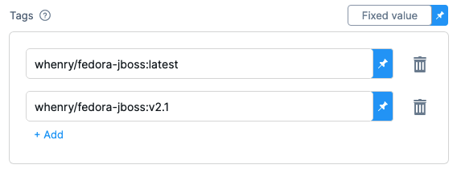
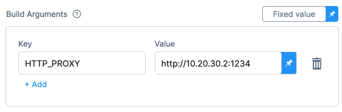

This topic provides settings for the **Build and Push to ECR** step, which builds an image and pushes it to [AWS ECR](https://docs.aws.amazon.com/AmazonECR/latest/userguide/what-is-ecr.html). Depending on the stage's build infrastructure, some settings may be unavailable or optional. Settings specific to containers, such as **Set Container Resources**, are not applicable when using the step in a stage with VM or Harness Cloud build infrastructure.

For more information, go to the following:

* Harness CI tutorial: [Build and push a container image to Amazon ECR](/tutorials/ci-pipelines/publish/amazon-ecr)
* AWS documentation: [Pushing a Docker image](https://docs.aws.amazon.com/AmazonECR/latest/userguide/docker-push-ecr-image.html)
* Harness CI documentation: [Build and push an artifact](/docs/continuous-integration/use-ci/build-and-upload-artifacts/build-and-upload-an-artifact)

:::info Kubernetes cluster build infrastructures

With Kubernetes cluster build infrastructures, **Build and Push** steps use [kaniko](https://github.com/GoogleContainerTools/kaniko/blob/main/README.md). Other build infrastructures use [drone-docker](https://github.com/drone-plugins/drone-docker/blob/master/README.md). Kaniko requires root access to build the Docker image. It doesn't support non-root users.

If your build runs as non-root (`runAsNonRoot: true`), and you want to run the **Build and Push** step as root, you can set **Run as User** to `0` on the **Build and Push** step to use the root user for that individual step only.

If your security policy doesn't allow running as root, go to [Build and push with non-root users](./build-and-push-nonroot.md).

:::

## Name

Enter a name summarizing the step's purpose. Harness automatically assigns an **Id** ([Entity Identifier Reference](../../../platform/20_References/entity-identifier-reference.md)) based on the **Name**. You can change the **Id**.

## AWS Connector

Select the Harness [AWS connector](/docs/platform/Connectors/Cloud-providers/add-aws-connector) to use to connect to ECR.

This step supports all [AWS connector authentication methods](/docs/platform/Connectors/Cloud-providers/ref-cloud-providers/aws-connector-settings-reference#harness-aws-connector-settings) (AWS access key, delegate IAM role assumption, IRSA, and cross-account access), but an additional stage variable might be required to [assume IAM roles or use ARNs](#stage-variable-required-to-assume-iam-role-and-arns).

The AWS IAM roles and policies associated with the AWS account for your Harness AWS connector must allow pushing to ECR. For more information, go to the [AWS connector settings reference](/docs/platform/Connectors/Cloud-providers/ref-cloud-providers/aws-connector-settings-reference).

### Stage variable required to assume IAM role or use ARNs

Stages with **Build and Push to ECR** steps must have a `PLUGIN_USER_ROLE_ARN` stage variable if:

* Your [AWS connector's authentication uses a cross-account role (ARN)](https://developer.harness.io/docs/platform/Connectors/Cloud-providers/ref-cloud-providers/aws-connector-settings-reference#enable-cross-account-access-sts-role). You can use `PLUGIN_USER_ROLE_ARN` to specify the full ARN value corresponding with the AWS connector's ARN.
* Your AWS connector uses [**Assume IAM Role on Delegate** authentication](/docs/platform/Connectors/Cloud-providers/ref-cloud-providers/aws-connector-settings-reference#harness-aws-connector-settings). If your connector doesn't use **AWS Access Key** authentication, then the **Build and Push to ECR** step uses the IAM role of the build pod or build VM (depending on your build infrastructure). You can use `PLUGIN_USER_ROLE_ARN` to select a different role than the default role assumed by the build pod/machine. This is similar to [`sts assume-role`](https://awscli.amazonaws.com/v2/documentation/api/latest/reference/sts/assume-role.html).

To add the `PLUGIN_USER_ROLE_ARN` stage variable:

1. In the Pipeline Studio, select the stage with the **Build and Push to ECR** step, and then select the **Overview** tab.
2. In the **Advanced** section, add a stage variable.
3. Enter `PLUGIN_USER_ROLE_ARN` as the **Variable Name**, set the **Type** to **String**, and then select **Save**.
4. For the **Value**, enter the full ARN value.

   * For cross-account roles, this ARN value must correspond with the AWS connector's ARN.
   * For connectors that use the delegate's IAM role, the ARN value must identify the role you want the build pod/machine to use.

## Region

Define the AWS region to use when pushing the image.

The registry format for ECR is `aws_account_id.dkr.ecr.region.amazonaws.com` and a region is required. For more information, go to the AWS documentation for [Pushing a Docker image](https://docs.aws.amazon.com/AmazonECR/latest/userguide/docker-push-ecr-image.html).

## Account Id

The AWS account ID to use when pushing the image. This is required.

The registry format for ECR is `aws_account_id.dkr.ecr.region.amazonaws.com`. For more information, go to the AWS documentation for [Pushing a Docker image](https://docs.aws.amazon.com/AmazonECR/latest/userguide/docker-push-ecr-image.html).

## Image Name

The name of the image you are pushing. It can be any name.

## Tags

Add [Docker build tags](https://docs.docker.com/engine/reference/commandline/build/#tag). This is equivalent to the `-t` flag.

Add each tag separately.

## Base Image Connector

Select an authenticated connector to download base images from a Docker-compliant registry. If you do not specify a **Base Image Connector**, the step downloads base images without authentication. Specifying a **Base Image Connector** is recommended because unauthenticated downloads generally have a lower rate limit than authenticated downloads.

## Optimize

With Kubernetes cluster build infrastructures, select this option to enable `--snapshotMode=redo`. This setting causes file metadata to be considered when creating snapshots, and it can reduce the time it takes to create snapshots. For more information, go to the kaniko documentation for the [snapshotMode flag](https://github.com/GoogleContainerTools/kaniko/blob/main/README.md#flag---snapshotmode).

## Dockerfile

The name of the Dockerfile. If you don't provide a name, Harness assumes the Dockerfile is in the root folder of the codebase.

## Context

Enter a path to a directory containing files that make up the [build's context](https://docs.docker.com/engine/reference/commandline/build/#description). When the pipeline runs, the build process can refer to any files found in the context. For example, a Dockerfile can use a `COPY` instruction to reference a file in the context.

## Labels

Specify [Docker object labels](https://docs.docker.com/config/labels-custom-metadata/) to add metadata to the Docker image.

## Build Arguments

The [Docker build-time variables](https://docs.docker.com/engine/reference/commandline/build/#build-arg). This is equivalent to the `--build-arg` flag.

## Target

The [Docker target build stage](https://docs.docker.com/engine/reference/commandline/build/#target), equivalent to the `--target` flag, such as `build-env`.

## Remote Cache Image

Enter the name of the remote cache image, for example, `app/myImage`.

The remote cache repository must be in the same account and organization as the build image. For caching to work, the specified image name must exist.

Harness enables remote Docker layer caching where each Docker layer is uploaded as an image to a Docker repo you identify. If the same layer is used in subsequent builds, Harness downloads the layer from the Docker repo. You can also specify the same Docker repo for multiple **Build and Push** steps, enabling these steps to share the same remote cache. This can dramatically improve build times by sharing layers across pipelines, stages, and steps.

## Run as User

With Kubernetes cluster build infrastructures, you can specify the user ID to use to run all processes in the pod if running in containers. For more information, go to [Set the security context for a pod](https://kubernetes.io/docs/tasks/configure-pod-container/security-context/#set-the-security-context-for-a-pod).

This step requires root access. You can use the **Run as User** setting if your build runs as non-root (`runAsNonRoot: true`), and you can run the **Build and Push** step as root. To do this, set **Run as User** to `0` to use the root user for this individual step only.

If your security policy doesn't allow running as root, go to [Build and push with non-root users](./build-and-push-nonroot.md).

## Set Container Resources

Set maximum resource limits for the resources used by the container at runtime:

* **Limit Memory:** The maximum memory that the container can use. You can express memory as a plain integer or as a fixed-point number using the suffixes `G` or `M`. You can also use the power-of-two equivalents `Gi` and `Mi`. The default is `500Mi`.
* **Limit CPU:** The maximum number of cores that the container can use. CPU limits are measured in CPU units. Fractional requests are allowed; for example, you can specify one hundred millicpu as `0.1` or `100m`. The default is `400m`. For more information, go to [Resource units in Kubernetes](https://kubernetes.io/docs/concepts/configuration/manage-resources-containers/#resource-units-in-kubernetes).

## Timeout

Set the timeout limit for the step. Once the timeout limit is reached, the step fails and pipeline execution continues. To set skip conditions or failure handling for steps, go to:

* [Step Skip Condition settings](../../../platform/8_Pipelines/w_pipeline-steps-reference/step-skip-condition-settings.md)
* [Step Failure Strategy settings](../../../platform/8_Pipelines/w_pipeline-steps-reference/step-failure-strategy-settings.md)
