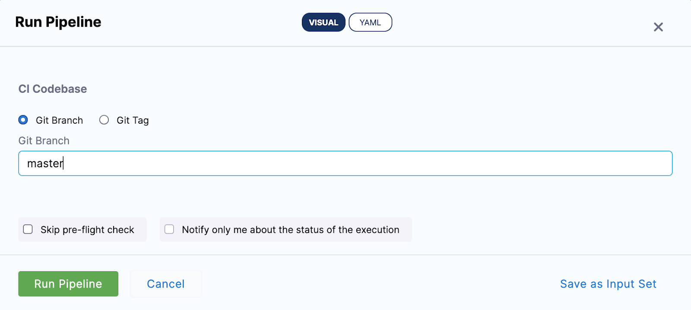
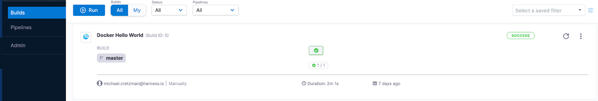

This topic provides settings to Build and Push an image to [Google Container Registry](https://cloud.google.com/container-registry) (GCR).

The following steps build an image and push it to GCR.

### Before You Begin

* [CI Pipeline Quickstart](../../ci-quickstarts/ci-pipeline-quickstart.md)
* [Delegates Overview](https://ngdocs.harness.io/article/2k7lnc7lvl-delegates-overview)
* [CI Stage Settings](../../ci-technical-reference/ci-stage-settings.md)
* [Learn Harness' Key Concepts](../../../getting-started/learn-harness-key-concepts.md)

### Step 1: Create the CI Stage

In your Harness Pipeline, click **Add Stage**, and then click CI.

### Step 2: Define the Build Farm Infrastructure

In the CI stage Infrastructure, define the build infrastructure for the Codebase.

The following steps use a Kubernetes cluster build farm.

See [Define Kubernetes Cluster Build Infrastructure](../set-up-build-infrastructure/set-up-a-kubernetes-cluster-build-infrastructure.md).

### Step 3: Add the Build and Push Step

In the stage's Execution, select **Build and Push to GCR**.

#### Step Parameters

##### Name

The unique name for this Step.

##### ID

See [Entity Identifier Reference](https://ngdocs.harness.io/article/li0my8tcz3-entity-identifier-reference).

##### GCP Connector

The Harness GCP Connector to use to connect to GCR. GCP account associated with the GCP Connector needs specific roles.

See [Google Cloud Platform (GCP) Connector Settings Reference](https://ngdocs.harness.io/article/yykfduond6-gcs-connector-settings-reference).

##### Host

The GCR registry hostname. For example, us.gcr.io hosts images in data centers in the United States in a separate storage bucket from images hosted by gcr.io.

##### Project ID

The GCP [Resource Manager project ID](https://cloud.google.com/resource-manager/docs/creating-managing-projects#identifying_projects).

##### Image Name

The name of the image you want to build.

##### Tags

The [Docker build tag](https://docs.docker.com/engine/reference/commandline/build/#tag-an-image--t) \(--target\).

Each tag should be added separately.

##### Option: Add a Tag using Harness Expression

You can tag the image in any way, but a Harness expression can be very useful.

The `<+pipeline.sequenceId>` is a built-in Harness variable. It represents the Build ID number, such as Build ID: 9. You can then use the same tag in another stage to reference the same build with its tag.

##### Dockerfile

Enter the path of the Dockerfile. If you don't provide a name, Harness assumes the Dockerfile is in the root folder of the codebase.

##### Context

Enter a path to a directory containing a Dockerfile.

##### Labels

[Docker object labels](https://docs.docker.com/config/labels-custom-metadata/) to add metadata to the Docker image.

##### Build Arguments

The [Docker build-time variables](https://docs.docker.com/engine/reference/commandline/build/#set-build-time-variables---build-arg) (--build-arg).

##### Target

The [Docker target build stage](https://docs.docker.com/engine/reference/commandline/build/#specifying-target-build-stage---target) (--target).

For example, build-env.

##### Remote Cache Image

The remote cache repository and build image need to be created on the same host and project. The Build creates the repository automatically if it doesn’t exist.

##### Set container resources

Maximum resources limit values for the resources used by the container at runtime.

##### Limit Memory

Maximum memory that the container can use.

You can express memory as a plain integer or as a fixed-point number using suffixes G or M. You can also use the power-of-two equivalents Gi or Mi.

##### Limit CPU

See [Resource units in Kubernetes](https://kubernetes.io/docs/concepts/configuration/manage-resources-containers/#resource-units-in-kubernetes).

Limit the number of cores that the container can use.

Limits for CPU resources are measured in CPU units.

Fractional requests are allowed. The expression 0.1 is equivalent to the expression 100m, which can be read as one hundred millicpu.

##### Timeout

Timeout for the step. Once the timeout is reached, the step fails, and the Pipeline execution continues.

#### Advanced Options

##### Conditional Execution

Set conditions to determine when the step should be executed. See [Conditional Execution](https://ngdocs.harness.io/article/i36ibenkq2-step-skip-condition-settings).

##### Failure Strategy

Define one or more failure strategies to control the behavior of your pipeline when your step execution encounters an error. See [Failure Strategy](https://ngdocs.harness.io/article/htrur23poj-step-failure-strategy-settings). 

### Step 4: Specify Codebase Branch or Tag at Pipeline Execution

Select the Codebase Git Branch or Git Tag to use for the execution.

Enter the branch or tag and click **Run Pipeline**.

###  Step 5: View the Results

You can see the logs for the Build and Push step in the Pipeline as it runs.

In your Harness project's Builds, you can see the build listed.

On GCR, you can see the image that you pushed.

### See Also

* [Run Step Settings](../../ci-technical-reference/run-step-settings.md)

