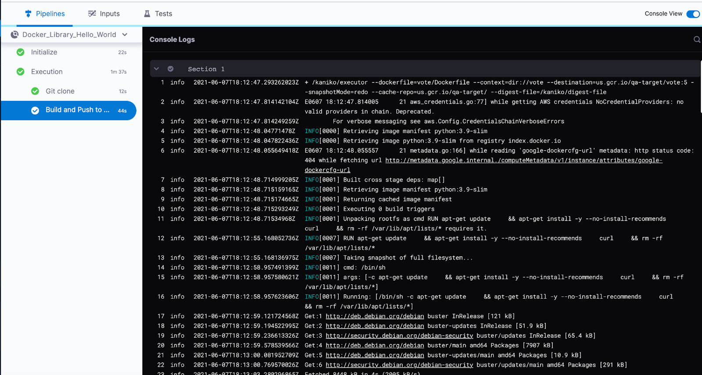
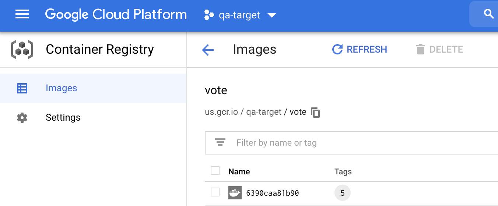

This topic explains how to configure the **Build and Push to GCR** step in a Harness CI pipeline. This step is used to build and push to [Google Container Registry (GCR)](https://cloud.google.com/container-registry).

:::info Kubernetes cluster build infrastructures

With Kubernetes cluster build infrastructures, **Build and Push** steps use [kaniko](https://github.com/GoogleContainerTools/kaniko/blob/main/README.md). Other build infrastructures use [drone-docker](https://github.com/drone-plugins/drone-docker/blob/master/README.md). Kaniko requires root access to build the Docker image. It doesn't support non-root users.

If your build runs as non-root (`runAsNonRoot: true`), and you want to run the **Build and Push** step as root, you can set **Run as User** to `0` on the **Build and Push** step to use the root user for that individual step only.

If your security policy doesn't allow running as root, go to [Build and push with non-root users](./build-and-push-nonroot.md).

:::

## Add the Build and Push to GCR step

Add the **Build and Push to GCR** step to the [Build stage](../set-up-build-infrastructure/ci-stage-settings.md) in a [CI pipeline](../prep-ci-pipeline-components.md) If you haven't created a pipeline before, try one of the [CI tutorials](../../ci-quickstarts/ci-pipeline-quickstart.md).

The **Build and Push to GCR** step settings are described below. Depending on the stage's build infrastructure, some settings may be unavailable or located under **Optional Configuration** in the visual pipeline editor. Settings specific to containers, such as **Set Container Resources**, are not applicable when using the step in a stage with VM or Harness Cloud build infrastructure.

### Name

Enter a name summarizing the step's purpose. Harness automatically assigns an **Id** ([Entity Identifier Reference](../../../platform/20_References/entity-identifier-reference.md)) based on the **Name**. You can change the **Id**.

### GCP Connector

The Harness GCP connector to use to connect to GCR. The GCP account associated with the GCP connector needs specific roles. For more information, go to [Google Cloud Platform (GCP) connector settings reference](/docs/platform/Connectors/Cloud-providers/ref-cloud-providers/gcs-connector-settings-reference).

This step supports GCP connectors that use access key authentication. It does not support GCP connectors that inherit delegate credentials.

### Host

The Google Container Registry hostname. For example, `us.gcr.io` hosts images in data centers in the United States in a separate storage bucket from images hosted by `gcr.io`. For a list of Container Registries, go to the Google documentation on [Pushing and pulling images](https://cloud.google.com/container-registry/docs/pushing-and-pulling).

:::info

The target GCR registry must meet the GCR requirements for pushing images. For more information, go to the Google documentation on [Pushing and pulling images](https://cloud.google.com/container-registry/docs/pushing-and-pulling).

:::

### Project ID

The [GCP resource manager project ID](https://cloud.google.com/resource-manager/docs/creating-managing-projects#identifying_projects).

### Image Name

The name of the image you want to build and push to the target container registry.

### Tags

Add [Docker build tags](https://docs.docker.com/engine/reference/commandline/build/#tag). This is equivalent to the `-t` flag.

Add each tag separately.

:::tip

Harness expressions are a useful way to define tags. For example, `<+pipeline.sequenceId>` is a built-in Harness expression. It represents the Build ID number, such as `9`. You can use the same tag in another stage to reference the same build by its tag.

:::

### Optimize

With Kubernetes cluster build infrastructures, select this option to enable `--snapshotMode=redo`. This setting causes file metadata to be considered when creating snapshots, and it can reduce the time it takes to create snapshots. For more information, go to the kaniko documentation for the [snapshotMode flag](https://github.com/GoogleContainerTools/kaniko/blob/main/README.md#flag---snapshotmode).

### Dockerfile

The name of the Dockerfile. If you don't provide a name, Harness assumes that the Dockerfile is in the root folder of the codebase.

### Context

Enter a path to a directory containing files that make up the [build's context](https://docs.docker.com/engine/reference/commandline/build/#description). When the pipeline runs, the build process can refer to any files found in the context. For example, a Dockerfile can use a `COPY` instruction to reference a file in the context.

### Labels

Specify [Docker object labels](https://docs.docker.com/config/labels-custom-metadata/) to add metadata to the Docker image.

### Build Arguments

The [Docker build-time variables](https://docs.docker.com/engine/reference/commandline/build/#build-arg). This is equivalent to the `--build-arg` flag.

### Target

The [Docker target build stage](https://docs.docker.com/engine/reference/commandline/build/#target), equivalent to the `--target` flag, such as `build-env`.

### Remote Cache Image

Enter the name of the remote cache image, such as `gcr.io/project-id/<image>`.

The remote cache repository must be in the same account and organization as the build image. For caching to work, the specified image name must exist.

Harness enables remote Docker layer caching where each Docker layer is uploaded as an image to a Docker repo you identify. If the same layer is used in later builds, Harness downloads the layer from the Docker repo. You can also specify the same Docker repo for multiple **Build and Push** steps, enabling these steps to share the same remote cache. This can dramatically improve build time by sharing layers across pipelines, stages, and steps.

### Run as User

With Kubernetes cluster build infrastructures, you can specify the user ID to use to run all processes in the pod if running in containers. For more information, go to [Set the security context for a pod](https://kubernetes.io/docs/tasks/configure-pod-container/security-context/#set-the-security-context-for-a-pod).

This step requires root access. You can use the **Run as User** setting if your build runs as non-root (`runAsNonRoot: true`), and you can run the **Build and Push** step as root. To do this, set **Run as User** to `0` to use the root user for this individual step only.

If your security policy doesn't allow running as root, go to [Build and push with non-root users](./build-and-push-nonroot.md).

### Set container resources

Set maximum resource limits for the resources used by the container at runtime:

* **Limit Memory:** The maximum memory that the container can use. You can express memory as a plain integer or as a fixed-point number using the suffixes `G` or `M`. You can also use the power-of-two equivalents `Gi` and `Mi`. The default is `500Mi`.
* **Limit CPU:** The maximum number of cores that the container can use. CPU limits are measured in CPU units. Fractional requests are allowed; for example, you can specify one hundred millicpu as `0.1` or `100m`. The default is `400m`. For more information, go to [Resource units in Kubernetes](https://kubernetes.io/docs/concepts/configuration/manage-resources-containers/#resource-units-in-kubernetes).

### Timeout

Set the timeout limit for the step. Once the timeout limit is reached, the step fails and pipeline execution continues. To set skip conditions or failure handling for steps, go to:

* [Step Skip Condition settings](../../../platform/8_Pipelines/w_pipeline-steps-reference/step-skip-condition-settings.md)
* [Step Failure Strategy settings](../../../platform/8_Pipelines/w_pipeline-steps-reference/step-failure-strategy-settings.md)

### Advanced settings

You can find the following settings on the **Advanced** tab in the step settings pane:

* [Conditional Execution](../../../platform/8_Pipelines/w_pipeline-steps-reference/step-skip-condition-settings.md): Set conditions to determine when/if the step should run.
* [Failure Strategy](../../../platform/8_Pipelines/w_pipeline-steps-reference/step-failure-strategy-settings.md): Control what happens to your pipeline when a step fails.

## Run the pipeline

After saving the pipeline, select **Run** to run the pipeline.

On the [build details page](../viewing-builds.md), you can see the logs for each step as they run.

If the build succeeds, you can find your pushed image on GCR.

## See also

* [Useful techniques for Build and Push steps](/docs/continuous-integration/use-ci/build-and-upload-artifacts/build-and-upload-an-artifact#useful-techniques) (Build without pushing, build multi-architecture images, use Harness expressions for tags)
* [Use Run steps](../run-ci-scripts/run-step-settings.md)
* [Build and test on a Kubernetes cluster build infrastructure](/tutorials/ci-pipelines/kubernetes-build-farm)
* [Delegate overview](/docs/platform/2_Delegates/delegate-concepts/delegate-overview.md)
* [CI Build stage settings](../set-up-build-infrastructure/ci-stage-settings.md)
* [Harness key concepts](../../../getting-started/learn-harness-key-concepts.md)
