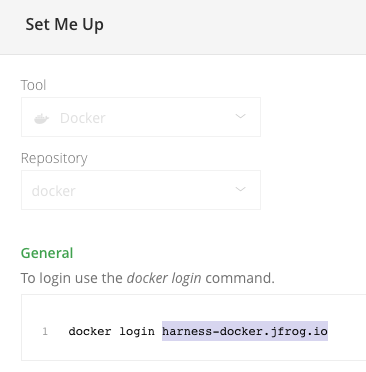

import Flags from '/docs/continuous-integration/shared/build-and-push-runtime-flags.md';

This topic explains how to use the [Build and Push an image to Docker Registry step](./build-and-push-to-docker-registry.md) to build and push an image to [JFrog Artifactory](https://www.jfrog.com/confluence/display/JFROG/JFrog+Artifactory) Docker registries.

For JFrog non-Docker registries, you can use a script in a [Run step](/docs/continuous-integration/use-ci/run-step-settings.md) to build the artifact, and then use the [Upload Artifacts to JFrog step](../upload-artifacts/upload-artifacts-to-jfrog.md) to upload the artifact.

You need:

* Access to a JFrog Artifactory instance with a Docker registry.
* A [CI pipeline](../../prep-ci-pipeline-components.md) with a [Build stage](../../set-up-build-infrastructure/ci-stage-settings.md).
* A Harness [Docker connector](#docker-connector) configured to your JFrog instance.


:::note

With Kubernetes cluster build infrastructures, **Build and Push** steps use [kaniko](https://github.com/GoogleContainerTools/kaniko/blob/main/README.md) by default. Kaniko requires root access to build the Docker image. It doesn't support non-root users.

If your build runs as non-root (`runAsNonRoot: true`), and you want to run the **Build and Push** step as root, you can set **Run as User** to `0` on the **Build and Push** step to use the root user for that individual step only.

If your security policy doesn't allow running as root, go to [Build and push with non-root users](../build-and-push-nonroot.md).

:::


## Build and push to JFrog Docker registries

In your pipeline's **Build** stage, add a **Build and Push an image to Docker Registry** step and configure the [settings](#build-and-push-to-docker-step-settings-for-jfrog-docker-registries) for JFrog.

Here is a YAML example of a **Build and Push an image to Docker Registry** step configured for JFrog:

```yaml
              - step:
                  type: BuildAndPushDockerRegistry
                  name: Build and push to JFrog Docker
                  identifier: Build_and_push_to_JFrog_Docker
                  spec:
                    connectorRef: YOUR_DOCKER_CONNECTOR_ID
                    repo: domain.jfrog.io/REPO/IMAGE
                    tags:
                      - <+pipeline.sequenceId>
```

When you run a pipeline, you can observe the step logs on the [build details page](../../viewing-builds.md). If the **Build and Push** step succeeds, you can find the uploaded image in JFrog.

:::tip

You can also:

* [Build images without pushing](../build-without-push.md)
* [Build multi-architecture images](../build-multi-arch.md)

:::

### Step settings

These sections explain how to configure the **Build and Push an image to Docker Registry** step settings for JFrog. Depending on the build infrastructure, some settings might be unavailable or optional. Settings specific to containers, such as **Set Container Resources**, are not applicable when using a VM or Harness Cloud build infrastructure.

#### Name

Enter a name summarizing the step's purpose. Harness automatically assigns an **Id** ([Entity Identifier](/docs/platform/references/entity-identifier-reference.md)) based on the **Name**. You can change the **Id** until the step is saved. Once save, the **Id** can't be changed.

#### Docker Connector

Specify a [Harness Docker Registry connector](/docs/platform/connectors/cloud-providers/ref-cloud-providers/docker-registry-connector-settings-reference) configured for JFrog.

To create this connector:

1. Go to **Connectors** in your Harness project, organization, or account resources, and select **New Connector**.
2. Select **Docker Registry** under **Artifact Repositories**.
3. Enter a **Name** for the connector. The **Description** and **Tags** are optional.
4. For **Provider Type**, Select **Other**.
5. In **Docker Registry URL**, enter your JFrog URL, such as `https://mycompany.jfrog.io`.
6. In the **Authentication** settings, you must use **Username and Password** authentication.
   * **Username:** Enter your JFrog username.
   * **Password:** Select or create a [Harness text secret](/docs/platform/secrets/add-use-text-secrets) containing the password corresponding with the **Username**.
7. Complete any other settings and save the connector. For information all Docker Registry connector settings, go to the [Docker connector settings reference](/docs/platform/connectors/cloud-providers/ref-cloud-providers/docker-registry-connector-settings-reference).

:::tip JFrog URLs

The JFrog URL format depends on your Artifactory configuration, and whether your Artifactory instance is local, virtual, remote, or behind a proxy. To get your JFrog URL, you can select your repo in your JFrog instance, select **Set Me Up**, and get the repository URL from the server name in the `docker-login` command.



For more information, go to the JFrog documentation on [Repository Management](https://www.jfrog.com/confluence/display/JFROG/Repository+Management) and [Configuring Docker Repositories](https://www.jfrog.com/confluence/display/RTF/Docker+Registry#DockerRegistry-ConfiguringDockerRepositories).

:::

#### Docker Repository

The repo where you want to store the image and the image name, for example, `mycompany.jfrog.io/REPO_NAME/IMAGE_NAME`.

#### Tags

Add [Docker build tags](https://docs.docker.com/engine/reference/commandline/build/#tag). This is equivalent to the `-t` flag.

Add each tag separately.


:::tip

When you push an image to a repo, you tag the image so you can identify it later. For example, in one pipeline stage, you push the image, and, in a later stage, you use the image name and tag to pull it and run integration tests on it.

Harness expressions are a useful way to define tags. For example, you can use the expression `<+pipeline.sequenceId>` as a tag. This expression represents the incremental build identifier, such as `9`. By using a variable expression, rather than a fixed value, you don't have to use the same image name every time.

For example, if you use `<+pipeline.sequenceId>` as a tag, after the pipeline runs, you can see the `Build Id` in the output.


And you can see where the `Build Id` is used to tag your image in the container registry:


You can use the same expression to pull the tagged image, such as `namespace/myimage:<+pipeline.sequenceId>`.

:::

#### Optimize

With Kubernetes cluster build infrastructures, select this option to enable `--snapshotMode=redo`. This setting causes file metadata to be considered when creating snapshots, and it can reduce the time it takes to create snapshots. For more information, go to the kaniko documentation for the [snapshotMode flag](https://github.com/GoogleContainerTools/kaniko/blob/main/README.md#flag---snapshotmode).

For information about setting other kaniko runtime flags, go to [Environment variables](#environment-variables-plugin-runtime-flags).

#### Dockerfile

The name of the Dockerfile. If you don't provide a name, Harness assumes that the Dockerfile is in the root folder of the codebase.

#### Context

Enter a path to a directory containing files that make up the [build's context](https://docs.docker.com/engine/reference/commandline/build/#description). When the pipeline runs, the build process can refer to any files found in the context. For example, a Dockerfile can use a `COPY` instruction to reference a file in the context.

:::info Kubernetes cluster build infrastructures

Kaniko, which is used by the **Build and Push** step with Kubernetes cluster build infrastructures, requires root access to build the Docker image. If you have not already enabled root access, you will receive the following error:

`failed to create docker config file: open/kaniko/ .docker/config.json: permission denied`

If your security policy doesn't allow running as root, go to [Build and push with non-root users](../build-and-push-nonroot.md).

:::

#### Labels

Specify [Docker object labels](https://docs.docker.com/config/labels-custom-metadata/) to add metadata to the Docker image.

#### Build Arguments

The [Docker build-time variables](https://docs.docker.com/engine/reference/commandline/build/#build-arg). This is equivalent to the `--build-arg` flag.


#### Target

The [Docker target build stage](https://docs.docker.com/engine/reference/commandline/build/#target), equivalent to the `--target` flag, such as `build-env`.

### Docker layer caching and Remote cache image
There are two ways in which you can leverage Docker Layer Caching: 
 **Enable Docker layer caching** (_'caching'_ property) or **Remote cache image** (_'remoteCacheRepo'_ property). Refer to [Enable Docker layer caching for your build](/docs/continuous-integration/use-ci/caching-ci-data/docker-layer-caching.md) to learn more.

#### Environment Variables (plugin runtime flags)

<Flags />

#### Run as User

With Kubernetes cluster build infrastructures, you can specify the user ID to use to run all processes in the pod if running in containers. For more information, go to [Set the security context for a pod](https://kubernetes.io/docs/tasks/configure-pod-container/security-context/#set-the-security-context-for-a-pod).

This step requires root access. You can use the **Run as User** setting if your build runs as non-root (`runAsNonRoot: true`), and you can run the **Build and Push** step as root. To do this, set **Run as User** to `0` to use the root user for this individual step only.

If your security policy doesn't allow running as root, go to [Build and push with non-root users](../build-and-push-nonroot.md).

#### Set Container Resources

Set maximum resource limits for the resources used by the container at runtime:

* **Limit Memory:** The maximum memory that the container can use. You can express memory as a plain integer or as a fixed-point number using the suffixes `G` or `M`. You can also use the power-of-two equivalents `Gi` and `Mi`. The default is `500Mi`.
* **Limit CPU:** The maximum number of cores that the container can use. CPU limits are measured in CPU units. Fractional requests are allowed; for example, you can specify one hundred millicpu as `0.1` or `100m`. The default is `400m`. For more information, go to [Resource units in Kubernetes](https://kubernetes.io/docs/concepts/configuration/manage-resources-containers/#resource-units-in-kubernetes).

#### Timeout

Set the timeout limit for the step. Once the timeout limit is reached, the step fails and pipeline execution continues. To set skip conditions or failure handling for steps, go to:

* [Step Skip Condition settings](/docs/platform/pipelines/step-skip-condition-settings)
* [Step Failure Strategy settings](/docs/platform/pipelines/failure-handling/define-a-failure-strategy-on-stages-and-steps)

### Conditions, looping, and failure strategies

You can find the following settings on the **Advanced** tab in the step settings pane:

* [Conditional Execution](/docs/platform/pipelines/step-skip-condition-settings): Set conditions to determine when/if the step should run.
* [Failure Strategy](/docs/platform/pipelines/failure-handling/define-a-failure-strategy-on-stages-and-steps): Control what happens to your pipeline when a step fails.
* [Use looping strategies](/docs/platform/pipelines/looping-strategies/looping-strategies-matrix-repeat-and-parallelism): Define a matrix, repeat, or parallelism strategy for an individual step.


## Publish Build metadata to a Docker image in JFrog Docker Registry

Use the Harness plugin to publish build metadata to a Docker image in the JFrog Docker Registry. It's useful for tracking and managing Docker builds in Artifactory, ensuring that all relevant build information is stored alongside your images.

For example:

```yaml
    - step:
        identifier: metadata
        name: Artifactory - Publish build info to JFrog Docker Registry
        type: Plugin
        spec:
          connectorRef: account.ArtifactoryDocker
          image: plugins/artifactory-publish-docker-buildinfo
          settings:
            access_token: <+secrets.getValue("org.artifactory_token")>
            url: https://artifactory.customer.com/artifactory/
            build_name: <+pipeline.name>
            build_number: <+pipeline.executionId>
            build_url: <+pipeline.executionUrl>
            docker_image: artifactory.customer.com/DOCKER_REPO/IMAGE_NAME:TAG_NAME
```


### Plugin specification 
* **connectorRef**: Harness Connector for the container registry where the plugin image is located.
* **image:** The Docker image containing the plugin to publish build info. For this example, it's `plugins/artifactory-publish-docker-buildinfo`.

Settings: 
* **access_token**: The access token for authenticating with Artifactory. In the example above it's retrieved from Harness secrets manager.
* **url**: The URL of the Artifactory instance where the build info will be published.
* **build_name**: The name of the build, typically set to the pipeline name.
* **build_number**: The build number, typically set to the pipeline execution ID.
* **build_url**: The URL to the pipeline execution in Harness, allowing quick access to the build details.
* **docker_image**: The Docker image for which to attach the build metadata, including its tag.


[Plugin on Dockerhub](https://hub.docker.com/r/plugins/artifactory-publish-docker-buildinfo/tags)


## Troubleshoot Build and Push steps

Go to the [CI Knowledge Base](/kb/continuous-integration/continuous-integration-faqs) for questions and issues related to building and pushing images, such as:

* [What drives the Build and Push steps? What is kaniko?](/kb/continuous-integration/continuous-integration-faqs/#what-drives-the-build-and-push-steps-what-is-kaniko)
* [Does a kaniko build use images cached locally on the node? Can I enable caching for kaniko?](/kb/continuous-integration/continuous-integration-faqs/#does-a-kaniko-build-use-images-cached-locally-on-the-node-can-i-enable-caching-for-kaniko)
* [Can I run Build and Push steps as root if my build infrastructure runs as non-root? What if my security policy doesn't allow running as root?](/kb/continuous-integration/continuous-integration-faqs/#can-i-run-build-and-push-steps-as-root-if-my-build-infrastructure-runs-as-non-root)
* [Can I set kaniko and drone-docker runtime flags, such as skip-tls-verify or custom-dns?](/kb/continuous-integration/continuous-integration-faqs/#can-i-set-kaniko-and-drone-docker-runtime-flags-such-as-skip-tls-verify-or-custom-dns)
* [Can I push without building?](/kb/continuous-integration/continuous-integration-faqs/#can-i-push-without-building)
* [Can I build without pushing?](/kb/continuous-integration/continuous-integration-faqs/#can-i-build-without-pushing)
* [Is remote caching supported in Build and Push steps?](/kb/continuous-integration/continuous-integration-faqs/#is-remote-caching-supported-in-build-and-push-steps)
* [Why doesn't the Build and Push step include the content of VOLUMES from my Dockerfile in the final image?](/kb/continuous-integration/continuous-integration-faqs/#why-doesnt-the-build-and-push-step-include-the-content-of-volumes-from-my-dockerfile-in-the-final-image)
* [Can I use a specific version of kaniko or drone-docker?](/kb/continuous-integration/continuous-integration-faqs/#is-there-a-way-to-use-a-newer-or-older-version-of-kaniko)
* [How do I fix this kaniko container runtime error: kaniko should only be run inside of a container?](/kb/continuous-integration/articles/kaniko_container_runtime_error)
* [Can I push and pull from two different docker registries that have same prefix for registry URL ?](/kb/continuous-integration/continuous-integration-faqs/#can-i-push-and-pull-from-two-different-docker-registries-that-have-same-prefix-for-registry-url-)
* [Why does the parallel execution of build and push steps fail when using Buildx on Kubernetes?](/kb/continuous-integration/continuous-integration-faqs#why-does-the-parallel-execution-of-build-and-push-steps-fail-when-using-buildx-on-kubernetes)