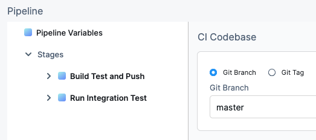
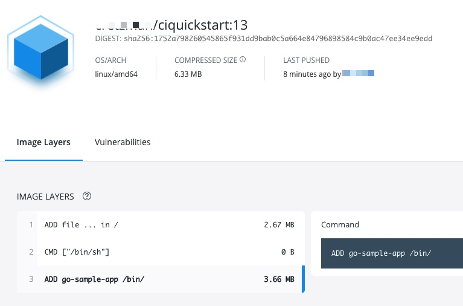

Add a **Build and Push** step to your CI pipeline to build your codebase and then push the artifact, such as a Docker image, to a repo. The following repos are supported:

* [Docker Hub](./build-and-push-to-docker-hub-step-settings.md)
* [Azure Container Registry (ACR)](./build-and-push-to-acr.md)
* [Google Container Registry (GCR)](./build-and-push-to-gcr.md)
* [Amazon Elastic Container Registry (ECR)](./build-and-push-to-ecr-step-settings.md)
* [Google Artifact Registry (GAR)](/tutorials/ci-pipelines/publish/google-gar#configure-pipeline-steps)

Harness CI also supports uploading any build artifacts to cloud storage:

* [Upload Artifacts to JFrog](./upload-artifacts-to-jfrog.md)
* [Upload Artifacts to GCS](./upload-artifacts-to-gcs-step-settings.md)
* [Upload Artifacts to S3](./upload-artifacts-to-s-3-step-settings.md)
* [Upload Artifacts to Sonatype Nexus](./upload-artifacts-to-sonatype-nexus.md)

<details>
<summary>Video summary</summary>

The following video provides a visual summary of the process described in this topic.

<!-- Video:
https://harness-1.wistia.com/medias/rpv5vwzpxz-->
<docvideo src="https://www.youtube.com/embed/v3A4kF1Upqo?feature=oembed" />

<!-- div class="hd--embed" data-provider="YouTube" data-thumbnail="https://i.ytimg.com/vi/v3A4kF1Upqo/hqdefault.jpg"><iframe width="200" height="150" src="https://www.youtube.com/embed/v3A4kF1Upqo?feature=oembed" frameborder="0" allow="accelerometer; autoplay; clipboard-write; encrypted-media; gyroscope; picture-in-picture" allowfullscreen=""></iframe></div -->

</details>

## Add the Build and Push step

These steps describe how to create a simple one-step Build stage that does not include testing. It builds the code in a build farm, and then pushes it to a Docker repo.

:::info Kubernetes cluster build infrastructures

With Kubernetes cluster build infrastructures, **Build and Push** steps use [kaniko](https://github.com/GoogleContainerTools/kaniko/blob/main/README.md). Other build infrastructures use [drone-docker](https://github.com/drone-plugins/drone-docker/blob/master/README.md). Kaniko requires root access to build the Docker image. It doesn't support non-root users.

If your build runs as non-root (`runAsNonRoot: true`), and you want to run the **Build and Push** step as root, you can set **Run as User** to `0` on the **Build and Push** step to use the root user for that individual step only.

If your security policy doesn't allow running as root, go to [Build and push with non-root users](./build-and-push-nonroot.md).

:::

1. Go to **Pipelines** and create a pipeline or edit an existing pipeline. If you're not familiar with creating pipelines, go to the [CI pipeline creation overview](../prep-ci-pipeline-components.md).
2. Configure the pipeline's codebase, if you have not already done so. For details, go to [Create and configure a codebase](../codebase-configuration/create-and-configure-a-codebase.md).

   :::tip

   The codebase configuration specifies the repo to use for this pipeline. When you run the pipeline, you specify the specific branch or commit to use for that build.

   :::

3. If your pipeline doesn't already have a **Build** stage, select **Add Stage**, and then select **Build**.
4. On the **Build** stage's **Infrastructure** tab, configure the build infrastructure. For example, you can [set up a Kubernetes cluster build infrastructure](../set-up-build-infrastructure/k8s-build-infrastructure/set-up-a-kubernetes-cluster-build-infrastructure.md). For details about all infrastructure settings, go to [CI Build stage settings](../set-up-build-infrastructure/ci-stage-settings.md).
5. In the **Build** stage's **Execution** tab, select **Add Step**, and then select a **Build and Push** step from the Step Library.

   For all **Build and Push** steps, you select or create a connector for the target repo, add repo-specific information, and specify Dockerfile information. For information about each **Build and Push** step's settings, go to the topic that corresponds with your registry provider:

   * Docker: [Build and Push an image to Docker Registry step settings](./build-and-push-to-docker-hub-step-settings.md)
   * Azure Container Registry (ACR): [Build and Push to ACR step settings](./build-and-push-to-acr.md) or [Build and Push an image to Docker Registry step settings](./build-and-push-to-docker-hub-step-settings.md)
   * Google Container Registry (GCR): [Build and Push to GCR step settings](./build-and-push-to-gcr.md)
   * Amazon Elastic Container Registry (ECR): [Build and Push to ECR step settings](./build-and-push-to-ecr-step-settings.md)
   * Google Artifact Registry (GAR): Use a **Run** step, as described in the [GAR CI tutorial](/tutorials/ci-pipelines/publish/google-gar#configure-pipeline-steps).

6. Select **Apply Changes** to save the step, and then select **Save** to save the pipeline.

<details>
<summary>YAML example: CI pipeline with a Build and Push step</summary>

Here's a YAML example of a CI pipeline that has a **Build** stage with a **Build and Push** step:

```yaml
pipeline:
  name: CI Quickstart
  identifier: CI_Quickstart
  properties:
    ci:
      codebase:
        connectorRef: account.CI_Quickstart
        repoName: goHelloWorldServer
        build: <+input>
  stages:
    - stage:
        name: Build Test and Push
        identifier: Build_Test_and_Push
        type: CI
        spec:
          cloneCodebase: true
          execution:
            steps:
              - step:
                  type: BuildAndPushDockerRegistry
                  name: Build and push image to Docker Hub
                  identifier: Build_and_push_image_to_Docker_Hub
                  spec:
                    connectorRef: account.Docker_Quickstart
                    repo: cretzman/ciquickstart
                    tags:
                      - <+pipeline.sequenceId>
          infrastructure:
            type: KubernetesDirect
            spec:
              connectorRef: account.cidelegate
              namespace: harness-delegate-uat
  projectIdentifier: CI_Quickstart
  orgIdentifier: default
```

</details>

## Run the pipeline

Select **Run Pipeline** to run your pipeline. Depending on your pipeline's codebase configuration, you may need to select a Git branch or tag to use for the build.



While the build runs, you can monitor the **Build and Push** step logs. For example, these are the logs for a step that pushed to a Docker repo in a pipeline using a Kubernetes cluster build infrastructure:

```
/kaniko/executor --dockerfile=Dockerfile --context=dir://. --destination=cretzman/ciquickstart:13
Retrieving image manifest alpine:3.12
Retrieving image alpine:3.12
Retrieving image manifest alpine:3.12
Retrieving image alpine:3.12
Built cross stage deps: map[]
Retrieving image manifest alpine:3.12
Retrieving image alpine:3.12
Retrieving image manifest alpine:3.12
Retrieving image alpine:3.12
Executing 0 build triggers
Unpacking rootfs as cmd ADD go-sample-app /bin/ requires it.
LABEL maintainer="John Doe <john.doe@example.com>"
Applying label maintainer=John Doe <john.doe@example.com>
Using files from context: [/step-exec/workspace/go-sample-app]
ADD go-sample-app /bin/
Taking snapshot of files...
ENTRYPOINT ["/bin/go-sample-app"]
```

If the build succeeds, you can find the pushed image in your image repo:



The build is also listed in your Harness project's **Builds**.

## Useful techniques

Here are some interesting ways you can use or enhance **Build and Push** steps.

### Use Harness expressions for tags

When you push an image to a repo, you tag the image so you can identify it later. For example, in one pipeline stage, you push the image, and, in a later stage, you use the image name and tag to pull it and run integration tests on it.

There are several ways to tag images, but Harness expressions can be useful.


For example, `<+pipeline.sequenceId>` is a built-in Harness expression that represents the **Build Id** number, for example `9`.

After the pipeline runs, you can see the `Build Id` in the output.


The ID also appears as an image tag in your target image repo:


The `Build Id` tags an image that you pushed in an earlier stage of your pipeline. You can use the `Build Id` to pull the same image in later stages of the same pipeline. By using a variable expression, rather than a fixed value, you don't have to use the same image name every time.

For example, you can use the `<+pipeline.sequenceId>` expression as a variable tag to reference images in future pipeline stages by using syntax such as: `harnessdev/ciquickstart:<+pipeline.sequenceId>`.

As a more specific example, if you have a [Background step](../manage-dependencies/background-step-settings.md) in a later stage in your pipeline, you can use the `<+pipeline.sequenceId>` variable to identify the image without needing to call on a fixed value.


### Build a Docker image without pushing

You can use your CI pipeline to test a Dockerfile used in your codebase and verify that the resulting image is correct before you push it to your Docker repository.

```mdx-code-block
import Tabs from '@theme/Tabs';
import TabItem from '@theme/TabItem';
```
```mdx-code-block
<Tabs>
  <TabItem value="hosted" label="Harness Cloud build infrastructure" default>
```

1. In your CI pipeline, go to the **Build** stage that includes the **Build and Push an image to Docker Registry** step.
2. In the **Build** stage's **Overview** tab, expand the **Advanced** section.
3. Select **Add Variable** and enter the following:
   * **Name:** `PLUGIN_DRY_RUN`
   * **Type:** **String**
   * **Value:** `true`
4. Save and run the pipeline.

```mdx-code-block
  </TabItem>
  <TabItem value="selfvm" label="Self-hosted VM build infrastructure">
```

1. In your CI pipeline, go to the **Build** stage that includes the **Build and Push an image to Docker Registry** step.
2. In the **Build** stage's **Overview** tab, expand the **Advanced** section.
3. Select **Add Variable** and enter the following:
   * **Name:** `PLUGIN_DRY_RUN`
   * **Type:** **String**
   * **Value:** `true`
4. Save and run the pipeline.

```mdx-code-block
  </TabItem>
  <TabItem value="local" label="Local runner build infrastructure">
```

1. In your CI pipeline, go to the **Build** stage that includes the **Build and Push an image to Docker Registry** step.
2. In the **Build** stage's **Overview** tab, expand the **Advanced** section.
3. Select **Add Variable** and enter the following:
   * **Name:** `PLUGIN_DRY_RUN`
   * **Type:** **String**
   * **Value:** `true`
4. Save and run the pipeline.

```mdx-code-block
  </TabItem>
  <TabItem value="other" label="Kubernetes cluster build infrastructure">
```

With the built-in **Build and Push** steps:

1. In your CI pipeline, go to the **Build** stage that includes the **Build and Push an image to Docker Registry** step.
2. In the **Build** stage's **Overview** tab, expand the **Advanced** section.
3. Select **Add Variable** and enter the following:
   * **Name:** `PLUGIN_NO_PUSH`
   * **Type:** **String**
   * **Value:** `true`
4. Save and run the pipeline.

With the Buildah plugin (which is used to [build and push with non-root users](./build-and-push-nonroot.md)):

1. In your CI pipeline, go to the **Build** stage that includes the **Plugin** step with the Buildah plugin.
2. In the **Build** stage's **Overview** tab, expand the **Advanced** section.
3. Select **Add Variable** and enter the following:
   * **Name:** `PLUGIN_DRY_RUN`
   * **Type:** **String**
   * **Value:** `true`
4. Save and run the pipeline.

```mdx-code-block
  </TabItem>
</Tabs>
```

### Build multi-architecture images

To use a CI pipeline to build multi-architecture images, create a separate stage for building and pushing each architecture.

The following YAML example describes a multi-architecture pipeline with two stages. Both stages have similar components but they are slightly different according to the architecture of the image that the stage builds.

Each stage:

* Uses a variation of a Kubernetes cluster build infrastructure.
* Has a **Run** step that prepares the DockerFile.
* Has a **Build and Push** step that builds and uploads the image.

<details>
<summary>YAML example: Multi-arch image pipeline</summary>


```yaml
pipeline:
  allowStageExecutions: true
  projectIdentifier: my-project
  orgIdentifier: default
  tags:
    CI: ""
  properties:
    ci:
      codebase:
        connectorRef: CI_GitHub
        repoName: Automation.git
        build: <+input>
  stages:
    - stage:
        name: K8
        identifier: upload
        type: CI
        spec:
          cloneCodebase: true
          infrastructure:
            type: KubernetesDirect
            spec:
              connectorRef: K8Linux
              namespace: <+input>
              runAsUser: ""
              automountServiceAccountToken: true
              nodeSelector: {}
              containerSecurityContext:
                runAsUser: ""
              os: Linux
          execution:
            steps:
              - step:
                  type: Run
                  name: CreateDockerFile
                  identifier: CreateDockerFile
                  spec:
                    connectorRef: CI_Docker_Hub
                    image: alpine:latest
                    command: |-
                      touch harnessDockerfileui
                      cat > harnessDockerfileui <<- EOM
                      FROM alpine:latest AS dev-env
                      ARG foo
                      RUN echo "$foo bar"
                      ENTRYPOINT ["pwd"]

                      FROM alpine:latest AS release-env
                      ARG hello
                      RUN echo "$hello world"
                      ENTRYPOINT ["ls"]
                      EOM
                      cat harnessDockerfileui
                    resources:
                      limits:
                        memory: 100M
              - step:
                  type: BuildAndPushDockerRegistry
                  name: DockerPushStep
                  identifier: DockerPushStep
                  spec:
                    connectorRef: my-docker-hub
                    repo: my-repo/ciquickstart
                    tags:
                      - "1.0"
                    dockerfile: harnessDockerfileui
                    target: dev-env
                    resources:
                      limits:
                        memory: 100M
        variables: []
    - stage:
        name: K8s Linux arm
        identifier: CI_Golden_ARM
        type: CI
        spec:
          cloneCodebase: true
          infrastructure:
            type: KubernetesDirect
            spec:
              connectorRef: k8sarm
              namespace: ci-gold-arm-delegate
              automountServiceAccountToken: true
              tolerations:
                - effect: NoSchedule
                  key: kubernetes.io/arch
                  operator: Equal
                  value: arm64
              nodeSelector:
                kubernetes.io/arch: arm64
              os: Linux
          execution:
            steps:
              - step:
                  type: Run
                  name: CreateDockerFile
                  identifier: CreateDockerFile
                  spec:
                    connectorRef: CI_Docker_Hub
                    image: alpine:latest
                    command: |-
                      touch harnessDockerfileui
                      cat > harnessDockerfileui <<- EOM
                      FROM alpine:latest AS dev-env
                      ARG foo
                      RUN echo "$foo bar"
                      ENTRYPOINT ["pwd"]

                      FROM alpine:latest AS release-env
                      ARG hello
                      RUN echo "$hello world"
                      ENTRYPOINT ["ls"]
                      EOM
                      cat harnessDockerfileui
                    resources:
                      limits:
                        memory: 100M
              - step:
                  type: BuildAndPushDockerRegistry
                  name: DockerPushStep
                  identifier: DockerPushStep
                  spec:
                    connectorRef: my-docker-hub
                    repo: my-repo/ciquickstart
                    tags:
                      - "1.0"
                    dockerfile: harnessDockerfileui
                    target: dev-env
                    resources:
                      limits:
                        memory: 100M
        variables: []
  variables: []
  identifier: CI_MultiArch
  name: CI_MultiArch
```

</details>
