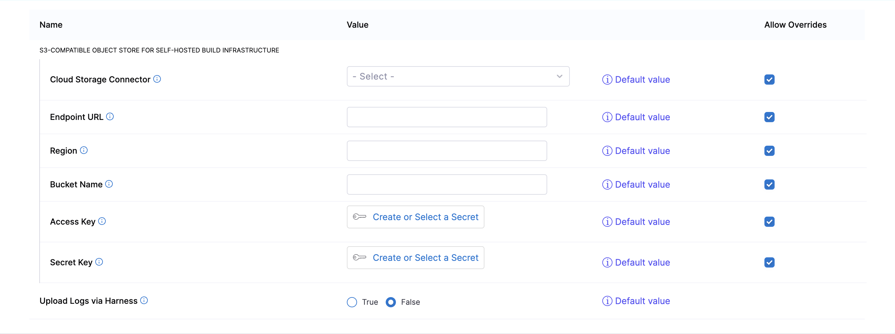
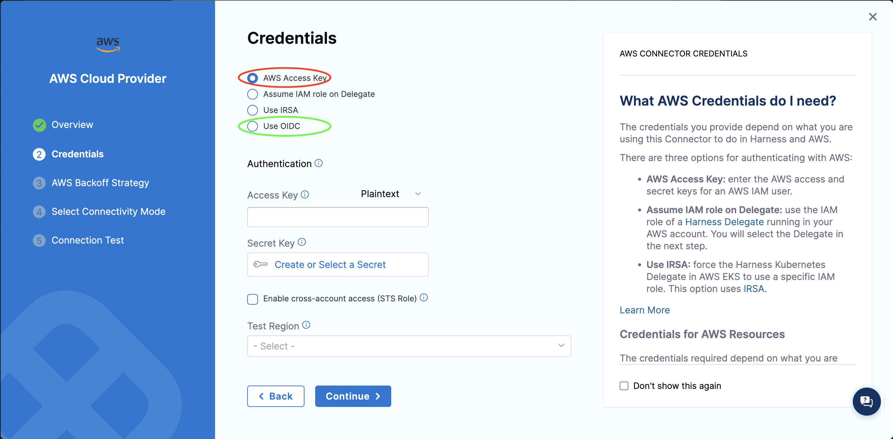
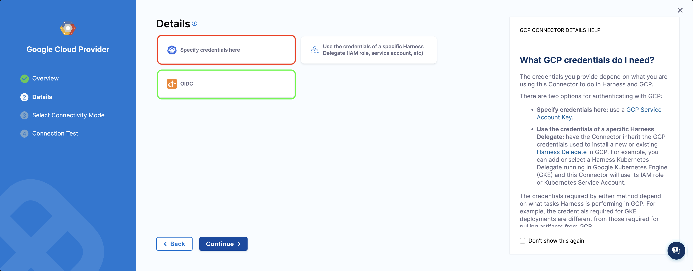
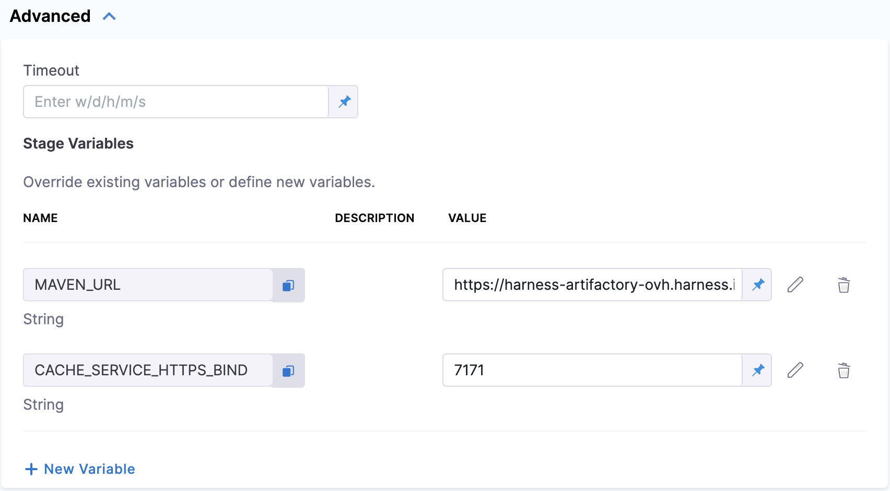

import Tabs from '@theme/Tabs';
import TabItem from '@theme/TabItem';

Build Intelligence is part of [Harness CI Intelligence](/docs/continuous-integration/get-started/harness-ci-intelligence), a suite of features in Harness CI designed to improve build times. It saves time by reusing outputs from previous builds. BI stores these outputs locally or remotely and retrieves them when inputs haven't changed. This process avoids the need to regenerate outputs, significantly speeding up the build process and enhancing efficiency.

:::info
* Build Intelligence is now available for Harness Cloud and self hosted pipelines. This feature is behind the feature flag `CI_CACHE_ENABLED`.
* For Harness cloud hosted pipelines, in addition to CI_CACHE_ENABLED flag, the following feature flag needs to be enabled: `CI_ENABLE_BUILD_CACHE_HOSTED_VM`
* For self hosted pipelines, in addition to the CI_CACHE_ENABLED flag, the following feature flags would be required for OIDC  authentication: `PL_GCP_OIDC_AUTHENTICATION` for GCP or `CDS_AWS_OIDC_AUTHENTICATION` for AWS

Contact [Harness Support](mailto:support@harness.io) to enable the feature.
:::


BI is currently available for Gradle and Bazel with Maven support coming soon. Regardless of the programming language used in your projects, as long as you're building with a supported build tool, you can leverage BI to optimize your builds.

## Build Intelligence Enabled

Once the appropriate feature flags are enabled, Build Intelligence feature is automatically configured and enabled. The Business Intelligence stage property is toggled ON and the corresponding yaml file is as follows:

```YAML
    - stage:
        identifier: build
        name: build
        type: CI
        spec:
          cloneCodebase: true
          buildIntelligence: 
            enabled: true # Build intelligence enabled
          execution:
            steps:
              - step:
                  type: Action
                  name: Set up Gradle
                  identifier: Set_up_Gradle
                  spec:
                    uses: gradle/gradle-build-action@v2
                    with:
                      gradle-version: "8.5"
              - step:
                  type: Run
                  name: build
                  identifier: build
                  spec:
                    shell: Sh
                    command: ./gradlew build --build-cache --profile
          platform:
            os: Linux
            arch: Amd64
          runtime:
            type: Cloud
            spec: {}

```
:::note
The --profile option in gradle build command is required for Build Intelligence to accurately retrieve profile information
:::

Harness Build Intelligence is available for Harness cloud hosted and self hosted environments (currently available for Kubernetes only)

<Tabs>
  <TabItem value="Cloud" label="Harness Cloud" default>

Harness auto-detects supported build tools (Gradle and Bazel). It auto injects required configuration to appropriate files on the host machine. Next, we will cover how we configure build cache for Gradle and Bazel

### Build Intelligence for Gradle
1. Harness creates an init.gradle file in `~/.gradle/init.d` or `$GRADLE_HOME/init.d` or `$GRADLE_USER_HOME/init.d` folder if not found.

2. The Harness Build Cache plugin config is imported into this config file.

3. The config looks as follows:
```groovy

      initscript {
          repositories {
          if (System.getenv('MAVEN_URL')) {
                  maven {
                      url System.getenv('MAVEN_URL')
                  }
              } else {
            mavenCentral()
          }       
          }
          dependencies {
              classpath 'io.harness:gradle-cache:%s'
          }
      }
      // Apply the plugin to the Settings object
      gradle.settingsEvaluated { settings ->
          settings.pluginManager.apply(io.harness.HarnessBuildCache)
          settings.buildCache {
                  local {
                      enabled = false
                  }
                  remote(io.harness.Cache) {
                      accountId = System.getenv('HARNESS_ACCOUNT_ID')
                      push = "true"
                      endpoint = System.getenv('HARNESS_CACHE_SERVICE_ENDPOINT')
                  }
              }
      }
  ```

  ### Build Intelligence for Bazel
  Bazel Config
1. Harness create a ~/.bazelrc file if not found

2. bazelrc does not support environment variables, hence the endpoint is hardcoded

3. The config looks like:

`build --remote_cache=http://endpoint:port/cache/bazel (endpoint depends on where we are auto-injecting)`

  bazelrc does not support environment variables, hence the endpoint needs to be hardcoded when writing to this file.
  </TabItem>

  <TabItem value="Self Hosted" label="Self Hosted" default>
  :::note
  Build Intelligence is only supported for Kubernetes on self hosted environments
  :::

  S3 bucket connector configuration can be made on the Project Settings > Default Settings page.

  We rely on the S3 storage configuration which is already used by Cache Intelligence.
  We use a cache proxy running within the infrastructure (Kubernetes pod or VM). This would be available to all the steps in execution and runs on port 8082 by defailt. 

  Storage Configuration:
  

  While we support Access Key, Secret key pair for AWS, we recommend using OIDC mechanism. Refer to the following image:
  

  While we support GCP Json Key, we recommend using OIDC mechanism. Refer to the following image:
  


### Gradle Config
1. Harness creates an init.gradle file in `~/.gradle/init.d` or `$GRADLE_HOME/init.d` or `$GRADLE_USER_HOME/init.d` folder if not found.

2. The Harness Build Cache plugin config is imported into this config file.

3. The config looks as follows:

```groovy
initscript {
    repositories {
		if (System.getenv('MAVEN_URL')) {
            maven {
                url System.getenv('MAVEN_URL')
            }
        } else {
			mavenCentral()
		}       
    }
    dependencies {
        classpath 'io.harness:gradle-cache:%s'
    }
}
// Apply the plugin to the Settings object
gradle.settingsEvaluated { settings ->
    settings.pluginManager.apply(io.harness.HarnessBuildCache)
    settings.buildCache {
            local {
                enabled = false
            }
            remote(io.harness.Cache) {
                accountId = System.getenv('HARNESS_ACCOUNT_ID')
                push = "true"
                endpoint = System.getenv('HARNESS_CACHE_SERVICE_ENDPOINT')
            }
        }
}
```
:::note
To specify custom Maven URL and PORT you need to add [**STAGE** variables](/docs/platform/pipelines/add-a-stage/#stage-variables) named `MAVEN_URL` and `CACHE_SERVICE_HTTPS_BIND` respectively
Refer to the image below to see how to set custom Maven URL and port:

:::

### Bazel Config
1. Create a ~/.bazelrc file (if it does not exist)

2. bazelrc does not support environment variables, hence the endpoint needs to be hardcoded when writing to this file.

3. The config looks like:
`build --remote_cache=http://endpoint:port/cache/bazel (endpoint is localhost:8082)`
  </TabItem>
</Tabs>