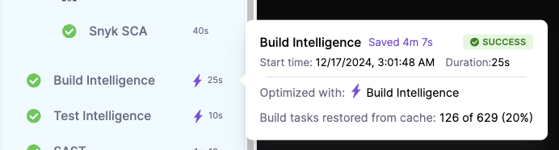

import Tabs from '@theme/Tabs';
import TabItem from '@theme/TabItem';

Build Intelligence is part of [Harness CI Intelligence](/docs/continuous-integration/get-started/harness-ci-intelligence), a suite of features in Harness CI designed to improve build times. By storing these outputs remotely and retrieving them when inputs haven't changed, Build Intelligence avoids unnecessary rebuilds, significantly accelerating the build process and enhancing efficiency.

Build Intelligence is currently available for **Gradle** and **Bazel** build tools, with Maven support coming soon. Regardless of the programming language used in your projects, as long as you're building with a supported build tool, you can leverage Build Intelligence to optimize your builds.

 
## Using Build Intelligence
Build Intelligence seamlessly integrates into your workflow without requiring changes to your build commands. Harness automatically detects supported build tools in your pipeline and injects the necessary configurations into the relevant files within the build workspace. This ensures Build Intelligence optimizes your builds during Gradle or Bazel operations performed in `Test` or `Run` steps. 

To enable Build Intelligence, use the UI editor to enable the stage property `Build Intelligence` in Build stage overview tab. Alternatively, it can be enabled from YAML editor as shown below.


Below is an example of a CI stage using Build Intelligence: 

```YAML
- stage:
    identifier: build
    name: build
    type: CI
    spec:
      cloneCodebase: true
      buildIntelligence: 
        enabled: true # Build intelligence enabled
      execution:
        steps:
          - step:
              type: Action
              name: Set up Gradle
              identifier: Set_up_Gradle
              spec:
                uses: gradle/gradle-build-action@v2
                with:
                  gradle-version: "8.5"
          - step:
              type: Run
              name: build
              identifier: build
              spec:
                shell: Sh
                command: ./gradlew build --profile  # '--profile' is optional but advised for gradle
```

<Tabs>
  <TabItem value="Cloud" label="Harness Cloud" default>


:::info
- Build Intelligence feature is behind the feature flags `CI_CACHE_ENABLED` and `CI_ENABLE_BUILD_CACHE_HOSTED_VM`. 

Contact [Harness Support](mailto:support@harness.io) to enable the feature.
:::


  </TabItem>


  <TabItem value="Self Hosted" label="Self Hosted" default>
  :::info
    - Build Intelligence is only supported for Kubernetes on self-hosted build infrastructure. 
  - To use Build Intelligence with self-hosted builds the following feature flags need to be enabled: 
  `CI_CACHE_ENABLED` and 'CI_ENABLE_BUILD_CACHE_K8' To authenticate to your S3 bucket using OIDC enabled `PL_GCP_OIDC_AUTHENTICATION` for GCP or `CDS_AWS_OIDC_AUTHENTICATION` for AWS.
  
  Contact [Harness Support](mailto:support@harness.io) to enable the feature.
  :::

  - When using a Build Intelligence with self-hosted infrastructure, an S3-compatible bucket is required for cache storage. Please visit [configure default S3-compatible object storage](/docs/platform/settings/default-settings.md#continuous-integration) for more information.
  - By default, Build Intelligence step that configures a proxy on port 8082. Ability to configure this port, if needed, is coming soon.  
  - By default, the Build Intelligence plugin is downloaded from Maven Central. If your environment does not have access to Maven Central or you prefer using a custom Maven repository, you can configure this by setting a stage variable named `MAVEN_URL`. See [Build Intelligence plugin](https://central.sonatype.com/artifact/io.harness/gradle-cache/overview ) 


  </TabItem>
</Tabs>


### How does Build Intelligence work 
Harness auto-detects supported build tools (Gradle and Bazel). It auto injects required configuration to appropriate files on the build workspace. This will allow Build Intelligence to automatically optimize your builds when bazel/gradle operation are done in `Test` or `Run` steps. 


#### Gradle Config
When using gradle, Harness creates an init.gradle file in `~/.gradle/init.d` or `$GRADLE_HOME/init.d` or `$GRADLE_USER_HOME/init.d` folder if not found, with the required configuration. 

#### Bazel Config
When using bazel, Harness create a ~/.bazelrc file (if it does not exist), with the required configuration. 

The config will look like:
`build --remote_cache=http://endpoint:port/cache/bazel (endpoint is localhost:8082)`

### Using '--profile'
Appending `--profile' to your build command, enables publishing Build Intelligence savings to Harness. This will allow you to clearly view the performance and benefits of using Build Intelligence. Note that even when omitted, Build Intelligence will continue to work and optimize your run as expected, but the savings will not be visible in the UI and relevant dashboards.

For example:  `./gradlew build --profile`


This is currently supported with Gradle build tool only . 



Visit [Intelligence Savings](/docs/continuous-integration/get-started/harness-ci-intelligence#intelligence-savings) for more information.
