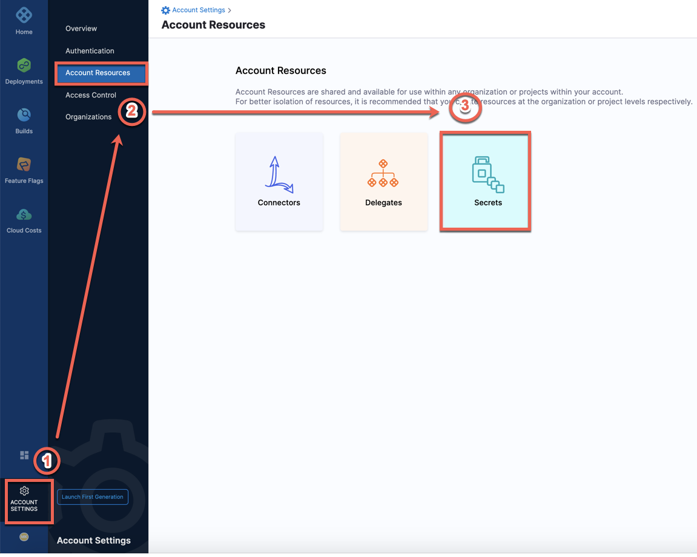

This topic describes how to modify and override build settings before a build in Harness CIE.

If you want to override your **Secrets** in `settings.xml` file at Pipeline execution, perform the following steps:

### Before You Begin

* [Harness Secret Manager Overview](../../../platform/6_Security/1-harness-secret-manager-overview.md)
* [Add Secrets Manager](../../../platform/6_Security/5-add-secrets-manager.md)
* [Add Text Secrets](../../../platform/6_Security/2-add-use-text-secrets.md)
* [Add SSH Secrets](../../../platform/6_Security/4-add-use-ssh-secrets.md)

### Step 1: Create a Secret at Account level

Make sure that you have the **Account**> **Secrets**> **Create/Edit/View** permission for Harness Platform. See [Permission Reference](../../../platform/4_Role-Based-Access-Control/ref-access-management/permissions-reference.md#platform) for details on the list of permissions.

1. Go to **Account Settings**, **Account Resources**, **Secrets**.

2. Click **Secrets**.  
For details on creating a secret, see [Add Text Secret](../../../platform/6_Security/2-add-use-text-secrets.md).
3. Create a new **Text** **Secret** in Harness.  
In this example, we create a new **Text Secret** named: **settingsXML**.
4. In **Secret Value**, paste the XML settings content from your **settings.xml** file.

5. Click **Save**.

### Step 2: Run the Referenced Secrets

Both text and file secrets are always referenced using their Id, not their name.In this step, you create a new **settings.xml** file in the Harness working directory and assign the values of your Text Secret to **settings.xml**.

Once the **settings.xml** file is created in the Harness working directory, Maven can read your Secret from this file.

#### Option 1: Add in the Run step

In the **Command**, in the **Run** step, enter:

`echo '<+secrets.getValue("account.settingsXML")>' > settings.xml`

#### Option 2: Add in the Run Tests step

In the **Run Tests** step, add the command in the **PreCommand** section of the **Run Tests** step:

 `echo '<+secrets.getValue("account.settingsXML")>' > settings.xml`

### Step 3: Run Your Maven Test

You can now run your Maven test as:

`mvn test -s settings.xml`

If you create `settings.xml` file in the `~/.m2/` folder, Maven can read the secrets from the default location and you don't need to run the test with `-s` flag.  
For example: If you use `echo '<+secrets.getValue("account.settingsXML")>' >``~/.m2/settings.xml.`You can now run your test as: `mvn test`

### See Also

* [Run a Script in a CI Stage](../run-ci-scripts/run-a-script-in-a-ci-stage.md)

