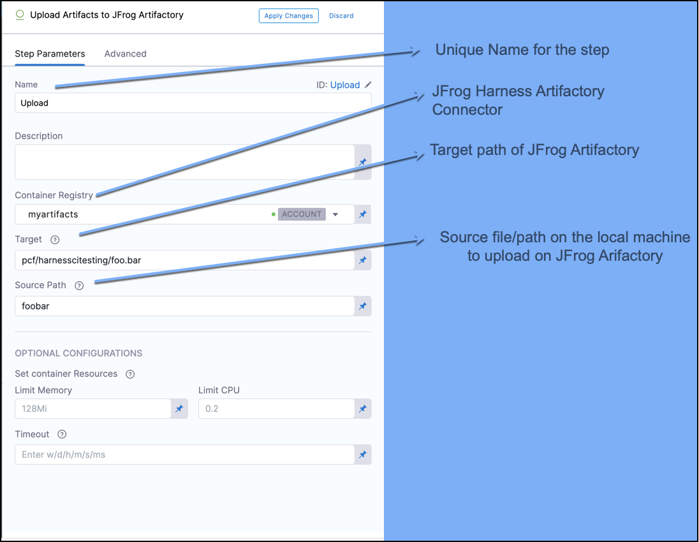
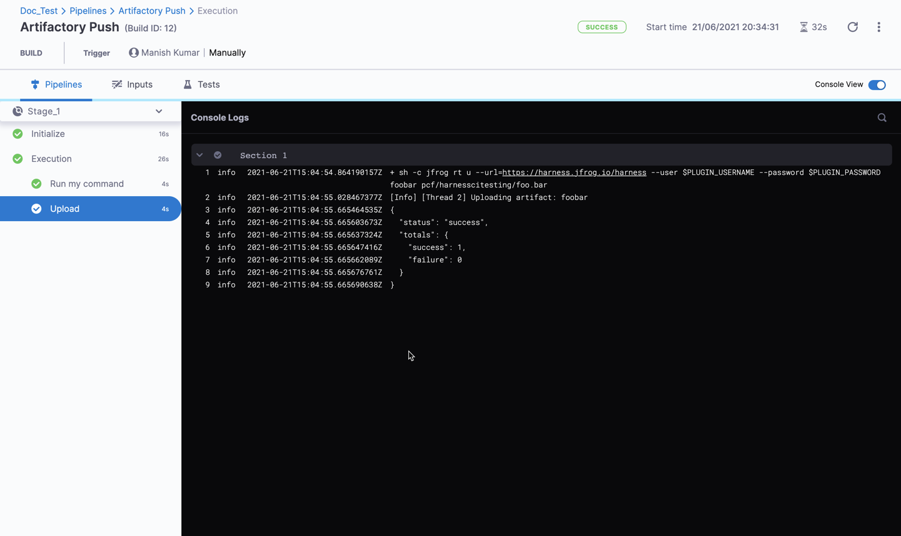
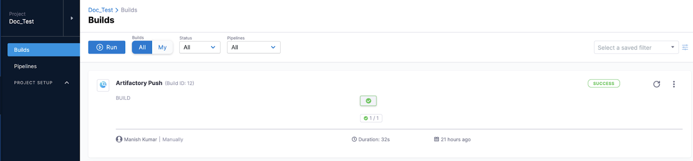
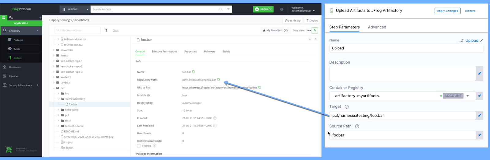

This topic provides settings to upload artifacts to [JFrog Artifactory](https://www.jfrog.com/confluence/display/JFROG/JFrog+Artifactory).

The following steps run SSH commands and push the artifacts to JFrog Artifactory.

### Before you Begin

* [CI Pipeline Quickstart](../../ci-quickstarts/ci-pipeline-quickstart.md)
* [CI Stage Settings](../../ci-technical-reference/ci-stage-settings.md)
* [Set Up Build Infrastructure](https://docs.harness.io/category/set-up-build-infrastructure)
* [Learn Harness' Key Concepts](../../../getting-started/learn-harness-key-concepts.md)

### Step 1: Create the CI Stage

In your Harness Pipeline, click **Add Stage**, and then click CI.

### Step 2: Define the Build Farm Infrastructure

In the CI stage Infrastructure, define the build farm for the codebase. See [Define Kubernetes Cluster Build Infrastructure](../set-up-build-infrastructure/set-up-a-kubernetes-cluster-build-infrastructure.md).

### Step 3: Configure the Run Step

In the stage's Execution step, select **Run**. The Run step executes one or more commands on a container image. See [Configure Run Step](../../ci-technical-reference/configure-service-dependency-step-settings.md). 

### Step 4: Upload Artifacts to JFrog Artifactory

In the CI Artifact, select **Upload Artifacts to JFrog Artifactory**.

In this step, configure the Harness Artifactory Connector, enter the source file/path, and the target path. 

The JFrog Account associated with the Connector must have read/write permission. See [Connector Settings Reference](https://ngdocs.harness.io/article/euueiiai4m-artifactory-connector-settings-reference).

For the step Settings, see [Upload Artifacts to JFrog Artifactory](../../ci-technical-reference/upload-artifacts-to-jfrog-artifactory-step-settings.md).

### Step 5: View the Results

Save the Pipeline and click **Run**. 

You can see the logs for the Run and Upload step in the Pipeline as it runs.

In your Harness project's Builds, you can see the build listed.

On JFrog, you can see the file that you pushed.

### See Also

* [Build and Push an Artifact](build-and-upload-an-artifact.md)

