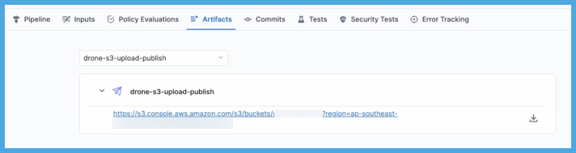

You can use the **Upload Artifacts to JFrog Artifactory** step in your CI pipelines to upload artifacts to [JFrog Artifactory](https://www.jfrog.com/confluence/display/JFROG/JFrog+Artifactory).

You need:

* Access to a JFrog Artifactory instance.
* A [CI pipeline](../prep-ci-pipeline-components.md) with a [Build stage](../set-up-build-infrastructure/ci-stage-settings.md). If you haven't created a pipeline before, try one of the [CI tutorials](../../get-started/tutorials.md).
* Steps in your pipeline that generate artifacts to upload, such as by running tests or building code. The steps you use depend on what artifacts you ultimately want to upload.
* An [Artifactory connector](#artifactory-connector).

You can also [upload artifacts to S3](./upload-artifacts-to-s-3-step-settings.md), [upload artifacts to GCS](./upload-artifacts-to-gcs-step-settings.md), and [upload artifacts to Sonatype Nexus](./upload-artifacts-to-sonatype-nexus.md). For other upload locations, you can use a script in a [Run step](../run-ci-scripts/run-step-settings.md).

## Add an Upload Artifacts to JFrog step

In your pipeline's **Build** stage, add an **Upload Artifacts to JFrog Artifactory** step and configure the [settings](#upload-artifacts-to-jfrog-step-settings) accordingly.

Here is a YAML example of a minimum **Upload Artifacts to JFrog Artifactory** step.

```yaml
              - step:
                  type: ArtifactoryUpload
                  name: ArtifactoryUpload_1
                  identifier: ArtifactoryUpload_1
                  spec:
                    connectorRef: YOUR_ARTIFACTORY_CONNECTOR_ID
                    target: groupId/artifactId/version
                    sourcePath: path/to/source
```

### Upload Artifacts to JFrog step settings

The **Upload Artifacts to JFrog Artifactory** step has the following settings. Depending on the build infrastructure, some settings might be unavailable or optional. Settings specific to containers, such as **Set Container Resources**, are not applicable when using the step in a stage with VM or Harness Cloud build infrastructure.

#### Name

Enter a name summarizing the step's purpose. Harness automatically assigns an **Id** ([Entity Identifier Reference](../../../platform/references/entity-identifier-reference.md)) based on the **Name**. You can change the **Id**.

#### Artifactory Connector

Select the Harness Artifactory connector to use for this upload. The JFrog Account associated with the connector must have read/write permission. For more information, go to the [Artifactory connector settings reference](/docs/platform/connectors/cloud-providers/ref-cloud-providers/artifactory-connector-settings-reference).

This step supports Artifactory connectors that use either anonymous or username and password authentication.

If the connector uses username and password authentication, the `PLUGIN_USERNAME` and `PLUGIN_PASSWORD` used by this step are derived from the selected Artifactory connector.

#### Target and Source Path

The **Target** is the target path in the JFrog Artifactory registry. This is a target repository name relative to the server URL in the connector. If `pom.xml` is not present, then the **Target** must be a full path to an artifacts folder, such as `groupId/artifactId/version`.

**Source Path** is a path to the artifact file/folder on the local/build machine you want to upload.

If you want to upload a compressed file, you must use a [Run step](../run-ci-scripts/run-step-settings.md) to compress the artifact before uploading it.


#### Run as User

Specify the user ID to use to run all processes in the pod if running in containers. For more information, go to [Set the security context for a pod](https://kubernetes.io/docs/tasks/configure-pod-container/security-context/#set-the-security-context-for-a-pod).

#### Set container resources

Set maximum resource limits for the resources used by the container at runtime:

* **Limit Memory:** The maximum memory that the container can use. You can express memory as a plain integer or as a fixed-point number using the suffixes `G` or `M`. You can also use the power-of-two equivalents `Gi` and `Mi`. The default is `500Mi`.
* **Limit CPU:** The maximum number of cores that the container can use. CPU limits are measured in CPU units. Fractional requests are allowed; for example, you can specify one hundred millicpu as `0.1` or `100m`. The default is `400m`. For more information, go to [Resource units in Kubernetes](https://kubernetes.io/docs/concepts/configuration/manage-resources-containers/#resource-units-in-kubernetes).

#### Timeout

Set the timeout limit for the step. Once the timeout limit is reached, the step fails and pipeline execution continues. To set skip conditions or failure handling for steps, go to:

* [Step Skip Condition settings](../../../platform/pipelines/w_pipeline-steps-reference/step-skip-condition-settings.md)
* [Step Failure Strategy settings](../../../platform/pipelines/w_pipeline-steps-reference/step-failure-strategy-settings.md)

## View artifacts on the Artifacts tab

You can use the [Artifact Metadata Publisher plugin](https://github.com/drone-plugins/artifact-metadata-publisher) to publish artifacts to the [Artifacts tab](../viewing-builds.md). To do this, add a [Plugin step](../use-drone-plugins/plugin-step-settings-reference.md) after the **Upload Artifacts to JFrog Artifactory** step.

```mdx-code-block
import Tabs from '@theme/Tabs';
import TabItem from '@theme/TabItem';
```
```mdx-code-block
<Tabs>
  <TabItem value="Visual" label="Visual">
```

Configure the **Plugin** step settings as follows:

* **Name:** Enter a name.
* **Container Registry:** Select a Docker connector.
* **Image:** Enter `plugins/artifact-metadata-publisher`.
* **Settings:** Add the following two settings as key-value pairs.
  * `file_urls`: Provide a URL to the artifact that was uploaded in the **Upload Artifacts to JFrog Artifactory** step. If you uploaded multiple artifacts, you can provide a list of URLs.
  * `artifact_file`: Provide any `.txt` file name, such as `artifact.txt` or `url.txt`. This is a required setting that Harness uses to store the artifact URL and display it on the **Artifacts** tab. This value is not the name of your uploaded artifact, and it has no relationship to the artifact object itself.

```mdx-code-block
  </TabItem>
  <TabItem value="YAML" label="YAML" default>
```

Add a `Plugin` step that uses the `artifact-metadata-publisher` plugin.

```yaml
               - step:
                  type: Plugin
                  name: publish artifact metadata
                  identifier: publish_artifact_metadata
                  spec:
                    connectorRef: account.harnessImage
                    image: plugins/artifact-metadata-publisher
                    settings:
                      file_urls: https://complete/url/to/artifact/on/jfrog
                      artifact_file: artifact.txt
```

* `connectorRef`: Use the built-in Docker connector (`account.harness.Image`) or specify your own Docker connector.
* `image`: Must be `plugins/artifact-metadata-publisher`.
* `file_urls`: Provide the URL to the artifact that was uploaded in the **Upload Artifacts to JFrog Artifactory** step. If you uploaded multiple artifacts, you can provide a list of URLs.
* `artifact_file`: Provide any `.txt` file name, such as `artifact.txt` or `url.txt`. This is a required setting that Harness uses to store the artifact URL and display it on the **Artifacts** tab. This value is not the name of your uploaded artifact, and it has no relationship to the artifact object itself.

```mdx-code-block
  </TabItem>
</Tabs>
```

## Build logs and artifact files

When you run the pipeline, you can observe the step logs on the [build details page](../viewing-builds.md).


If the Upload Artifacts step succeeds, you can find the artifact in your JFrog repo.


If you used the Artifact Metadata Publisher, you can find a link to the artifact on the [Artifacts tab](../viewing-builds.md).

:::tip

On the **Artifacts** tab, select the step name to expand the list of artifact links associated with that step.

If your pipeline has multiple steps that upload artifacts, use the dropdown menu on the **Artifacts** tab to switch between lists of artifacts uploaded by different steps.

<!--  -->

<docimage path={require('./static/artifacts-tab-with-link.png')} />

:::

## Troubleshooting the Upload Artifacts to JFrog step

You might encounter these issues when using the **Upload Artifacts to JFrog Artifactory** step.

### Certificate signed by unknown authority

If you get a `certificate signed by unknown authority` error, make sure the correct server certificates are uploaded to the correct container path. For example, the container path for Windows is `C:/Users/ContainerAdministrator/.jfrog/security/certs`.

### mkdir permission denied when running as non-root

With a Kubernetes cluster build infrastructure, the **Upload Artifacts to JFrog** step must run as root. If you set **Run as User** to anything other than `1000`, the step fails with `mkdir /.jfrog: permission denied`.
