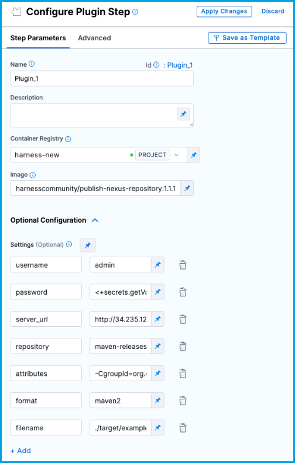

```mdx-code-block
import Tabs from '@theme/Tabs';
import TabItem from '@theme/TabItem';
```

You can use the [Nexus Publish Drone plugin](https://github.com/harness-community/drone-nexus-publish) in your CI pipelines to upload artifacts to [Sonatype Nexus Repository Manager](https://www.sonatype.com/products/sonatype-nexus-repository).

You can also [upload artifacts to S3](./upload-artifacts-to-s-3-step-settings.md), [upload artifacts to GCS](./upload-artifacts-to-gcs-step-settings.md), and [upload artifacts to JFrog](./upload-artifacts-to-jfrog.md).

## Requirements

* You have access to a Sonatype Nexus Repository Manager instance.
* You have a [CI pipeline](../prep-ci-pipeline-components.md) with a [Build stage](../set-up-build-infrastructure/ci-stage-settings.md). If you haven't created a pipeline before, try one of the [CI tutorials](../../ci-quickstarts/ci-pipeline-quickstart.md).
* Your pipeline has steps that generate artifacts to upload, such as by running tests or building code. The steps you use depend on what artifacts you ultimately want to upload.

## Add the Plugin step

```mdx-code-block
<Tabs>
  <TabItem value="Visual" label="Visual">
```

1. In your CI pipeline's **Build** stage, add a [Plugin step](../use-drone-plugins/plugin-step-settings-reference.md).
2. Enter a **Name** and optional **Description**.
3. For **Container Registry**, select a [Docker connector](/docs/platform/Connectors/Cloud-providers/ref-cloud-providers/docker-registry-connector-settings-reference).
4. In the **Image** field, enter `harnesscommunity/publish-nexus-repository:1.1.1`.
5. Under **Optional Configuration**, add **Settings** to configure the Nexus Publisher plugin's properties, as described in the following table.

| Keys | Type | Description | Value example |
| - | - | - | - |
| `username` | String | A username for accessing Nexus Repository Manager. | <ul><li>`admin`</li><li>`test-user`</li></ul> |
| `password` | String | An [expression referencing a secret](/docs/platform/Secrets/add-use-text-secrets#step-3-reference-the-encrypted-text-by-identifier) containing the password for the specified username. | `<+secrets.getValue("nexus_password")>` |
| `server_url` | Public URL | The URL of your Nexus Repository Manager instance. | `http://34.235.128.201:8081/` |
| `filename` | String | The path to the target artifact that you want to upload. | `./target/example-1.0.jar` |
| `format` | String | The repository format. | <ul><li>`maven2`</li><li>`raw`</li></ul> |
| `repository` | String | The name of the repository where you want to upload the artifact. | `maven-releases` |
| `attributes` | String of key-value pairs | Component and asset attributes providing additional artifact metadata.  `-CgroupId=org.dronetest -CartifactId=example -Cversion=1.0 -Aextension=jar -Aclassifier=bin` |

<!--  -->

<docimage path={require('./static/sonatype-nexus-plugin-visual-settings.png')} />

```mdx-code-block
  </TabItem>
  <TabItem value="YAML" label="YAML" default>
```
The following YAML example describes a [Plugin step](../use-drone-plugins/plugin-step-settings-reference.md) in a `CI` stage that updates the Jira **Build** field when there is a successful build.

```yaml
              - step:
                  type: Plugin
                  name: upload_sonatype
                  identifier: upload_sonatype
                  spec:
                    connectorRef: account.harnessImage ## Docker Hub container registry connector
                    image: harnesscommunity/publish-nexus-repository:1.1.1
                    settings:
                      username: deploy-user ## Nexus Repository Manager username
                      password: <+secrets.getValue("nexus_password")> ## Nexus Repository Manager password
                      server_url: http://34.235.128.201:8081/ ## Nexus Repository instance URL
                      filename: ./target/example-1.0.jar ## Path to the artifact to upload
                      format: maven2 ## Repository format
                      repository: maven-releases ## Destination repository name
                      attributes: "-CgroupId=org.dronetest -CartifactId=example -Cversion=1.0 -Aextension=jar -Aclassifier=bin" ## Key-value pairs providing additional metadata
```

<details>
<summary>Plugin step specifications</summary>

*  `type: Plugin`
*  `name:` Specify a step name.
*  `identifier:` Specify a unique step ID.
*  `connectorRef:` Specify a [Docker connector](/docs/platform/Connectors/Cloud-providers/ref-cloud-providers/docker-registry-connector-settings-reference).
*  `image: harnesscommunity/publish-nexus-repository:1.1.1`
*  `settings:` Configure the Nexus Publisher plugin's properties, as described in the following table.

| Keys | Type | Description | Value example |
| - | - | - | - |
| `username` | String | A username for accessing Nexus Repository Manager. | <ul><li>`admin`</li><li>`test-user`</li></ul> |
| `password` | String | An [expression referencing a secret](/docs/platform/Secrets/add-use-text-secrets#step-3-reference-the-encrypted-text-by-identifier) containing the password for the specified username. | `<+secrets.getValue("nexus_password")>` |
| `server_url` | Public URL | The URL of your Nexus Repository Manager instance. | `http://11.222.333.444:8000/` |
| `filename` | String | The path to the target artifact that you want to upload. | `./target/example-1.0.jar` |
| `format` | String | The repository format. | <ul><li>`maven2`</li><li>`raw`</li></ul> |
| `repository` | String | The name of the repository where you want to upload the artifact. | `maven-releases` |
| `attributes` | String of key-value pairs | Component and asset attributes providing additional artifact metadata.  `"-CgroupId=org.dronetest -CartifactId=example -Cversion=1.0 -Aextension=jar -Aclassifier=bin"` |

</details>

```mdx-code-block
  </TabItem>
</Tabs>
```

:::tip Tips

You can use variable expressions for **Settings** values, such as `password: <+stage.variables.nexus_password>`, which uses a [stage variable](/docs/platform/Pipelines/add-a-stage#option-stage-variables).

Create [text secrets](/docs/platform/Secrets/add-use-text-secrets) for sensitive information, such as passwords.

:::

<details>
<summary>Pipeline YAML example</summary>

The following YAML example is for a pipeline that includes steps to build an artifact and then upload it to Sonatype Nexus.

```yaml
pipeline:
  name: YOUR_PIPELINE_NAME
  identifier: YOUR_PIPELINE_ID
  projectIdentifier: default
  orgIdentifier: default
  tags: {}
  properties:
    ci:
      codebase:
        connectorRef: YOUR_CODEBASE_CONNECTOR
        repoName: YOUR_CODE_REPO
        build: <+input>
  stages:
    - stage:
        name: stage1
        identifier: stage1
        type: CI
        spec:
          cloneCodebase: true
          execution:
            steps:
              - step:
                  type: Run
                  name: Build
                  identifier: Run_3
                  spec:
                    shell: Sh
                    command: "mvn clean package"
              - step:
                  type: Plugin
                  name: upload_nexus
                  identifier: upload_nexus
                  spec:
                    connectorRef: account.harnessImage
                    image: harnesscommunity/publish-nexus-repository:1.1.1
                    settings:
                      username: test-user
                      password: <+secrets.getValue("nexus_password")>
                      server_url: http://11.222.333.444:8000/
                      format: maven2
                      filename: ./target/example-1.0.jar
                      repository: maven-releases
                      attributes: "-CgroupId=org.dronetest -CartifactId=example -Cversion=1.0 -Aextension=jar -Aclassifier=bin"
          platform:
            os: Linux
            arch: Amd64
          runtime:
            type: Cloud
            spec: {}
```

</details>

## Confirm the upload

After you add the steps and save the pipeline, select **Run** to run the pipeline.

On the [build details page](../viewing-builds.md), you can see the logs for each step as they run.

After the **Plugin** step runs, confirm that the artifact uploaded to Sonatype Nexus.

## View artifacts on the Artifacts tab

As an alternative to manually finding artifacts on Sonatype Nexus, you can use the [Artifact Metadata Publisher Drone plugin](https://github.com/drone-plugins/artifact-metadata-publisher) to publish artifacts to the [Artifacts tab](../viewing-builds.md). To do this, add another **Plugin** step after the Nexus Publisher plugin step.

```mdx-code-block
<Tabs>
  <TabItem value="Visual" label="Visual">
```

Configure the **Plugin** step to use the Artifact Metadata Publisher plugin:

* **Name:** Enter a name.
* **Container Registry:** Select a Docker connector.
* **Image:** Enter `plugins/artifact-metadata-publisher`.
* **Settings:** Add the following two settings as key-value pairs.
  * `file_urls`: The URL to the target artifact that was uploaded by the Nexus Publisher plugin.
  * `artifact_file`: `artifact.txt`

```mdx-code-block
  </TabItem>
  <TabItem value="YAML" label="YAML" default>
```

Add a `Plugin` step that uses the `artifact-metadata-publisher` plugin.

```yaml
               - step:
                  type: Plugin
                  name: publish artifact metadata
                  identifier: publish_artifact_metadata
                  spec:
                    connectorRef: account.harnessImage
                    image: plugins/artifact-metadata-publisher
                    settings:
                      file_urls: ## Provide the URL to the target artifact that was uploaded by the Nexus Publisher plugin.
                      artifact_file: artifact.txt
```

```mdx-code-block
  </TabItem>
</Tabs>
```
