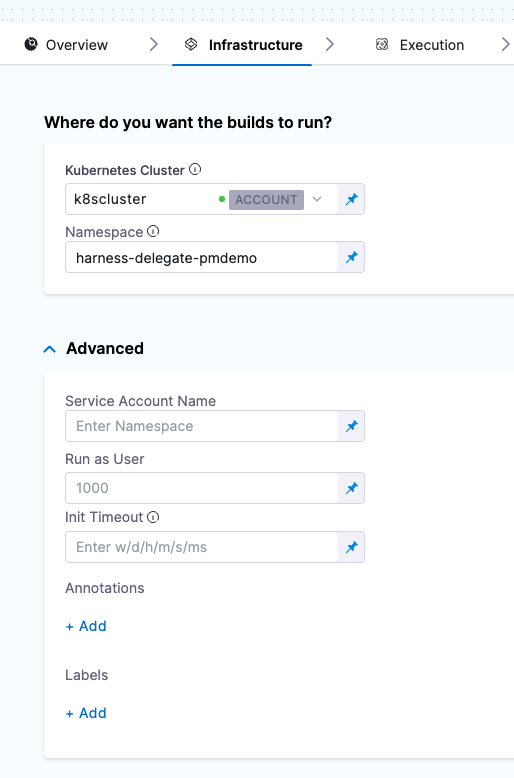

This topic describes CI Build stage settings. For more information about configuring stages in CI pipelines, go to [CI pipeline creation overview](../prep-ci-pipeline-components.md).

To create, edit, and delete stages in CI pipelines, you need either Project Admin or Project Member permissions. For more information, go to the [Permission Reference](/docs/platform/Role-Based-Access-Control/ref-access-management/permissions-reference).

## Stage Name

The unique name for this Stage.

## ID

See [Entity Identifier Reference](../../../platform/20_References/entity-identifier-reference.md).

## Description

Text string.

## Tags

See [Tags Reference](../../../platform/20_References/tags-reference.md).

## Clone Codebase

When you select this option, Harness automatically clones your codebase repository before executing the steps of this stage.

No special configuration is required.

If you don't select the option here, you can select it in **Stage Details**.

## Configure Codebase

These settings specify the codebase for the Stage. See [Create and configure a codebase](../codebase-configuration/create-and-configure-a-codebase.md). Available when you add the first stage to a pipeline. After adding the stage, these are managed under the pipeline's **Codebase** settings.

### Connector

A Harness codebase connector that connects to the repository where the codebase is located.

### Repository URL

The full URL for the codebase.

## Overview

Settings found on the **Overview** tab after adding a stage to a pipeline.

### Stage Details

Repeats Name, Description, Tags, and Clone Codebase.

### Shared Paths

You can add Shared Paths to share data in folders outside the default workspace. For example, the maven `m2` repo is stored in `/root/.m2` by default. If your Build Stage uses Maven, you can specify the shared path`/root/.m2` so that all Steps can access the repo.

### Stage Variables

Found under **Advanced** on the **Overview** tab.

Environment variables are available to all steps in the stage. For an example use case, go to [Build a Docker image without pushing](../build-and-upload-artifacts/build-and-upload-an-artifact.md#useful-techniques).

<!--### Workspace

Harness automatically creates a temporary volume, known as your workspace, and clones your codebase repository into this volume. The workspace is the current working directory for each step in your Pipeline.

Enter a workspace volume, beginning with a forward slash, such as `/vol`. If you enter `/vol`, the workspace will be `/vol/harness`.

The workspace is ephemeral: the Build creates the workspace when the Stage starts and destroys it when the Stage ends.

Individual Steps can communicate and share state using the workspace filesystem. The workspace is a volume, so filesystem changes persist across the entire Stage.-->

## Infrastructure

Settings found on the **Infrastructure** tab after adding a stage to a pipeline.

Infrastructure is where the build is run. It is a build farm, such as a Kubernetes cluster. Infrastructure settings vary by [build infrastructure type](../set-up-build-infrastructure/which-build-infrastructure-is-right-for-me.md).

<!-- either tabs or accordions -->

Cloud

content in md format

Kubernetes

A Kubernetes cluster can be used as a build farm. See [Set up a Kubernetes cluster build infrastructure](../set-up-build-infrastructure/set-up-a-kubernetes-cluster-build-infrastructure.md).

### Namespace

The Kubernetes namespace in the target cluster to use.

### Override Image Connector

By default, Harness pulls certain images from public Docker Hub repos that are needed to run a build. You can override this by using a Connector that downloads these images from the Harness Container Image Registry instead. This option is useful when your default Delegate cannot access the public registry (due to security policies in your organization, for example, or if your infrastructure is running in a private cloud).

To override how the Build Stage pulls these images, create a Connector as described in [Connect to Harness Container Image Registry Using Docker Connector](../../../platform/7_Connectors/connect-to-harness-container-image-registry-using-docker-connector.md).

## Advanced

### Volumes

A list of the volumes you want to mount onto the pod running the Stage.

#### Empty Directory

Mount a new [`emptyDir`](https://kubernetes.io/docs/concepts/storage/volumes/#emptydir) volume that gets deleted when the Stage finishes execution.

* **Mount Path:** The volume path for Step containers.
* **Medium:** The storage medium for the volume. Leave blank to use the default medium for the host node, or enter `memory` to mount a tmpfs (RAM-backed filesystem) on the host node.
* **Size:** Maximum memory that the volume can use. You can express memory as a plain integer or as a fixed-point number using the suffixes `G` or `M`. You can also use the power-of-two equivalents `Gi` and `Mi`. If not specified, the volume can use up to 50% of available memory on the host node.

#### Host Path

Mount a file or folder from the host node filesystem.

It is good practice to avoid hostPath volumes in most cases. See [hostPath](https://kubernetes.io/docs/concepts/storage/volumes/#hostpath) in the Kubernetes docs.

* **Mount Path:** The volume path for step containers.
* **Path:** The volume path on the host node.
* **Path Type:** To apply a precheck on the specified path before mounting the volume, enter a supported value, such as `FileOrCreate`. Leave blank to skip any prechecks before mounting.

#### Persistent Volume Claim

Mount a [Persistent Volume](https://kubernetes.io/docs/concepts/storage/persistent-volumes/) using a predefined Persistent Volume Claim.

* **Mount Path:** The volume path for Step containers.
* **Claim Name:** Name of a PVC defined in your build infrastructure.
* **Read Only:** Mount the volume in read-only mode.

### Service Account Name

The Service Account for Step containers to use when communicating with the Kubernetes API server. Leave blank to use the default service account for the namespace.

If your cluster connector inherits authentication credentials from the Delegate, then you must supply a Service Account Name.

### Init Timeout

Timeout for the initialization phase. During this phase, Harness downloads the build step images and spins up the containers to execute the build steps.

### Annotations

Kubernetes Annotation to the pod YAML used to create the host pod for the Stage. See [Annotations](https://kubernetes.io/docs/concepts/overview/working-with-objects/annotations/).

### Labels

Key/Value pair that will be added to the Kubernetes pod YAM used to create the host pod for the Stage. See [Labels and Selectors](https://kubernetes.io/docs/concepts/overview/working-with-objects/labels/).

### Automount Service Account Token

By default, Kubernetes mounts a token for the Service Account when it creates a pod, which enables the pod to communicate with the Kubernetes API server. When this option is disabled, the service account token will not get mounted.

### Priority Class

The [`PriorityClass`](https://kubernetes.io/docs/concepts/scheduling-eviction/pod-priority-preemption/#priorityclass) of the Stage pod in case resources run out on the host node. Specify a PriorityClass from your build infrastructure. You can also specify the predefined classes `system-cluster-critical` or `system-node-critical`, which ensure that the stage is always scheduled first.

If you leave this field blank, the `PriorityClass` will be the `globalDefault`, if your infrastructure has one defined, or `0`, which is lowest priority.

### Container Security Context

Configure the [Security Context](https://kubernetes.io/docs/tasks/configure-pod-container/security-context/) for the stage (pod) and steps (containers):

* **Privileged:** Run all containers with the [`--privileged`](https://docs.docker.com/engine/reference/run/#runtime-privilege-and-linux-capabilities) flag enabled. This flag is disabled by default. You can override this setting in individual Run and Run Tests steps.
* **Allow Privilege Escalation:** When enabled, a process can gain more privileges than its parent process. This setting determines whether the [`no_new_privs`](https://www.kernel.org/doc/Documentation/prctl/no_new_privs.txt) flag gets set on the container process.
* **Add Capabilities:** The list of capabilities to add to each Step by default, in addition to the runtime defaults. This field corresponds to the [`capabilities: add`](https://kubernetes.io/docs/tasks/configure-pod-container/security-context/#set-capabilities-for-a-container) option in Kubernetes.
* **Drop Capabilities:** The list of capabilities that must be dropped from each Step. This field corresponds to the [`capabilities: drop`](https://kubernetes.io/docs/tasks/configure-pod-container/security-context/#set-capabilities-for-a-container) option in Kubernetes.
* **Run as Non-Root:** Run all Steps as a non-root User. To specify a default User Id for all containers, set the Run as User field.
* **Read-Only Root Filesystem:** Run all Steps with a read-only root filesystem, with no writable layer.
* **Run as User:** Run with this user Id for containers in the pod. A typical example of a Run as User value would be 1000. To override this default, set Run as User in individual Steps.

### Node Selector

A list of [`nodeSelectors`](https://kubernetes.io/docs/concepts/scheduling-eviction/assign-pod-node/#nodeselector), which whitelist the set of candidate nodes based on your Stage pod requirements.

### Tolerations

A list of [`tolerations`](https://kubernetes.io/docs/concepts/scheduling-eviction/taint-and-toleration/), which allow (but do not require) the pods to schedule onto nodes with matching taints.

Local

content in md format

VMs

content in md format

## Execution

The **Execution** tab is where you add steps to the stage. For details about settings for each step, go to the [CI Technical Reference](/docs/category/ci-technical-reference).

## Advanced

The **Advanced** tab contains settings for [conditional execution](/docs/platform/pipelines/w_pipeline-steps-reference/step-skip-condition-settings), [looping strategies](/docs/platform/Pipelines/looping-strategies-matrix-repeat-and-parallelism), and [failure strategies](/docs/platform/Pipelines/define-a-failure-strategy-on-stages-and-steps).
