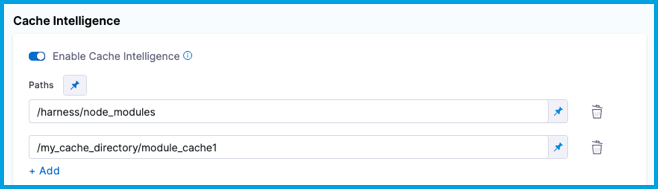
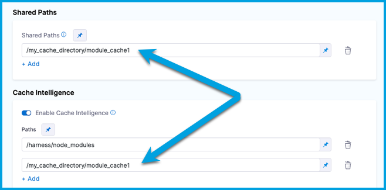
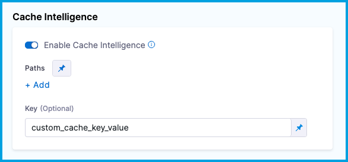

import Tabs from '@theme/Tabs';
import TabItem from '@theme/TabItem';

Modern continuous integration systems execute pipelines inside ephemeral environments that are provisioned solely for pipeline execution and are not reused from prior pipeline runs. As builds often require downloading and installing many library and software dependencies, caching these dependencies for quick retrieval at runtime can save a significant amount of time.


With **Cache Intelligence**, a [Harness CI Intelligence](/docs/continuous-integration/get-started/harness-ci-intelligence.md) feature, Harness automatically caches and restores software dependencies to speed up your builds - hassle free.

You can use Cache Intelligence with any [build infrastructure](/docs/continuous-integration/use-ci/set-up-build-infrastructure/which-build-infrastructure-is-right-for-me.md).

:::note
Cache intelligence for self-managed build infrastructure is an early access feature and is behind the feature flag `CI_ENABLE_CACHE_INTEL_SELF_HOSTED`. Contact [Harness Support](mailto:support@harness.io) to enable the feature.
:::


## Supported tools and paths

Cache Intelligence fully supports **Bazel**, **Maven**, **Gradle**, **Yarn**, **Go**, **Node**,  **VB** (with .Net), **F#** (with .Net) and **MSBuild/dotnet** (only for C#) build tools, as long as default cache paths are used. 

Below is a list of the default locations cached using Cache Intelligence:

| **Build Tool** | **Dependency Management file**  | **Default Path cached** 
|----------------|---------------------------------|-------------------------|
| `Maven` | pom.xml | .m2/repository
| `Gradle` | build.gradle | .gradle
| `Bazel` | WORKSPACE | .bazel
| `Node` | yarn.lock | .yarn
| `Go` | go.mod | .go
| `C# .Net` | *.csproj | .nuget/packages
| `VB .Net` | *.vbproj | .nuget/packages
| `F# .Net` | *.fsproj | .nuget/packages


For other build tools or non-default cache locations, you use Cache Intelligence with [custom cache paths](#customize-cache-paths).


## Cache storage

When you use Cache Intelligence with Harness CI Cloud, the cache is stored in the Harness-managed environment. When running builds on self-managed infrastructure, you will need to provide your own storage. 

<Tabs>
<TabItem value="cloud" label="Harness Cloud" default>

When you use Cache Intelligence with [Harness CI Cloud](/docs/continuous-integration/use-ci/set-up-build-infrastructure/use-harness-cloud-build-infrastructure.md), you don't need to bring your own storage, because the cache is stored in Harness-managed Harness Cloud storage.

All pipelines in the account use the same cache storage, and each build tool has a unique cache key that is used to restore the appropriate cache data at runtime.

The cache storage limit depends on your subscription plan type:

* Free: 2 GB
* Team: 5 GB
* Enterprise: 10 GB

Harness doesn't limit the number of caches you can store, but, once you reach your storage limit, Harness continues to save new caches by automatically evicting old caches.

The cache retention window is 15 days, which resets whenever a cache is updated.

</TabItem>
<TabItem value="sm" label="Self-managed build infrastructures">

When running builds in self-managed infrastructures, [configure S3-compatible  default object storage](/docs/platform/settings/default-settings.md#continuous-integration) that Harness can use to seamlessly store and manage the cache.

We suggest that you consider setting bucket level retention policy for efficient cache management. 

</TabItem>
</Tabs>


## Enable Cache Intelligence

1. If you're *not* using Harness Cloud build infrastructure, you must [configure S3-compatible global object storage](/docs/platform/settings/default-settings.md#continuous-integration) that Harness can use to store and manage caches.

   This is not required for Harness Cloud build infrastructure. For more information, go to [Cache storage](#cache-storage).

2. Enable Cache Intelligence in each applicable stage in your pipeline.

   To do this in the Visual editor, select a **Build** stage, select the stage's **Overview** tab, and then select **Enable Cache Intelligence**.

   To do this in the YAML editor, add the following to your pipeline's `stage.spec`:

      ```yaml
      caching:
        enabled: true
      ```

3. Add [custom cache paths](#customize-cache-paths) if you're using an unsupported build tool, a non-default cache location, or a Windows platform. For a list of supported tools, go to [Supported tools and paths](#supported-tools-and-paths).

4. You can also:

   * [Add custom cache keys.](#customize-cache-keys)
   * [Define the cache policy.](#define-cache-policy)
   * [Enable cache override.](#enable-cache-override)

## Customize cache paths

Cache Intelligence stores the data to be cached in the `/harness` directory by default. You can use `paths` to specify a list of locations to be cached. This is useful if:

- You're *not* using a [fully supported build tool](#supported-tools-and-paths).
- You have customized cache locations, such as with `yarn config set cache-folder`.
- You're using a Windows platform.

<Tabs>
<TabItem value="Visual" label="Visual editor">

1. In the same stage where you enabled Cache Intelligence, go to the **Overview** tab, and make sure **Enable Cache Intelligence** is selected.
2. In **Paths**, specify cache paths.

   On Windows platforms, you might need to specify the cache path from `C:`, such as `C:\harness\node_modules`.

   <!--  -->

   <DocImage path={require('./static/cache_int_paths.png')} />

3. Cache paths outside the `/harness` directory must _also_ be declared in **[Shared Paths](../set-up-build-infrastructure/ci-stage-settings.md#shared-paths)**.

   <!--  -->

   <DocImage path={require('./static/cache_int_shared_paths.png')} />

</TabItem>
<TabItem value="YAML" label="YAML editor" default>

In the same stage where you enabled Cache Intelligence, add a list of `paths` to cache under `stage.spec.caching`. For example:

```yaml
- stage:
    name: Build
    identifier: Build
    type: CI
    spec:
      caching:
        enabled: true
        paths:
          - /harness/node_modules
      cloneCodebase: true
```

On Windows platforms, you might need to specify the cache path from `C:`, such as `C:\harness\node_modules`.

Cache paths outside the `/harness` directory must _also_ be declared in [shared paths](../set-up-build-infrastructure/ci-stage-settings.md#shared-paths). Add the list of `sharedPaths` under `stage.spec`, for example:

```yaml
- stage:
    name: Build
    identifier: Build
    type: CI
    spec:
      caching:
        enabled: true
        paths: # All custom cache paths.
          - /harness/node_modules # Custom cache path within /harness directory.
          - /my_cache_directory/module_cache1 # Custom cache path outside /harness directory.
      cloneCodebase: true
      platform:
        os: Linux
        arch: Amd64
      runtime:
        type: Cloud
        spec: {}
      sharedPaths: # All shared paths outside /harness directory. These can be cache paths or other shared paths for your pipeline.
        - /my_cache_directory/module_cache1 # Custom cache path outside /harness directory.
```

</TabItem>
</Tabs>

## Customize cache keys

Harness generates a cache key from a hash of the build lock file (such as `pom.xml`, `build.gradle`, or `package.json`) that Harness detects. If Harness detects multiple tools or multiple lock files, Harness combines the hashes to create the cache key.

You can define custom cache keys if you don't want to use the default cache key naming behavior or you have a use case that requires defining custom cache keys, such as [caching in parallel stages](#cache-intelligence-in-parallel-stages).

<Tabs>
<TabItem value="Visual" label="Visual">

1. In the same stage where you enabled Cache Intelligence, go to the **Overview** tab, and make sure **Enable Cache Intelligence** is selected.
2. Enter the custom key value in **Key**.

   <!--  -->

   <DocImage path={require('./static/cache_int_custom_key.png')} />

</TabItem>
<TabItem value="YAML" label="YAML" default>

To customize the cache key in the YAML editor, add `key: CUSTOM_KEY_VALUE` under `stage.spec.caching` in the same stage where you enabled Cache Intelligence.

```yaml
- stage:
    name: Build
    identifier: Build
    type: CI
    spec:
      caching:
        enabled: true
        key: <+input> # This example uses runtime input so that the user specifies the cache key at runtime.
      cloneCodebase: true
```

</TabItem>
</Tabs>

You can use [fixed values, runtime inputs, and expressions](/docs/platform/variables-and-expressions/runtime-inputs) for the key value.

### Cache Intelligence in parallel stages

If you have multiple stages that run in parallel, you must use [custom cache keys](#customize-cache-keys) for each stage that uses Cache Intelligence. This prevents conflicts when the parallel stages attempt to save or retrieve caches concurrently.

If your stage uses a matrix or repeat [looping strategy](/docs/platform/pipelines/looping-strategies/looping-strategies-matrix-repeat-and-parallelism) that generates multiple stage instances, you can use a [Harness expression](/docs/platform/variables-and-expressions/harness-variables) to generate unique cache keys, such as `key: cachekey-<+strategy.iteration>`. The `<+strategy.iteration>` expressions references the stage's iteration index. Each instance of the stage generated by the matrix/repeat strategy has a different iteration index, starting from `0`.

## Define cache policy

The cache policy defines how you use caching in a stage.

For example, if your pipeline has two stages, you might want to restore the cache in the first stage and then save the cache in the second stage, rather than both saving and restoring the cache in both stages.

To configure the cache policy, add `policy: pull | push | pull-push` to `stage.spec.caching`.

* `policy: pull` - Only restore cache.
* `policy: push` - Only save cache.
* `policy: pull-push` - Save and restore cache. This is the default setting.

For example, here is a pipeline with two Build (`CI`) stages using Cache Intelligence. The first stage's cache policy is set to `pull` only, and the second stage's cache policy is set to `push` only. When this pipeline runs, the first stage restores the build cache, and the second stage saves the cache at the end of the build.

```yaml
  stages:
    - stage:
        name: buildStage1
        identifier: buildstage1
        description: ""
        type: CI
        spec:
          cloneCodebase: true
          platform:
            os: Linux
            arch: Amd64
          runtime:
            type: Cloud
            spec: {}
          caching:
            enabled: true
            policy: pull # Define cache policy.
          execution:
            steps:
              ...
    - stage:
        name: buildStage2
        identifier: buildstage2
        description: ""
        type: CI
        spec:
          cloneCodebase: true
          platform:
            os: Linux
            arch: Amd64
          runtime:
            type: Cloud
            spec: {}
          caching:
            enabled: true
            policy: push # Define cache policy.
          execution:
            steps:
              ...
```

## Enable cache override

The cache override allows you to force push the cache even if the cache key hasn't changed.

To configure the cache override, add `override: true | false` to `stage.spec.caching`.

* `override: true` - Always save the cache. Currently, this is the default setting.
* `override: false` - Only save the cache if there are changes.

For example:

```yaml
- stage:
    name: Build
    identifier: Build
    type: CI
    spec:
      caching:
        enabled: true
        override: false # Define cache override.
      cloneCodebase: true
```

## Cache Intelligence API

You can use the Cache Intelligence API to get information about the cache or delete the cache.

API key authentication is required. You need a [Harness API key](/docs/platform/automation/api/add-and-manage-api-keys) with [core_account_edit](/docs/platform/automation/api/api-permissions-reference) permission. For more information about API keys, go to [Manage API keys](/docs/platform/automation/api/add-and-manage-api-keys). For more information about authentication, go to the [Harness API documentation](https://apidocs.harness.io/#section/Introduction/Authentication).

### Get cache metadata

Get metadata about the cache, such as the size and path.

```
curl --location --request GET 'https://app.harness.io/gateway/ci/cache/info?accountIdentifier=$YOUR_HARNESS_ACCOUNT_ID' \
--header 'Accept: application/json' \
--header 'X-API-KEY: $API_KEY'
```

### Delete cache

Delete the entire cache, or use the optional `path` parameter to delete a specific subdirectory in the cache.

```
curl --location --request DELETE 'https://app.harness.io/gateway/ci/cache?accountIdentifier=$YOUR_HARNESS_ACCOUNT_ID&path=/path/to/deleted/directory' \
--header 'Accept: application/json' \
--header 'X-API-KEY: $API_KEY'
```

## Troubleshoot caching

Go to the [CI Knowledge Base](/kb/continuous-integration/continuous-integration-faqs) for questions and issues related to caching, data sharing, dependency management, workspaces, shared paths, and more. For example:

* [Why are changes made to a container image filesystem in a CI step is not available in the subsequent step that uses the same container image?](/kb/continuous-integration/continuous-integration-faqs/#why-are-changes-made-to-a-container-image-filesystem-in-a-ci-step-is-not-available-in-the-subsequent-step-that-uses-the-same-container-image)
* [How can I use an artifact in a different stage from where it was created?](/kb/continuous-integration/continuous-integration-faqs/#how-can-i-use-an-artifact-in-a-different-stage-from-where-it-was-created)
* [How can I check if the cache was restored?](/kb/continuous-integration/continuous-integration-faqs/#how-can-i-check-if-the-cache-was-restored)
* [What is the Cache Intelligence cache storage limit?](/kb/continuous-integration/continuous-integration-faqs/#what-is-the-cache-intelligence-cache-storage-limit)
