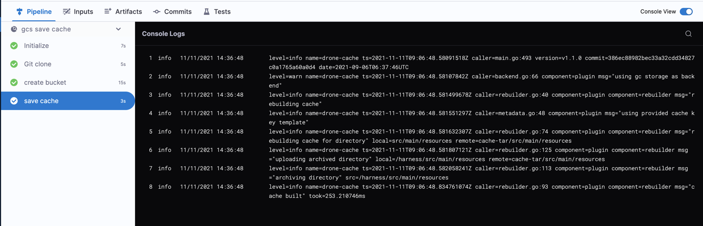
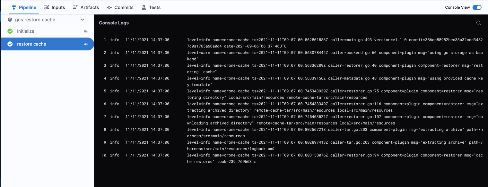

Modern continuous integration systems execute pipelines inside ephemeral environments that are provisioned solely for pipeline execution and are not reused from prior pipeline runs. As builds often require downloading and installing many library and software dependencies, caching these dependencies for quick retrieval at runtime can save a significant amount of time.

In addition to loading dependencies faster, you can also use caching to share data across stages in your Harness CI pipelines. You need to use caching to share data across stages because each stage in a Harness CI pipeline has its own build infrastructure.

This topic explains how you can use the **Save Cache to GCS** and **Restore Cache from GCS** steps in your CI pipelines to save and retrieve cached data from Google Cloud Storage (GCS) buckets. For more information about caching in GCS, go to the Google Cloud documentation on [caching](https://cloud.google.com/storage/docs/caching). In your pipelines, you can also [save and restore cached data from S3](saving-cache.md) or use Harness [Cache Intelligence](./cache-intelligence.md).

:::caution

You can't share access credentials or other [Text Secrets](/docs/platform/Secrets/add-use-text-secrets) across stages.

:::

This topic assumes you have created a pipeline and that you are familiar with the following:

* [Harness key concepts](/docs/getting-started/learn-harness-key-concepts.md)
* [CI pipeline basics](../../ci-quickstarts/ci-pipeline-basics.md)
* [CI Build stage settings](../set-up-build-infrastructure/ci-stage-settings.md)
* [Build infrastructure](/docs/category/set-up-build-infrastructure)

## Requirements

You need a dedicated GCS bucket for your Harness cache operations. Don't save files to the bucket manually. The Retrieve Cache operation fails if the bucket includes any files that don't have a Harness cache key.

You need a [GCP connector](/docs/platform/Connectors/Cloud-providers/ref-cloud-providers/gcs-connector-settings-reference/) that authenticates through a GCP service account key. To do this:

1. In GCP, create an IAM service account. Note the email address generated for the IAM service account; you can use this to identify the service account when assigning roles.
2. Assign the required GCS roles to the service account, as described in the [GCP connector settings reference](/docs/platform/Connectors/Cloud-providers/ref-cloud-providers/gcs-connector-settings-reference/#gcs-and-gcr-role-requirements).
3. Generate a JSON-formatted service account key.
4. In the GCP connector's **Details**, select **Specify credentials here**, and then provide the service account key for authentication. For more information, refer to **Store service account keys as Harness secrets** in the [GCP connector settings reference](/docs/platform/Connectors/Cloud-providers/ref-cloud-providers/gcs-connector-settings-reference/#gcp-connector-settings).

## Add save and restore cache steps

```mdx-code-block
import Tabs from '@theme/Tabs';
import TabItem from '@theme/TabItem';
```

```mdx-code-block
<Tabs>
  <TabItem value="Visual" label="Visual">
```

1. Go to the pipeline and stage where you want to add the **Save Cache to GCS** step.
2. Select **Add Step**, select **Add Step** again, and then select **Save Cache to GCS** in the Step Library.
3. Configure the [Save Cache to GCS step settings](#save-cache-to-gcs-step-settings).
4. Select **Apply changes** to save the step.
5. Go to the stage where you want to add the **Restore Cache from GCS** step.
6. Select **Add Step**, select **Add Step** again, and then select **Restore Cache from GCS** in the Step Library.
7. Configure the [Restore Cache from GCS step settings](#restore-cache-from-gcs-step-settings). The bucket and key must correspond with the bucket and key settings in the **Save Cache to GCS** step.
8. Select **Apply changes** to save the step, and then select **Save** to save the pipeline.

```mdx-code-block
  </TabItem>
  <TabItem value="YAML" label="YAML" default>
```

To add a **Save Cache to GCS** step in the YAML editor, add a `type: SaveCacheGCS` step, then define the [Save Cache to GCS step settings](#save-cache-to-gcs-step-settings). The following are required:

* `connectorRef` The GCP connector ID.
* `bucket`: The GCS cache bucket name.
* `key`: The GCS cache key to identify the cache.
* `sourcePaths`: Files and folders to cache. Specify each file or folder separately.
* `archiveFormat`: The archive format. The default format is `Tar`.

Here is an example of the YAML for a **Save Cache to GCS** step.

```yaml
              - step:
                  type: SaveCacheGCS
                  name: Save Cache to GCS_1
                  identifier: SaveCachetoGCS_1
                  spec:
                    connectorRef: account.gcp
                    bucket: ci_cache
                    key: gcs-{{ checksum filePath1 }} # example cache key based on file checksum
                    sourcePaths:
                      - directory1 # example first directory to cache
                      - directory2 # example second directory to cache
                    archiveFormat: Tar
```

To add a **Restore Cache from GCS** step in the YAML editor, add a `type: RestoreCacheGCS` step, and then define the [Restore Cache from GCS step settings](#restore-cache-from-gcs-step-settings). The following settings are required:

* `connectorRef` The GCP connector ID.
* `bucket`: The GCS cache bucket name. This must correspond with the Save Cache to GCS `bucket`.
* `key`: The GCS cache key to identify the cache. This must correspond with the Save Cache to GCS `key`.
* `archiveFormat`: The archive format, corresponding with the Save Cache to GCS `archiveFormat`.

Here is an example of the YAML for a **Restore Cache from GCS** step.

```yaml
              - step:
                  type: RestoreCacheGCS
                  name: Restore Cache From GCS_1
                  identifier: RestoreCacheFromGCS_1
                  spec:
                    connectorRef: account.gcp
                    bucket: ci_cache
                    key: gcs-{{ checksum filePath1 }} # example cache key based on file checksum
                    archiveFormat: Tar
```

```mdx-code-block
  </TabItem>
</Tabs>
```

### Save Cache to GCS step settings

<details>
<summary>Save Cache to GCS step settings</summary>

:::info

Depending on the stage's build infrastructure, some settings may be unavailable or located under **Optional Configuration** in the visual pipeline editor. Settings specific to containers, such as **Set Container Resources**, are not applicable when using the step in a stage with VM or Harness Cloud build infrastructure.

:::

#### Name

Enter a name summarizing the step's purpose. Harness automatically assigns an **Id** ([Entity Identifier Reference](/docs/platform/20_References/entity-identifier-reference.md)) based on the **Name**. You can change the **Id**.

#### GCP Connector

The Harness connector for the GCP account where you want to save the cache. For more information, go to [Google Cloud Platform (GCP) connector settings reference](/docs/platform/Connectors/Cloud-providers/ref-cloud-providers/gcs-connector-settings-reference).

This step supports GCP connectors that use access key authentication. It does not support GCP connectors that inherit delegate credentials.

#### Bucket

The GCS destination bucket name.

#### Key

The key to identify the cache.

You can use the checksum macro to create a key based on a file's checksum, for example: `myApp-{{ checksum filePath1 }}`

With this macro, Harness checks if the key exists and compares the checksum. If the checksum matches, then Harness doesn't save the cache. If the checksum is different, then Harness saves the cache.

The backslash character isn't allowed as part of the checksum value here. This is a limitation of the Go language (golang) template. You must use a forward slash instead.

* Incorrect format: `cache-{{ checksum ".\src\common\myproj.csproj" }`
* Correct format: `cache-{{ checksum "./src/common/myproj.csproj" }}`

#### Source Paths

A list of the files/folders to cache. Add each file/folder separately.

#### Archive Format

Select the archive format. The default archive format is Tar.

#### Override Cache

Select this option if you want to override the cache if a cache with a matching **Key** already exists.

By default, the **Override Cache** option is set to false (unselected).

#### Run as User

Specify the user ID to use to run all processes in the pod if running in containers. For more information, go to [Set the security context for a pod](https://kubernetes.io/docs/tasks/configure-pod-container/security-context/#set-the-security-context-for-a-pod).

#### Set Container Resources

Maximum resources limits for the resources used by the container at runtime:

* **Limit Memory:** Maximum memory that the container can use. You can express memory as a plain integer or as a fixed-point number with the suffixes `G` or `M`. You can also use the power-of-two equivalents, `Gi` or `Mi`. Do not include spaces when entering a fixed value. The default is `500Mi`.
* **Limit CPU:** The maximum number of cores that the container can use. CPU limits are measured in CPU units. Fractional requests are allowed. For example, you can specify one hundred millicpu as `0.1` or `100m`. The default is `400m`. For more information, go to [Resource units in Kubernetes](https://kubernetes.io/docs/concepts/configuration/manage-resources-containers/#resource-units-in-kubernetes).

#### Timeout

Set the timeout limit for the step. Once the timeout limit is reached, the step fails and pipeline execution continues. To set skip conditions or failure handling for steps, go to:

* [Step Skip Condition settings](/docs/platform/8_Pipelines/w_pipeline-steps-reference/step-skip-condition-settings.md)
* [Step Failure Strategy settings](/docs/platform/8_Pipelines/w_pipeline-steps-reference/step-failure-strategy-settings.md)

</details>

#### Stage setting: Shared paths

Pipeline steps within a stage share the same [workspace](/docs/continuous-integration/use-ci/set-up-build-infrastructure/ci-stage-settings#workspace). You can optionally [share paths](/docs/continuous-integration/use-ci/caching-ci-data/share-ci-data-across-steps-and-stages#share-data-between-steps-in-a-stage) outside the workspace between steps in your stage by setting `spec.sharedPaths`.

```yaml
  stages:
    - stage:
        spec:
          sharedPaths:
            - /example/path # directory outside workspace to share between steps
```

### Restore Cache from GCS step settings

<details>
<summary>Restore Cache from GCS step settings</summary>

:::info

Depending on the stage's build infrastructure, some settings may be unavailable or located under **Optional Configuration** in the visual pipeline editor. Settings specific to containers, such as **Set Container Resources**, are not applicable when using the step in a stage with VM or Harness Cloud build infrastructure.

:::

#### Name

Enter a name summarizing the step's purpose. Harness automatically assigns an **Id** ([Entity Identifier Reference](/docs/platform/20_References/entity-identifier-reference.md)) based on the **Name**. You can change the **Id**.

#### GCP Connector

The Harness connector for the GCP account where the cache is saved.

This step supports GCP connectors that use access key authentication. It does not support GCP connectors that inherit delegate credentials.

#### Bucket

The name of the GCS bucket containing the target cache.

#### Key

The key identifying the cache to restore.

You can use the checksum macro to restore a key based on a file's checksum, for example `myApp-{{ checksum "path/to/file" }}` or `gcp-{{ checksum "package.json" }}`. The result of the checksum macro is concatenated to the leading string.

The backslash character isn't allowed as part of the checksum value here. This is a limitation of the Go language (golang) template. You must use a forward slash instead, for example:

* Incorrect format: `cache-{{ checksum ".\src\common\myproj.csproj" }}`
* Correct format: `cache-{{ checksum "./src/common/myproj.csproj" }}`

#### Archive Format

Select the archive format. The default archive format is Tar.

#### Fail if Key Doesn't Exist

Select this option to fail the step if the specified **Key** doesn't exist.

By default, this option is set to false (unselected).

#### Run as User

Specify the user ID to use to run all processes in the pod if running in containers. For more information, go to [Set the security context for a pod](https://kubernetes.io/docs/tasks/configure-pod-container/security-context/#set-the-security-context-for-a-pod).

#### Set Container Resources

Maximum resources limits for the resources used by the container at runtime:

* **Limit Memory:** Maximum memory that the container can use. You can express memory as a plain integer or as a fixed-point number with the suffixes `G` or `M`. You can also use the power-of-two equivalents, `Gi` or `Mi`. Do not include spaces when entering a fixed value. The default is `500Mi`.
* **Limit CPU:** The maximum number of cores that the container can use. CPU limits are measured in CPU units. Fractional requests are allowed. For example, you can specify one hundred millicpu as `0.1` or `100m`. The default is `400m`. For more information, go to [Resource units in Kubernetes](https://kubernetes.io/docs/concepts/configuration/manage-resources-containers/#resource-units-in-kubernetes).

#### Timeout

Set the timeout limit for the step. Once the timeout limit is reached, the step fails and pipeline execution continues. To set skip conditions or failure handling for steps, go to:

* [Step Skip Condition settings](/docs/platform/8_Pipelines/w_pipeline-steps-reference/step-skip-condition-settings.md)
* [Step Failure Strategy settings](/docs/platform/8_Pipelines/w_pipeline-steps-reference/step-failure-strategy-settings.md)

</details>

### Language-specific requirements

The cache key and paths differ by language.

```mdx-code-block
<Tabs>
<TabItem value="Go">
```

[Go](https://go.dev/) pipelines must reference `go.sum` for `spec.key` in **Save Cache to GCS** and **Restore Cache From GCS** steps, for example:

```yaml
                  spec:
                    key: cache-{{ checksum "go.sum" }}
```

`spec.sourcePaths` must include `/go/pkg/mod` and `/root/.cache/go-build` in the **Save Cache to GCS** step, for example:

```yaml
                  spec:
                    sourcePaths:
                      - /go/pkg/mod
                      - /root/.cache/go-build
```

```mdx-code-block
</TabItem>

<TabItem value="Node.js">
```

[npm](https://www.npmjs.com/) pipelines must reference `package-lock.json` for `spec.key` in **Save Cache to GCS** and **Restore Cache From GCS** steps, for example:

```yaml
                  spec:
                    key: cache-{{ checksum "package-lock.json" }}
```

[Yarn](https://yarnpkg.com/) pipelines must reference `yarn.lock` for `spec.key` in **Save Cache to GCS** and **Restore Cache From GCS** steps, for example:

```yaml
                  spec:
                    key: cache-{{ checksum "yarn.lock" }}
```

`spec.sourcePaths` must include `node_modules` in the **Save Cache to GCS** step, for example:

```yaml
                  spec:
                    sourcePaths:
                      - node_modules
```

```mdx-code-block
</TabItem>

<TabItem value="Maven">
```

[Maven](https://maven.apache.org/) pipelines must reference `pom.xml` for `spec.key` in **Save Cache to GCS** and **Restore Cache From GCS** steps, for example:

```yaml
                  spec:
                    key: cache-{{ checksum "pom.xml" }}
```

`spec.sourcePaths` must include `/root/.m2` in the **Save Cache to GCS** step, for example:

```yaml
                  spec:
                    sourcePaths:
                      - /root/.m2
```

```mdx-code-block
</TabItem>
</Tabs>
```

## Placement of save and restore cache steps

The placement and sequence of the save and restore cache steps depends on how you're using caching in a pipeline.

* If you use caching to optimize a single stage, the **Restore Cache from GCS** step occurs before the **Save Cache to GCS** step.
* If you use caching to share data across stages, the **Save Cache to GCS** step occurs in the stage where you create the data you want to cache, and the **Restore Cache from GCS** step occurs in the stage where you want to load the previously-cached data.

The following YAML examples show save and restore cache steps used within the same stage and across two stages.

<details>
<summary>YAML example: Restore and save cache in the same stage</summary>

This YAML example includes one stage. At the beginning of the stage, the cache is restored so the cached data can be used for the build steps. At the end of the stage, if the cached files changed, updated file are saved to the cache bucket.

```yaml
  stages:
    - stage:
        name: Build
        identifier: Build
        type: CI
        spec:
          cloneCodebase: true
          execution:
            steps:
              - step:
                  type: RestoreCacheGCS
                  name: Restore Cache From GCS_1
                  identifier: RestoreCacheFromGCS_1
                  spec:
                    connectorRef: account.gcp
                    bucket: ci_cache
                    key: gcp-{{ checksum "package.json" }}
                    archiveFormat: Tar
 ...
              - step:
                  type: SaveCacheGCS
                  name: Save Cache to GCS_1
                  identifier: SaveCachetoGCS_1
                  spec:
                    connectorRef: account.gcp
                    bucket: ci_cache
                    key: gcp-{{ checksum "package.json" }}
                    sourcePaths:
                      - /harness/node_modules
                    archiveFormat: Tar
```

</details>

<details>
<summary>YAML example: Save and restore cache across stages</summary>

This YAML example includes two stages. The first stage creates a cache bucket and saves the cache to the bucket, and the second stage retrieves the previously-saved cache.

```yaml
    stages:  
        - stage:  
              identifier: GCS_Save_Cache  
              name: GCS Save Cache  
              type: CI  
              variables:  
                  - name: GCP_Access_Key  
                    type: String  
                    value: <+input>  
                  - name: GCP_Secret_Key  
                    type: Secret  
                    value: <+input>  
              spec:  
                  sharedPaths:  
                      - /.config  
                      - /.gsutil  
                  execution:  
                      steps:  
                          - step:  
                                identifier: createBucket  
                                name: create bucket  
                                type: Run  
                                spec:  
                                    connectorRef: <+input>  
                                    image: google/cloud-sdk:alpine  
                                    command: |+  
                                        echo $GCP_SECRET_KEY > secret.json  
                                        cat secret.json  
                                        gcloud auth -q activate-service-account --key-file=secret.json  
                                        gsutil rm -r gs://harness-gcs-cache-tar || true  
  
                                        gsutil mb -p ci-play gs://harness-gcs-cache-tar  
  
                                    privileged: false  
                          - step:  
                                identifier: saveCacheTar  
                                name: Save Cache  
                                type: SaveCacheGCS  
                                spec:  
                                    connectorRef: <+input>  
                                    bucket: harness-gcs-cache-tar  
                                    key: cache-tar  
                                    sourcePaths:  
                                        - <+input>  
                                    archiveFormat: Tar  
...
        - stage:  
              identifier: gcs_restore_cache  
              name: GCS Restore Cache  
              type: CI  
              variables:  
                  - name: GCP_Access_Key  
                    type: String  
                    value: <+input>  
                  - name: GCP_Secret_Key  
                    type: Secret  
                    value: <+input>  
              spec:  
                  sharedPaths:  
                      - /.config  
                      - /.gsutil  
                  execution:  
                      steps:  
                          - step:  
                                identifier: restoreCacheTar  
                                name: Restore Cache  
                                type: RestoreCacheGCS  
                                spec:  
                                    connectorRef: <+input>  
                                    bucket: harness-gcs-cache-tar  
                                    key: cache-tar  
                                    archiveFormat: Tar  
                                    failIfKeyNotFound: true  
```

</details>

## Cache step logs

You can observe and review build logs on the [Build details page](../viewing-builds.md).

<details>
<summary>Example: Save Cache to GCS step logs</summary>

```
level=info name=drone-cache ts=2021-11-11T09:06:48.834761074Z caller=rebuilder.go:93 component=plugin component=rebuilder msg="cache built" took=253.210746ms
```



</details>

<details>
<summary>Example: Restore Cache from GCS step logs</summary>

```
level=info name=drone-cache ts=2021-11-11T09:07:00.803158076Z caller=restorer.go:94 component=plugin component=restorer msg="cache restored" took=239.769663ms
```



</details>
