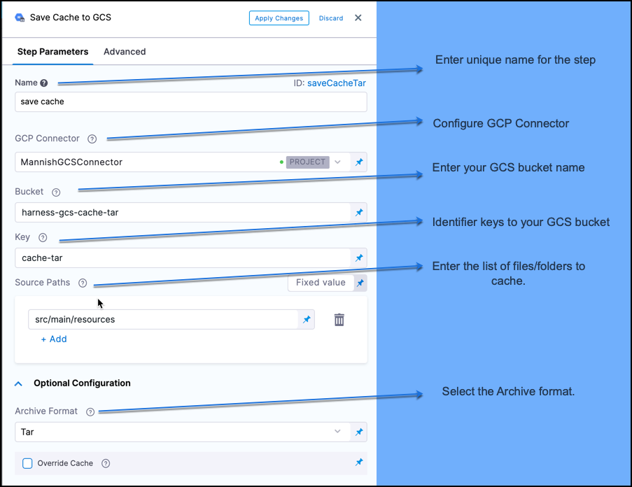

Modern continuous integration systems execute pipelines inside ephemeral environments that are provisioned solely for pipeline execution and are not reused from prior pipeline runs. As builds often require downloading and installing many library and software dependencies, caching these dependencies for quick retrieval at runtime can save a significant amount of time.

In addition to loading dependencies faster, you can also use caching to share data across stages in your Harness CI pipelines. You need to use caching to share data across stages because each stage in a Harness CI pipeline has its own build infrastructure.

This topic explains how you can use the **Save Cache to GCS** and **Restore Cache from GCS** steps in your CI pipelines to save and retrieve cached data from Google Cloud Storage (GCS) buckets. For more information about caching in GCS, go to the Google Cloud documentation on [caching](https://cloud.google.com/storage/docs/caching). In your pipelines, you can also [save and restore cached data from S3](saving-cache.md) or use Harness [Cache Intelligence](./cache-intelligence.md).

:::caution

You can't share access credentials or other [Text Secrets](../../../platform/6_Security/2-add-use-text-secrets.md) across stages.

:::

This topic assumes you have created a pipeline and that you are familiar with the following:

* [Harness key concepts](../../../getting-started/learn-harness-key-concepts.md)
* [CI pipeline basics](../../ci-quickstarts/ci-pipeline-basics.md)
* [CI stage settings](../../ci-technical-reference/ci-stage-settings.md)
* [Build infrastructure](/docs/category/set-up-build-infrastructure)

## Requirements

You need a dedicated GCS bucket for your Harness cache operations. Don't save files to the bucket manually. The Retrieve Cache operation fails if the bucket includes any files that don't have a Harness cache key.

You need a [GCP connector](/docs/platform/connectors/ref-cloud-providers/gcs-connector-settings-reference/) that authenticates through a GCP service account key. To do this:

1. In GCP, create an IAM service account. Note the email address generated for the IAM service account; you can use this to identify the service account when assigning roles.
2. Assign the required GCS roles to the service account, as described in the [GCP connector settings reference](/docs/platform/connectors/ref-cloud-providers/gcs-connector-settings-reference/#gcs-and-gcr-role-requirements).
3. Generate a JSON-formatted service account key.
4. In the GCP connector's **Details**, select **Specify credentials here**, and then provide the service account key for authentication. For more information, refer to **Store service account keys as Harness secrets** in the [GCP connector settings reference](/docs/platform/connectors/ref-cloud-providers/gcs-connector-settings-reference/#gcp-connector-settings).

## Configure save and restore cache steps

The placement and sequence of the save and restore cache steps depends on how you're using caching in a pipeline.

* If you use caching to optimize a single stage, the **Restore Cache from GCS** step occurs before the **Save Cache to GCS** step.
* If you use caching to share data across stages, the **Save Cache to GCS** step occurs in the stage where you create the data you want to cache, and the **Restore Cache from GCS** step occurs in the stage where you want to load the previously-cached data.

```mdx-code-block
import Tabs from '@theme/Tabs';
import TabItem from '@theme/TabItem';
```

```mdx-code-block
<Tabs>
  <TabItem value="Visual" label="Visual editor" default>
```

1. Go to the pipeline and stage where you want to add the **Save Cache to GCS** step.
2. Select **Add Step**, select **Add Step** again, and then select **Save Cache to GCS** in the Step Library.
3. Configure the [Save Cache to GCS step settings](../../ci-technical-reference/save-cache-to-gcs-step-settings.md).

   

4. Select **Apply changes** to save the step.
5. Go to the stage where you want to add the **Restore Cache from GCS** step.
6. Select **Add Step**, select **Add Step** again, and then select **Restore Cache from GCS** in the Step Library.
7. Configure the [Restore Cache from GCS step settings](../../ci-technical-reference/restore-cache-from-s-3-step-settings.md). The bucket and key must correspond with the bucket and key settings in the **Save Cache to GCS** step.
8. Select **Apply changes** to save the step, and then select **Save** to save the pipeline.

```mdx-code-block
  </TabItem>
  <TabItem value="YAML" label="YAML editor">
```

To configure the **Save Cache to GCS** step in YAML, you must specify `type: SaveCacheGCS`. In `step: spec:`, specify the following:

* `connectorRef` The GCP connector ID.
* `bucket`: The GCS cache bucket name.
* `key`: The GCS cache key to identify the cache.
* `sourcePaths`: Files and folders to cache. Specify each file or folder separately.
* `archiveFormat`: The archive format. The default format is `Tar`.

```yaml
              - step:
                  type: SaveCacheGCS
                  name: Save Cache to GCS_1
                  identifier: SaveCachetoGCS_1
                  spec:
                    connectorRef: account.gcp
                    bucket: ci_cache
                    key: gcp-{{ checksum "package.json" }}
                    sourcePaths:
                      - /harness/node_modules
                    archiveFormat: Tar
```

To configure the **Restore Cache from GCS** step in the YAML editor, you must specify `type: RestoreCacheGCS`. In `step: spec:`, specify the following:

* `connectorRef` The GCP connector ID.
* `bucket`: The GCS cache bucket name. This must correspond with the Save Cache to GCS `bucket`.
* `key`: The GCS cache key to identify the cache. This must correspond with the Save Cache to GCS `key`.
* `archiveFormat`: The archive format, corresponding with the Save Cache to GCS `archiveFormat`.

```yaml
              - step:
                  type: RestoreCacheGCS
                  name: Restore Cache From GCS_1
                  identifier: RestoreCacheFromGCS_1
                  spec:
                    connectorRef: account.gcp
                    bucket: ci_cache
                    key: gcp-{{ checksum "package.json" }}
                    archiveFormat: Tar
```

The following YAML examples show save and restore cache steps used within the same stage and across two stages.

<details>
<summary>YAML example: Restore and save cache in the same stage</summary>

This YAML example includes one stage. At the beginning of the stage, the cache is restored so the cached data can be used for the build steps. At the end of the stage, if the cached files changed, updated file are saved to the cache bucket.

```yaml
  stages:
    - stage:
        name: Build
        identifier: Build
        type: CI
        spec:
          cloneCodebase: true
          execution:
            steps:
              - step:
                  type: RestoreCacheGCS
                  name: Restore Cache From GCS_1
                  identifier: RestoreCacheFromGCS_1
                  spec:
                    connectorRef: account.gcp
                    bucket: ci_cache
                    key: gcp-{{ checksum "package.json" }}
                    archiveFormat: Tar
 ...
              - step:
                  type: SaveCacheGCS
                  name: Save Cache to GCS_1
                  identifier: SaveCachetoGCS_1
                  spec:
                    connectorRef: account.gcp
                    bucket: ci_cache
                    key: gcp-{{ checksum "package.json" }}
                    sourcePaths:
                      - /harness/node_modules
                    archiveFormat: Tar
```

</details>

<details>
<summary>YAML example: Save and restore cache across stages</summary>

This YAML example includes two stages. The first stage creates a cache bucket and saves the cache to the bucket, and the second stage retrieves the previously-saved cache.

```yaml
    stages:  
        - stage:  
              identifier: GCS_Save_Cache  
              name: GCS Save Cache  
              type: CI  
              variables:  
                  - name: GCP_Access_Key  
                    type: String  
                    value: <+input>  
                  - name: GCP_Secret_Key  
                    type: Secret  
                    value: <+input>  
              spec:  
                  sharedPaths:  
                      - /.config  
                      - /.gsutil  
                  execution:  
                      steps:  
                          - step:  
                                identifier: createBucket  
                                name: create bucket  
                                type: Run  
                                spec:  
                                    connectorRef: <+input>  
                                    image: google/cloud-sdk:alpine  
                                    command: |+  
                                        echo $GCP_SECRET_KEY > secret.json  
                                        cat secret.json  
                                        gcloud auth -q activate-service-account --key-file=secret.json  
                                        gsutil rm -r gs://harness-gcs-cache-tar || true  
  
                                        gsutil mb -p ci-play gs://harness-gcs-cache-tar  
  
                                    privileged: false  
                          - step:  
                                identifier: saveCacheTar  
                                name: Save Cache  
                                type: SaveCacheGCS  
                                spec:  
                                    connectorRef: <+input>  
                                    bucket: harness-gcs-cache-tar  
                                    key: cache-tar  
                                    sourcePaths:  
                                        - <+input>  
                                    archiveFormat: Tar  
...
        - stage:  
              identifier: gcs_restore_cache  
              name: GCS Restore Cache  
              type: CI  
              variables:  
                  - name: GCP_Access_Key  
                    type: String  
                    value: <+input>  
                  - name: GCP_Secret_Key  
                    type: Secret  
                    value: <+input>  
              spec:  
                  sharedPaths:  
                      - /.config  
                      - /.gsutil  
                  execution:  
                      steps:  
                          - step:  
                                identifier: restoreCacheTar  
                                name: Restore Cache  
                                type: RestoreCacheGCS  
                                spec:  
                                    connectorRef: <+input>  
                                    bucket: harness-gcs-cache-tar  
                                    key: cache-tar  
                                    archiveFormat: Tar  
                                    failIfKeyNotFound: true  
```

</details>

```mdx-code-block
  </TabItem>
</Tabs>
```

## Cache step logs

You can observe and review build logs on the [Build details page](../view-your-builds/viewing-builds.md).

<details>
<summary>Example: Save Cache to GCS step logs</summary>

```
level=info name=drone-cache ts=2021-11-11T09:06:48.834761074Z caller=rebuilder.go:93 component=plugin component=rebuilder msg="cache built" took=253.210746ms
```


</details>

<details>
<summary>Example: Restore Cache from GCS step logs</summary>

```
level=info name=drone-cache ts=2021-11-11T09:07:00.803158076Z caller=restorer.go:94 component=plugin component=restorer msg="cache restored" took=239.769663ms
```


</details>
