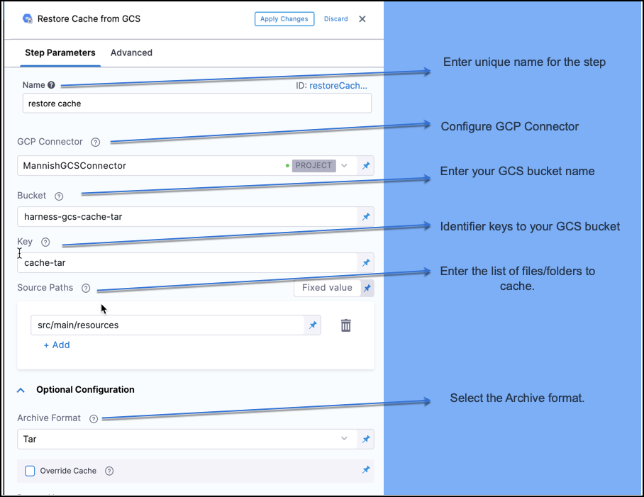

Modern continuous integration systems execute pipelines inside ephemeral environments that are provisioned solely for pipeline execution and are not reused from prior pipeline runs. As builds often require downloading and installing many library and software dependencies, caching these dependencies for quick retrieval at runtime can save a significant amount of time.

In addition to loading dependencies faster, you can also use caching to share data across stages in your Harness CI pipelines. You need to use caching to share data across stages because each stage in a Harness CI pipeline has its own build infrastructure.

This topic explains how you can use the **Save Cache to GCS** and **Restore Cache from GCS** steps in your CI pipelines to save and retrieve cached data from Google Cloud Storage (GCS) buckets. For more information about caching in GCS, go to the Google Cloud documentation on [caching](https://cloud.google.com/storage/docs/caching). In your pipelines, you can also [save and restore cached data from S3](saving-cache.md) and use Harness [Cache Intelligence](./cache-intelligence.md).

This topic assumes you are familiar with the following:

* [Harness key concepts](../../../getting-started/learn-harness-key-concepts.md)
* [CI pipeline basics](../../ci-quickstarts/ci-pipeline-basics.md)
* [CI stage settings](../../ci-technical-reference/ci-stage-settings.md)
* [Build infrastructure](/docs/category/set-up-build-infrastructure)

:::caution

You can't share access credentials or other [Text Secrets](../../../platform/6_Security/2-add-use-text-secrets.md) across stages.
<!-- should this just say "You cant store access credentials or other [text secrets] in caches"? -->

:::

## Prepare GCS for Harness cache operations

* Create a dedicated GCS bucket for your Harness cache operations.
* Don't save files to the bucket manually. The Retrieve Cache operation fails if the bucket includes any files that don't have a Harness cache key.

<!-- Is it necessary to know this: https://cloud.google.com/cdn/docs/caching -->


(tabs)


## Review: YAML Example

If you want to configure your Pipeline in YAML, in **Pipeline Studio,** click **YAML**. 

The following YAML file defines a Pipeline with two Stages: Save Cache and Restore Cache. Copy the following YAML, paste it in the Harness YAML editor, and modify its attributes based on your Pipeline requirements.


```
pipeline:  
    identifier: GCS_Save_and_Restore_Cache  
    name: GCS Save and Restore Cache  
    stages:  
        - stage:  
              identifier: GCS_Save_Cache  
              name: GCS Save Cache  
              type: CI  
              variables:  
                  - name: GCP_Access_Key  
                    type: String  
                    value: <+input>  
                  - name: GCP_Secret_Key  
                    type: Secret  
                    value: <+input>  
              spec:  
                  sharedPaths:  
                      - /.config  
                      - /.gsutil  
                  execution:  
                      steps:  
                          - step:  
                                identifier: createBucket  
                                name: create bucket  
                                type: Run  
                                spec:  
                                    connectorRef: <+input>  
                                    image: google/cloud-sdk:alpine  
                                    command: |+  
                                        echo $GCP_SECRET_KEY > secret.json  
                                        cat secret.json  
                                        gcloud auth -q activate-service-account --key-file=secret.json  
                                        gsutil rm -r gs://harness-gcs-cache-tar || true  
  
                                        gsutil mb -p ci-play gs://harness-gcs-cache-tar  
  
                                    privileged: false  
                          - step:  
                                identifier: saveCacheTar  
                                name: Save Cache  
                                type: SaveCacheGCS  
                                spec:  
                                    connectorRef: <+input>  
                                    bucket: harness-gcs-cache-tar  
                                    key: cache-tar  
                                    sourcePaths:  
                                        - <+input>  
                                    archiveFormat: Tar  
                  infrastructure:  
                      type: KubernetesDirect  
                      spec:  
                          connectorRef: <+input>  
                          namespace: default  
                  cloneCodebase: true  
        - stage:  
              identifier: gcs_restore_cache  
              name: GCS Restore Cache  
              type: CI  
              variables:  
                  - name: GCP_Access_Key  
                    type: String  
                    value: <+input>  
                  - name: GCP_Secret_Key  
                    type: Secret  
                    value: <+input>  
              spec:  
                  sharedPaths:  
                      - /.config  
                      - /.gsutil  
                  execution:  
                      steps:  
                          - step:  
                                identifier: restoreCacheTar  
                                name: Restore Cache  
                                type: RestoreCacheGCS  
                                spec:  
                                    connectorRef: <+input>  
                                    bucket: harness-gcs-cache-tar  
                                    key: cache-tar  
                                    archiveFormat: Tar  
                                    failIfKeyNotFound: true  
                  infrastructure:  
                      useFromStage: gcs_save_cache  
                  cloneCodebase: false  
 
```

## Step 1: Open the Build Stage

In your Harness Pipeline, open the Stage where you want to save the cache.

## Step 2: Define the Build Farm Infrastructure

In the Infrastructure tab, define the build farm for the codebase.

The following step uses a Kubernetes cluster build farm.

See [Set up a Kubernetes cluster build infrastructure](../set-up-build-infrastructure/set-up-a-kubernetes-cluster-build-infrastructure.md).

## Step 3: Save Cache to GCS

In the Execution tab, click **Add Step** and then select **Save Cache to GCS**. Here you configure the GCS bucket, keys, and source paths to enable Harness to save the cache to GCS.

For step settings, see [Save Cache to GCS Step Settings](../../ci-technical-reference/save-cache-to-gcs-step-settings.md).


## Step 4: Restore Cache from GCS Stage

In your Pipeline, click **Add Stage** where you want to restore the saved cache from GCS. 

In the Execution tab, click **Add Step** and then select **Restore Cache from GCS**. Here you configure the GCS bucket keys on which you have your saved cache.

For step settings, see [Restore Cache Step Settings](../../ci-technical-reference/restore-cache-from-s-3-step-settings.md).



When you are done, click **Apply Changes**.

## Step 5: Run Pipeline

Click **Save** to save the changes, then click **Run Pipeline**. 

## Step 6: View the Results

You can see the logs for the Pipeline as it runs.

### Save Cache Stage Output

In the Save Cache stage, you can see the logs for **Save Cache to GCS** step in the Pipeline as it runs.


```
level=info name=drone-cache ts=2021-11-11T09:06:48.834761074Z caller=rebuilder.go:93 component=plugin component=rebuilder msg="cache built" took=253.210746ms
```
### Restore Cache Stage Output

In the Restore Cache stage, you can see the logs for **Restore Cache from GCS** step in the Pipeline as it runs.


```
level=info name=drone-cache ts=2021-11-11T09:07:00.803158076Z caller=restorer.go:94 component=plugin component=restorer msg="cache restored" took=239.769663ms
```
