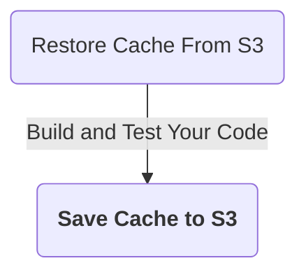
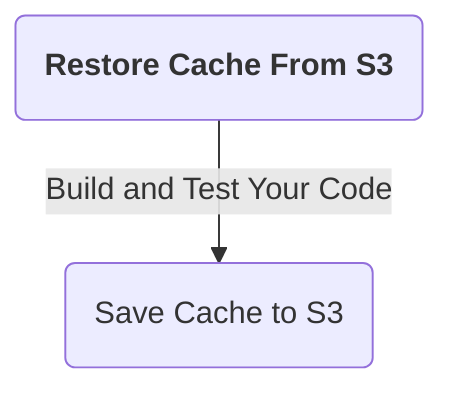
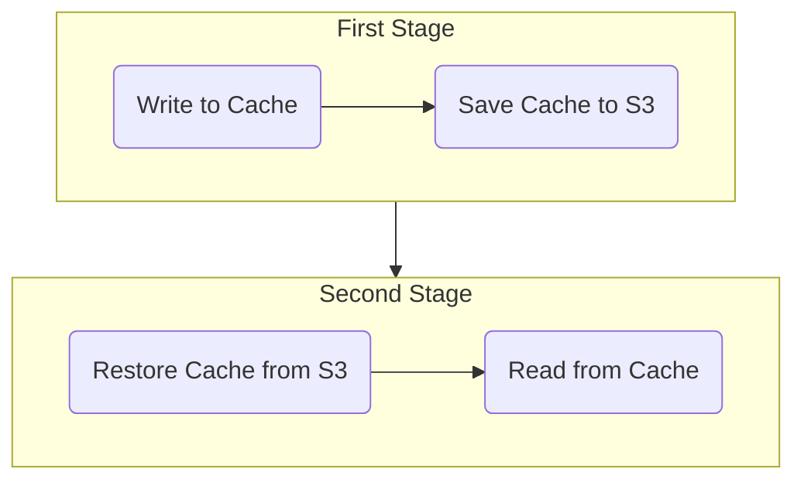

```mdx-code-block
import Tabs from '@theme/Tabs';
import TabItem from '@theme/TabItem';
```

Caching enables sharing data across stages. Caching also speeds up builds by reusing data from expensive fetch operations in previous jobs.

Caching has two primary benefits:

* Run pipelines faster by reusing the expensive fetch operation data from previous builds
* Share data across stages

You can cache data to an AWS S3 bucket in one stage using the **Save Cache to S3** step, and restore it in the same stage or a following stage using the **Restore Cache From S3** step.

This topic explains how to configure the **Save Cache to S3** and **Restore Cache From S3** steps in Harness CI.

You cannot share access credentials or other [Text Secrets](/docs/platform/Secrets/add-use-text-secrets) across Stages.

:::info

If you are using Harness Cloud build infrastructure, you can use [Cache Intelligence](cache-intelligence.md) to automate caching.

:::

## Requirements

You need a dedicated S3 bucket for your Harness CI cache operations, and you need an AWS connector with read/write access to this S3 bucket.

<details><summary>Sample S3 Cache Bucket Policy</summary>

```json
{
    "Version": "2012-10-17",
    "Statement": [
        {
            "Sid": "AllowS3BucketAccess",
            "Effect": "Allow",
            "Action": [
                "s3:PutObject",
                "s3:GetObject",
                "s3:ListBucket",
                "s3:DeleteObject"
            ],
            "Resource": [
                "arn:aws:s3:::your-s3-bucket/*",
                "arn:aws:s3:::your-s3-bucket"
            ]
        },
        {
            "Sid": "AllowDescribeRegions",
            "Effect": "Allow",
            "Action": "ec2:DescribeRegions",
            "Resource": "*"
        }
    ]
}
```

</details>

For more information on configuring an S3 connector and S3 bucket policies, go to [Add an AWS connector](/docs/platform/Connectors/Cloud-providers/add-aws-connector) and the [AWS connector settings reference](/docs/platform/Connectors/Cloud-providers/ref-cloud-providers/aws-connector-settings-reference).

Optionally, you can create a [lifecycle configuration](https://docs.aws.amazon.com/AmazonS3/latest/userguide/object-lifecycle-mgmt.html) to automatically delete old cache data from your S3 bucket.

:::caution

Use a dedicated bucket for your Harness CI cache operations. Do not save files to the bucket manually. The Restore Cache operation will fail if the bucket includes any files that do not have a Harness cache key.

:::

## Add the Save Cache to S3 step

Add the **Save Cache to S3** step after steps that build and test your code, as shown in this diagram:



Here is a YAML example of a **Save Cache to S3** step.

```yaml
              - step:
                  type: SaveCacheS3
                  name: Save Cache to S3
                  identifier: Save_Cache_to_S3
                  spec:
                    connectorRef: AWS_Connector
                    region: us-east-1
                    bucket: your-s3-bucket
                    key: cache-{{ checksum filePath1 }} # example cache key based on file checksum
                    sourcePaths:
                      - directory1 # example first directory to cache
                      - directory2 # example second directory to cache
                    archiveFormat: Tar
...
```

### Save Cache to S3 step settings

<details>
<summary>Save Cache to S3 step settings</summary>

:::info

Depending on the stage's build infrastructure, some settings may be unavailable or located under **Optional Configuration** in the visual pipeline editor. Settings specific to containers, such as **Set Container Resources**, are not applicable when using the step in a stage with VM or Harness Cloud build infrastructure.

:::

#### Name

Enter a name summarizing the step's purpose. Harness automatically assigns an **Id** ([Entity Identifier Reference](/docs/platform/20_References/entity-identifier-reference.md)) based on the **Name**. You can change the **Id**.

#### AWS Connector

The Harness AWS connector to use when saving the cache to S3. The AWS IAM roles and policies associated with the account used in the Harness AWS Connector must be able to write to S3.

:::note

This step supports AWS connectors using **AWS Access Key**, **Assume IAM role on Delegate**, and IRSA authentication methods *without* cross-account access (ARN/STS).

This step doesn't support AWS connectors that have enabled cross-account access (ARN/STS) for any authentication method.

:::

For more information about roles and permissions for AWS connectors, go to:

* [Add an AWS connector](/docs/platform/Connectors/Cloud-providers/add-aws-connector)
* [AWS connector settings reference](/docs/platform/Connectors/Cloud-providers/ref-cloud-providers/aws-connector-settings-reference).

#### Region

Define the AWS region to use when saving the cache, such as the AWS region you selected when you created the AWS S3 bucket. For more information go to the AWS documentation:

* [Creating, configuring, and working with Amazon S3 buckets](https://docs.aws.amazon.com/AmazonS3/latest/user-guide/create-configure-bucket.html)
* [Pushing a Docker image to an Amazon ECR repository](https://docs.aws.amazon.com/AmazonECR/latest/userguide/docker-push-ecr-image.html)

#### Bucket

The AWS S3 bucket where you want to save the cache.

#### Key

The key to identify the cache.

You can use the checksum macro to create a key based on a file's checksum, for example: `myApp-{{ checksum filePath1 }}`

With this macro, Harness checks if the key exists and compares the checksum. If the checksum matches, then Harness doesn't save the cache. If the checksum is different, then Harness saves the cache.

The backslash character isn't allowed as part of the checksum value here. This is a limitation of the Go language (golang) template. You must use a forward slash instead.

* Incorrect format: `cache-{{ checksum ".\src\common\myproj.csproj" }`
* Correct format: `cache-{{ checksum "./src/common/myproj.csproj" }}`

#### Source Paths

A list of the files/folders to cache. Add each file/folder separately.

#### Endpoint URL

Endpoint URL for S3-compatible providers. This setting is not needed for AWS.

#### Archive Format

Select the archive format. The default archive format is Tar.

#### Override Cache

Select this option if you want to override the cache if a cache with a matching **Key** already exists.

By default, the **Override Cache** option is set to false (unselected).

#### Path Style

If unselected, the step uses Virtual Hosted Style for paths, such as `http://bucket.host/key`. If selected, the step uses Path Style, such as `http://host/bucket/key`.

For MinIO, you must use Path Style. Make sure **Path Style** is true (selected).

By default, **Path Style** is false (unselected).

#### Run as User

Specify the user ID to use to run all processes in the pod if running in containers. For more information, go to [Set the security context for a pod](https://kubernetes.io/docs/tasks/configure-pod-container/security-context/#set-the-security-context-for-a-pod).

#### Set Container Resources

Maximum resources limits for the resources used by the container at runtime:

* **Limit Memory:** Maximum memory that the container can use. You can express memory as a plain integer or as a fixed-point number with the suffixes `G` or `M`. You can also use the power-of-two equivalents, `Gi` or `Mi`. Do not include spaces when entering a fixed value. The default is `500Mi`.
* **Limit CPU:** The maximum number of cores that the container can use. CPU limits are measured in CPU units. Fractional requests are allowed. For example, you can specify one hundred millicpu as `0.1` or `100m`. The default is `400m`. For more information, go to [Resource units in Kubernetes](https://kubernetes.io/docs/concepts/configuration/manage-resources-containers/#resource-units-in-kubernetes).

#### Timeout

Set the timeout limit for the step. Once the timeout limit is reached, the step fails and pipeline execution continues. To set skip conditions or failure handling for steps, go to:

* [Step Skip Condition settings](../../../platform/8_Pipelines/w_pipeline-steps-reference/step-skip-condition-settings.md)
* [Step Failure Strategy settings](../../../platform/8_Pipelines/w_pipeline-steps-reference/step-failure-strategy-settings.md)

</details>

#### Stage setting: Shared paths

Pipeline steps within a stage share the same [workspace](/docs/continuous-integration/use-ci/set-up-build-infrastructure/ci-stage-settings#workspace). You can optionally [share paths](/docs/continuous-integration/use-ci/caching-ci-data/share-ci-data-across-steps-and-stages#share-data-between-steps-in-a-stage) outside the workspace between steps in your stage by setting `spec.sharedPaths`.

```yaml
  stages:
    - stage:
        spec:
          sharedPaths:
            - /example/path # directory outside workspace to share between steps
```

## Add the Restore Cache From S3 step

Add the **Restore Cache From S3** step before steps that build and test your code, as shown in the following diagram:



Here is a YAML example of a **Restore Cache From S3** step.

```yaml
              - step:
                  type: RestoreCacheS3
                  name: Restore Cache From S3
                  identifier: Restore_Cache_From_S3
                  spec:
                    connectorRef: AWS_Connector
                    region: us-east-1
                    bucket: your-s3-bucket
                    key: cache-{{ checksum filePath1 }} # example cache key based on file checksum
                    archiveFormat: Tar
...
```

:::caution

The `key` value in this step must match the `key` value in your **Save Cache to S3** step.

:::

### Restore Cache from S3 step settings

<details>
<summary>Restore Cache from S3 step settings</summary>

:::info

Depending on the stage's build infrastructure, some settings may be unavailable or located under **Optional Configuration** in the visual pipeline editor. Settings specific to containers, such as **Set Container Resources**, are not applicable when using the step in a stage with VM or Harness Cloud build infrastructure.

:::

#### Name

Enter a name summarizing the step's purpose. Harness automatically assigns an **Id** ([Entity Identifier Reference](/docs/platform/20_References/entity-identifier-reference.md)) based on the **Name**. You can change the **Id**.

#### AWS Connector

The Harness Connector to use when restoring the cache from AWS S3. If your pipeline also has a **Save Cache to S3** step, these steps typically use the same connector.

The AWS IAM roles and policies associated with the account used in the Harness AWS Connector must be able to read from S3.

:::note

This step supports AWS connectors using **AWS Access Key**, **Assume IAM role on Delegate**, and IRSA authentication methods *without* cross-account access (ARN/STS).

This step doesn't support AWS connectors that have enabled cross-account access (ARN/STS) for any authentication method.

:::

For more information about roles and permissions for AWS connectors, go to:

* [Add an AWS connector](/docs/platform/Connectors/Cloud-providers/add-aws-connector)
* [AWS connector settings reference](/docs/platform/Connectors/Cloud-providers/ref-cloud-providers/aws-connector-settings-reference)

#### Region

The relevant AWS region. If your pipeline also has a **Save Cache to S3** step, the region is typically the same for both steps.

#### Bucket

The AWS S3 bucket where the target cache is saved. If your pipeline also has a **Save Cache to S3** step, the bucket is typically the same for both steps.

#### Key

The key identifying the cache that you want to retrieve. If your pipeline also has a **Save Cache to S3** step, the key value must be the same to restore the previously-saved cache.

The backslash character isn't allowed as part of the checksum value here. This is a limitation of the Go language (golang) template. You must use a forward slash instead:

* Incorrect format: `cache-{{ checksum ".\src\common\myproj.csproj" }`
* Correct format: `cache-{{ checksum "./src/common/myproj.csproj" }}`

#### Endpoint URL

Endpoint URL for S3-compatible providers. This is not needed for AWS.

#### Archive Format

Select the archive format. The default archive format is Tar.

#### Path Style

If unselected, the step uses Virtual Hosted Style for paths, such as `http://bucket.host/key`. If selected, the step uses Path Style, such as `http://host/bucket/key`.

For MinIO, you must use Path Style. Make sure **Path Style** is true (selected).

By default, **Path Style** is false (unselected).

#### Fail if Key Doesn't Exist

Select this option to fail the step if the specified **Key** doesn't exist.

By default, this option is set to false (unselected).

#### Run as User

Specify the user ID to use to run all processes in the pod if running in containers. For more information, go to [Set the security context for a pod](https://kubernetes.io/docs/tasks/configure-pod-container/security-context/#set-the-security-context-for-a-pod).

#### Set Container Resources

Maximum resources limits for the resources used by the container at runtime:

* **Limit Memory:** Maximum memory that the container can use. You can express memory as a plain integer or as a fixed-point number with the suffixes `G` or `M`. You can also use the power-of-two equivalents, `Gi` or `Mi`. Do not include spaces when entering a fixed value. The default is `500Mi`.
* **Limit CPU:** The maximum number of cores that the container can use. CPU limits are measured in CPU units. Fractional requests are allowed. For example, you can specify one hundred millicpu as `0.1` or `100m`. The default is `400m`. For more information, go to [Resource units in Kubernetes](https://kubernetes.io/docs/concepts/configuration/manage-resources-containers/#resource-units-in-kubernetes).

#### Timeout

Set the timeout limit for the step. Once the timeout limit is reached, the step fails and pipeline execution continues. To set skip conditions or failure handling for steps, go to:

* [Step Skip Condition settings](/docs/platform/8_Pipelines/w_pipeline-steps-reference/step-skip-condition-settings.md)
* [Step Failure Strategy settings](/docs/platform/8_Pipelines/w_pipeline-steps-reference/step-failure-strategy-settings.md)

</details>


## Language-specific requirements

The cache key and paths differ by language.

```mdx-code-block
<Tabs>
<TabItem value="Go">
```

[Go](https://go.dev/) pipelines must reference `go.sum` for `spec.key` in **Save Cache to S3** and **Restore Cache From S3** steps, for example:

```yaml
                  spec:
                    key: cache-{{ checksum "go.sum" }}
```

`spec.sourcePaths` must include `/go/pkg/mod` and `/root/.cache/go-build` in the **Save Cache to S3** step, for example:

```yaml
                  spec:
                    sourcePaths:
                      - /go/pkg/mod
                      - /root/.cache/go-build
```

```mdx-code-block
</TabItem>

<TabItem value="Node.js">
```

[npm](https://www.npmjs.com/) pipelines must reference `package-lock.json` for `spec.key` in **Save Cache to S3** and **Restore Cache From S3** steps, for example:

```yaml
                  spec:
                    key: cache-{{ checksum "package-lock.json" }}
```

[Yarn](https://yarnpkg.com/) pipelines must reference `yarn.lock` for `spec.key` in **Save Cache to S3** and **Restore Cache From S3** steps, for example:

```yaml
                  spec:
                    key: cache-{{ checksum "yarn.lock" }}
```

`spec.sourcePaths` must include `node_modules` in the **Save Cache to S3** step, for example:

```yaml
                  spec:
                    sourcePaths:
                      - node_modules
```

```mdx-code-block
</TabItem>

<TabItem value="Maven">
```

[Maven](https://maven.apache.org/) pipelines must reference `pom.xml` for `spec.key` in **Save Cache to S3** and **Restore Cache From S3** steps, for example:

```yaml
                  spec:
                    key: cache-{{ checksum "pom.xml" }}
```

`spec.sourcePaths` must include `/root/.m2` in the **Save Cache to S3** step, for example:

```yaml
                  spec:
                    sourcePaths:
                      - /root/.m2
```

```mdx-code-block
</TabItem>
</Tabs>
```

## Caching in multi-stage pipelines

Because each stage runs in an isolated environment, you can use caching to pass data from one stage to the next.

The following diagram illustrates cache usage across two stages.



## Caching with non-private ACL

If your bucket's ACL is set to something other than `private` (blank, `bucket-owner-full-control`, or something else), then you must add a [stage variable](/docs/platform/pipelines/add-a-stage/#stage-variables) called `PLUGIN_ACL` and set its value to the relevant ACL value.

The default value for `PLUGIN_ACL` is `private`, so if your bucket's ACL is something other than `private`, you must set this environment variable accordingly.
