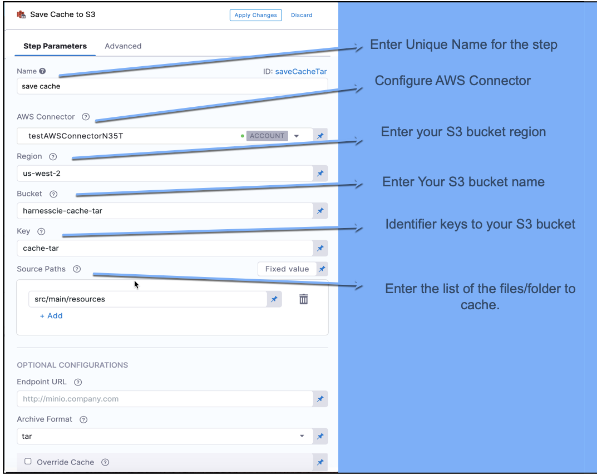
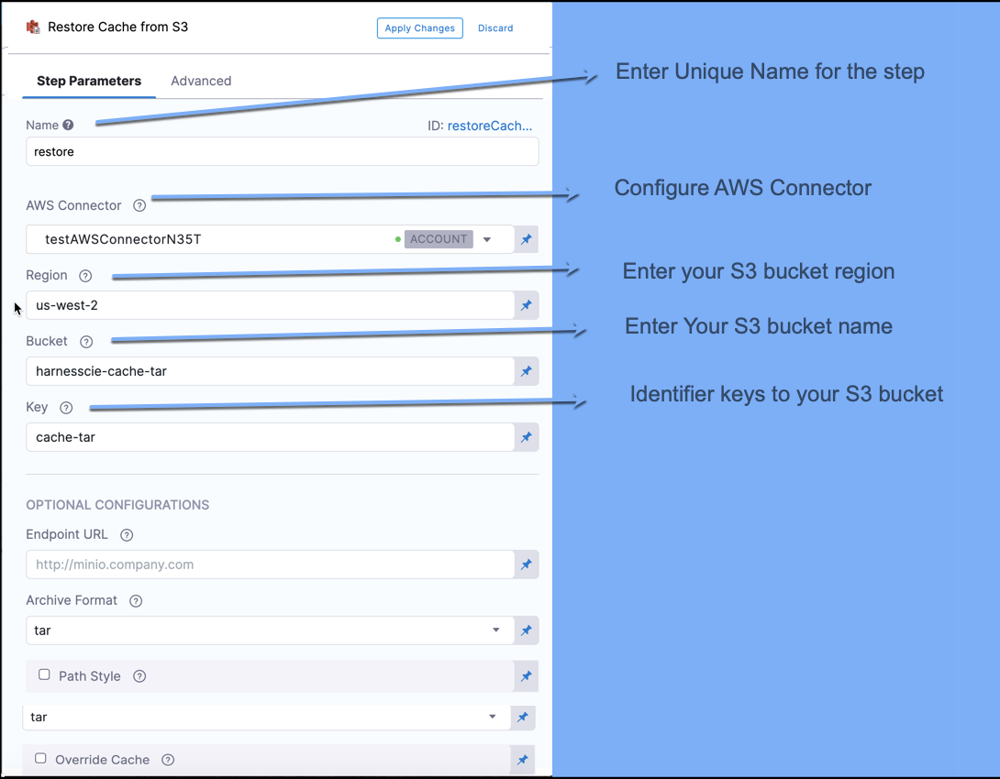
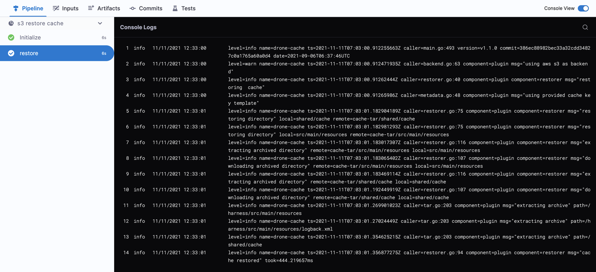

Caching has two primary benefits:

* It can make your jobs run faster by reusing the expensive fetch operation data from previous jobs.
* It enables you to share data across Stages.

In a Harness CI Pipeline, you can save the cache to an AWS S3 bucket in one Stage using the **Save Cache to S3** step, and restore it in the same or another Stage using **Restore Cache from S3 step**. 

The topic explains how to configure the **Save Cache to S3** and **Restore Cache from S3** steps in CI using a two-stage Pipeline.

You cannot share access credentials or other [Text Secrets](https://ngdocs.harness.io/article/osfw70e59c-add-use-text-secrets) across Stages.

### Before You Begin

* [CI Pipeline Quickstart](../../ci-quickstarts/ci-pipeline-quickstart.md)
* [CI Stage Settings](../../ci-technical-reference/ci-stage-settings.md)
* [Set Up Build Infrastructure](https://docs.harness.io/category/set-up-build-infrastructure)
* [Learn Harness' Key Concepts](../../../getting-started/learn-harness-key-concepts.md)

### Limitations

* You cannot share access credentials or other [Text Secrets](https://docs.harness.io/article/osfw70e59c-add-use-text-secrets) across Stages.
* Use a dedicated bucket for your Harness cache operations. Do not save files to the bucket manually. The Retrieve Cache operation will fail if the bucket includes any files that do not have a Harness cache key.

### Review: YAML Example

If you want to configure your Pipeline in YAML, in **Pipeline Studio,** click **YAML**. 

The following YAML file creates a Pipeline with two Stages: Save Cache and Restore Cache. Copy the following YAML, paste it in the Harness YAML editor, and modify its based on your Pipeline requirements.


```
pipeline:  
    name: Save and Restore AWS  
    identifier: Save_and_Restore_AWS  
    projectIdentifier: Example  
    orgIdentifier: default  
    tags: {}  
    stages:  
        - stage:  
              identifier: s3_save_cache  
              name: s3_save_cache  
              type: CI  
              variables:  
                  - name: AWS_ACCESS_KEY  
                    type: String  
                    value: <+input>  
                  - name: AWS_SECRET_KEY  
                    type: Secret  
                    value: <+input>  
              spec:  
                  sharedPaths:  
                      - /shared  
                  execution:  
                      steps:  
                          - step:  
                                identifier: createBucket  
                                name: create bucket  
                                type: Run  
                                spec:  
                                    command: |  
                                        aws configure set aws_access_key_id $AWS_ACCESS_KEY  
                                        aws configure set aws_secret_access_key $AWS_SECRET_KEY  
                                        aws configure set default.region us-west-2  
                                        aws s3 rb s3://harnesscie-cache-tar --force || true  
                                        aws s3 mb s3://harnesscie-cache-tar  
                                    envVariables:  
                                        HOME: /shared  
                                    connectorRef: <+input>  
                                    image: amazon/aws-cli:2.0.6  
                          - step:  
                                identifier: rootFile  
                                name: create file at slash  
                                type: Run  
                                spec:  
                                    command: |  
                                        echo hello world > /shared/cache  
                                    connectorRef: <+input>  
                                    image: alpine  
                          - step:  
                                identifier: saveCacheTar  
                                name: save cache  
                                type: SaveCacheS3  
                                spec:  
                                    region: us-west-2  
                                    connectorRef: <+input>  
                                    bucket: harnesscie-cache-tar  
                                    sourcePaths:  
                                        - src/main/resources  
                                        - /shared/cache  
                                    key: cache-tar  
                                    archiveFormat: Tar  
                  infrastructure:  
                      type: KubernetesDirect  
                      spec:  
                          connectorRef: <+input>  
                          namespace: default  
                  cloneCodebase: true  
        - stage:  
              identifier: s3_restore_cache  
              name: s3 restore cache  
              type: CI  
              variables:  
                  - name: AWS_ACCESS_KEY  
                    type: String  
                    value: <+input>  
                  - name: AWS_SECRET_KEY  
                    type: Secret  
                    value: <+input>  
              spec:  
                  sharedPaths:  
                      - /shared  
                  execution:  
                      steps:  
                          - step:  
                                identifier: restoreCacheTar  
                                name: restore  
                                type: RestoreCacheS3  
                                spec:  
                                    region: us-west-2  
                                    connectorRef: <+input>  
                                    bucket: harnesscie-cache-tar  
                                    key: cache-tar  
                                    failIfKeyNotFound: true  
                                    archiveFormat: Tar  
                  infrastructure:  
                      useFromStage: s3_save_cache  
                  cloneCodebase: false
```
If you want to configure your Pipeline in the Harness UI, go to **Pipeline Studio** and click the **VISUAL** tab at the top of the screen.

### Step 1: Open the Build Stage

In your Harness Pipeline, open the Stage where you want to save the cache.

### Step 2: Define the Build Farm Infrastructure

In the Infrastructure tab, define the build farm for the codebase.

The following step uses a Kubernetes cluster build farm.

See [Define Kubernetes Cluster Build Infrastructure](../set-up-build-infrastructure/set-up-a-kubernetes-cluster-build-infrastructure.md).

### Step 3: Save Cache to S3

In Execution, click **Add Step**, and select **Save Cache to S3**. Here you configure S3 bucket, keys, and source paths to enable Harness to save the cache to S3.

For step settings, see [Save Cache to S3 Settings.](../../ci-technical-reference/save-cache-to-s-3-step-settings.md)



### Step 4: Restore Cache from S3 Stage

In your Pipeline, click **Add Stage** where you want to restore the saved cache from S3. 

In **Execution**, click **Add Step**, and select **Restore Cache from S3**. Here you configure the keys for the S3 bucket where you saved your cache.

For step settings, see [Restore Cache Step Settings](../../ci-technical-reference/restore-cache-from-s-3-step-settings.md).



When you are done, click **Apply Changes**.

### Step 5: Run Pipeline

Click **Save** to save the changes, then click **Run Pipeline**. 

### Step 6: View the Results

You can see the logs for the Pipeline as it runs.

#### Save Cache Stage Output

In the Save Cache stage, you can see the logs for Save Cache to S3 step in the Pipeline as it runs.

![]./static/saving-cache-528.png)
```
level=info name=drone-cache ts=2021-11-11T07:08:02.169728067Z caller=rebuilder.go:93 component=plugin component=rebuilder msg="cache built" took=217.977195ms
```
#### Restore Cache Stage Output

In the Restore Cache stage, you can see the logs for Restore Saved Cache from the S3 step in the Pipeline as it runs.


```
level=info name=drone-cache ts=2021-11-11T07:08:15.915788644Z caller=restorer.go:94 component=plugin component=restorer msg="cache restored" took=439.384074ms
```
### See Also

* [Save and Restore Cache from GCS](save-cache-in-gcs.md)

