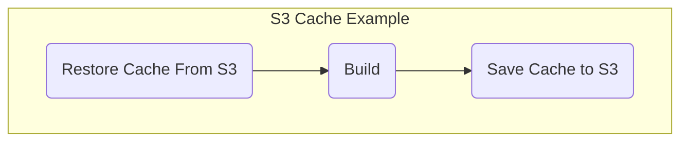
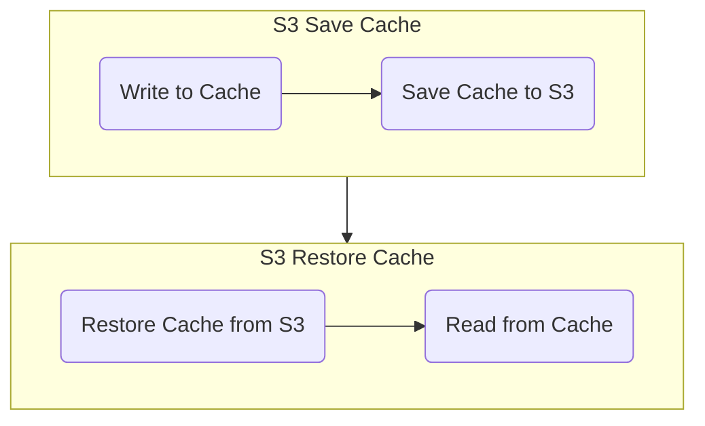

```mdx-code-block
import Tabs from '@theme/Tabs';
import TabItem from '@theme/TabItem';
```

Caching enables sharing data across stages. Caching also speeds up builds by reusing the expensive fetch operation from previous jobs.

Caching has two primary benefits:

* Run pipelines faster by reusing the expensive fetch operation data from previous builds
* Share data across Stages

You can cache data to an AWS S3 bucket in one Stage using the **Save Cache to S3** step, and restore it in the same Stage, or a following Stage, using **Restore Cache From S3** step. 

This topic explains how to configure the **Save Cache to S3** and **Restore Cache From S3** steps in Harness CI.

You cannot share access credentials or other [Text Secrets](../../../platform/6_Security/2-add-use-text-secrets.md) across Stages.

:::info

If you're using Harness Cloud build infrastructure, you can use [Cache Intelligence](cache-intelligence.md) to automate caching.

:::

## Requirements

You need a dedicated S3 bucket for your Harness CI cache operations, and you need an AWS connector with read/write access to this S3 bucket.

For information on configuring an S3 connector and S3 policies, go to [Add an AWS connector](../../../../docs/platform/7_Connectors/add-aws-connector.md) and the [AWS connector settings reference](../../../../docs/platform/7_Connectors/ref-cloud-providers/aws-connector-settings-reference.md).

Optionally, you can create a [lifecycle configuration](https://docs.aws.amazon.com/AmazonS3/latest/userguide/object-lifecycle-mgmt.html) to automatically delete old cache data from your S3 bucket.

:::caution

Use a dedicated bucket for your Harness CI cache operations. Do not save files to the bucket manually. The Restore Cache operation will fail if the bucket includes any files that do not have a Harness cache key.

:::

## Add Save Cache to S3 step

Here is a YAML example of a Save Cache to S3 step.

Add this step after your pipeline's build/test steps, near the end of your pipeline.

For details about this step's settings, go to [Save Cache to S3 step settings](../../ci-technical-reference/save-cache-to-s-3-step-settings.md).

```yaml
              - step:
                  type: SaveCacheS3
                  name: Save Cache to S3
                  identifier: Save_Cache_to_S3
                  spec:
                    connectorRef: AWS_Connector
                    region: us-east-1
                    bucket: your-s3-bucket
                    key: cache-{{ checksum filePath1 }}
                    sourcePaths:
                      - directory1
                      - directory2
                    archiveFormat: Tar
```

## Add Restore Cache From S3 step

Here is a YAML example of a Restore Cache From S3 step.

Add this step before your pipeline's build/test steps, near the start of your pipeline.

For details about this step's settings, go to [Restore Cache from S3 step settings](../../ci-technical-reference/restore-cache-from-s-3-step-settings.md).

```yaml
              - step:
                  type: RestoreCacheS3
                  name: Restore Cache From S3
                  identifier: Restore_Cache_From_S3
                  spec:
                    connectorRef: AWS_Connector
                    region: us-east-1
                    bucket: your-s3-bucket
                    key: myApp-{{ checksum filePath1 }}
                    archiveFormat: Tar
```

## Pipeline examples

### Single Stage

This example pipeline demonstrates cache usage in a single stage.



```mdx-code-block
<Tabs>
<TabItem value="Harness Cloud">
```

**Operating System:** Linux

**Architecture:** AMD64

**Language:** Node.js

<details><summary>Sample YAML</summary>

:::note

`<+input>` represents [runtime inputs](../../../platform/20_References/runtime-inputs.md#runtime-inputs) that you must specify when you run the pipeline. If you do not want to provide these values at runtime, replace `<+input>` with fixed values or expressions.

:::

```yaml
# copy/paste this block into your pipelines's 'stages' section
  stages:
    - stage:
        name: S3 Cache Example
        identifier: S3_Cache_Example
        type: CI
        spec:
          cloneCodebase: true
          platform:
            os: Linux
            arch: Amd64
          runtime:
            type: Cloud
            spec: {}
          execution:
            steps:
              - step:
                  type: RestoreCacheS3
                  name: Restore Cache From S3
                  identifier: Restore_Cache_From_S3
                  spec:
                    connectorRef: <+input>
                    region: <+input>
                    bucket: <+input>
                    key: cache-{{ checksum "package.json" }}
                    archiveFormat: Tar
              - step:
                  type: Run
                  name: Build
                  identifier: Build
                  spec:
                    shell: Sh
                    command: npm install
              - step:
                  type: SaveCacheS3
                  name: Save Cache to S3
                  identifier: Save_Cache_to_S3
                  spec:
                    connectorRef: <+input>
                    region: <+input>
                    bucket: <+input>
                    key: cache-{{ checksum "package.json" }}
                    sourcePaths:
                      - node_modules
                    archiveFormat: Tar

# copy/paste this block into your pipelines's 'properties' section
  properties:
    ci:
      codebase:
        connectorRef: <+input>
        repoName: <+input>
        build: <+input> 
```

</details>

```mdx-code-block
</TabItem>
<TabItem value="Kubernetes">
```

Kubernetes example goes here

```mdx-code-block
</TabItem>
</Tabs>
```

### Multi-Stage

This example pipeline demonstrates cache usage across two stages.



```mdx-code-block
<Tabs>
<TabItem value="Harness Cloud">
```

**Operating System:** Linux

**Architecture:** AMD64

**Language:** None

<details><summary>Sample YAML</summary>

:::note

`<+input>` represents [runtime inputs](../../../platform/20_References/runtime-inputs.md#runtime-inputs) that you must specify when you run the pipeline. If you do not want to provide these values at runtime, replace `<+input>` with fixed values or expressions.

:::

```yaml
# copy/paste this block into your pipelines's stages section
  stages:
    - stage:
        name: S3 Save Cache
        identifier: S3_Save_Cache
        type: CI
        spec:
          sharedPaths:
            - /shared
          cloneCodebase: false
          platform:
            os: Linux
            arch: Amd64
          runtime:
            type: Cloud
            spec: {}
          execution:
            steps:
              - step:
                  identifier: Write_to_Cache
                  name: Write to Cache
                  type: Run
                  spec:
                    command: |
                      echo "this is sequence <+pipeline.sequenceId>" > /shared/cache
                    connectorRef: <+input>
                    image: alpine
              - step:
                  type: SaveCacheS3
                  name: Save Cache to S3
                  identifier: Save_Cache_to_S3
                  spec:
                    connectorRef: <+input>
                    region: <+input>
                    bucket: <+input>
                    key: cache-tar
                    sourcePaths:
                      - /shared/cache
                    archiveFormat: Tar
    - stage:
        identifier: S3_Restore_Cache
        name: S3 Restore Cache
        type: CI
        spec:
          sharedPaths:
            - /shared
          execution:
            steps:
              - step:
                  type: RestoreCacheS3
                  name: Restore Cache from S3
                  identifier: Restore_Cache_From_S3
                  spec:
                    connectorRef: <+input>
                    region: <+input>
                    bucket: <+input>
                    key: cache-tar
                    archiveFormat: Tar
              - step:
                  identifier: Read_From_Cache
                  name: Read from Cache
                  type: Run
                  spec:
                    command: |
                      cat /shared/cache  
                    connectorRef: <+input>
                    image: alpine
          infrastructure:
            useFromStage: S3_Save_Cache
          cloneCodebase: false
```

</details>

```mdx-code-block
</TabItem>
<TabItem value="Kubernetes">
```

Kubernetes example goes here

```mdx-code-block
</TabItem>
</Tabs>
```
