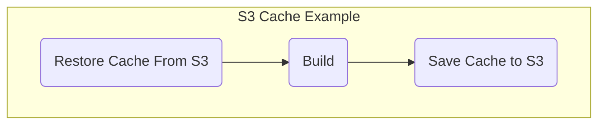
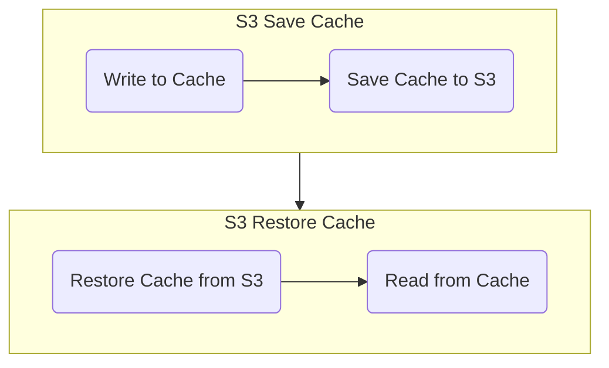

```mdx-code-block
import Tabs from '@theme/Tabs';
import TabItem from '@theme/TabItem';
```

This topic explains how to configure the **Save Cache to S3** and **Restore Cache From S3** steps in Harness CI.

:::info

If you are using Harness Cloud for your CI pipelines, [Cache Intelligence](cache-intelligence.md) can remove most of complexity of cache management.

:::

## Overview

You can cache data to an AWS S3 bucket in one Stage using the **Save Cache to S3** step, and restore it in the same Stage, or a following Stage, using **Restore Cache From S3** step. 

Caching has two primary benefits:

* Run pipelines faster by reusing the expensive fetch operation data from previous executions
* Share data across Stages

You cannot share access credentials or other [Text Secrets](../../../platform/6_Security/2-add-use-text-secrets.md) across Stages.

## Before You Begin

* [Learn Harness' Key Concepts](../../../getting-started/learn-harness-key-concepts.md)
* [Set Up Build Infrastructure](/docs/category/set-up-build-infrastructure)

:::info

You will need an [AWS connector](../../../../docs/platform/7_Connectors/add-aws-connector.md) with read/write access to your S3 bucket. Below is a minimal S3 bucket read/write policy. See the [AWS documentation](https://docs.aws.amazon.com/AmazonS3/latest/userguide/example-bucket-policies.html) for more S3 bucket policy examples.

<details><summary>Sample S3 Cache Bucket Policy</summary>

```json
{
    "Version": "2012-10-17",
    "Statement": [
        {
            "Sid": "AllowS3BucketAccess",
            "Effect": "Allow",
            "Action": [
                "s3:PutObject",
                "s3:GetObject",
                "s3:ListBucket",
                "s3:DeleteObject"
            ],
            "Resource": [
                "arn:aws:s3:::your-s3-bucket/*",
                "arn:aws:s3:::your-s3-bucket"
            ]
        },
        {
            "Sid": "AllowDescribeRegions",
            "Effect": "Allow",
            "Action": "ec2:DescribeRegions",
            "Resource": "*"
        }
    ]
}
```

</details>

Consider creating an [lifecycle configuration](https://docs.aws.amazon.com/AmazonS3/latest/userguide/object-lifecycle-mgmt.html) for your S3 cache bucket to automatically delete old cache data.

:::

:::caution

Use a dedicated bucket for your Harness CI cache operations. Do not save files to the bucket manually. The Retrieve Cache operation will fail if the bucket includes any files that do not have a Harness cache key.

:::

## Steps

### Restore Cache From S3

```yaml title="Sample Step YAML"
              - step:
                  type: RestoreCacheS3
                  name: Restore Cache From S3
                  identifier: Restore_Cache_From_S3
                  spec:
                    connectorRef: AWS_Connector
                    region: us-east-1
                    bucket: your-s3-bucket
                    key: myApp-{{ checksum filePath1 }}
                    archiveFormat: Tar
```

See [Restore Cache from S3 step settings](../../ci-technical-reference/restore-cache-from-s-3-step-settings.md) for all available settings.

### Save Cache to S3

```yaml title="Sample Step YAML"
              - step:
                  type: SaveCacheS3
                  name: Save Cache to S3
                  identifier: Save_Cache_to_S3
                  spec:
                    connectorRef: AWS_Connector
                    region: us-east-1
                    bucket: your-s3-bucket
                    key: cache-{{ checksum filePath1 }}
                    sourcePaths:
                      - directory1
                      - directory2
                    archiveFormat: Tar
```

See [Save Cache to S3 step settings](../../ci-technical-reference/save-cache-to-s-3-step-settings.md) for all available settings.

## Examples

### Single Stage

This example pipeline demonstrates cache usage in a single stage.



```mdx-code-block
<Tabs>
<TabItem value="Cloud">
```

:::info

Harness Cloud features [Cache Intelligence](cache-intelligence.md), which can simplify caching within a single stage.

:::

#### Linux/AMD64

**Language:** Node.js

<details><summary>Sample YAML</summary>

:::note

`<+input>` represents [runtime inputs](../../../platform/20_References/runtime-inputs.md#runtime-inputs) that you must specify when you run the pipeline. If you do not want to provide these values at runtime, replace `<+input>` with fixed values or expressions.

:::

```yaml
# copy/paste this block into your pipelines's 'stages' section
  stages:
    - stage:
        name: S3 Cache Example
        identifier: S3_Cache_Example
        type: CI
        spec:
          cloneCodebase: true
          platform:
            os: Linux
            arch: Amd64
          runtime:
            type: Cloud
            spec: {}
          execution:
            steps:
              - step:
                  type: RestoreCacheS3
                  name: Restore Cache From S3
                  identifier: Restore_Cache_From_S3
                  spec:
                    connectorRef: <+input>
                    region: <+input>
                    bucket: <+input>
                    key: cache-{{ checksum "package.json" }}
                    archiveFormat: Tar
              - step:
                  type: Run
                  name: Build
                  identifier: Build
                  spec:
                    shell: Sh
                    command: npm install
              - step:
                  type: SaveCacheS3
                  name: Save Cache to S3
                  identifier: Save_Cache_to_S3
                  spec:
                    connectorRef: <+input>
                    region: <+input>
                    bucket: <+input>
                    key: cache-{{ checksum "package.json" }}
                    sourcePaths:
                      - node_modules
                    archiveFormat: Tar

# copy/paste this block into your pipelines's 'properties' section
  properties:
    ci:
      codebase:
        connectorRef: <+input>
        repoName: <+input>
        build: <+input> 
```

</details>

```mdx-code-block
</TabItem>
<TabItem value="Kubernetes">
```

Kubernetes example goes here

```mdx-code-block
</TabItem>
</Tabs>
```

### Multi-Stage

This example pipeline demonstrates cache usage across two stages.



```mdx-code-block
<Tabs>
<TabItem value="Cloud">
```

#### Linux/AMD64

**Language:** None

<details><summary>Sample YAML</summary>

:::note

`<+input>` represents [runtime inputs](../../../platform/20_References/runtime-inputs.md#runtime-inputs) that you must specify when you run the pipeline. If you do not want to provide these values at runtime, replace `<+input>` with fixed values or expressions.

:::

```yaml
# copy/paste this block into your pipelines's stages section
  stages:
    - stage:
        name: S3 Save Cache
        identifier: S3_Save_Cache
        type: CI
        spec:
          sharedPaths:
            - /shared
          cloneCodebase: false
          platform:
            os: Linux
            arch: Amd64
          runtime:
            type: Cloud
            spec: {}
          execution:
            steps:
              - step:
                  identifier: Write_to_Cache
                  name: Write to Cache
                  type: Run
                  spec:
                    command: |
                      echo "this is sequence <+pipeline.sequenceId>" > /shared/cache
                    connectorRef: <+input>
                    image: alpine
              - step:
                  type: SaveCacheS3
                  name: Save Cache to S3
                  identifier: Save_Cache_to_S3
                  spec:
                    connectorRef: <+input>
                    region: <+input>
                    bucket: <+input>
                    key: cache-tar
                    sourcePaths:
                      - /shared/cache
                    archiveFormat: Tar
    - stage:
        identifier: S3_Restore_Cache
        name: S3 Restore Cache
        type: CI
        spec:
          sharedPaths:
            - /shared
          execution:
            steps:
              - step:
                  type: RestoreCacheS3
                  name: Restore Cache from S3
                  identifier: Restore_Cache_From_S3
                  spec:
                    connectorRef: <+input>
                    region: <+input>
                    bucket: <+input>
                    key: cache-tar
                    archiveFormat: Tar
              - step:
                  identifier: Read_From_Cache
                  name: Read from Cache
                  type: Run
                  spec:
                    command: |
                      cat /shared/cache  
                    connectorRef: <+input>
                    image: alpine
          infrastructure:
            useFromStage: S3_Save_Cache
          cloneCodebase: false
```

</details>

```mdx-code-block
</TabItem>
<TabItem value="Kubernetes">
```

Kubernetes example goes here

```mdx-code-block
</TabItem>
</Tabs>
```

## See Also

* [Save and Restore Cache from GCS](save-cache-in-gcs.md)
