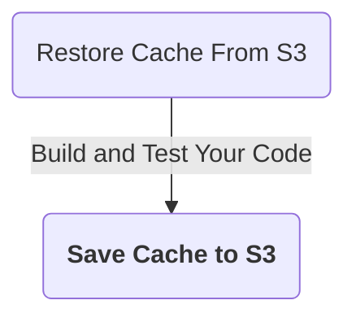
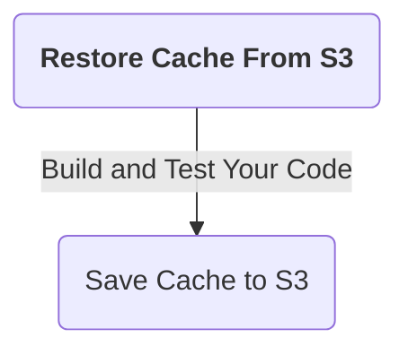
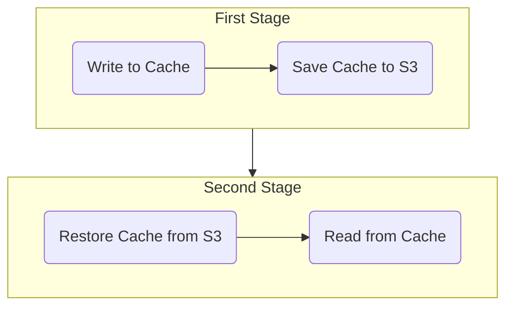

```mdx-code-block
import Tabs from '@theme/Tabs';
import TabItem from '@theme/TabItem';
```

Caching has two primary benefits:

* Run pipelines faster by reusing the expensive fetch operation data from previous builds.
* Share data across stages.

You can cache data to an AWS S3 bucket in one stage using the **Save Cache to S3** step, and restore it in the same stage or a following stage using the **Restore Cache From S3** step. You cannot share access credentials or other [Text Secrets](/docs/platform/secrets/add-use-text-secrets) across stages.

This topic explains how to configure the **Save Cache to S3** and **Restore Cache From S3** steps in Harness CI.

:::info

If you are using Harness Cloud build infrastructure, you can use [Cache Intelligence](cache-intelligence.md) to automate caching.

:::

## S3 bucket and AWS connector requirements

You need:

* A dedicated S3 bucket for your Harness CI cache operations.
* An [AWS connector](/docs/platform/connectors/cloud-providers/add-aws-connector) with read/write access to your S3 bucket.
* An optional [lifecycle configuration](https://docs.aws.amazon.com/AmazonS3/latest/userguide/object-lifecycle-mgmt.html), if you want to automatically delete old cache data from your S3 bucket.

Here is an example of an S3 cache bucket policy:

```json
{
    "Version": "2012-10-17",
    "Statement": [
        {
            "Sid": "AllowS3BucketAccess",
            "Effect": "Allow",
            "Action": [
                "s3:PutObject",
                "s3:GetObject",
                "s3:ListBucket",
                "s3:DeleteObject"
            ],
            "Resource": [
                "arn:aws:s3:::your-s3-bucket/*",
                "arn:aws:s3:::your-s3-bucket"
            ]
        },
        {
            "Sid": "AllowDescribeRegions",
            "Effect": "Allow",
            "Action": "ec2:DescribeRegions",
            "Resource": "*"
        }
    ]
}
```

:::caution

You must use a dedicated bucket for your Harness CI cache operations. Do not save files to the bucket manually. The Restore Cache operation will fail if the bucket includes any files that do not have a Harness cache key.

:::

### Caching with non-private ACL

If your bucket's ACL is set to something other than `private` (such as blank, `bucket-owner-full-control`, or something else), then you must add a [stage variable](/docs/platform/pipelines/add-a-stage/#stage-variables) named `PLUGIN_ACL`. Set the value to the relevant ACL value.

The default value for `PLUGIN_ACL` is `private`, so if your bucket's ACL is something other than `private`, you must set this environment variable accordingly.

## Add the Save Cache to S3 step

Add the **Save Cache to S3** step after steps that build and test your code, as shown in this diagram:



Here is a YAML example of a **Save Cache to S3** step.

```yaml
              - step:
                  type: SaveCacheS3
                  name: Save Cache to S3
                  identifier: Save_Cache_to_S3
                  spec:
                    connectorRef: AWS_Connector
                    region: us-east-1
                    bucket: your-s3-bucket
                    key: cache-{{ checksum filePath1 }} # example cache key based on file checksum
                    sourcePaths:
                      - directory1 # example first directory to cache
                      - directory2 # example second directory to cache
                    archiveFormat: Tar
...
```

### Save Cache to S3 step settings

The **Save Cache to S3** step has the following settings. Depending on the stage's build infrastructure, some settings might be unavailable or optional. Settings specific to containers, such as **Set Container Resources**, are not applicable when using the step in a stage with VM or Harness Cloud build infrastructure.

#### Name

Enter a name summarizing the step's purpose. Harness automatically assigns an **Id** ([Entity Identifier Reference](/docs/platform/references/entity-identifier-reference.md)) based on the **Name**. You can change the **Id**.

#### AWS Connector

The Harness AWS connector to use when saving the cache to S3. The AWS IAM roles and policies associated with the account used in the Harness AWS Connector must be able to write to S3.

:::info

This step supports AWS connectors using **AWS access key**, **Assume IAM role on delegate**, and **IRSA** authentication methods *without* cross-account access (ARN/STS).

[IRSA requires modifications to the delegate YAML](https://developer.harness.io/docs/platform/connectors/cloud-providers/ref-cloud-providers/aws-connector-settings-reference#harness-aws-connector-settings:~:text=Configure%20IRSA%20credentials%20for%20AWS%20connectors) and build infrastructure settings. The service account to be used for uploading to S3 must be specified in the delegate YAML and in the [Service Account Name](/docs/continuous-integration/use-ci/set-up-build-infrastructure/ci-stage-settings#service-account-name) in the stage's build infrastructure settings.

This step *doesn't* support AWS connectors that have enabled cross-account access (ARN/STS) for any authentication method.

:::

For more information about roles, permissions, and configuration for AWS connectors, go to:

* [Add an AWS connector](/docs/platform/connectors/cloud-providers/add-aws-connector)
* [AWS connector settings reference](/docs/platform/connectors/cloud-providers/ref-cloud-providers/aws-connector-settings-reference).

#### Region

Define the AWS region to use when saving the cache, such as the AWS region you selected when you created the AWS S3 bucket. For more information go to the AWS documentation:

* [Creating, configuring, and working with Amazon S3 buckets](https://docs.aws.amazon.com/AmazonS3/latest/user-guide/create-configure-bucket.html)
* [Pushing a Docker image to an Amazon ECR repository](https://docs.aws.amazon.com/AmazonECR/latest/userguide/docker-push-ecr-image.html)

#### Bucket

The AWS S3 bucket where you want to save the cache.

#### Key

The key to identify the cache.

You can use the checksum macro to create a key based on a file's checksum, for example: `myApp-{{ checksum filePath1 }}`

With this macro, Harness checks if the key exists and compares the checksum. If the checksum matches, then Harness doesn't save the cache. If the checksum is different, then Harness saves the cache.

The backslash character isn't allowed as part of the checksum value here. This is a limitation of the Go language (golang) template. You must use a forward slash instead.

* Incorrect format: `cache-{{ checksum ".\src\common\myproj.csproj" }`
* Correct format: `cache-{{ checksum "./src/common/myproj.csproj" }}`

#### Source Paths

A list of the files/folders to cache. Add each file/folder separately.

#### Endpoint URL

Endpoint URL for S3-compatible providers. This setting is not needed for AWS.

#### Archive Format

Select the archive format. The default archive format is Tar.

#### Override Cache

Select this option if you want to override the cache if a cache with a matching **Key** already exists.

By default, the **Override Cache** option is set to false (unselected).

#### Path Style

If unselected, the step uses Virtual Hosted Style for paths, such as `http://bucket.host/key`. If selected, the step uses Path Style, such as `http://host/bucket/key`.

For MinIO, you must use Path Style. Make sure **Path Style** is true (selected).

By default, **Path Style** is false (unselected).

#### Run as User

Specify the user ID to use to run all processes in the pod if running in containers. For more information, go to [Set the security context for a pod](https://kubernetes.io/docs/tasks/configure-pod-container/security-context/#set-the-security-context-for-a-pod).

#### Set Container Resources

Maximum resources limits for the resources used by the container at runtime:

* **Limit Memory:** Maximum memory that the container can use. You can express memory as a plain integer or as a fixed-point number with the suffixes `G` or `M`. You can also use the power-of-two equivalents, `Gi` or `Mi`. Do not include spaces when entering a fixed value. The default is `500Mi`.
* **Limit CPU:** The maximum number of cores that the container can use. CPU limits are measured in CPU units. Fractional requests are allowed. For example, you can specify one hundred millicpu as `0.1` or `100m`. The default is `400m`. For more information, go to [Resource units in Kubernetes](https://kubernetes.io/docs/concepts/configuration/manage-resources-containers/#resource-units-in-kubernetes).

#### Timeout

Set the timeout limit for the step. Once the timeout limit is reached, the step fails and pipeline execution continues. To set skip conditions or failure handling for steps, go to:

* [Step Skip Condition settings](../../../platform/pipelines/w_pipeline-steps-reference/step-skip-condition-settings.md)
* [Step Failure Strategy settings](../../../platform/pipelines/w_pipeline-steps-reference/step-failure-strategy-settings.md)

### Set shared paths for cache locations outside the stage workspace

Steps in the same stage share the same [workspace](/docs/continuous-integration/use-ci/set-up-build-infrastructure/ci-stage-settings#workspace), which is `/harness`. If your steps need to use data in locations outside the stage workspace, you must specify these as [shared paths](/docs/continuous-integration/use-ci/caching-ci-data/share-ci-data-across-steps-and-stages#share-data-between-steps-in-a-stage). This is required if you want to cache directories outside `/harness`. For example:

```yaml
  stages:
    - stage:
        spec:
          sharedPaths:
            - /example/path # directory outside workspace to share between steps
```

## Add the Restore Cache From S3 step

Add the **Restore Cache From S3** step before steps that build and test your code, as shown in the following diagram:



Here is a YAML example of a **Restore Cache From S3** step.

```yaml
              - step:
                  type: RestoreCacheS3
                  name: Restore Cache From S3
                  identifier: Restore_Cache_From_S3
                  spec:
                    connectorRef: AWS_Connector
                    region: us-east-1
                    bucket: your-s3-bucket
                    key: cache-{{ checksum filePath1 }} # example cache key based on file checksum
                    archiveFormat: Tar
...
```

:::caution

The `key` value in this step must match the `key` value in your **Save Cache to S3** step.

:::

### Restore Cache from S3 step settings

The **Restore Cache from S3** step has the following settings. Depending on the stage's build infrastructure, some settings might be unavailable or optional. Settings specific to containers, such as **Set Container Resources**, are not applicable when using the step in a stage with VM or Harness Cloud build infrastructure.

#### Name

Enter a name summarizing the step's purpose. Harness automatically assigns an **Id** ([Entity Identifier Reference](/docs/platform/references/entity-identifier-reference.md)) based on the **Name**. You can change the **Id**.

#### AWS Connector

The Harness Connector to use when restoring the cache from AWS S3. If your pipeline also has a **Save Cache to S3** step, these steps typically use the same connector.

The AWS IAM roles and policies associated with the account used in the Harness AWS Connector must be able to read from S3.

:::note

This step supports AWS connectors using **AWS Access Key**, **Assume IAM role on Delegate**, and IRSA authentication methods *without* cross-account access (ARN/STS).

This step doesn't support AWS connectors that have enabled cross-account access (ARN/STS) for any authentication method.

:::

For more information about roles and permissions for AWS connectors, go to:

* [Add an AWS connector](/docs/platform/connectors/cloud-providers/add-aws-connector)
* [AWS connector settings reference](/docs/platform/connectors/cloud-providers/ref-cloud-providers/aws-connector-settings-reference)

#### Region

The relevant AWS region. If your pipeline also has a **Save Cache to S3** step, the region is typically the same for both steps.

#### Bucket

The AWS S3 bucket where the target cache is saved. If your pipeline also has a **Save Cache to S3** step, the bucket is typically the same for both steps.

#### Key

The key identifying the cache that you want to retrieve. If your pipeline also has a **Save Cache to S3** step, the key value must be the same to restore the previously-saved cache.

The backslash character isn't allowed as part of the checksum value here. This is a limitation of the Go language (golang) template. You must use a forward slash instead:

* Incorrect format: `cache-{{ checksum ".\src\common\myproj.csproj" }`
* Correct format: `cache-{{ checksum "./src/common/myproj.csproj" }}`

#### Endpoint URL

Endpoint URL for S3-compatible providers. This is not needed for AWS.

#### Archive Format

Select the archive format. The default archive format is Tar.

#### Path Style

If unselected, the step uses Virtual Hosted Style for paths, such as `http://bucket.host/key`. If selected, the step uses Path Style, such as `http://host/bucket/key`.

For MinIO, you must use Path Style. Make sure **Path Style** is true (selected).

By default, **Path Style** is false (unselected).

#### Fail if Key Doesn't Exist

Select this option to fail the step if the specified **Key** doesn't exist.

By default, this option is set to false (unselected).

#### Run as User

Specify the user ID to use to run all processes in the pod if running in containers. For more information, go to [Set the security context for a pod](https://kubernetes.io/docs/tasks/configure-pod-container/security-context/#set-the-security-context-for-a-pod).

#### Set Container Resources

Maximum resources limits for the resources used by the container at runtime:

* **Limit Memory:** Maximum memory that the container can use. You can express memory as a plain integer or as a fixed-point number with the suffixes `G` or `M`. You can also use the power-of-two equivalents, `Gi` or `Mi`. Do not include spaces when entering a fixed value. The default is `500Mi`.
* **Limit CPU:** The maximum number of cores that the container can use. CPU limits are measured in CPU units. Fractional requests are allowed. For example, you can specify one hundred millicpu as `0.1` or `100m`. The default is `400m`. For more information, go to [Resource units in Kubernetes](https://kubernetes.io/docs/concepts/configuration/manage-resources-containers/#resource-units-in-kubernetes).

#### Timeout

Set the timeout limit for the step. Once the timeout limit is reached, the step fails and pipeline execution continues. To set skip conditions or failure handling for steps, go to:

* [Step Skip Condition settings](/docs/platform/pipelines/w_pipeline-steps-reference/step-skip-condition-settings.md)
* [Step Failure Strategy settings](/docs/platform/pipelines/w_pipeline-steps-reference/step-failure-strategy-settings.md)

## Go, Node, and Maven cache key and path requirements

There are specific requirements for cache keys and paths for Go, Node.js, and Maven.

```mdx-code-block
<Tabs>
<TabItem value="Go">
```

[Go](https://go.dev/) pipelines must reference `go.sum` for `spec.key` in **Save Cache to S3** and **Restore Cache From S3** steps, for example:

```yaml
                  spec:
                    key: cache-{{ checksum "go.sum" }}
```

`spec.sourcePaths` must include `/go/pkg/mod` and `/root/.cache/go-build` in the **Save Cache to S3** step, for example:

```yaml
                  spec:
                    sourcePaths:
                      - /go/pkg/mod
                      - /root/.cache/go-build
```

```mdx-code-block
</TabItem>

<TabItem value="Node.js">
```

[npm](https://www.npmjs.com/) pipelines must reference `package-lock.json` for `spec.key` in **Save Cache to S3** and **Restore Cache From S3** steps, for example:

```yaml
                  spec:
                    key: cache-{{ checksum "package-lock.json" }}
```

[Yarn](https://yarnpkg.com/) pipelines must reference `yarn.lock` for `spec.key` in **Save Cache to S3** and **Restore Cache From S3** steps, for example:

```yaml
                  spec:
                    key: cache-{{ checksum "yarn.lock" }}
```

`spec.sourcePaths` must include `node_modules` in the **Save Cache to S3** step, for example:

```yaml
                  spec:
                    sourcePaths:
                      - node_modules
```

```mdx-code-block
</TabItem>

<TabItem value="Maven">
```

[Maven](https://maven.apache.org/) pipelines must reference `pom.xml` for `spec.key` in **Save Cache to S3** and **Restore Cache From S3** steps, for example:

```yaml
                  spec:
                    key: cache-{{ checksum "pom.xml" }}
```

`spec.sourcePaths` must include `/root/.m2` in the **Save Cache to S3** step, for example:

```yaml
                  spec:
                    sourcePaths:
                      - /root/.m2
```

```mdx-code-block
</TabItem>
</Tabs>
```

## Caching in multi-stage pipelines

Because each stage runs in an isolated environment, you can use caching to pass data from one stage to the next.

The following diagram illustrates cache usage across two stages.



## Caching in parallel or concurrent stages

If you have multiple stages that run in parallel, **Save Cache** steps might encounter errors when they attempt to save to the same cache location concurrently. To prevent conflicts with saving caches from parallel runs, you need to skip the **Save Cache** step in *all except one* of the parallel stages.

This is necessary for any [looping strategy](/docs/platform/pipelines/looping-strategies-matrix-repeat-and-parallelism.md) that causes stages to run in parallel, either literal parallel stages or matrix/repeat strategies that generate multiple instances of a stage.

To do skip the **Save Cache** step in all except one parallel stage, add the following [conditional execution](/docs/platform/pipelines/w_pipeline-steps-reference/step-skip-condition-settings) to the **Save Cache** step(s):

```mdx-code-block
<Tabs>
  <TabItem value="Visual" label="Visual editor">
```

1. Edit the **Save Cache** step, and select the **Advanced** tab.
2. Expand the **Conditional Execution** section.
3. Select **Execute this step if the stage execution is successful thus far**.
4. Select **And execute this step only if the following JEXL condition evaluates to True**.
5. For the JEXL condition, enter `<+strategy.iteration> == 0`.

```mdx-code-block
  </TabItem>
  <TabItem value="YAML" label="YAML editor" default>
```

Add the following `when` definition to the end of your **Save Cache** step.

```yaml
              - step:
                  ...
                  when:
                    stageStatus: Success ## Execute this step if the stage execution is successful thus far.
                    condition: <+strategy.iteration> == 0 ## And execute this step if this JEXL condition evaluates to true
```

This `when` definition causes the step to run only if *both* of the following conditions are met:

* `stageStatus: Success`: Execute this step if the stage execution is successful thus far.
* `condition: <+strategy.iteration> == 0`: Execution this step if the JEXL expression evaluates to true.

```mdx-code-block
  </TabItem>
</Tabs>
```

The JEXL expression `<+strategy.iteration> == 0` references the looping strategy's iteration index value assigned to each stage. The iteration index value is a zero-indexed value appended to a step or stage's identifier when it runs in a [looping strategy](/docs/platform/pipelines/looping-strategies-matrix-repeat-and-parallelism.md). Although the stages run concurrently, each concurrent instance has a different index value, starting from `0`. By limiting the **Save Cache** step to run on the `0` stage, it only runs in one of the concurrent instances.
