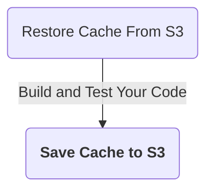
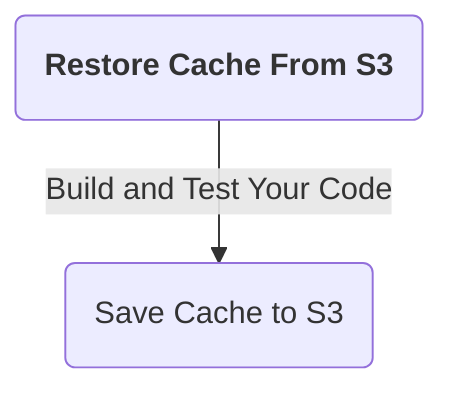
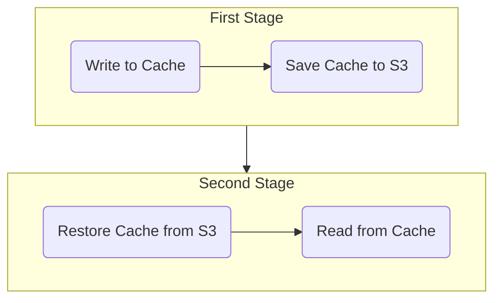

```mdx-code-block
import Tabs from '@theme/Tabs';
import TabItem from '@theme/TabItem';
```

Caching enables sharing data across stages. Caching also speeds up builds by reusing data from expensive fetch operations in previous jobs.

Caching has two primary benefits:

* Run pipelines faster by reusing the expensive fetch operation data from previous builds
* Share data across stages

You can cache data to an AWS S3 bucket in one stage using the **Save Cache to S3** step, and restore it in the same stage or a following stage using the **Restore Cache From S3** step. 

This topic explains how to configure the **Save Cache to S3** and **Restore Cache From S3** steps in Harness CI.

You cannot share access credentials or other [Text Secrets](../../../platform/6_Security/2-add-use-text-secrets.md) across Stages.

:::info

If you are using Harness Cloud build infrastructure, you can use [Cache Intelligence](cache-intelligence.md) to automate caching.

:::

## Requirements

You need a dedicated S3 bucket for your Harness CI cache operations, and you need an AWS connector with read/write access to this S3 bucket.

<details><summary>Sample S3 Cache Bucket Policy</summary>

```json
{
    "Version": "2012-10-17",
    "Statement": [
        {
            "Sid": "AllowS3BucketAccess",
            "Effect": "Allow",
            "Action": [
                "s3:PutObject",
                "s3:GetObject",
                "s3:ListBucket",
                "s3:DeleteObject"
            ],
            "Resource": [
                "arn:aws:s3:::your-s3-bucket/*",
                "arn:aws:s3:::your-s3-bucket"
            ]
        },
        {
            "Sid": "AllowDescribeRegions",
            "Effect": "Allow",
            "Action": "ec2:DescribeRegions",
            "Resource": "*"
        }
    ]
}
```

</details>

For more information on configuring an S3 connector and S3 bucket policies, go to [Add an AWS connector](../../../../docs/platform/7_Connectors/add-aws-connector.md) and the [AWS connector settings reference](../../../../docs/platform/7_Connectors/ref-cloud-providers/aws-connector-settings-reference.md).

Optionally, you can create a [lifecycle configuration](https://docs.aws.amazon.com/AmazonS3/latest/userguide/object-lifecycle-mgmt.html) to automatically delete old cache data from your S3 bucket.

:::caution

Use a dedicated bucket for your Harness CI cache operations. Do not save files to the bucket manually. The Restore Cache operation will fail if the bucket includes any files that do not have a Harness cache key.

:::

## Add Save Cache to S3 step

Here is a YAML example of a **Save Cache to S3** step.

```yaml
              - step:
                  type: SaveCacheS3
                  name: Save Cache to S3
                  identifier: Save_Cache_to_S3
                  spec:
                    connectorRef: AWS_Connector
                    region: us-east-1
                    bucket: your-s3-bucket
                    key: cache-{{ checksum filePath1 }} # example cache key based on file checksum
                    sourcePaths:
                      - directory1 # example first directory to cache
                      - directory2 # example second directory to cache
                    archiveFormat: Tar
...
```

For details about this step's settings, go to [Save Cache to S3 step settings](../../ci-technical-reference/save-cache-to-s-3-step-settings.md).

Pipeline steps within a stage share the same [workspace](../../ci-technical-reference/ci-stage-settings.md#workspace). You can optionally [share paths](../../ci-technical-reference/ci-stage-settings.md#share-paths) outside the workspace between steps in your stage by setting `spec.sharedPaths`.

```yaml
  stages:
    - stage:
        spec:
          sharedPaths:
            - /example/path # directory outside workspace to share between steps
```

Add **Save Cache to S3** step to your stage after steps that build and test your code, as shown in this diagram:



## Add Restore Cache From S3 step

Here is a YAML example of a **Restore Cache From S3** step.

```yaml
              - step:
                  type: RestoreCacheS3
                  name: Restore Cache From S3
                  identifier: Restore_Cache_From_S3
                  spec:
                    connectorRef: AWS_Connector
                    region: us-east-1
                    bucket: your-s3-bucket
                    key: cache-{{ checksum filePath1 }} # example cache key based on file checksum
                    archiveFormat: Tar
...
```

The `spec.key` value in this step must match the `spec.key` value in your **Save Cache to S3** step.

For details about this step's settings, go to [Restore Cache from S3 step settings](../../ci-technical-reference/restore-cache-from-s-3-step-settings.md).

Add **Restore Cache From S3** step to your stage before steps that build and test your code, as shown in the following diagram:



## Languages

Your cache key and paths will differ depending on your language.

```mdx-code-block
<Tabs>
<TabItem value="Go">
```

[Go](https://go.dev/) pipelines must reference `go.sum` for `spec.key` in **Save Cache to S3** and **Restore Cache From S3** steps, for example:

```yaml
                  spec:
                    key: cache-{{ checksum "go.sum" }}
```

`spec.sourcePaths` must include `/go/pkg/mod` and `/root/.cache/go-build` in the **Save Cache to S3** step, for example:

```yaml
                  spec:
                    sourcePaths:
                    - /go/pkg/mod
                    - /root/.cache/go-build
```

```mdx-code-block
</TabItem>

<TabItem value="Node.js">
```

[Npm](https://www.npmjs.com/) pipelines must reference `package-lock.json` for `spec.key` in **Save Cache to S3** and **Restore Cache From S3** steps, for example:

```yaml
                  spec:
                    key: cache-{{ checksum "package-lock.json" }}
```

[Yarn](https://yarnpkg.com/) pipelines must reference `yarn.lock` for `spec.key` in **Save Cache to S3** and **Restore Cache From S3** steps, for example:

```yaml
                  spec:
                    key: cache-{{ checksum "yarn.lock" }}
```

`spec.sourcePaths` must include `node_modues` in the **Save Cache to S3** step, for example:

```yaml
                  spec:
                    sourcePaths:
                    - node_modules
```

```mdx-code-block
</TabItem>

<TabItem value="Maven">
```

[Maven](https://maven.apache.org/) pipelines must reference `pom.xml` for `spec.key` in **Save Cache to S3** and **Restore Cache From S3** steps, for example:

```yaml
                  spec:
                    key: cache-{{ checksum "pom.xml" }}
```

`spec.sourcePaths` must include `/root/.m2` in the **Save Cache to S3** step, for example:

```yaml
                  spec:
                    sourcePaths:
                    - /root/.m2
```

```mdx-code-block
</TabItem>
</Tabs>
```

## Multi-stage pipelines

Because each stage runs in an isolated environment, you can use caching to pass data from one stage to the next.

The following diagram illustrates cache usage across two stages.


