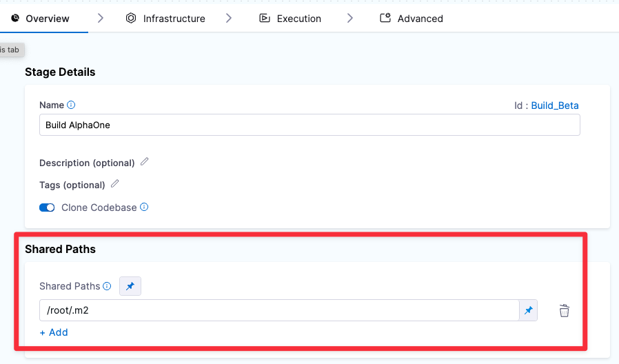

This topic describes how to share CI data across Steps and Stages.

### Share Data Across Steps

Each Stage has a common `/harness` folder. Any Step in the Stage can create, retrieve, update, and delete files in this folder.

You can declare Shared Paths for a Stage. Any Step in the Stage can create, retrieve, update, and delete data in a Shared Path. Suppose you use Maven to manage your software projects. Each Step uses `/root/.m2` as the Maven repository, which is outside the common `/harness` folder. This means you need to declare it as a Shared Path in the Pipeline Editor.

To declare a Shared Path, open the Stage, go to the Overview tab, click **Shared Paths**, and add the subfolder such as `/root/.m2`. Once you do this, any Step can then access `/root/.m2`.

### Share Data Across Stages

You can share data across Stages using AWS or GCS buckets:

1. Save your cache using [Save Cache to S3](../../ci-technical-reference/save-cache-to-s-3-step-settings.md) or [Save Cache to GCS](../../ci-technical-reference/save-cache-to-gcs-step-settings.md).
2. Retrieve your cache using [Restore Cache from S3](../../ci-technical-reference/restore-cache-from-s-3-step-settings.md) or [Restore Cache from GCS](../../ci-technical-reference/restore-cache-from-gcs-settings.md).

You cannot share access credentials or other [Text Secrets](https://ngdocs.harness.io/article/osfw70e59c-add-use-text-secrets) across Stages.For complete end-to-end examples, see the following how-tos:

* [Save and Restore Cache from S3](saving-cache.md)
* [Save and Restore Cache from GCS](save-cache-in-gcs.md)

