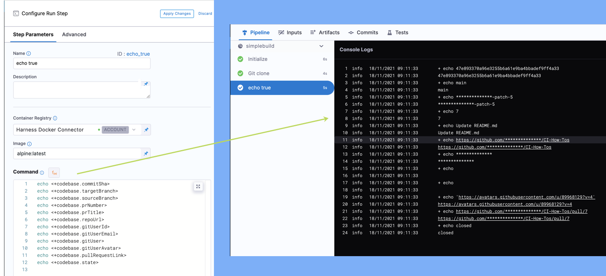

```mdx-code-block
import Tabs from '@theme/Tabs';
import TabItem from '@theme/TabItem';
```

In Harness CI, you set up a [codebase](./create-and-configure-a-codebase.md) by creating a [Harness connector](/docs/platform/Connectors/Code-Repositories/connect-to-code-repo) that connects to a Git repo. Pipelines use this connector to clone the code that you want to build and test. When a pipeline runs, Harness also fetches Git details and displays them in the [build details](../viewing-builds.md).

This topic describes how codebase variables are resolved and the built-in Harness expressions that you can use to reference Git codebase attributes in your pipelines.

For more information about variables and expressions, go to:

* [Built-in and custom Harness variables reference](../../../platform/12_Variables-and-Expressions/harness-variables.md)
* [CI environment variables reference](../optimize-and-more/ci-env-var.md)

## Requirements

You must use a supported codebase: GitHub, Bitbucket, or GitLab.

Your [code repo connector](/docs/platform/Connectors/Code-Repositories/connect-to-code-repo) must use **Username and Token** authentication and allow API access (**Enable API access**).

## Variable resolution

The value of codebase variables depends on the pipeline's [codebase](./create-and-configure-a-codebase.md) and the build start conditions (webhook trigger or manual). A variable is resolved only if the build includes the necessary information for that variable. For example, `<+codebase.prNumber>` is only resolved if the build started from a pull request. Builds that aren't started from a PR won't have a PR number to assign to that variable. Builds that aren't associated with a PR won't have a PR number to apply to that variable.

:::info

Codebase variables are local to the **Build** (`CI`) stage where they were resolved. For example, if your pipeline has a **Build** stage and a **Deploy** stage, the codebase variables are accessible in the **Build** stage only.

:::

### Manual builds

Manual builds occur when you manually run a pipeline from within Harness. You can specify a branch, PR, or tag to build.

* **Manual branch builds:** Manually run a pipeline and select the **Git Branch** build type. Harness looks for the source code attached to the specified **Branch Name**, and it clones that specific source code for the build.
* **Manual pull request (PR) builds**: Manually run a pipeline and select the **Git Pull Request** build type. Harness looks for the source code attached to the specified **Pull Request Number**, and it clones that specific source code for the build.
* **Manual tag builds:** Manually run a pipeline and select the **Git Tag** build type. Harness looks for the source code attached to the specified **Tag Name**, and it clones that specific source code for the build.

### Webhook triggers

You can automatically [trigger pipelines using Git events](/docs/platform/Triggers/triggering-pipelines). [Webhook triggers](/docs/platform/Pipelines/w_pipeline-steps-reference/triggers-reference) listen for specific events in your code repo, and then trigger builds when those events occur.

Values in the webhook payload are mapped to the build's codebase variables. The variables that get resolved are based on the event type and the payload contents.

* **Pull request (PR) triggers:** A **Pull Request Webhook Event** automatically starts a build in Harness when there is a new pull request event on the pipeline's associated Git repo. You can specify the type of [pull request events](/docs/platform/Pipelines/w_pipeline-steps-reference/triggers-reference#event-and-actions) to track, such as close, open, update/edit, reopen, and so on.
* **Push triggers:** A **Push Webhook Event** automatically starts a build in Harness when there is a new branch or tag push event on the pipeline's associated Git repo.

<!-- Tag push trigger YAML example

```yaml
        payloadConditions:
          - key: <+trigger.payload.ref>
            operator: StartsWith
            value: refs/tags/
```
-->

### Unresolved variables

Codebase variables aren't resolved in these scenarios:

* **Cron triggers:** Builds started from cron triggers don't contain specific Git event information and, therefore, don't provide a payload to resolve codebase variables in the same way as PR and push triggers.
* **Non-default codebases:** Codebase variables are only resolved for the pipeline's [default codebase](./create-and-configure-a-codebase.md). If a pipeline [clones additional codebases](./clone-and-process-multiple-codebases-in-the-same-pipeline.md) through **Run** or **Git Clone** steps, codebase variables are not produced for these additional codebases.

## Reference codebase variables

You can use [Harness' expressions](/docs/platform/references/runtime-inputs/#expressions) to reference various codebase attributes in your **Build** (`CI`) stages. Expressions are formatted as `<+PARENT.CHILD>`, such as `<+codebase.commitSha>`, where `commitSha` is an attribute within `codebase`.

For example, you can add a [Run step](../run-ci-scripts/run-step-settings.md) with a series of `echo` commands to your pipeline to reference codebase variables:

```mdx-code-block
<Tabs>
  <TabItem value="Visual" label="Visual">
```



```mdx-code-block
  </TabItem>
  <TabItem value="YAML" label="YAML" default>
```

```yaml
              - step:
                  type: Run
                  name: echo codebase
                  identifier: echo_codebase
                  spec:
                    shell: Sh
                    command: |-
                      echo <+codebase.repoUrl>
                      echo <+codebase.prNumber>
                      echo <+codebase.prTitle>
                      echo <+codebase.pullRequestLink>
                      echo <+codebase.targetBranch>
                      echo <+codebase.sourceBranch>
                      echo <+codebase.commitSha>
                      echo <+codebase.gitUserId>
                      echo <+codebase.gitUserEmail>
                      echo <+codebase.state>
```

In the [build logs](../viewing-builds.md), you can see the value of each variable:

```
+ echo https://github.com/**************/CI-How-Tos
+ echo 8
+ echo Update README.md
+ echo https://github.com/**************/CI-How-Tos/pull/8
+ echo main
+ echo **************-patch-5-1
+ echo 85116fa2f04858cd5e946d69f24d7359205a0737
+ echo **************
+ echo
+ echo open
```

```mdx-code-block
  </TabItem>
</Tabs>
```

:::tip

You can use expressions to reference the value of some `DRONE_` environment variables. For more information, go to the [CI environment variables reference](../optimize-and-more/ci-env-var.md).

:::

## Build start conditions

These variables describe how the build started.

### codebase.build.type

* Value: Provides the type of event that started the build:
   * `tag`: Manual tag build
   * `branch`: Manual branch build
   * `PR`: PR build (manual or webhook)
   * `Push`: Push webhook trigger (branch or tag)
* Expression: `<+codebase.build.type>`

You can use this expression to create conditions based on build type, such as `<+codebase.build.type>=="TYPE"`, where `TYPE` is `tag`, `PR`, `branch`, or `Push`.

### trigger.type

* Value: Identifies the trigger type. For PR and push webhook triggers, it is `Webhook`.
* Expression: `<+trigger.type>`
* Exclusions: Not available for manual builds.

### trigger.event

* Value: The webhook trigger event category, `PR` or `PUSH`.
* Expression: `<+trigger.event>`
* Exclusions: Not available for manual builds.

## Branch, PR, and tag data

### codebase.branch

* Value: The PR's target branch or the branch specified for a branch build.
* Expression: `<+codebase.branch>`
* Exclusions: `null` for all tag builds.

### codebase.prNumber

* Value: The Git PR number.
* Expression:
   * Manual PR builds: `<+codebase.prNumber>`
   * PR webhook triggers: `<+codebase.prNumber>` or `<+trigger.prNumber>`
* Exclusions: `null` for all tag and branch builds.

### codebase.prTitle

* Value: The Git PR title.
* Expression:
   * Manual PR builds: `<+codebase.prTitle>`
   * PR webhook triggers: `<+codebase.prTitle>` or `<+trigger.prTitle>`
* Exclusions: `null` for all tag and branch builds.

### codebase.pullRequestBody

* Value: The Git PR description.
* Expression: `<+codebase.pullRequestBody>`
* Exclusions: `null` for all tag and branch builds.

### codebase.pullRequestLink

* Value: Link to the PR.
* Expression: `<+codebase.pullRequestLink>`
* Exclusions: `null` for all tag and branch builds.

### codebase.sourceBranch

* Value: The source branch for a PR.
* Expression:
   * Manual builds: `<+codebase.sourceBranch>`
   * Webhook triggers: `<+codebase.sourceBranch>` or `<+trigger.sourceBranch>`
* Exclusions:
   * Tag builds: Always `null`.
   * Branch builds: `null` or the same as [`<+codebase.branch>`](#branch).

### codebase.tag

* Value: The Git tag specified for a tag build.
* Expression: `<+codebase.tag>`
* Exclusions: `null` for all PR and branch builds.

### codebase.targetBranch

* Value:
   * PR builds: The PR's target branch.
   * Branch builds: `null` or the same as [`<+codebase.branch>`](#branch).
   * Tag builds: `null` or the tag path, such as `refs/tags/TAG_NAME`.
* Expression:
   * Manual builds: `<+codebase.targetBranch>`
   * Webhook triggers: `<+codebase.targetBranch>` or `<+trigger.targetBranch>`

## Commit data

### codebase.baseCommitSha

* Value: The Git commit SHA of a PR's base commit.
* Expression:
   * Manual PR builds: `<+codebase.baseCommitSha>`
   * PR webhook triggers: `<+codebase.baseCommitSha>` or `<+trigger.baseCommitSha>`
* Exclusions: `null` for all tag and branch builds.

### codebase.commitMessage

* Value: The latest commit message in the branch, tag, or PR.
* Expression: `<+codebase.commitMessage>`

### codebase.commitRef

* Value: A Git commit reference.
* Expression: `<+codebase.commitRef>`

### codebase.commitSha

* Value: The full Git commit SHA for the latest commit in the branch, tag, or PR.
* Expression:
   * Manual builds: `<+codebase.commitSha>`
   * Webhook triggers: `<+codebase.commitSha>` or `<+trigger.commitSha>`

:::info

For Bitbucket PR builds (manual or webhook), this expression returns a *shortened* SHA due to the Bitbucket webhook payload only sending shortened SHAs.

This *isn't* the same as the short SHA returned by [`<+codebase.shortCommitSha>`](#shortcommitsha).

:::

### codebase.shortCommitSha

* Value: The short SHA (seven characters) of the build's [commit SHA](#commitsha).
* Expression: `<+codebase.shortCommitSha>`

## Git user data

### codebase.gitUser

* Value: User name of the Git account associated with the build. Can be `null` or masked in build logs.
* Expression:
   * Manual builds: `<+codebase.gitUser>`
   * Webhook triggers: `<+codebase.gitUser>` or `<+trigger.gitUser>`

### codebase.gitUserAvatar

* Value: Link to user avatar of the Git account associated with the build.
* Expression: `<+codebase.gitUserAvatar>`

### codebase.gitUserEmail

* Value: User email of the Git account associated with the build. Can be `null` or masked in build logs.
* Expression: `<+codebase.gitUserEmail>`

### codebase.gitUserId

* Value: User ID of the Git account associated with the build. Can be `null` or masked in build logs.
* Expression: `<+codebase.gitUserId>`

## Repo data

### codebase.repoUrl

* Value: Link to the Git repo associated with the build.
* Expression:
   * Manual builds: `<+codebase.repoUrl>`
   * Webhook triggers: `<+codebase.repoUrl>` or `<+trigger.repoUrl>`

### codebase.state

* Value: State of the Git working directory associated with a PR.
* Expression: `<+codebase.state>`
* Exclusions: `null` for all tag and branch builds.

### trigger.sourceRepo

* Value: The PR, branch, or tag's source repo, if applicable. Otherwise, `null`.
* Expression: `<+trigger.sourceRepo>`
* Exclusions: Not available for manual builds.
