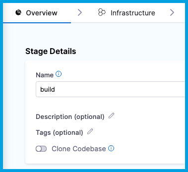

If you want to clone a subdirectory instead of your entire Git repo, you can disable the pipeline's default codebase and then run your `git` commands in a **Run** step.

You can also use this pattern if you need to use specific `git clone` arguments when cloning your codebase.

## Disable Clone Codebase

You must disable **Clone Codebase** so that you can clone the repo according to your specifications. If **Clone Codebase** is enabled, then the build clones the pipeline's [default codebase](./create-and-configure-a-codebase.md#configure-the-default-codebase) automatically.

In the Visual editor, you can disable **Clone Codebase** in the Build stage's **Overview** tab.

<!--  -->

<docimage path={require('./static/disable-clone-codebase-visual.png')} />

In the YAML editor, set `cloneCodebase` to `false` in the `stage.spec`.

```yaml
    - stage:
        name: build
        identifier: build
        description: ""
        type: CI
        spec:
          cloneCodebase: false
```

## Add a Run step to clone the codebase

Add a [Run step](../run-ci-scripts/run-step-settings.md) containing your desired `git` commands, such as [`git sparse-checkout`](https://git-scm.com/docs/git-sparse-checkout) to clone a subdirectory instead of an entire repo.

```yaml
              - step:
                  type: Run
                  identifier: clone
                  name: clone
                  spec:
                    shell: Sh
                    command: |-
                      git sparse-checkout ...
```
